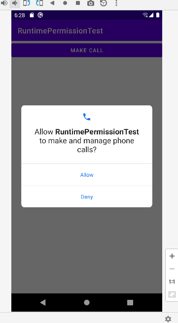
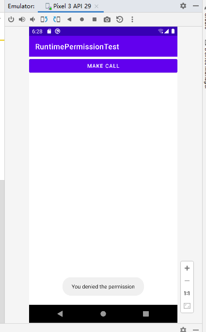
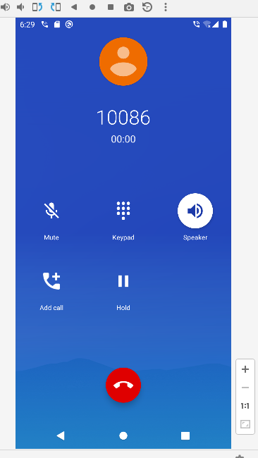
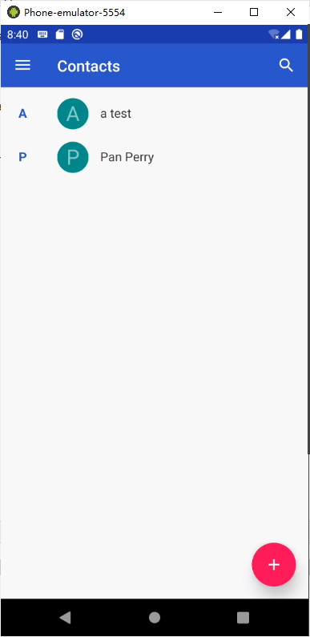
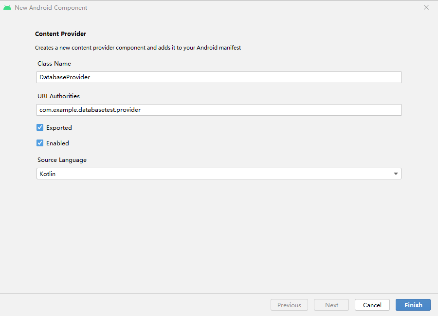
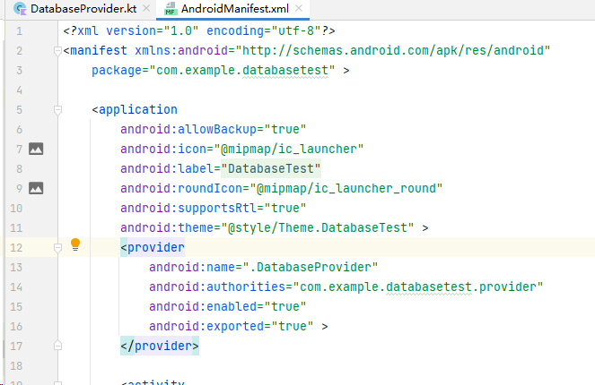
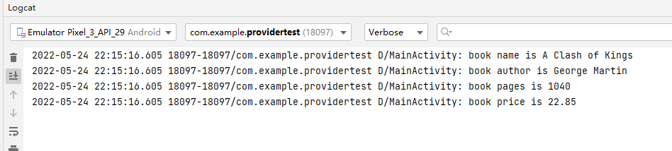
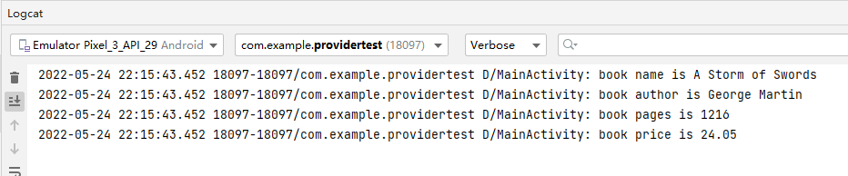

# ContentProvider

在第6章写BroadcastTest项目的时候第一次接触了 Android 权限相关的内容，当时为了要监听开机广播，我们在 AndroidManifest.xml 文件中
添加了这样一句权限声明：

```xml
<manifest xmlns:android="http://schemas.android.com/apk/res/android" package="com.example.broadcasttest">
	<uses-permission android:name="android.permission.RECEIVE_BOOT_COMPLETED" /> 
	...
</manifest>
```

监听开机广播涉及了用户设备的安全，如果不声明，程序会直接崩溃。


## 在程序运行时申请权限

新建一个RuntimePermissionTest项目；

在 Android 6.0 系统出现之前，拨打电话功能的实现非常简单：

先在 src/main/AndroidManifest.xml 中加入权限声明

```xml
<?xml version="1.0" encoding="utf-8"?>
<manifest xmlns:android="http://schemas.android.com/apk/res/android"
    package="com.example.runtimepermissiontest">

    <uses-permission android:name="android.permission.CALL_PHONE"/>

    <application
        ......
    </application>

</manifest>
```

```xml
<LinearLayout xmlns:android="http://schemas.android.com/apk/res/android"
    android:layout_width="match_parent"
    android:layout_height="match_parent">

    <Button
        android:id="@+id/makeCall"
        android:layout_width="match_parent"
        android:layout_height="wrap_content"
        android:text="Make Call" />
</LinearLayout>

<!-- src/main/res/layout/activity_main.xml -->
```

```kotlin
// src/main/java/com/example/runtimepermissiontest/MainActivity.kt
package com.example.runtimepermissiontest

import android.content.Intent
import android.net.Uri
import androidx.appcompat.app.AppCompatActivity
import android.os.Bundle
import com.example.runtimepermissiontest.databinding.ActivityMainBinding

private lateinit var binding : ActivityMainBinding

class MainActivity : AppCompatActivity() {
    override fun onCreate(savedInstanceState: Bundle?) {
        super.onCreate(savedInstanceState)
        setContentView(R.layout.activity_main)
        binding = ActivityMainBinding.inflate(layoutInflater)
        val view = binding.root
        setContentView(view)
		
        // 为按钮添加触发器
        binding.makeCall.setOnClickListener {
            try {
                val intent = Intent(Intent.ACTION_CALL)
                intent.data = Uri.parse("tel:10086")
                startActivity(intent)
            }
            catch (e: SecurityException) { e.printStackTrace() }
        }
    }
}
```

而在 Android 6+， 此方法已无法使用，此时 Logcat 内容如下：

```
2022-05-17 14:56:16.986 2050-6057/? I/ActivityTaskManager: START u0 {act=android.intent.action.CALL dat=tel:xxxxx cmp=com.android.server.telecom/.components.UserCallActivity} from uid 10135
2022-05-17 14:56:16.986 2050-6057/? W/ActivityTaskManager: Permission Denial: starting Intent { act=android.intent.action.CALL dat=tel:xxxxx cmp=com.android.server.telecom/.components.UserCallActivity } from ProcessRecord{4b97c0e 7633:com.example.runtimepermissiontest/u0a135} (pid=7633, uid=10135) with revoked permission android.permission.CALL_PHONE
2022-05-17 14:56:15.065 1857-1857/? W/adbd: timeout expired while flushing socket, closing
2022-05-17 14:56:16.988 7633-7633/com.example.runtimepermissiontest W/System.err: java.lang.SecurityException: Permission Denial: starting Intent { act=android.intent.action.CALL dat=tel:xxxxx cmp=com.android.server.telecom/.components.UserCallActivity } from ProcessRecord{4b97c0e 7633:com.example.runtimepermissiontest/u0a135} (pid=7633, uid=10135) with revoked permission android.permission.CALL_PHONE
2022-05-17 14:56:16.988 7633-7633/com.example.runtimepermissiontest W/System.err:     at android.os.Parcel.createException(Parcel.java:2071)
2022-05-17 14:56:16.988 7633-7633/com.example.runtimepermissiontest W/System.err:     at android.os.Parcel.readException(Parcel.java:2039)
2022-05-17 14:56:16.988 7633-7633/com.example.runtimepermissiontest W/System.err:     at android.os.Parcel.readException(Parcel.java:1987)
2022-05-17 14:56:16.989 7633-7633/com.example.runtimepermissiontest W/System.err:     at android.app.IActivityTaskManager$Stub$Proxy.startActivity(IActivityTaskManager.java:3851)
2022-05-17 14:56:16.989 7633-7633/com.example.runtimepermissiontest W/System.err:     at android.app.Instrumentation.execStartActivity(Instrumentation.java:1705)
2022-05-17 14:56:16.989 7633-7633/com.example.runtimepermissiontest W/System.err:     at android.app.Activity.startActivityForResult(Activity.java:5192)
2022-05-17 14:56:16.989 7633-7633/com.example.runtimepermissiontest W/System.err:     at androidx.activity.ComponentActivity.startActivityForResult(ComponentActivity.java:597)
2022-05-17 14:56:16.989 7633-7633/com.example.runtimepermissiontest W/System.err:     at android.app.Activity.startActivityForResult(Activity.java:5150)
2022-05-17 14:56:16.989 7633-7633/com.example.runtimepermissiontest W/System.err:     at androidx.activity.ComponentActivity.startActivityForResult(ComponentActivity.java:583)
2022-05-17 14:56:16.989 7633-7633/com.example.runtimepermissiontest W/System.err:     at android.app.Activity.startActivity(Activity.java:5521)
2022-05-17 14:56:16.989 7633-7633/com.example.runtimepermissiontest W/System.err:     at android.app.Activity.startActivity(Activity.java:5489)
2022-05-17 14:56:16.989 7633-7633/com.example.runtimepermissiontest W/System.err:     at com.example.runtimepermissiontest.MainActivity.onCreate$lambda-0(MainActivity.kt:24)
2022-05-17 14:56:16.989 7633-7633/com.example.runtimepermissiontest W/System.err:     at com.example.runtimepermissiontest.MainActivity.$r8$lambda$2-IeCKXsDOq6Zmjm5M3sXKDlAOM(Unknown Source:0)
2022-05-17 14:56:16.989 7633-7633/com.example.runtimepermissiontest W/System.err:     at com.example.runtimepermissiontest.MainActivity$$ExternalSyntheticLambda0.onClick(Unknown Source:2)
2022-05-17 14:56:16.989 7633-7633/com.example.runtimepermissiontest W/System.err:     at android.view.View.performClick(View.java:7125)
2022-05-17 14:56:16.989 7633-7633/com.example.runtimepermissiontest W/System.err:     at com.google.android.material.button.MaterialButton.performClick(MaterialButton.java:1194)
2022-05-17 14:56:16.989 7633-7633/com.example.runtimepermissiontest W/System.err:     at android.view.View.performClickInternal(View.java:7102)
2022-05-17 14:56:16.989 7633-7633/com.example.runtimepermissiontest W/System.err:     at android.view.View.access$3500(View.java:801)
2022-05-17 14:56:16.989 7633-7633/com.example.runtimepermissiontest W/System.err:     at android.view.View$PerformClick.run(View.java:27336)
2022-05-17 14:56:16.989 7633-7633/com.example.runtimepermissiontest W/System.err:     at android.os.Handler.handleCallback(Handler.java:883)
2022-05-17 14:56:16.992 7633-7633/com.example.runtimepermissiontest W/System.err:     at android.os.Handler.dispatchMessage(Handler.java:100)
2022-05-17 14:56:16.992 7633-7633/com.example.runtimepermissiontest W/System.err:     at android.os.Looper.loop(Looper.java:214)
2022-05-17 14:56:16.992 7633-7633/com.example.runtimepermissiontest W/System.err:     at android.app.ActivityThread.main(ActivityThread.java:7356)
2022-05-17 14:56:16.993 7633-7633/com.example.runtimepermissiontest W/System.err:     at java.lang.reflect.Method.invoke(Native Method)
2022-05-17 14:56:16.993 7633-7633/com.example.runtimepermissiontest W/System.err:     at com.android.internal.os.RuntimeInit$MethodAndArgsCaller.run(RuntimeInit.java:492)
2022-05-17 14:56:16.993 7633-7633/com.example.runtimepermissiontest W/System.err:     at com.android.internal.os.ZygoteInit.main(ZygoteInit.java:930)
2022-05-17 14:56:16.994 7633-7633/com.example.runtimepermissiontest W/System.err: Caused by: android.os.RemoteException: Remote stack trace:
2022-05-17 14:56:16.994 7633-7633/com.example.runtimepermissiontest W/System.err:     at com.android.server.wm.ActivityStackSupervisor.checkStartAnyActivityPermission(ActivityStackSupervisor.java:1043)
2022-05-17 14:56:16.994 7633-7633/com.example.runtimepermissiontest W/System.err:     at com.android.server.wm.ActivityStarter.startActivity(ActivityStarter.java:760)
2022-05-17 14:56:16.995 7633-7633/com.example.runtimepermissiontest W/System.err:     at com.android.server.wm.ActivityStarter.startActivity(ActivityStarter.java:583)
2022-05-17 14:56:16.995 7633-7633/com.example.runtimepermissiontest W/System.err:     at com.android.server.wm.ActivityStarter.startActivityMayWait(ActivityStarter.java:1288)
2022-05-17 14:56:16.995 7633-7633/com.example.runtimepermissiontest W/System.err:     at com.android.server.wm.ActivityStarter.execute(ActivityStarter.java:514)
2022-05-17 14:56:16.996 1798-4314/? W/audio_hw_generic: Not supplying enough data to HAL, expected position 817020 , only wrote 816996
2022-05-17 14:56:20.163 1798-1798/? W/audio_hw_generic: Not supplying enough data to HAL, expected position 1095075 , only wrote 956467
2022-05-17 14:56:24.945 1945-1945/? E/wifi_forwarder: RemoteConnection failed to initialize: RemoteConnection failed to open pipe
2022-05-17 14:56:24.984 1922-1922/? E/netmgr: Failed to open QEMU pipe 'qemud:network': Invalid argument
2022-05-17 14:56:33.572 2050-2132/? W/AppOps: Noting op not finished: uid 10098 pkg com.google.android.gms code 79 time=1652770411977 duration=0
2022-05-17 14:56:37.004 2050-2132/? D/WificondControl: Scan result ready event
2022-05-17 14:56:37.011 2050-2132/? E/WifiService: Permission violation - getScanResults not allowed for uid=10098, packageName=com.google.android.gms, reason=java.lang.SecurityException: Location mode is disabled for the device

```


修改一下 MainActivity.kt：

```kotlin
// src/main/java/com/example/runtimepermissiontest/MainActivity.kt
package com.example.runtimepermissiontest

import android.content.Intent
import android.content.pm.PackageManager
import android.net.Uri
import androidx.appcompat.app.AppCompatActivity
import android.os.Bundle
import android.widget.Toast
import androidx.core.app.ActivityCompat
import androidx.core.content.ContextCompat
import androidx.core.content.PackageManagerCompat
import com.example.runtimepermissiontest.databinding.ActivityMainBinding
import java.util.jar.Manifest

private lateinit var binding: ActivityMainBinding

class MainActivity : AppCompatActivity() {
    override fun onCreate(savedInstanceState: Bundle?) {
        ......

        binding.makeCall.setOnClickListener {
            // 修改内容：
            if (ContextCompat.checkSelfPermission(
                    this, "android.Manifest.permission.CALL_PHONE"
                ) != PackageManager.PERMISSION_GRANTED
            ) {
                ActivityCompat.requestPermissions(this, arrayOf(android.Manifest.permission.CALL_PHONE), 1)
            } else {
                call()
            }
        }
    }

    override fun onRequestPermissionsResult(
        requestCode: Int,
        permissions: Array<out String>,
        grantResults: IntArray
    ) {
        super.onRequestPermissionsResult(requestCode, permissions, grantResults)
        // 重写新增：
        when (requestCode) {
            1 -> {
                if (grantResults.isNotEmpty() && grantResults[0] == PackageManager.PERMISSION_GRANTED) {
                    call()
                } else {
                    Toast.makeText(this, "You denied the permission",Toast.LENGTH_LONG).show()
                }
            }
        }
    }

    private fun call() {
        try {
            val intent = Intent(Intent.ACTION_CALL)
            intent.data = Uri.parse("tel:10086")
            startActivity(intent)
        } catch (e: SecurityException) {
            e.printStackTrace()
        }
    }
}
```


运行，并点击 “Make Call”



如果点击 Deny， 将会出现 Toast



如果点击 Allow，将会开始拨打电话



## 访问其他程序中的数据

ContentProvider的用法一般有两种：

一种是使用现有的ContentProvider读取和操作相应程序中的数据；

另一种是创建自己的ContentProvider，给程序的数据提供外部访问接口。


### ContentResolver  增删改查

不同于SQLiteDatabase，ContentResolver中的增删改查方法都是不接收表名参数的，而是使用一个Uri参数代替，这个参数被称为内容URI。

内容URI给ContentProvider中的数据建立 了唯一标识符，它主要由两部分组成：authority和path。

- authority是用于对不同的应用程序做区分的，一般为了避免冲突，会采用应用包名的方式进行命名。
  - 比如某个应用的包名是 com.example.app，那么该应用对应的authority就可以命名为 com.example.app.provider。
- path则是用于对同一应用程序中不同的表做区分的，通常会添 加到authority的后面。
  - 比如某个应用的数据库里存在两张表table1和table2，这时就可以将path分别命名为/table1和/table2，然后把authority和path进行组合，
  - 内容URI就变成了 com.example.app.provider/table1和com.example.app.provider/table2。
  - 不过，目前还很难辨认出这两个字符串就是两个内容URI，我们还需要在字符串的头部加上协议声明。
- 因此，内容URI最标准的格式如下：

```kotlin
content://com.example.app.provider/table1 
content://com.example.app.provider/table2
```


内容URI可以非常清楚地表达我们想要访问哪个程序中哪张表里的数据。也正是因此，ContentResolver中的增删改查方法才都接收Uri对象作为参数。

得到了内容URI字符串之后，我们还需要将它解析成Uri对象才可以作为参数传入：

```kotlin
val uri = Uri.parse("content://com.example.app.provider/table1")
```

只需要调用Uri.parse()方法，就可以将内容URI字符串解析成Uri对象了。


使用这个Uri对象查询table1表中的数据：

```kotlin
val cursor = contentResolver.query( uri,
projection, selection, selectionArgs,
sortOrder)
```


**参数说明**

| query() 方法参数 | 对应 SQL 部分             | 描述                              |
| ---------------- | ------------------------- | --------------------------------- |
| uri              | from table_name           | 指定查询某个 App 下的某张表       |
| projection       | select column1, column2   | 指定查询的列名                    |
| selection        | where column = value      | 指定 where 中的占位符提供具体的值 |
| selectionArgs    | -                         | 为 where 中的占位符提供具体的值   |
| sortOrder        | order by column1, column2 | 指定查询结果的排序方式            |


查询完成后返回的仍然是一个Cursor对象，读取的思路仍然是通过移动游标的位置遍历Cursor的所有行，然后取出每一行中相应列的数据。

```kotlin
while (cursor.moveToNext()) { 
	val column1 = cursor.getString(cursor.getColumnIndex("column1")) 
	val column2 = cursor.getInt(cursor.getColumnIndex("column2"))
}
cursor.close()
```


向 table1表中添加一条数据：

将待添加的数据组装到ContentValues中，然后调用ContentResolver的insert()方法，将Uri和ContentValues作为参数传入即可：

```kotlin
val values = contentValuesOf("column1" to "text", "column2" to 1) 
contentResolver.insert(uri, values)
```

更新这条数据：

把column1的值清空，可以借助ContentResolver的 update()方法实现

```kotlin
val values = contentValuesOf("column1" to "") 
contentResolver.update(uri, values, "column1 = ? and column2 = ?", arrayOf("text", "1"))
```

删除这条数据：

调用ContentResolver的delete()方法

```kotlin
contentResolver.delete(uri, "column2 = ?", arrayOf("1"))
```


## 读取联系人

首先，到通讯录中确认有联系人的存在，如果没有，则创建几个。




### 实践

创建项目 ContactsTest 

```xml
<!-- src/main/res/layout/activity_main.xml -->
<LinearLayout xmlns:android="http://schemas.android.com/apk/res/android"
    android:layout_width="match_parent"
    android:layout_height="match_parent"
    android:orientation="vertical">

    <ListView
        android:id="@+id/contactsView"
        android:layout_width="match_parent"
        android:layout_height="match_parent"></ListView>
</LinearLayout>
```

LinearLayout里只放置了一个ListView。这里之所以使用ListView而不是 RecyclerView，是因为我们要将关注的重点放在读取系统联系人上面，如果使用
RecyclerView的话，代码偏多，会容易让我们找不着重点。


权限声明

```xml
<?xml version="1.0" encoding="utf-8"?>
<manifest xmlns:android="http://schemas.android.com/apk/res/android"
    package="com.example.contactstest">

    <uses-permission android:name="android.permission.READ_CONTACTS"/>

    <application
        ......
    </application>

</manifest>
<!-- src/main/AndroidManifest.xml -->
```


MainActivity.kt

```kotlin
// src/main/java/com/example/contactstest/MainActivity.kt
package com.example.contactstest

import android.annotation.SuppressLint
import android.content.pm.PackageManager
import android.os.Bundle
import android.provider.ContactsContract
import android.widget.ArrayAdapter
import android.widget.Toast
import androidx.appcompat.app.AppCompatActivity
import androidx.core.app.ActivityCompat
import androidx.core.content.ContextCompat
import com.example.contactstest.databinding.ActivityMainBinding

private lateinit var binding: ActivityMainBinding

class MainActivity : AppCompatActivity() {

    private val contactsList = ArrayList<String>()
    private lateinit var adapter: ArrayAdapter<String>

    override fun onCreate(savedInstanceState: Bundle?) {
        super.onCreate(savedInstanceState)
        setContentView(R.layout.activity_main)

        binding = ActivityMainBinding.inflate(layoutInflater)
        val view = binding.root
        setContentView(view)

        // 首先按照ListView的标准用法对其初始化，然后开始调用运行时权限的处理逻辑，因为READ_CONTACTS权限属于危险权限。
        // 所以在用户授权之后，才能调用readContacts()方法读取系统联系人信息。
        adapter = ArrayAdapter(this, android.R.layout.simple_list_item_1, contactsList)
        binding.contactsView.adapter = adapter
        if (ContextCompat.checkSelfPermission(this, android.Manifest.permission.READ_CONTACTS)
            != PackageManager.PERMISSION_GRANTED
        ) {
            ActivityCompat.requestPermissions(
                this,
                arrayOf(android.Manifest.permission.READ_CONTACTS),
                1
            )
        } else {
            readContacts()
        }
    }

    override fun onRequestPermissionsResult(
        requestCode: Int,
        permissions: Array<String>,
        grantResults: IntArray
    ) {
        super.onRequestPermissionsResult(requestCode, permissions, grantResults)
        when (requestCode) {
            1 -> {
                if (grantResults.isNotEmpty() && grantResults[0] == PackageManager.PERMISSION_GRANTED) {
                    readContacts()
                } else {
                    Toast.makeText(this, "You denied the permission", Toast.LENGTH_LONG).show()
                }
            }
        }
    }

    @SuppressLint("Range")
    private fun readContacts() {
        // 查询联系人数据
        // 使用了ContentResolver的 query()方法查询系统的联系人数据。不过传入的Uri参数怎么有些奇怪啊？
        // 为什么没有调用Uri.parse()方法去解析一个内容URI字符串呢？
        // 这是因为ContactsContract.CommonDataKinds.Phone类已经帮我们做好了封装，提供了一个 CONTENT_URI常量，
        // 而这个常量就是使用Uri.parse()方法解析出来的结果。
        // 接着对 query()方法返回的Cursor对象进行遍历，这里使用了?.操作符和apply函数来简化遍历的代码。
        contentResolver.query(
            ContactsContract.CommonDataKinds.Phone.CONTENT_URI,
            null,
            null,
            null,
            null
        )?.apply {
            // 将联系人姓名和手机号逐个取出：
            while (moveToNext()) {
                // 获取联系人姓名
                // 联系人姓名这一列对应的常量是 ContactsContract.CommonDataKinds.Phone.DISPLAY_NAME
                val displayName =
                    getString(getColumnIndex(ContactsContract.CommonDataKinds.Phone.DISPLAY_NAME))  // 需要 @SuppressLint("Range")
                // 获取联系人手机号
                // 联系人手机号这一列对 应的常量是ContactsContract.CommonDataKinds.Phone.NUMBER。
                val number =
                    getString(getColumnIndex(ContactsContract.CommonDataKinds.Phone.NUMBER))    // 需要 @SuppressLint("Range")
                // 取出后进行拼接，并且在中间加上换行符，然后将拼接后的数据添加到ListView的数据源里
                contactsList.add("$displayName\n$number")
            }
            // 通知刷新一下ListView
            adapter.notifyDataSetChanged()
            // 最后千万不要忘记将Cursor对象关闭
            close()
        }
    }
}
```


## 创建自己的 ContentProvider

### 创建 ContentProvider 的步骤

跨程序共享数据的功能，可以通过新建一个类去继承 ContentProvider的方式来实现。ContentProvider类中有6个抽象方法，我们在使用子类继承
它的时候，需要将这6个方法全部重写。例：

```kotlin
class MyProvider : ContentProvider() {
    override fun onCreate(): Boolean {
        return false
    }

    override fun query(
        uri: Uri,
        projection: Array<String>?,
        selection: String?,
        selectionArgs: Array<String>?,
        sortOrder: String?
    ): Cursor? {
        return null
    }

    override fun insert(uri: Uri, values: ContentValues?): Uri? {
        return null
    }

    override fun update(
        uri: Uri,
        values: ContentValues?,
        selection: String?,
        selectionArgs: Array<String>?
    ): Int {
        return 0
    }

    override fun delete(uri: Uri, selection: String?, selectionArgs: Array<String>?): Int {
        return 0
    }

    override fun getType(uri: Uri): String? {
        return null
    }
}
```

六个方法的作用

1. `onCreate()`。初始化ContentProvider的时候调用。通常会在这里完成对数据库的创建和 升级等操作，返回true表示ContentProvider初始化成功，返回false则表示失败。
2. `query()`。从ContentProvider中查询数据。uri参数用于确定查询哪张表，projection 参数用于确定查询哪些列，selection和selectionArgs参数用于约束查询哪些行，sortOrder参数用于对结果进行排序，查询的结果存放在Cursor对象中返回。

1. `insert()`。向ContentProvider中添加一条数据。uri参数用于确定要添加到的表，待添 加的数据保存在values参数中。添加完成后，返回一个用于表示这条新记录的URI。
2. `update()`。更新ContentProvider中已有的数据。uri参数用于确定更新哪一张表中的数 据，新数据保存在values参数中，selection和selectionArgs参数用于约束更新哪些行， 受影响的行数将作为返回值返回。
3. `delete()`。从ContentProvider中删除数据。uri参数用于确定删除哪一张表中的数据， selection和selectionArgs参数用于约束删除哪些行，被删除的行数将作为返回值返回。
4. `getType()`。根据传入的内容URI返回相应的MIME类型。


**回顾**

一个标准的内容URI写法：

```kotlin
content://com.example.app.provider/table1
```

在这个内容URI的后面加上一个id，以下表示调用方期望访问的是com.example.app这个应用的table1表中id为1的数据。：

```kotlin
content://com.example.app.provider/table1/1
```


**通配符**

*表示匹配任意长度的任意字符。

#表示匹配任意长度的数字。


一个能够匹配任意表的内容 URI 格式：

```kotlin
content://com.example.app.provider/*
```

一个能够匹配 table1 表中任意一行数据的内容URI格式

```kotlin
content://com.example.app.provider/table1/#
```


借助UriMatcher这个类就可以轻松地实现匹配内容URI的功能。UriMatcher 中提供了一个 addURI() 方法，这个方法接收3个参数，可以分别把authority、path和一个自定义代码传进去。这样，当调用UriMatcher的match()方法时，就可以将一个Uri对象传入，返回值是某个能够匹配这个Uri对象所对应的自定义代码，利用这个代码，我们就可以判断 出调用方期望访问的是哪张表中的数据了。

例：


MyProvider中新增了4个整型变量，其中，，，。接着我们。


然后

```kotlin
class MyProvider : ContentProvider() {
    private val table1Dir = 0	// table1Dir表示访问table1表中的所有数据
    private val table1Item = 1	// table1Item表示访问table1表中的单条数据
    private val table2Dir = 2	// table2Dir表示访问table2表中的所有数据
    private val table2Item = 3	// table2Item表示访问table2表中的单条数据

    private val uriMatcher = UriMatcher(UriMatcher.NO_MATCH)

    init {
        // 在MyProvider类实例化的时候立刻创建UriMatcher的实例，并调用addURI()方法，
        // 将期望匹配的内容URI格式传递进去，注意这里传入的路径参数是可以使用通配符(说明见上)的
        uriMatcher.addURI("com.example.app.provider","table1",table1Dir)		
        uriMatcher.addURI ("com.example.app.provider ", "table1/#", table1Item)	
        uriMatcher.addURI("com.example.app.provider ", "table2", table2Dir)		
        uriMatcher.addURI("com.example.app.provider ", "table2/#", table2Item)	
    }
    ...

    override fun query(
        // 当query()方法被调用的时候，就会通过UriMatcher的match()方法对传入的Uri对象进行匹配，
        // 如果发现UriMatcher中某个 内容URI格式成功匹配了该Uri对象，则会返回相应的自定义代码，
        // 然后我们就可以判断出调用方期望访问的到底是什么数据了。
        uri: Uri, projection: Array<String>?,  selection: String?, selectionArgs: Array<String>?, sortOrder: String?): Cursor? {
        when (uriMatcher.match(uri)) {
            table1Dir -> {
                // 查询table1表中的所有数据
            }
            table1Item -> {
                // 查询table1表中的单条数据
            }
            table2Dir -> {
                // 查询table2表中的所有数据
            }
            table2Item -> {
                // 查询table2表中的单条数据
            }
        }
        ...
    }
    ...
}
```


上述代码只是以query()方法为例做了个示范，其实insert()、update()、delete()这几 个方法的实现是差不多的，它们都会携带uri这个参数，然后同样利用UriMatcher的 match()方法判断出调用方期望访问的是哪张表，再对该表中的数据进行相应的操作就可以了。

除此之外，还有一个方法你可能会比较陌生，即getType()方法。它是所有的 ContentProvider都必须提供的一个方法，用于获取Uri对象所对应的MIME类型。一个内容URI所对应的MIME字符串主要由3部分组成，Android对这3个部分做了如下格式规定。

- 必须以vnd开头。 如果内容URI以路径结尾，则后接android.cursor.dir/；
- 如果内容URI以id结尾，则后 接android.cursor.item/。
- 最后接上vnd.\<authority\>.\<path\>。


所以，对于 `content://com.example.app.provider/table1` 这个内容URI，它所对应的MIME类型就可以写成：

```kotlin
vnd.android.cursor.dir/vnd.com.example.app.provider.table1
```

对于 `content://com.example.app.provider/table1/1` 这个内容URI，它所对应的MIME类型就可以写成：

```kotlin
vnd.android.cursor.item/vnd.com.example.app.provider.table1
```


继续完善MyProvider中的内容了，这次来实现 getType() 方法中的逻辑:

```kotlin
class MyProvider : ContentProvider() { 
	...
	override fun getType(uri: Uri) = when (uriMatcher.match(uri)) {
        table1Dir -> "vnd.android.cursor.dir/vnd.com.example.app.provider.table1"
        table1Item -> "vnd.android.cursor.item/vnd.com.example.app.provider.table1"
        table2Dir -> "vnd.android.cursor.dir/vnd.com.example.app.provider.table2"
        table2Item -> "vnd.android.cursor.item/vnd.com.example.app.provider.table2"
        else -> null
    }
}
```

到这里，一个完整的ContentProvider就创建完成了，现在任何一个应用程序都可以使用 ContentResolver访问我们程序中的数据。那么，如何才能保证隐私数据不会泄漏出去呢？

其实多亏了ContentProvider的良好机制，这个问题在不知不觉中已经被解决了。因为所有的增删改查操作都一定要匹配到相应的内容URI格式才能进行，而我们当然不可能向UriMatcher中添加隐私数据的URI，所以这部分数据根本无法被外部程序访问，安全问题也就不存在了。


### 实践

打开DatabaseTest项目，首先将MyDatabaseHelper中使用Toast弹出创建数据库成功的提示去除，因为跨程序访问时我们不能直接使用Toast。

然后创建一个 ContentProvider，右击com.example.databasetest包→New→Other→Content Provider

Class Name: DatabaseProvider

URI Authorities: com.example.databasetest.provider

Exported属性表示是否允许外部程序访问我们 的ContentProvider

Enabled属性表示是否启用这个ContentProvider。




```kotlin
// src/main/java/com/example/databasetest/DatabaseProvider.kt
package com.example.databasetest

import android.content.ContentProvider
import android.content.ContentValues
import android.content.UriMatcher
import android.database.Cursor
import android.net.Uri

class DatabaseProvider : ContentProvider() {

    // 首先，在类的一开始，同样是定义了4个变量，分别用于表示访问Book表中的所有数据、
    // 访问Book表中的单条数据、访问Category表中的所有数据和访问Category表中的单条数据。
    private val bookDir = 0
    private val bookItem = 1
    private val categoryDir = 2
    private val categoryItem = 3
    private val authority = "com.example.databasetest.provider"
    private var dbHelper: MyDatabaseHelper? = null

    // 然后在一个by lazy代码块里对UriMatcher进行了初始化操作，将期望匹配的几种URI格式添加了进去。
    	// by lazy代码块是Kotlin提供的一种懒加载技术，代码块中的代码一开始并不会执行，
    	// 只有当uriMatcher变量首次被调用的时候才会执行，并且会将代码块中最后一 行代码的返回值赋给uriMatcher。
    private val uriMatcher by lazy {
        val matcher = UriMatcher(UriMatcher.NO_MATCH)
        matcher.addURI(authority, "book", bookDir)
        matcher.addURI(authority, "book/#", bookItem)
        matcher.addURI(authority, "category", categoryDir)
        matcher.addURI(authority, "category/#", categoryItem)
        matcher
    }

    // 综合利用了Getter方法语法糖、?.操作符、let函数、?:操作符以及单行代码函数语法糖。
    // 首先调用了getContext()方法并借助?.操作符和let函数判断它的返回值是否为空：
    // 如果为空就使用?:操作符返回false，表示 ContentProvider初始化失败；如果不为空就执行let函数中的代码。
    // 在let函数中创建了一个MyDatabaseHelper的实例，然后返回true表示ContentProvider初始化成功。
    // 由于我们借 助了多个操作符和标准函数，因此这段逻辑是在一行表达式内完成的，符合单行代码函数的语法糖要求，
    // 所以直接用等号连接返回值即可。其他几个方法的语法结构是类似的。
    override fun onCreate() = context?.let {
        dbHelper = MyDatabaseHelper(it, "BookStore.db", 2)
        true
    } ?: false

    // 这个方法中先获取了SQLiteDatabase的实例，然后根据传入的Uri参数判断用户想要访问哪张表，
    // 再调用SQLiteDatabase的query()进行查询，并将Cursor对象返回就好了。
    // 注意，当访问单条数据的时候，调用了Uri对象的getPathSegments()方法，它会将内容URI权限之后的部分以“/”符号进行分割，
    // 并把分割后的结果放入一个字符串列表中，那这个列表的第0个位置存放的就是路径，第1个位置存放的就是id了。
    // 得到了id之后，再通过selection和selectionArgs参数进行约束，就实现了查询单条数据的功能。
    override fun query(
        uri: Uri, projection: Array<String>?, selection: String?,
        selectionArgs: Array<String>?, sortOrder: String?
    ) = dbHelper?.let {
        // 查询数据
        val db = it.readableDatabase
        val cursor = when (uriMatcher.match(uri)) {
            bookDir -> db.query("Book", projection, selection, selectionArgs, null, null, sortOrder)
            bookItem -> {
                val bookId = uri.pathSegments[1]
                db.query("Book", projection, "id = ?", arrayOf(bookId), null, null, sortOrder)
            }
            categoryDir -> db.query(
                "Category",
                projection,
                selection,
                selectionArgs,
                null,
                null,
                sortOrder
            )
            categoryItem -> {
                val categoryId = uri.pathSegments[1]
                db.query(
                    "Category",
                    projection,
                    "id = ?",
                    arrayOf(categoryId),
                    null,
                    null,
                    sortOrder
                )
            }
            else -> null
        }
        cursor
    }

    // 先获取了SQLiteDatabase的实例，然后根据传入的Uri参数判断用户想要往哪张表里添加数据，再调用SQLiteDatabase的insert()方法进行添加就可以了。
    // 注意，insert()方法要求返回一个能够表示这条新增数据的URI，
    // 所以我们还需要调用 Uri.parse()方法，将一个内容URI解析成Uri对象，当然这个内容URI是以新增数据的id结尾的。
    override fun insert(uri: Uri, values: ContentValues?) = dbHelper?.let {
        // 添加数据
        val db = it.writableDatabase
        val uriReturn = when (uriMatcher.match(uri)) {
            bookDir, bookItem -> {
                val newBookId = db.insert("Book", null, values)
                Uri.parse("content://$authority/book/$newBookId")
            }
            categoryDir, categoryDir -> {
                val newCategoryId = db.insert("Category", null, values)
                Uri.parse("content://$authority/book/$newCategoryId")
            }
            else -> null
        }
        uriReturn
    }

    // 先获取 SQLiteDatabase的实例，然后根据传入的uri参数判断用户想要更新哪张表里的数据，
    // 再调用SQLiteDatabase的update()方法进行更新就好了，受影响的行数将作为返回值返回。
    override fun update(
        uri: Uri,
        values: ContentValues?,
        selection: String?,
        selectionArgs: Array<String>?
    ) =
        dbHelper?.let {
            // 更新数据
            val db = it.writableDatabase
            val updatedRows = when (uriMatcher.match(uri)) {
                bookDir -> db.update("Book", values, selection, selectionArgs)
                bookItem -> {
                    val bookId = uri.pathSegments[1]
                    db.update("Book", values, "id = ?", arrayOf(bookId))
                }
                categoryDir -> db.update("Category", values, selection, selectionArgs)
                categoryItem -> {
                    val categoryId = uri.pathSegments[1]
                    db.update("Category", values, "id = ?", arrayOf(categoryId))
                }
                else -> 0
            }
            updatedRows
        } ?: 0
    
    // 先获取SQLiteDatabase的实例，然后根据传入的uri参数判断用户想要删除哪张表里的数据，
    // 再调用SQLiteDatabase的delete()方法进行删除就好了，被删除的行数将作为返回值返回。
    override fun delete(uri: Uri, selection: String?, selectionArgs: Array<String>?) =
        dbHelper?.let {
            // 删除数据
            val db = it.writableDatabase
            val deletedRows = when (uriMatcher.match(uri)) {
                bookDir -> db.delete("Book", selection, selectionArgs)
                bookItem -> {
                    val bookId = uri.pathSegments[1]
                    db.delete("Book", "id = ?", arrayOf(bookId))
                }
                categoryDir -> db.delete("Category", selection, selectionArgs)
                categoryItem -> {
                    val categoryId = uri.pathSegments[1]
                    db.delete("Category", "id = ?", arrayOf(categoryId))
                }
                else -> 0
            }
            deletedRows
        } ?: 0

    // 按照上一节中介绍的格式规则编写（往上滑，在上面！）
    override fun getType(uri: Uri) = when (uriMatcher.match(uri)) {
        bookDir -> "vnd.android.cursor.dir/vnd.com.example.databasetest.provider.book"
        bookItem -> "vnd.android.cursor.item/vnd.com.example.databasetest.provider.book"
        categoryDir -> "vnd.android.cursor.dir/vnd.com.example.databasetest.provider.category"
        categoryItem -> "vnd.android.cursor.item/vnd.com.example.databasetest.provider.category"
        else -> null
    }
}
```


另外，ContentProvider一定要在AndroidManifest.xml文件中注册才可以使用（AS已自动注册）




### 测试

首先需要将DatabaseTest程序从模拟器中删除，以防止上一章中产生的遗留数据对我们造成干扰。然后运行一下项目，将DatabaseTest程序重新安装在模拟器上。接着关闭DatabaseTest这个项目，并创建一个新项目ProviderTest，我们将通过这个程序去访问DatabaseTest中的数据。

```xml
<LinearLayout xmlns:android="http://schemas.android.com/apk/res/android"
    android:layout_width="match_parent"
    android:layout_height="match_parent"
    android:orientation="vertical">

    <Button
        android:id="@+id/addData"
        android:layout_width="match_parent"
        android:layout_height="wrap_content"
        android:text="Add To Book" />

    <Button
        android:id="@+id/queryData"
        android:layout_width="match_parent"
        android:layout_height="wrap_content"
        android:text="Query From Book" />

    <Button
        android:id="@+id/updateData"
        android:layout_width="match_parent"
        android:layout_height="wrap_content"
        android:text="Update Book" />

    <Button
        android:id="@+id/deleteData"
        android:layout_width="match_parent"
        android:layout_height="wrap_content"
        android:text="Delete From Book" />
</LinearLayout>

<!-- src/main/res/layout/activity_main.xml -->
```

```kotlin
// src/main/java/com/example/providertest/MainActivity.kt
package com.example.providertest

import android.annotation.SuppressLint
import android.net.Uri
import androidx.appcompat.app.AppCompatActivity
import android.os.Bundle
import android.util.Log
import androidx.core.content.contentValuesOf
import com.example.providertest.databinding.ActivityMainBinding

private lateinit var binding: ActivityMainBinding

class MainActivity : AppCompatActivity() {

    // 定义变量
    var bookId: String? = null

    @SuppressLint("Range")
    override fun onCreate(savedInstanceState: Bundle?) {
        super.onCreate(savedInstanceState)
        setContentView(R.layout.activity_main)

        binding = ActivityMainBinding.inflate(layoutInflater)
        val view = binding.root
        setContentView(view)
        
        // 分别在这4个按钮的点击事件里面处理 增删改查 的逻辑。

        binding.addData.setOnClickListener {
            // 添加数据
            // 首先调用了Uri.parse()方法将一个内容URI解析成Uri对象，然后把要添加的数据都存放到 ContentValues对象中，
            // 接着调用ContentResolver的insert()方法执行添加操作就可以了。
            // 注意，insert()方法会返回一个Uri对象，这个对象中包含了新增数据的id，
            // 我们通过 getPathSegments()方法将这个id取出，稍后会用到它。 
            val uri = Uri.parse("content://com.example.databasetest.provider/book")
            val values = contentValuesOf(
                "name" to "A Clash of Kings",
                "author" to "George Martin", "pages" to 1040, "price" to 22.85
            )
            val newUri = contentResolver.insert(uri, values)
            bookId = newUri?.pathSegments?.get(1)
        }
        
        binding.queryData.setOnClickListener {
            // 查询数据
            // 调用了Uri.parse()方法将一个内容URI解析成Uri对象，然后调用 ContentResolver的query()方法查询数据，
            // 查询的结果当然还是存放在Cursor对象中。之 后对Cursor进行遍历，从中取出查询结果，并打印出来。 
            val uri = Uri.parse("content://com.example.databasetest.provider/book")
            contentResolver.query(uri, null, null, null, null)?.apply {
                while (moveToNext()) {
                    val name = getString(getColumnIndex("name"))        // 需要 @SuppressLint("Range")
                    val author = getString(getColumnIndex("author"))    // 需要 @SuppressLint("Range")
                    val pages = getInt(getColumnIndex("pages"))         // 需要 @SuppressLint("Range")
                    val price = getDouble(getColumnIndex("price"))      // 需要 @SuppressLint("Range")
                    Log.d("MainActivity", "book name is $name")
                    Log.d("MainActivity", "book author is $author")
                    Log.d("MainActivity", "book pages is $pages")
                    Log.d("MainActivity", "book price is $price")
                }
                close()
            }
        }
        
        binding.updateData.setOnClickListener {
            // 更新数据
            // 将内容URI解析成Uri对象，然后把想要更新的数据存放到 ContentValues对象中，再调用ContentResolver的update()方法执行更新操作就可以了。
            // 注意，这里我们为了不想让Book表中的其他行受到影响，在调用Uri.parse()方法时， 给内容URI的尾部增加了一个id，
            // 而这个id正是添加数据时所返回的。这就表示我们只希望更新刚刚添加的那条数据，Book表中的其他行都不会受影响。 
            bookId?.let {
                val uri = Uri.parse("content://com.example.databasetest.provider/book/$it")
                val values = contentValuesOf(
                    "name" to "A Storm of Swords",
                    "pages" to 1216, "price" to 24.05
                )
                contentResolver.update(uri, values, null, null)
            }
        }
        
        binding.deleteData.setOnClickListener {
            // 删除数据
            // 使用同样的方法解析了一个以id结尾的内容URI，然后调用ContentResolver的delete()方法执行删除操作就可以了。
            // 由于我们在内容URI里指定了一 个id，因此只会删掉拥有相应id的那行数据，Book表中的其他数据都不会受影响。
            bookId?.let {
                val uri = Uri.parse("content://com.example.databasetest.provider/book/$it")
                contentResolver.delete(uri, null, null)
            }
        }
    }
}
```


### 运行

点击一下“Add To Book”按钮，此时数据就应该已经添加到DatabaseTest程序的数据库中了， 我们可以通过点击“Query From Book”按钮进行检查



然后点击一下“Update Book”按钮更新数据，再点击一下“Query From Book”按钮进行检查



最后点击“Delete From Book”按钮删除数据，此时再点击“Query From Book”按钮就查询不到数据了。
