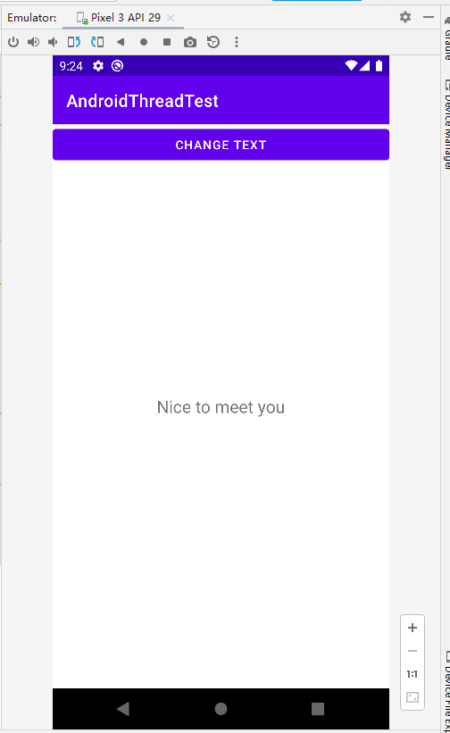

# Thread

## 基本用法

创建：定义一个线程只需要新建一个类继承自Thread，然后重写父类的run()方法，并在里面编写具体逻辑即可（耦合度高）

```kotlin
class MyThread : Thread() { 
	override fun run() { 
		// 编写具体的逻辑
	}
}
```

启动：创建 MyThread 实例后，执行  `Start()` 方法即可

```kotlin
MyThread().start()
```

但是，继承的方式耦合性有点高，更多选择使用实现 Runnable 接口的方式来定义一个线程

```kotlin
class MyThread : Runnable { 
    override fun run() { 
        // 编写具体的逻辑
	}
}
```

启动：Thread 的构造函数接收一个 Runnable 参数，而我们创建的 MyThread 实例正是一 个实现了 Runnable 接口的对象，所以可以直接将它传入Thread 的构造函数里。接着调用 Thread 的 `start()` 方法，`run()` 方法中的代码就会在子线程当中运行了。

```kotlin
val myThread = MyThread() 
Thread(myThread).start()
```

如果你不想专门再定义一个类去实现 Runnable 接口，也可以使用 Lambda 的方式，这种写法更为常见

```kotlin
Thread { 
	// 编写具体的逻辑
}.start()
```

Kotlin还给我们提供了一种更加简单的开启线程的方式

```kotlin
thread {
	// 编写具体的逻辑
}
```


**实例**

创建项目 AndroidThreadTest：

```xml
<RelativeLayout xmlns:android="http://schemas.android.com/apk/res/android"
    android:layout_width="match_parent"
    android:layout_height="match_parent">

    <Button
        android:id="@+id/changeTextBtn"
        android:layout_width="match_parent"
        android:layout_height="wrap_content"
        android:text="Change Text" />

    <TextView
        android:id="@+id/textView"
        android:layout_width="wrap_content"
        android:layout_height="wrap_content"
        android:layout_centerInParent="true"
        android:text="Hello world"
        android:textSize="20sp" />
</RelativeLayout>

<!-- src/main/res/layout/activity_main.xml -->
```

```kotlin
// src/main/java/com/example/androidthreadtest/MainActivity.kt
package com.example.androidthreadtest

import androidx.appcompat.app.AppCompatActivity
import android.os.Bundle
import android.os.Handler
import android.os.Looper
import android.os.Message
import com.example.androidthreadtest.databinding.ActivityMainBinding
import kotlin.concurrent.thread

private lateinit var binding: ActivityMainBinding

class MainActivity : AppCompatActivity() {

    // 1.变量updateText，用于表示更新TextView这个动作
    val updateTest = 1

    // 2.新增一个Handler对象，并重写父类的handleMessage()方法，在这里对具体的Message进行处理
    val handler = object : Handler(Looper.getMainLooper()) {
        override fun handleMessage(msg: Message) {
            when (msg.what) {
                updateTest -> binding.textView.text = "Nice to meet you"
            }
        }
    }

    override fun onCreate(savedInstanceState: Bundle?) {
        super.onCreate(savedInstanceState)
        setContentView(R.layout.activity_main)

        binding = ActivityMainBinding.inflate(layoutInflater)
        val view = binding.root
        setContentView(view)

        // 注：Android 不允许在子线程中更改 UI，对于这种情况，故Android提供了一套异步消息处理机制：
        binding.changeTextBtn.setOnClickListener() {
            thread {
                // 3.创建一个Message（android.os.Message）对象，
                // 4.并将它的 what字段的值指定为updateText，
                // 5.然后调用Handler的sendMessage()方法将这条Message发送出去。
                val msg = Message()
                msg.what = updateTest
                handler.sendMessage(msg)
            }
        }
    }
}
```





**原理**

异步消息处理主要由4个部分组成：Message、Handler、MessageQueue和 Looper。

- **Message** 是在线程之间传递的消息，它可以在内部携带少量的信息，用于在不同线程之间 传递数据。上一小节中我们使用到了Message的what字段，除此之外还可以使用arg1和 arg2字段来携带一些整型数据，使用obj字段携带一个Object对象。
- **Handler** 顾名思义也就是处理者的意思，它主要是用于发送和处理消息的。发送消息一般 是使用Handler的sendMessage()方法、post()方法等，而发出的消息经过一系列地辗 转处理后，最终会传递到Handler的handleMessage()方法中。
- **MessageQueue** 是消息队列的意思，它主要用于存放所有通过Handler发送的消息。这部 分消息会一直存在于消息队列中，等待被处理。每个线程中只会有一个MessageQueue对 象。
- **Looper** 是每个线程中的MessageQueue的管家，调用Looper的loop()方法后，就会进入 一个无限循环当中，然后每当发现MessageQueue中存在一条消息时，就会将它取出，并 传递到Handler的handleMessage()方法中。每个线程中只会有一个Looper对象。