## 实验目的与要求

1. 更好地熟悉和掌握计算机中汇编语言和高级语言之间的关系。
2. 增强学生对于调试器gdb、edb等调试器的使用和逆向工程等方面原理与技能的掌握。
3. 掌握使用gdb调试器和objdump来反汇编炸弹的可执行文件，并单步跟踪调试每一阶段的机器代码，从中理解每一汇编语言代码的行为或作用，进而设法“推断”出拆除炸弹所需的目标字符串。
4. 完善测试，需要拆除尽可能多的炸弹

## 实验仪器设备 / 实验环境

1. Linux操作系统 — 64位Ubuntu
2. gdb调试器和objdump反汇编指令
3. 笔记本

## 实验内容及步骤

- 一个“binary bombs”（二进制炸弹，下文将简称为炸弹）是一个Linux可执行C程序，包含了7个阶段（phase1~phase6和一个隐藏阶段）。炸弹运行的每个阶段要求学生输入一个特定的字符串，若的输入符合程序预期的输入，该阶段的炸弹就被“拆除”，否则炸弹“爆炸”并打印输出 "BOOM!!!"字样。实验的目标是拆除尽可能多的炸弹层次。

- 每个炸弹阶段考察了机器级语言程序的一个不同方面，难度逐级递增： 

  阶段1：字符串比较

  阶段2：for循环

  阶段3：switch分支

  阶段4：递归函数

  阶段5：数组元素按序访问

  阶段6：链表

  隐藏阶段：只有在阶段4的拆解字符串后再附加一特定字符串后才会出现（作为最后一个阶段）

- 为了完成二进制炸弹拆除任务，需要使用gdb调试器和objdump来反汇编炸弹的可执行文件，并单步跟踪调试每一阶段的机器代码，从中理解每一汇编语言代码的行为或作用，进而设法“推断”出拆除炸弹所需的目标字符串。这可能需要在每一阶段的开始代码前和引爆炸弹的函数前设置断点，以便于调试。

- 拆弹密码的输入分文两种模式。

  - 模式1：正常手动输入，每次程序运行到某一阶段会停下来要求用户输入数据。这种方式比较原始，不推荐使用。如果使用这种做法，在程序调试到后期时，每次为了进入后期的断点位置都需要在之前的每一个阶段进行手动输入，极其浪费时间。

  - 模式2：采用输入重定向。首先将答案文本写至一个.txt文本中，每个阶段的拆弹密码占一行。

    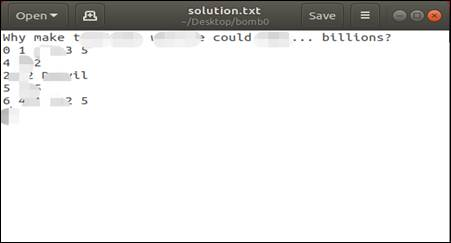

  - 在调试程序时直接使用输入重定向指令，例如（假设密码已被写入到之前的拆弹密码文本文件solution.txt中）：./bomb < solution.txt

  - 通过执行以上指令即可直接根据屏幕输出来判断程序正确地进行了几个阶段或者在第几个阶段出现了错误。如果密码全部正确，提示结果如下图所示：

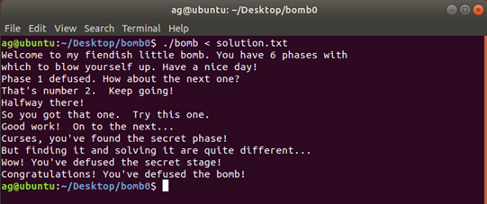

## 实验设备与软件环境

1. Linux操作系统 —— 64位 Ubuntu 18.04
2. C编译环境(gcc)、make自动化编译工具
3. 虚拟机

## 实验注意事项

1. 建议在linux下进行文本拆弹密码文本编辑。
2. 建议使用gdb或IDA、edb、DDD之类的调试软件辅助进行。
3. 建议实验过程中手绘图表辅助逆向工程分析。

## 实验技巧

- 你需要掌握：

  1.使用 gdb 和反汇编以查看程序的运行过程。

  2.明白具体的操作符的含义。

  3.理解不同寄存器的常用方法。

  4.一些汇编语句与实际命令的转换。

  5.使用gdb和反汇编以查看程序的运行过程

  本实验的执行文件为bomb（无后缀），先在命令行找到bomb文件的位置，再用gdb调试工具运行该文件，写法为**gdb bomb**。进入 gdb 调试后，使用**disas phase_X**反汇编相应关卡,或者直接使用**layout regs**进入图形化交互界面,注意自己添加断点(**break** **函数名**)，以及单步执行(**si**)

- 具体的操作符的含义

  常量以符号$开头：$-42， $0x15213（一定要注意十进制还是十六进制）

  寄存器以符号%开头：%esi，%rax（可能存的是值或者地址）

  内存地址用括号括起来：如(%rbx)，括号实际上是去寻址的意思

  一些汇编语句与实际命令的转换，下面是一个**例子**

  注：汇编指令的英文一般就指代其功能，如mov（move移动）。汇编的注释为;。

  ```
  sub    $0x8,%rsp    					;rsp寄存器的内容减去8再保存到rsp中
  mov    $0x402400,%esi   	 			;将常量$0x402400存到esi寄存器中，一般出现这类地址，是重点信息
  callq  0x401338 <strings_not_equal>    	;调用strings_not_equal函数。bomb文件中的函数名基本就指代其功能
  test   %eax,%eax    					;test指令做&操作，一般和跳转一起使用
  je     0x400ef7 <phase_1+23> ;
  callq  0x40143a <explode_bomb>    		;je为若相等则跳转，je也等价于jz（若为零则跳转）。此处即若eax零则跳转到0x400ef7。
  add    $0x8,%rsp    					;rsp寄存器内容加8再保存到rsp中
  
  ```

## 编程要求

根据提示，在汇编代码中找到本关密码，在执行文件中将密码输出验证。为了方便找出过关代码，反汇编找出源码：**objdump -d ./bomb > bomb.s**

如果提示没有执行权限，可以使用ll命令查看该文件夹下的文件权限，并用chmod修改

```
./bomb
```

chmod 777 bomb来修改运行权限

之后再尝试运行即可，效果如下图。如果没有遇到Permission denied问题，则不需要这一步的特殊处理。

```
chmod 777 bomb
```

gdb bomb进入调试

进入调试后，先设置断点，如break phase_1即输入第一关密码后，在phase_1处暂停。再用run命令开始运行程序，run以后会出现一段话，此时输入第一关密码，随便输一个，即进入断点处，此时disas即可查看第一关汇编代码，注意不必纠结函数，给出的地址很重要。


例：

**1.****查看地址0x01存的内容**

​	print 0x01

​	x/s 0x01  ;x为以16进制显示，s为以字符串显示

**2.****查看寄存器esi存的内容**

​	**print $esi**

**	x/s $esi**

**3.****建议将反汇编出来的代码放入一个文本中，好做笔记。**

**4.将汇编中出现的代码，与书中所学的if，while，for，switch的模板做笔记，提炼出程序框架。**

## 实验过程与结果

### Phase_1


1. 使用gdb boom 进入gdb调试模式，并使用layout regs进入GUI模式

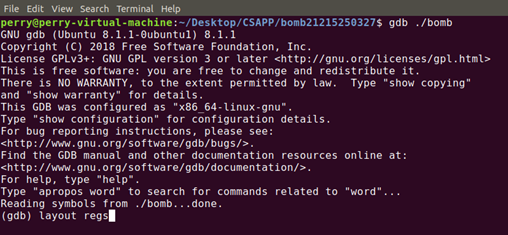

2. 在Phase_1函数前打断点，并将程序跑起来

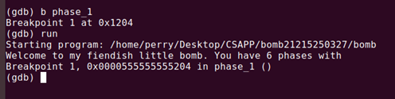

3. 由下面的call… <strings_not_equal>猜出lea内藏有拆弹密码，尝试x/s注释内的内存地址，得出拆弹密码：Brownie, you are doing a heck of a job.

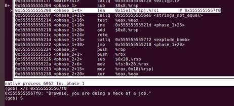

### Phase_2

1. 反汇编Phase_2后，观察到call另一地址

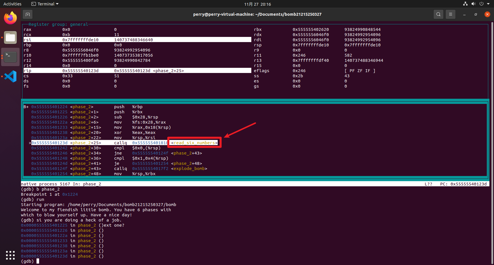

2. 同时，观察到对比的第一个数字为0，如果不为0，则call explode_bomb。

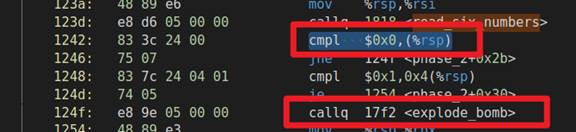

3. 进入read_six_number后，观察到lea指令，查看0x5555554029a3的内容，对应0x555555401841处call指令，得到解除炸弹的密码为六个整数。

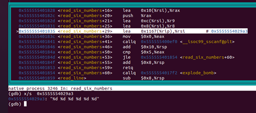

4. 在<phase_2+30>位置打断点，并使用c指令让gdb运行至位于<phase_2+30>处断点，通过观察phase_2函数可知，第一个数字为0，第二个数字为1，其余四位为前两位相加。

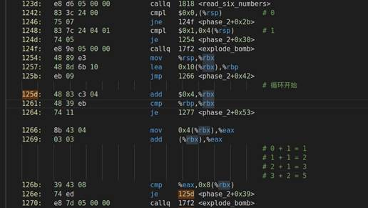

5. 组合后得到拆弹密码：0 1 1 2 3 5

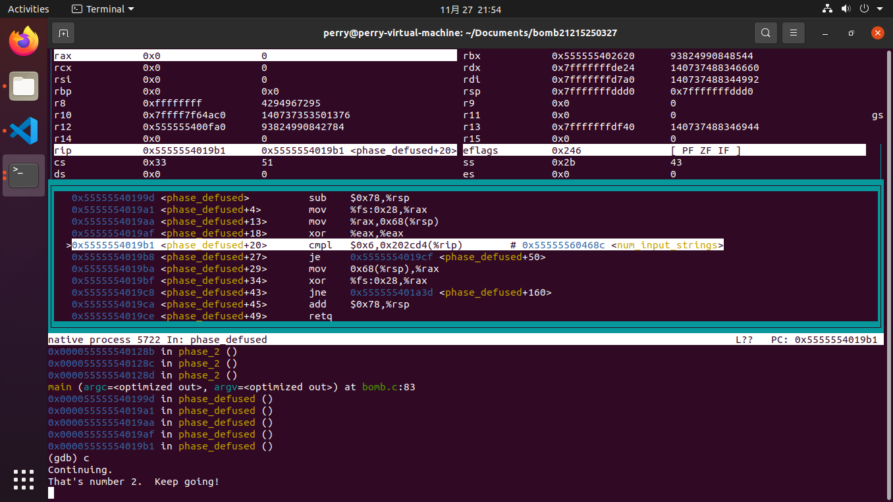

### Phase_3

1. 易知，解除炸弹的密码为两个整数

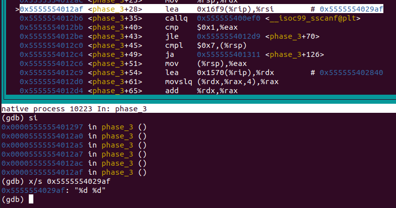

2. 观察后猜出，解除炸弹的其中一个密码可能为：6 50。

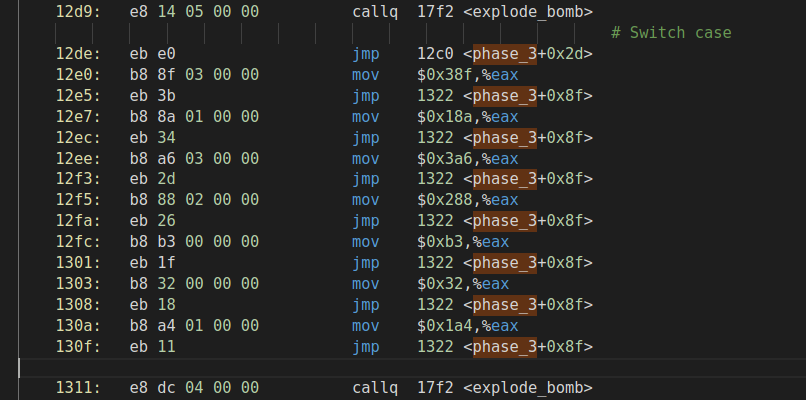

3. 尝试输入后，成功call phase_defused，Phase_3拆除成功。

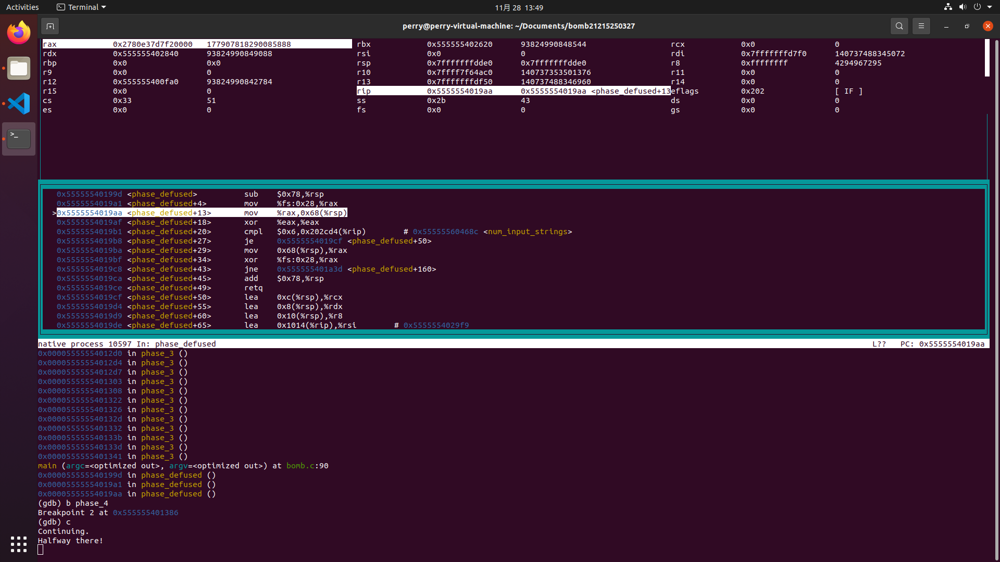

### Phase_4

1. 易知，拆弹密码为两个整数

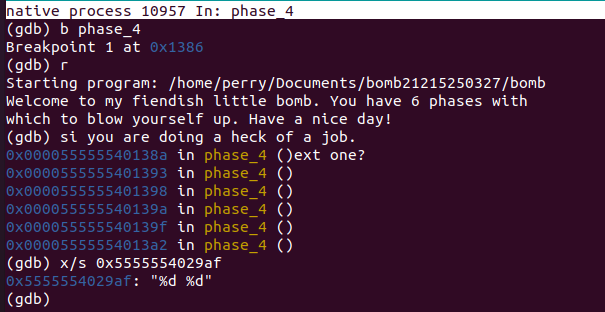

2. 观察汇编代码后，可得出：第一个数必定小于等于14，第二个整数必定为1

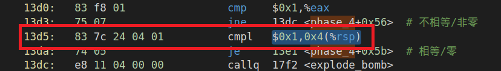

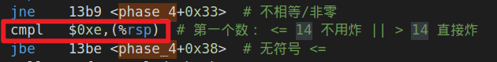

3. 观察func4

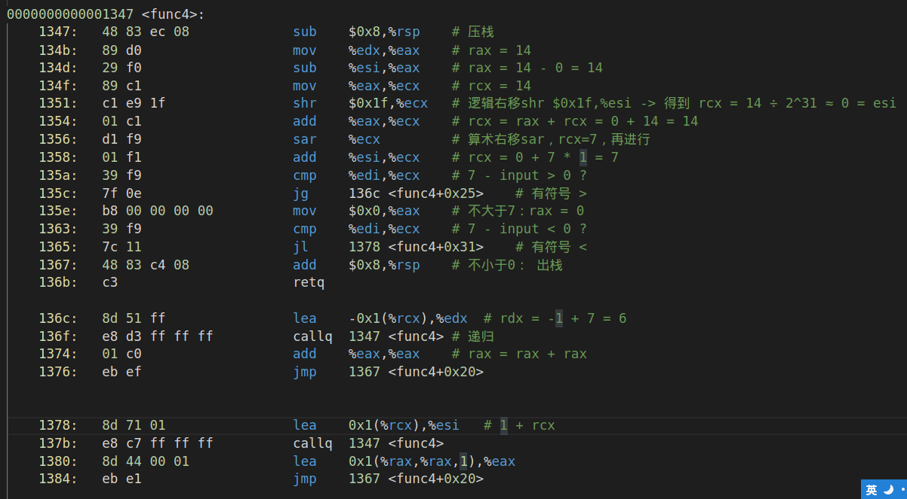

4. 尝试输入：11 1，成功call phase_defused，炸弹拆除成功。

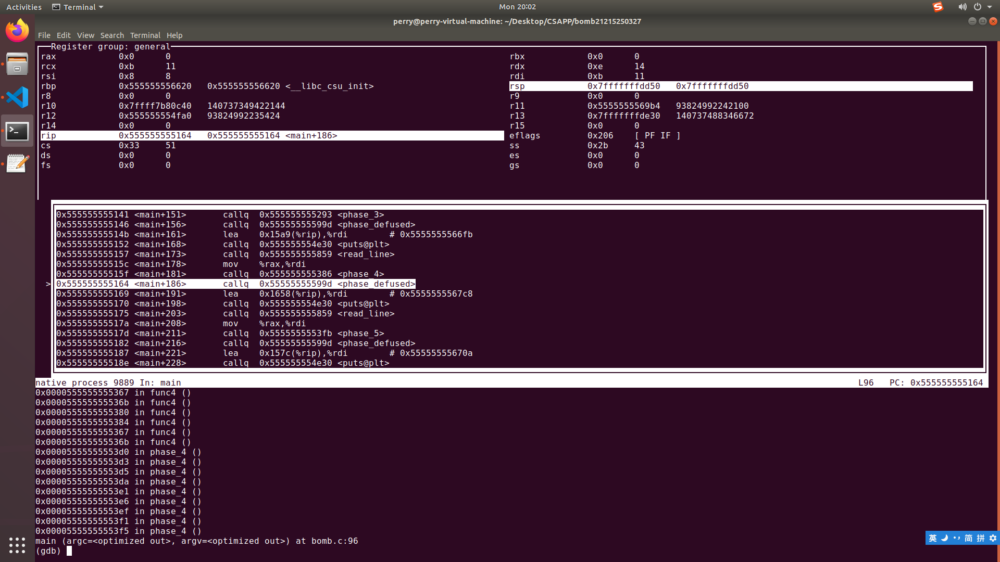


## 操作异常问题与解决方案

问题：实验过程中，其中一台电脑使用Ubuntu 18.04，执行apt-get update 和 apt-get upgrade 打完更新后，重启虚拟机，会卡死在登录页面，无法进入Ubuntu Desktop，多次使用VMware自定义安装及快速安装功能将系统重装后，只要执行两条更新命令，问题依旧出现。

思考：可能存在兼容性问题。

解决：改用Ubuntu 20.04 LTS。

## 实验总结

GNU symbolic debugger，简称「GDB 调试器」，是 Linux 平台下最常用的一款程序调试器，发展至今，GDB 调试器已经对 C、C++、Go、Objective-C、OpenCL、Ada 等多种编程语言提供了支持。

在本次实验中，对于反汇编指令以及一系列的寄存器操作后的结果有了一定的认识，知道了程序背后的机器级代码是如何执行。在这个过程中需要细心的分析，确定程序的流程。

实验前需要先去学习工具的使用与一些编译的基础（符号表、定址表等等）花费了一些时间。前几个阶段过于关注函数的具体实现而没有根据常识去推测一些明显函数的作用花费了一些时间。

实验过程需要细致的分析与大胆的猜测与实验验证，还需要小心操作，最重要的是耐心，面对非常晦涩的汇编代码如何一步步地弄清代码的作用很需要毅力。当然也可以通过自己写出等价的C代码来帮助自己理解。

