## 2.1 Google文件系统GFS

### 2.1.1 系统框架

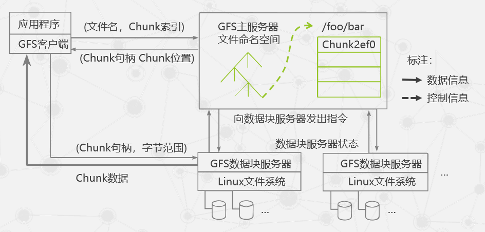

#### 系统节点的角色

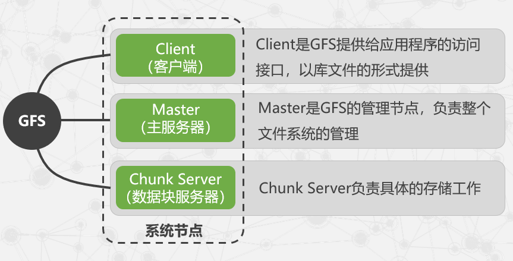

#### 实现机制

- 客户端首先访问Master节点，获取交互的Chunk Server信息，然后访问这些Chunk Server，完成数据存取工作。
  - 这种设计方法实现了**控制流和数据流的分离**。
  - Client与Master之间只有控制流，而无数据流，极大地**降低了Master的负载**。
  - Client与Chunk Server之间直接传输数据流，同时由于文件被分成多个Chunk进行分布式存储，**Client可以同时访问多个Chunk Server**，从而使得整个系统的I/O高度并行，系统整体性能得到提高。 

- **采用中心服务器模式**
  - Master管理分布式文件系统中的所有元数据
  - Chunk Server只是一个存储空间
  - Chunk Server之间无任何关系
  - 避免Master成为系统性能和可靠性上的瓶颈
    - 控制元数据的规模
    - 对Master进行远程备份、控制信息和数据分流
  - 优点：
    - 可以方便地增加Chunk Server
    - Master掌握系统内所有Chunk Server的情况，方便进行负载均衡
    - 不存在元数据的一致性问题

- **不缓存数据**
  - 文件操作大部分是流式读写，不存在大量重复读写，使用Cache对性能提高不
  - Chunk Server上数据存取使用本地文件系统从可行性看，Cache与实际数据的一致性维护也极其复杂
- **在用户态下实现**
  - 利用POSIX编程接口存取数据降低了实现难度，提高通用性
  - POSIX接口提供功能更丰富
  - 用户态下有多种调试工具
  - Master和Chunk Server都以进程方式运行，单个进程不影响整个操作系统
  - GFS和操作系统运行在不同的空间，两者耦合性降低

### 2.1.2 容错机制

- Master上保存了GFS文件系统的三种元数据。
  - 当Master发生故障时，在磁盘数据保存完好的情况下，可以迅速恢复以上元数据
  - 为了防止Master彻底死机的情况，GFS还提供了Master远程的实时备份

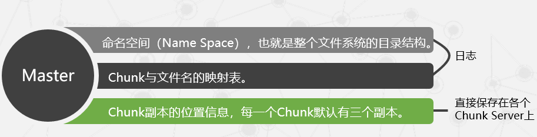

#### Chunk Server容错

- GFS采用副本的方式实现Chunk Server的容错
- 每一个Chunk有多个存储副本（默认为三个）
- 对于每一个Chunk，必须将所有的副本全部写入成功，才视为成功写入
- 相关的副本出现丢失或不可恢复等情况，Master自动将该副本复制到其他Chunk Server
- GFS中的每一个文件被划分成多个Chunk，**Chunk的默认大小是64MB**
- 每一个**Chunk以Block为单位进行划分，大小为64KB**，每一个Block对应一个32bit的校验和

### 2.1.3  系统管理技术

- 大规模集群安装技术
  - GFS集群中通常有非常多的节点，因此迅速地安装、部署一个GFS的系 统，以及迅速地进行节点的系统升级等，需要相应的技术支撑
- 故障检测技术
  - GFS是构建在不可靠的廉价计算机之上的文件系统，节点数目多，在最短的时间内发现并确定发生故障的Chunk Server，需要相关的集群监控技术。
- 节点动态加入技术
  - 只需将裸机加入，就会自动获取系统并安装运行
- 节能技术
  - 对服务器主板进行修改，采用蓄电池代替昂贵的UPS（不间断 电源系统），提高能量的利用率。

## 2.2 分布式数据处理MapReduce

### 2.2.1 产生背景

- MapReduce这种**并行编程模式**思想最早是在**1995**年提出的。
- 与传统的分布式程序设计相比，MapReduce封装了**并行处理、容错处理、本地化计算、负载均衡**等细节，还**提供了一个简单而强大的接口**。
- MapReduce把对数据集的大规模操作，**分发给一个主节点管理下的各分节点**共同完成，通过这种方式**实现任务的可靠执行与容错机制**。

### 2.2.2 编程模型

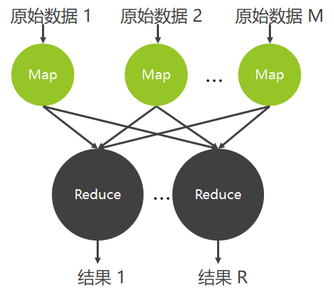

- Map函数：对一部分原始数据进行指定的操作。
  - 每个Map操作都针对不同的原始数据，因此Map与Map之间是互相独立的，这使得它们可以充分并行化。
- Reduce操作：对每个Map所产生的一部分中间结果进行合并操作。
  - 每个Reduce所处理的Map中间结果是互不交叉的，所有Reduce产生的最终结果经过简单连接就形成了完整的结果集.

#### 编程模型

**Map输入参数**：in_key和in_value，它指明了Map需要处理的原始数据 

**Map输出结果**：一组<key,value>对，这是经过Map操作后所产生的中间结果 

**Reduce输入参数**：（key,[value1,…,valuem]）

**Reduce工作**：对这些对应相同key的value值进行归并处理

**Reduce输出结果**：（key, final_value），所有Reduce的结果并在一起就是最终结果 

### 2.2.3 实现机制

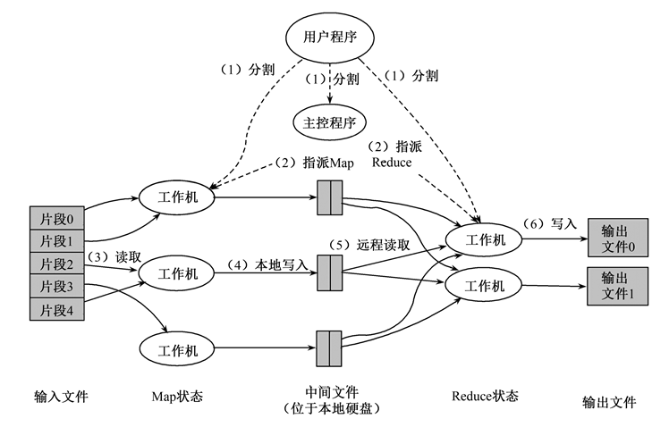

- MapReduce函数首先把**输入文件分成M块**
- 分派的执行程序中有一个**主控程序Master**
- 一个被分配了Map任务的Worker读取并处理相关的输入块
- 这些缓冲到内存的中间结果将被定时写到本地硬盘，**这些数据通过分区函数分成R个区**
- 当Master通知执行Reduce的Worker关于中间<key,value>对的位置时，它调用远程过程，从Map Worker的本地硬盘上读取缓冲的中间数据
- Reduce Worker根据每一个唯一中间key来遍历所有的排序后的中间数据，并且把key和相关的中间结果值集合传递给用户定义的Reduce函数
- 当所有的Map任务和Reduce任务都完成的时候，Master激活用户程序

#### 容错机制

- Master失效
  - Master会周期性地设置检查点（checkpoint），并导出Master的数据。一旦某个任务失效，系统就从最近的一个检查点恢复并重新执行。
  - 由于只有一个Master在运行，如果Master失效了，则只能终止整个MapReduce程序的运行并重新开始。
- Worker失效
  - Master会周期性地给Worker发送ping命令，如果没有Worker的应答，则Master认为Worker失效，终止对这个Worker的任务调度，把失效Worker的任务调度到其他Worker上重新执行。

### 2.2.4 案例分析

#### 怎样通过MapReduce完成排序工作，使其有序（字典序）呢？

- 对原始的数据进行分割（Split），得到N个不同的数据分块 。

  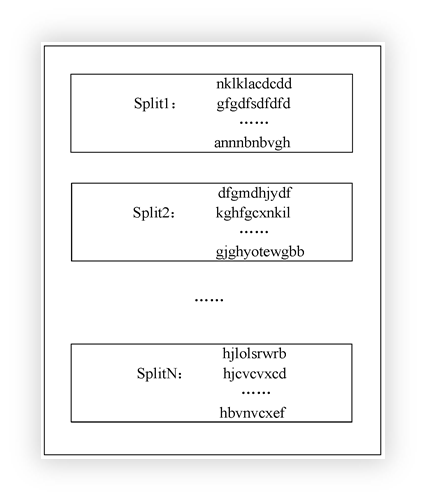

- 对每一个数据分块都启动一个Map进行处理。采用桶排序的方法，每个Map中按照首字母将字符串分配到26个不同的桶中。

  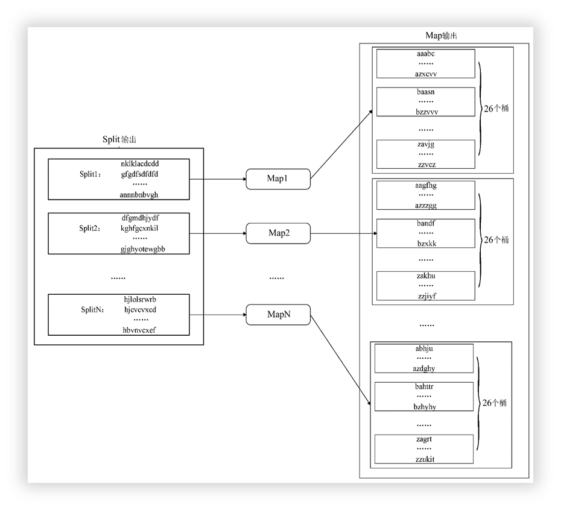

- 对于Map之后得到的中间结果，启动26个Reduce。按照首字母将Map中不同桶中的字符串集合放置到相应的Reduce中进行处理。

  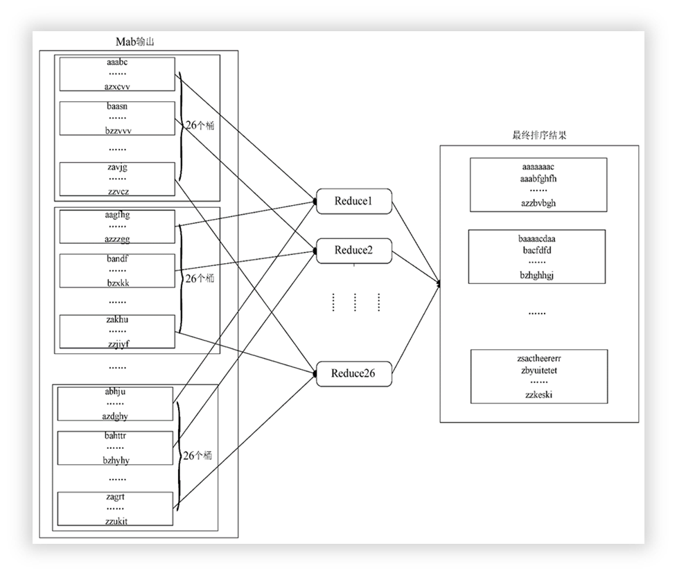

## 2.3 分布式锁服务Chubby

- Chubby是Google设计的提供**粗粒度**锁服务的一个文件系统，它基于松耦合分布式系统，解决了分布的一致性问题。(粗粒度：指时间短；细粒度：指时间长)
  - 通过使用Chubby的**锁服务**，用户可以确保数据操作过程中的一致性
  - Chubby作为一个稳定的**存储系统**存储包括元数据在内的小数据
  - Google内部还使用Chubby进行**名字服务**（Name Server）

### 2.3.1 Paxos算法

- **三个节点**

  - **proposers**：提出决议

  - **acceptors**：批准决议

  - **learners**：获取并使用已经通过的决议

- **三个条件**

  - 决议只有在**被**proposers提出后才能批准

  - 每次**只批准一个**决议

  - 只有决议确定被**批准后**learners**才能获取**这个决议

#### 系统的约束条件

- p1：每个acceptor只接受它得到的第一个决议。

- p2：一旦某个决议得到通过，之后通过的决议必须和该决议保持一致。
  - p2a：一旦某个决议v得到通过，之后任何acceptor再批准的决议必须是v。
  - p2b：一旦某个决议v得到通过，之后任何proposer再提出的决议必须是v。
  - p2c：如果一个编号为n的提案具有值v，那么存在一个“多数派”，要么它们中没有谁批准过编号小于n的任何提案，要么它们进行的最近一次批准具有值v。
- 注：为了保证决议的唯一性，acceptors也要满足一个约束条件：**当且仅当 acceptors 没有收到编号大于n的请求时，acceptors 才批准编号为n的提案。**

#### 决议的两个阶段

- **准备阶段**
  - proposers**选择一个提案并将它的编号设为n**
  - 将它**发送给acceptors中的一个“多数派”**
  - acceptors 收到后，如果提案的编号大于它已经回复的所有消息，则**acceptors将自己上次的批准回复给proposers，并不再批准小于n的提案**。
- **批准阶段**
  - 当proposers接收到acceptors 中的这个“多数派”的回复后，就向回复请求的acceptors发送accept请求，在符合acceptors一方的约束条件下，acceptors收到accept请求后即批准这个请求。

### 2.3.2 Chubby系统设计

#### Chubby的设计目标主要有以下几点

- 高可用性和高可靠性
- 高扩展性
- 支持粗粒度的**建议性**锁服务
- 服务信息的直接存储
- 支持缓存机制
- 支持通报机制

#### Chubby的基本架构

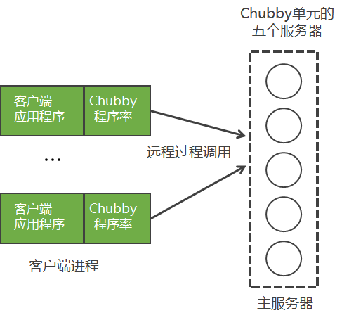

- 客户端
  - 在客户这一端每个客户应用程序都有一个Chubby程序库（Chubby Library），客户端的所有应用都是通过调用这个库中的相关函数来完成的。

- 服务器端
  - 服务器一端称为Chubby单元，一般是由五个称为副本（Replica）的服务器组成的，这五个副本在配置上完全一致，并且在系统刚开始时处于对等地位。

### 2.3.3 Chubby中的Paxos

- 副本结构

  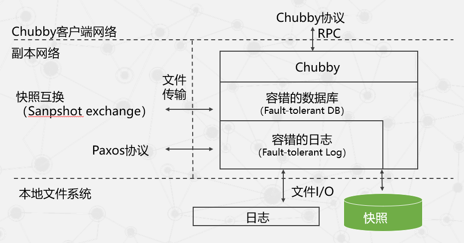

- 容错日志API

  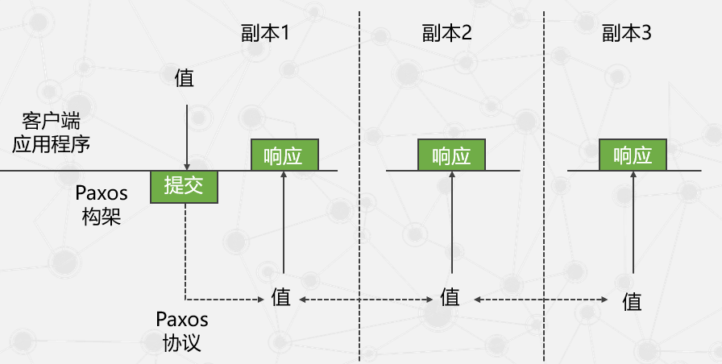

### 2.3.4 Chubby文件系统

- 系统规定每个节点的 元数据都应当包含以下四种单调递增的64位编号

  - 实例号（Instance Number）：新节点实例号必定大于旧节点的实例号。
  - 内容生成号（Content Generation Number）：文件内容修改时该号增加。 
  - 锁生成号（Lock Generation Number）：锁被用户持有时该号增加。
  - ACL生成号（ACL Generation Number）：ACL名被覆写时该号增加。

- 常用函数

  | **函** **数 名 称**  | **作**    **用**                         |
  | -------------------- | ---------------------------------------- |
  | Open()               | 打开某个文件或者目录来创建句柄           |
  | Close()              | 关闭打开的句柄，后续的任何操作都将中止   |
  | Poison()             | 中止当前未完成及后续的操作，但不关闭句柄 |
  | GetContentsAndStat() | 返回文件内容及元数据                     |
  | GetStat()            | 只返回文件元数据                         |
  | ReadDir()            | 返回子目录名称及其元数据                 |
  | SetContents()        | 向文件中写入内容                         |
  | SetACL()             | 设置ACL名称                              |
  | Delete()             | 如果该节点没有子节点的话则执行删除操作   |
  | Acquire()            | 获取锁                                   |
  | Release()            | 释放锁                                   |
  | GetSequencer()       | 返回一个sequencer                        |
  | SetSequencer()       | 将sequencer和某个句柄进行关联            |
  | CheckSequencer()     | 检查某个sequencer是否有效                |

### 2.3.5 通信协议

- 客户端和主服务器之间的通信是通过KeepAlive握手协议来维持的，这一通信过程的 简单示意图 如下

  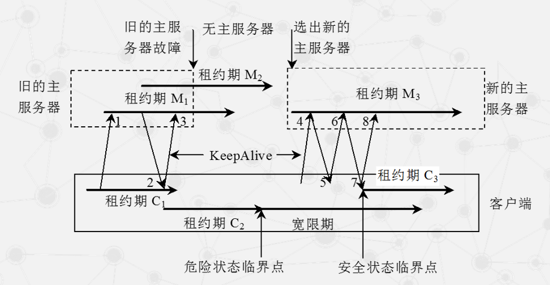

  - 客户端租约过期 

    - 刚开始时，客户端向主服务器发出一个KeepAlive请求（见图2-10中的1），如果有需要通知的事件时则主服务器会立刻做出回应，否则主服务器并不立刻对这个请求做出回应，而是等到客户端的租约期C1快结束的时候才做出回应（见图2-10中的2），并更新主 服务器租约期为M2。

    - 客户端在接到这个回应后认为该主服务器仍处于活跃状态，于是将 租约期更新为C2并立刻发出新的KeepAlive请求（见图2-10中的3）。同样地，主服务器可 能不是立刻回应而是等待C2接近结束，但是在这个过程中主服务器出现故障停止使用。 在等待了一段时间后C2到期，由于并没有收到主服务器的回应，系统向客户端发出一个 危险（Jeopardy）事件，客户端清空并暂时停用自己的缓存，从而进入一个称为宽限期 （Grace Period）的危险状态。这个宽限期默认是45秒。在宽限期内，客户端不会立刻断 开其与服务器端的联系，而是不断地做探询。
    - 图2-10中新的主服务器很快被重新选出，当 它接到客户端的第一个KeepAlive请求（见图2-10中的4）时会拒绝（见图2-10中的5），因 为这个请求的纪元号（Epoch Number）错误。不同主服务器的纪元号不相同，客户端的 每次请求都需要这个号来保证处理的请求是针对当前的主服务器。客户端在主服务器拒绝 之后会使用新的纪元号来发送KeepAlive请求（见图2-10中的6）。新的主服务器接受这个 请求并立刻做出回应（见图2-10中的7）。如果客户端接收到这个回应的时间仍处于宽限 期内，系统会恢复到安全状态，租约期更新为C3。如果在宽限期未接到主服务器的相关回应，客户端终止当前的会话。

  - 主服务器出错 

    - 在客户端和主服务器端进行通信时可能会遇到主服务器故障，图2-10就出现了这种情况。正常情况下旧的主服务器出现故障后系统会很快地选举出新的主服务器，新选举的主 服务器在完全运行前需要经历以下九个步骤。 
      - 产生一个新的纪元号以便今后客户端通信时使用，这能保证当前的主服务器不
        必处理针对旧的主服务器的请求。 
      - 只处理主服务器位置相关的信息，不处理会话相关的信息。
      - 构建处理会话和锁所需的内部数据结构。 
      - 允许客户端发送KeepAlive请求，不处理其他会话相关的信息。
      - 向每个会话发送一个故障事件，促使所有的客户端清空缓存。
      - 等待直到所有的会话都收到故障事件或会话终止。 
      - 开始允许执行所有的操作。 
      - 如果客户端使用了旧的句柄则需要为其重新构建新的句柄。 
      - 一定时间段后（1分钟），删除没有被打开过的临时文件夹。 如果这一过程在宽限期内顺利完成，则用户不会感觉到任何故障的发生，也就是说新旧主服务器的替换对于用户来说是透明的，用户感觉到的仅仅是一个延迟。使用宽限期的好处正是如此。

### 2.3.6 正确性与性能

- 一致性

  - 每个Chubby单元是由五个副本组成的，这五个副本中需要选举产生一个主服务器，这种选举本质上就是一个一致性问题

- 安全性

  - 采用的是ACL形式的安全保障措施。只要不被覆写，子节点都是直接继承父节点的ACL名

    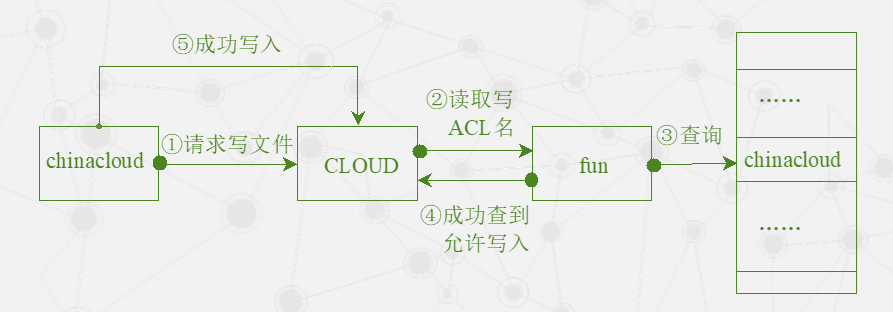

    - 用户chinacloud提出向文件CLOUD中写入内容的请求。CLOUD首先读取自身的写ACL名fun，接着在fun中查到了chinacloud这一行记录，于是返回信息允许chinacloud对文件进行写操作，此时chinacloud才被允许向CLOUD写入内容。其他的操作和写操作类似。

- 优化性能

  - 提高主服务器默认的租约期、使用协议转换服务将Chubby协议转换成较简单的协议、客户端一致性缓存等

## 2.4 分布式结构化数据表Bigtable

### 2.4.1 设计动机与目标

### 2.4.2 数据模型

- Bigtable是一个分布式多维映射表，表中的数据通过一个行关键字（Row Key）、一个列关键字（Column Key）以及一个时间戳（Time Stamp）进行索引
- Bigtable的存储逻辑可以表示为：``(row:string, column:string, time:int64)→string``

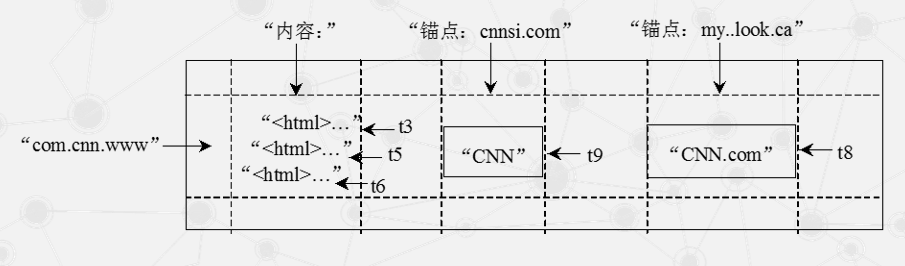

- 行
  -  Bigtable的行关键字可以是任意的字符串，但是大小不能够超过64KB。Bigtable和传统的关系型数据库有很大不同，它不支持一般意义上的事务，但能保证对于行的读写操作 具有原子性（Atomic）。表中数据都是根据行关键字进行排序的，排序使用的是词典序。 
  - 上图是Bigtable数据模型的一个典型实例，其中com.cnn.www就是一个行关键字。不直接存储网页地址而将其倒排是Bigtable的一个巧妙设计。这样做至少会带来以下两个好 处。
    - 同一地址域的网页会被存储在表中的连续位置，有利于用户查找和分析。
    - 倒排便于数据压缩，可以大幅提高压缩率。 由于规模问题，单个的大表不利于数据的处理，因此Bigtable将一个表分成了很多子表（Tablet），每个子表包含多个行。子表是Bigtable中数据划分和负载均衡的基本单位。
- 列 
  - Bigtable并不是简单地存储所有的列关键字，而是将其组织成所谓的列族（ColumnFamily），每个族中的数据都属于同一个类型，并且同族的数据会被压缩在一起保存。
  - 引入了列族的概念之后，列关键字就采用下述的语法规则来定义： 族名：限定词（family：qualifier） 族名必须有意义，限定词则可以任意选定。
  - 在图中，内容（Contents）、锚点（Anchor，就是HTML中的链接）都是不同的族。而cnnsi.com和my.look.ca则是锚点族中 不同的限定词。通过这种方式组织的数据结构清晰明了，含义也很清楚。族同时也是 Bigtable中访问控制（Access Control）的基本单元，也就是说访问权限的设置是在族这一 级别上进行的。 
- 时间戳 
  - Google的很多服务比如网页检索和用户的个性化设置等都需要保存不同时间的数据，
  - 这些不同的数据版本必须通过时间戳来区分。图2-12中内容列的t3、t5和t6表明其中保存 了在t3、t5和t6这三个时间获取的网页。Bigtable中的时间戳是64位整型数，具体的赋值方式可以采取系统默认的方式，也可以用户自行定义。

### 2.4.3 系统架构

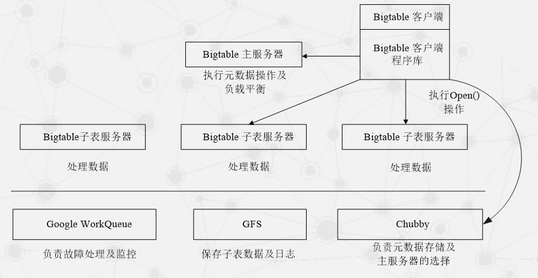

- 作用

  - 选取并保证同一时间内只有一个主服务器（Master Server）。

  - 获取子表的位置信息。

  - 保存Bigtable的模式信息及访问控制列表。

### 2.4.4 主服务器

- 当一个新的子表产生时，主服务器通过一个加载命令将其分配给一个空间足够的子表服务器。
- 创建新表、表合并以及较大子表的分裂都会产生一个或多个新子表。
- 分割完成之后子服务器需要向主服务发出一个通知。
- 主服务器必须对子表服务器的状态进行监控，以便及时检测到服务器的加入或撤销

#### Bigtable 中 Chubby 的主要作用

- 基于系统出现故障是一种常态的设计理念（Google几乎所有的产品都是基于这个设计 理念），每个主服务器被设定了一个会话时间的限制。当某个主服务器到时退出后，管理 系统就会指定一个新的主服务器，这个主服务器的启动需要经历以下四个步骤。 
  - 从Chubby中获取一个独占锁，确保同一时间只有一个主服务器。
  - 扫描服务器目录，发现目前活跃的子表服务器。
  - 与所有的活跃子表服务器取得联系以便了解所有子表的分配情况。 
  - 通过扫描元数据表（Metadata Table），发现未分配的子表并将其分配到合适的

### 2.4.5 子表服务器

- SSTable是Google为Bigtable设计的内部数据存储格式。所有的SSTable文件都存储在GFS上，用户可以通过键来查询相应的值。

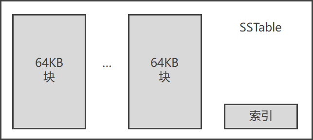

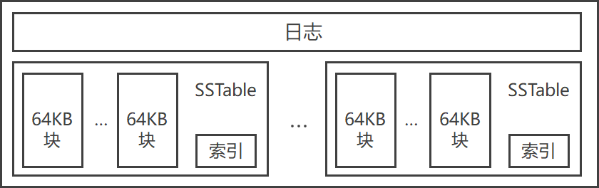

- 不同子表的SSTable可以共享

- 每个子表服务器上仅保存一个日志文件

- Bigtable规定将日志的内容按照键值进行排序

- 每个子表服务器上保存的子表数量可以从几十到上千不等，通常情况下是100个左右

#### 子表地址组成

- Bigtable系统的内部采用的是一种类似B+树的三层查询体系

  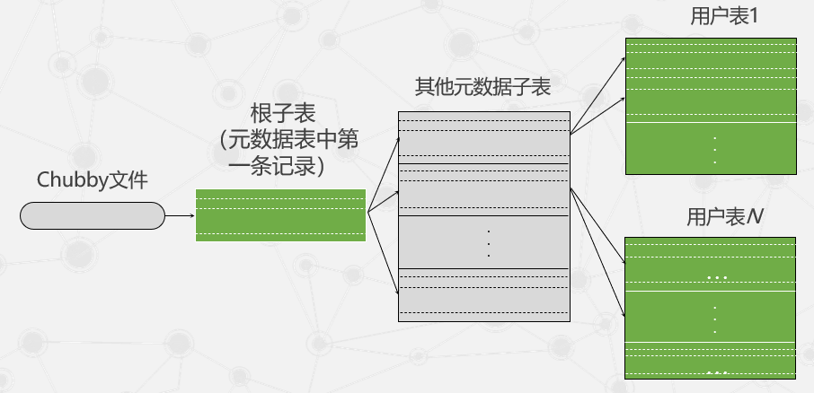

#### Bigtable 数据存储及读/写操作

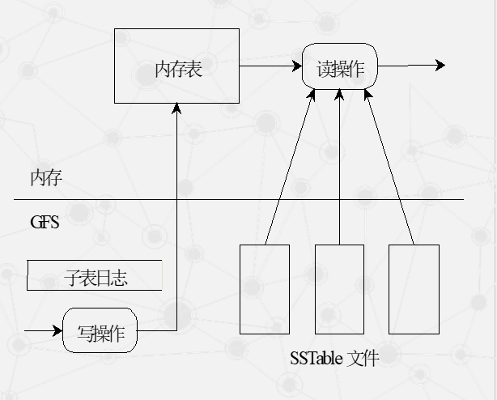

#### **三种形式压缩之间的关系**

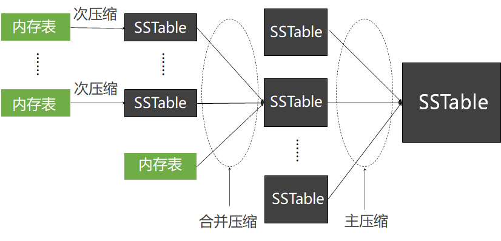

### 2.4.6 性能优化

#### **局部性群组**

- Bigtable允许用户将原本并不存储在一起的数据以列族为单位，根据需要组织在一个单独的SSTable中，以构成一个局部性群组。

- 用户可以只看自己感兴趣的内容。

- 对于一些较小的且会被经常读取的局部性群组，明显地改善读取效率。

  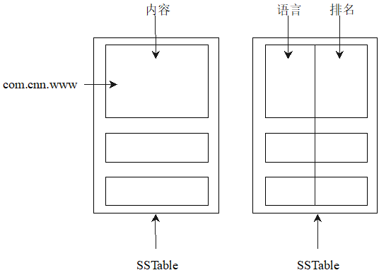

#### 压缩

#### **布隆过滤器**

一个很长的**二进制向量**和一系列**随机映射函数**

- 优点

  - 布隆过滤器的速度快，省空间

  - 不会将一个存在的子表判定为不存在

- 缺点

  - 在某些情况下它会将不存在的子表判断为存在
