## 5.1 引例

### 5.1.1  问题与传统解决方案

【例5-1】假设现有一些配置完全相同的机器cSlave0~cSlaveN，cMaster0，cMaster1，并且每台机器都有1个双核CPU，5GB硬盘。现有两个大小都是2GB的文件file0和file1。

### 第一类问题，存储。

问题①：将file0和file1存入两台不同机器，但要求对外显示它们存于同一硬盘空间。

- 取两台机器cSlave0和cSlave1，cSlave0存储file0，cSlave1存储file1。

问题②：不考虑①，现有一新文件file2，大小为6GB，要求存入机器后对外显示依旧为一个完整文件。

- 将file2拆成两个大小分别为3GB的文件file2-a和file2-b，将file2-a存入cSlave0、file2-b存入cSlave1。

### 第二类问题，计算。

问题③：在问题①下，统计file0和file1这两个文件里每个单词出现的次数。

- 步骤一，将cSlave1上的file1复制一份到cSlave0上，这样cSlave0上同时存有file0和file1。
- 步骤二，编写一简单程序，程序里使用HashMap<String, Integer>，顺序读取文件，判断新读取的单词是否存在于HashMap，存在Integer+1，不存在则HashMap里加入这个新单词，Integer置为1，记此程序为WordCount。
- 步骤三，将此程序WordCount放在cSlave0上执行，得出结果。

### 第三类问题，可靠性。

问题④：假设用于解决上述问题的机器宕机了，问如何保证数据不丢失。

- 为每台机器都做磁盘冗余阵列（RAID），购买更稳定的硬件，配置最好的机房、最稳定的网络。

### 5.1.3  分布式下的解决方案

#### 分布式存储

对于第一类存储问题，若能将多台机器硬盘以某种方式连接到一起，则问题迎刃而解。取机器cSlave0，cSlave1和cMaster0，采用客户-服务器模式构建分布式存储集群，让cMaster0管理cSlave0，cSlave1。

上层主机只管理，下层主机只存储

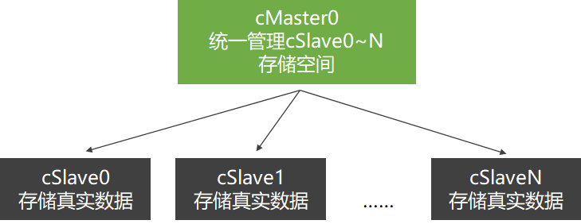

在此设计环境下：

- ##### 对内

客户-服务器模式：只要保证store master正常工作，我们很容易随意添加store slave，硬盘存储空间无限大。

- ##### 对外

统一存储空间，统一文件接口：整个集群就像是一台机器、一片云，硬盘显示为统一存储空间，文件接口统一。

**分布式文件系统(Distributed File System，DFS)  ≈  Hadoop分布式文件系统 (Hadoop DFS，HDFS)**

#### 分布式计算

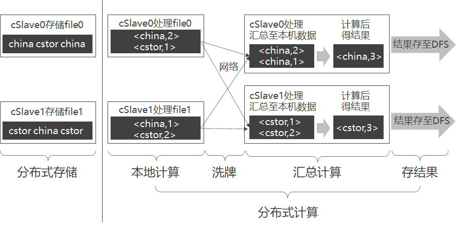

**步骤**

- 本地计算（Map）
- 洗牌（Shuffle）
  - 规定将Key值相同的KV对，通过网络发往同一台机器。
- 合并再计算（Reduce）

取新机器cMaster1，采用客户-服务器模式构建由机器cSlave0、cSlave1和cMaster1组成的分布式计算集群。

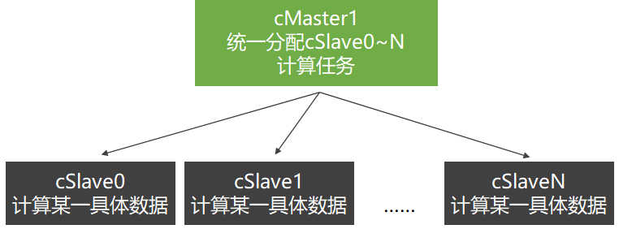

cSlave0最好是处理存于本机硬盘上的file0，而不是将file1从cSlave1调过来（通过网络）再处理file1，这就是所谓的“本地计算”。

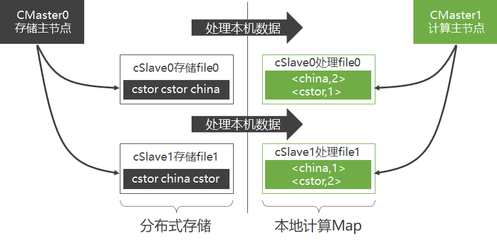

**合并 (洗牌)**

- 第一步：每台机器将各自KV对中的Value连接成一个链表
- 第二步：各台机器可对<Key,ValueList>进行业务处理，称此过程为Reduce。
- 第三步：将得出的结果再存于DFS。

容易看出，无论是Map、Shuffle还是Reduce，甚至是存储结果，在每个阶段都是并行的，整个过程则构成一个有向无环图（DAG）

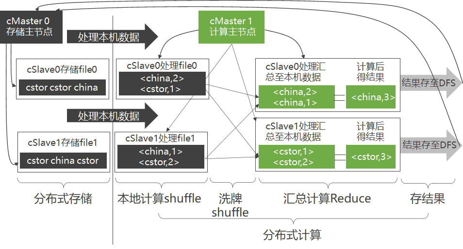

**冗余存储与冗余计算**

只要保证存于cSlave0上的数据，同时还存在于别的机器上，即使cSlave0宕机，数据依旧不会丢失。

- 存储时
  - 引入新机器cSlave2和cSlave3，将存于cSlave0的file0同样存储于cSlave2，存于cSlave1的file1同样存一份于cSlave3。
- 计算时
  - cSlave0~3的计算任务统一由cMaster1指派。
  - cMaster1选中先结束的那台机器的计算结果，并停止另一台机器里还在计算的进程
- 作用
  - 通过冗余存储，不仅提高了分布式存储可靠性，还提高了分布式计算的可靠性。

### 5.1.4  小结

- 现实中Hadoop的实现机制则更加复杂，但其架构的基本思路和本节很类似。
- 分布式存储和分布式计算这两者间并没有关系，它们各自都可以独立存在。
- 当MapReduce运行于HDFS上时，性能较好。

## 5.2 Hadoop 2.0简述

- 将Hadoop 2.0部署至集群后，通过调用Hadoop 2.0程序库，能够用简单的编程模型来处理分布在不同机器上的大规模数据集。
- 由于采用客户-服务器模式，Hadoop 2.0很容易从一台机器扩展至成千上万台机器，并且每台机器都能提供本地计算存储和本地计算。
- 考虑到集群中每台机器都可能会出问题（如硬件失效），Hadoop 2.0本身从设计上就在程序层规避了这些问题。

**各个产品项目之间的层次关系**

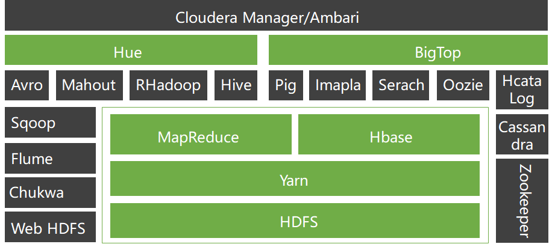

**应用场景**

- 构建大型分布式集群

- 数据仓库

- 数据挖掘

**Google云计算组件和Hadoop及其相关项目之间的对应关系：**

| **Hadoop云计算系统** | **Google云计算系统** |
| -------------------- | -------------------- |
| Hadoop  HDFS         | Google  GFS          |
| Hadoop  MapReduce    | Google  MapReduce    |
| HBase                | Google  BigTable     |
| ZooKeeper            | Google  Chubby       |
| Pig                  | Google  Sawzall      |

## 5.3 Hadoop 2.0部署

### 5.3.1  部署综述

**制定部署规划**

- 准备机器
- 准备机器软件环境
- 下载Hadoop
- 解压Hadoop
- 配置Hadoop
- 启动Hadoop
- 测试Hadoop

**硬件环境**
由于分布式计算需要用到很多机器，部署时用户须提供多台机器，至于提供几台，须根据 “部署规划”确定。
实际上，完全模式部署Hadoop时，最低需要两台机器（一个主节点，一个从节点），此外，硬件方面，每台机器最低要求有1GB内存，20GB硬盘空间。

**软件环境**

大量的实践证明，在Linux环境下使用Hadoop则更加稳定高效
须注意的是新装系统（CentOS）的机器不可以直接部署Hadoop

- 修改机器名
- 添加域名映射
- 关闭防火墙
- 安装JDK

**关于Hadoop依赖软件**

- SSH只是给sbin/start-yarn.sh等几个start-x.sh与stop-x.sh脚本使用
- Hadoop本身是一堆Java代码，而Java代码并不依赖SSH
- 本节使用的Hadoop版本为稳定版Hadoop-2.2.0.tar.gz
- CentOS版本为64位CentOS-6.5
- JDK版本为jdk-7u40-linux-x64.rpm

### 5.3.2  传统解压包部署

现有三台机器，且它们都刚装好64位CentOS-6.5，安装系统时用户名为joe，请按要求完成：

-  修改三台机器名为cMaster，cSlave0和cSlave1，并添加域名映射、关闭防火墙和安装JDK。
-  以cMaster作为主节点，cSlave0和cSlave1作为从节点，部署Hadoop。

- 制定部署规划
  - 此Hadoop集群需三台机器（cMaster，cSlave0和cSlave1），其中cMaster作为主节点，cSlave0和cSlave1作为从节点。
- 准备机器
  - 准备三台机器，它们可以是实体机也可以是虚拟机，若使用虚拟机。
- 准备机器软件环境
  - 三台机器都要完成：修改机器名、添加域名映射、关闭防火墙和安装JDK。

- 下载Hadoop
  - 谷歌搜索“Hadoop download”并下载，以joe用户身份，将Hadoop分别复制到三台机器上。
- 解压Hadoop
  - 分别以joe用户登录三台机器，每台都执行如下命令解压Hadoop文件：
- 配置Hadoop
  - 三台机器都要配置，且配置相同

- 启动Hadoop
  - 首先，在主节点cMaster上格式化主节点命名空间
  - 其次，在主节点cMaster上启动存储主服务namenode和资源管理主服务resourcemanager。
  - 最后，在从节点上启动存储从服务datanode和资源管理从服务nodemanager
- 测试Hadoop

## 5.4 Hadoop 2.0体系架构

### 5.4.1  Hadoop 2.0公共组件Common

### 5.4.2  分布式文件系统HDFS

**HDFS定位**

为提高扩展性，HDFS采用了master/slave架构来构建分布式存储集群，这种架构很容易向集群中任意添加或删除slave。

**HDFS体系架构**

HDFS架构：

- HDFS采用master/slave体系来构建分布式存储服务
  - 提高了HDFS的可扩展性又简化了架构设计
- HDFS里将文件分块存储
  - 优化存储颗粒度
- namenode统一管理所有slave机器datanode存储空间，datanode以块为单位存储实际的数据
- 真正的文件I/O操作时客户端直接和datanode交互

NameNode（主控制服务器）

- 负责维护文件系统的命名空间（Namespace）
- 协调客户端对文件的访问
- 记录命名空间内的任何改动或命名空间本身的属性改动

DataNode

- 负责它们所在的物理节点上的存储管理
- HDFS开放文件系统的命名空间

NameNode

- 执行文件系统的命名空间操作
- 决定数据块到DataNode的映射

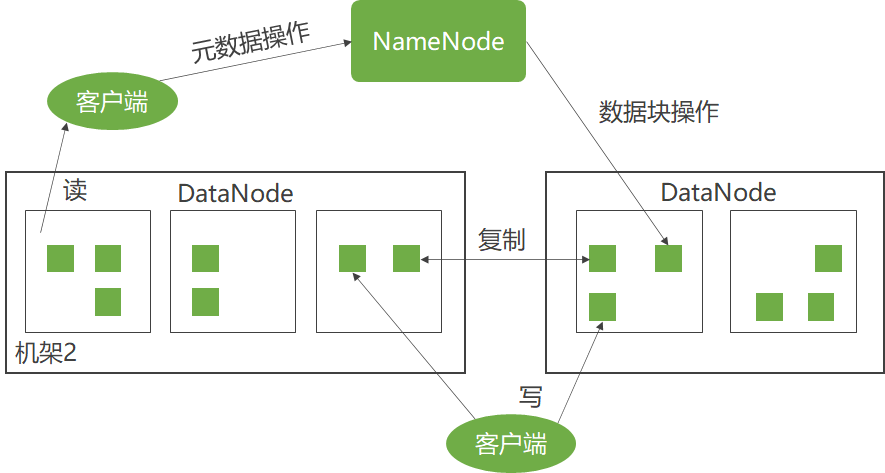

客户端要访问一个文件

- 客户端从NameNode获得组成文件的数据块的位置列表
- 客户端直接从DataNode上读取文件数据

**一般拓扑**

- 只有单个NameNode节点，
- 使用SecondaryNameNode或BackupNode节点实时获取NameNode元数据信息，备份元数据。

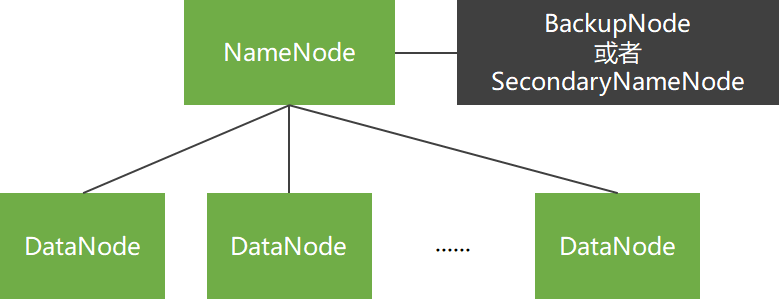

**商用拓扑**

- 有两个NameNode节点，
- 并使用ZooKeeper实现NameNode节点间的热切换。

ZooKeeper集群：至少三个ZooKeeper实体，用来选举ActiveNamenode。
JourNalNode集群：至少三个，用于与两NameNode交换数据，也可使用NFS。
HTTPFS：提供Web端读写HDFS功能。

**HDFS内部特性**

- 冗余备份
- 副本存放
- 副本选择
- 心跳检测
- 数据完整性检测
- 元数据磁盘失效
- 简单一致性模型、流式数据访问
- 客户端缓存
- 流水线复制
- 架构特征
- 超大规模数据集

**HDFS对外功能**

- NameNode高可靠性
- HDFS快照
- 元数据管理与恢复工具
- HDFS安全性

- HDFS配额功能
- HDFS C语言接口
- HDFS Short-Circuit功能
- WebHdfs

### 5.4.3  分布式操作系统Yarn

**分布式操作系统的基本功能**

- 管理计算机资源

- 提供用户接口

**Yarn**

- 一方面管理整个集群的计算资源（CPU、内存等）
- 另一方面提供用户程序访问系统资源的API。

**体系架构**

Yarn的主要思想是将MRv1版JobTracker的两大功能——资源管理和任务调度，拆分成两个独立的进程：

- 资源管理模块
  - 全局资源管理进程ResourceManager
- 任务管理模块
  - 任务管理进程ApplicationMaster

Yarn依旧是master/slave结构

主进程ResourceManager是整个集群资源仲裁中心

从进程NodeManager管理本机资源

ResourceManager和从属节点的进程NodeManager组成了Hadoop 2.0的分布式数据计算框架

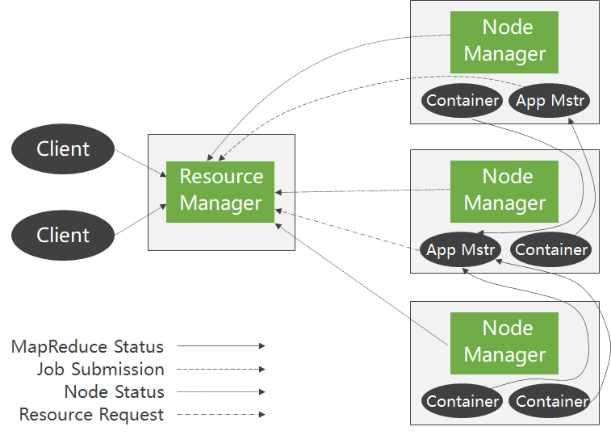

Yarn在执行时包含以下独立实体：

① Client：客户端，负责向集群提交作业。

② ResourceManager：集群主进程，仲裁中心，负责集群资源管理和任务调度。

③ Scheduler：资源仲裁模块。

④ ApplicationManager：选定，启动和监管ApplicationMaster。

⑤ NodeManager：集群从进程，管理监视Containers，执行具体任务。

⑥ Container：本机资源集合体，如某Container为4个CPU，8GB内存。

⑦ ApplicationMaster：任务执行和监管中心。

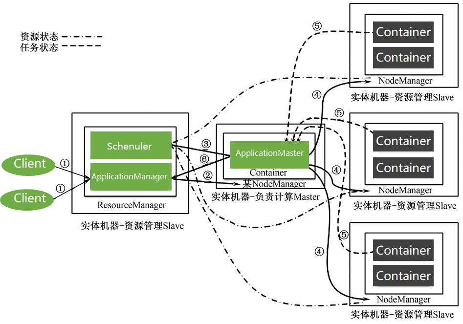

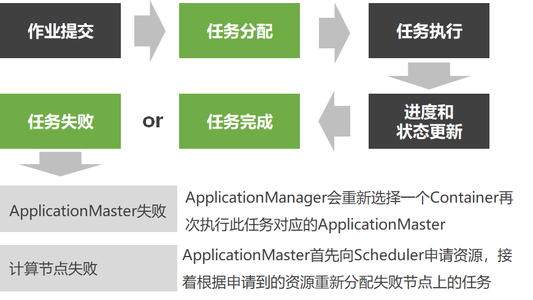

从Yarn架构和Yarn任务执行过程能看出Yarn具有巨大优势：

- Scheduler
- ApplicationManager
- ApplicationMaster
- 纯粹的资源仲裁中心
- 只监管ApplicationMaster
- 负责任务整体执行

Yarn的设计大大减轻了ResourceManager的资源消耗，并且ApplicationMaster可分布于集群中任意一台机器，设计上更加优美。

除了ResourceManager和NodeManager两个实体外，Yarn还包括WebAppProxyServer和JobHistoryServer两个实体。

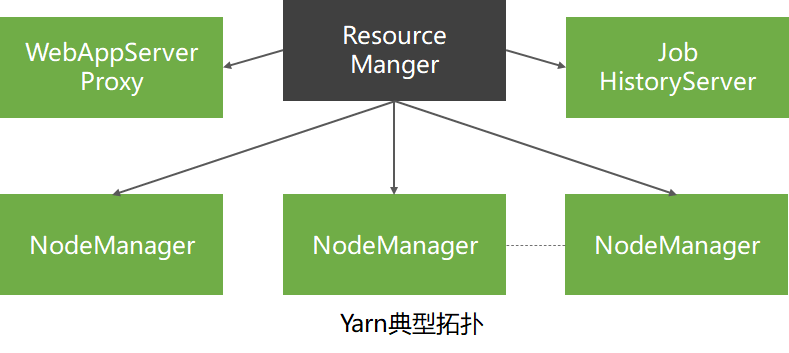

- JobHistoryServer 管理已完成的Yarn任务
  - 历史任务的日志和执行时的各种统计信息统一由JobTracker管理
  - Yarn将管理历史任务的功能抽象成一独立实体JobHistoryServer
- WebAppProxyServer 任务执行时的Web页面代理
  - 通过使用代理，不仅进一步降低了ResourceManager的压力，还能降低Yarn受到的Web攻击
  - 负责监管具体MapReduce任务执行全过程，将从Container那里收集过的任务执行信息汇总并显示到一个Web界面上

**编程模板**

ApplicationMaster 是一个可变更的部分，只要实现不同的ApplicationMaster，就可以实现不同的编程模式

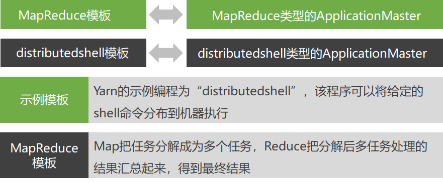

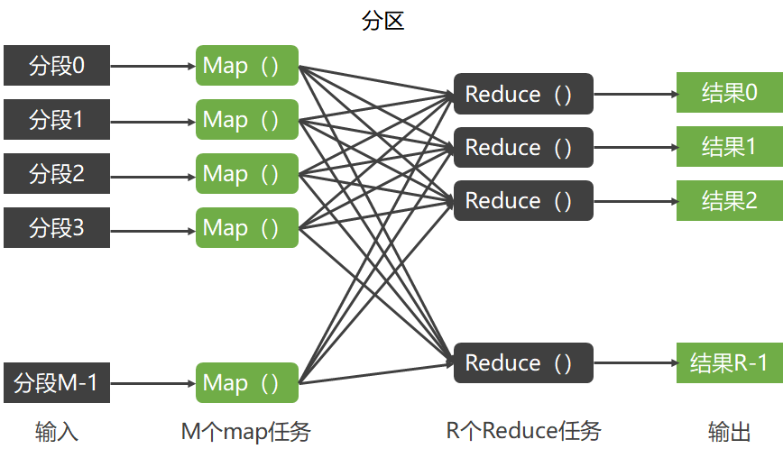

一个MapReduce操作分为两个阶段：映射阶段和化简阶段。

- 映射阶段
  - MapReduce框架将用户输入的数据分割为M个片断，对应M个Map任务。
- 化简阶段
  - 每一个Reduce操作的输入是一个<K2,list(V2)>片断，Reduce操作调用用户定义的Reduce函数，生成用户需要的键值对<K3,V3>进行输出。

**调度策略**

ResourceManager的Scheduler模块支持插拔，通过配置文件，用户可以个性化指定其调度策略

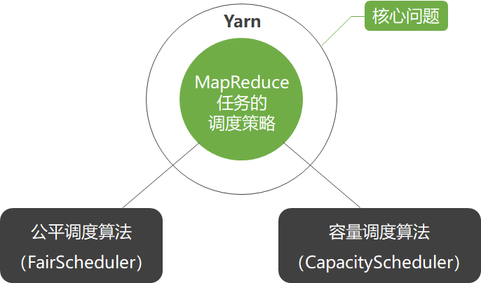

**容量调度算法**

- CapacityScheduler是一种多用户多任务调度策略，它以队列为单位划分任务，以Container为单位分配资源，它也是Hadoop 2.0默认的调度策略，为多个用户共享集群资源提供安全可靠的保障。
- 通过共建集群的方式，不但可以提高资源利用率，还能在必要时刻使用更多的集群资源，同时，组织机构间共建集群也大大降低了运维成本，
- 容量调度策略通过队列来划分资源，队列间关系类似于一棵多叉树，队列间一层层继承，根队列称为root队列，Yarn初次启动时默认启动队列为root.default队列。

- 多级队列
  - 容量调度策略以队列来划分集群资源，不同机构可以在集群里新建不同队列
- 容量确定性
  - 规定某队列占用集群资源的上下限，能够确保即使其他队列用到其最高峰时，也能预留充足资源留给此队列
- 安全性
  - 每个队列都有相应的访问控制列表ACL文件
- 弹性
  - 通过设置队列额外资源使用量，能够让此队列使用超出规定的资源量
- 多用户
  - 通过设置不同队列拥有资源的比例，避免某用户或某进程独占集群资源，实现多用户多任务调度
- 易操作性
  - 主要包括实时配置和实时更改队列状态

- 默认队列
  - 公平调度策略也通过队列来组织和管理任务，并且也支持多级队列，其队列之间为多叉树结构
- 队列间权重配置
  - 设置某队列资源权重，权重越大，获得资源的比例越大
- 队列内多调度策略
  - 队列内部的调度策略是可配置的，默认为FairSharePolicy策略
- 队列下限
  - 为每个队列设置资源下限值，大大提高集群资源利用率
- 支持多用户
  - 通过多级队列可以将不同的用户分配到不同的队列里
- 访问控制列表ACL
  - 管理员可以设置队列的ACL文件，严格控制用户访问

### 5.4.4  Hadoop 2.0安全机制简介

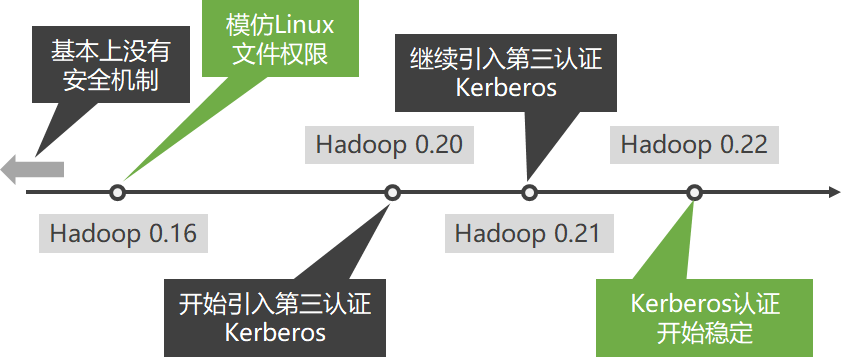

使用Kerberos来实现Hadoop用户认证
Kerberos      鉴定登录用户（服务）是否是其声称的用户（服务）
Hadoop       决定这个用户到底拥有多少权限

## 5.5 Hadoop 2.0访问接口

- 浏览器接口

|           | **Web地址**                         | **配置文件**    | **配置参数**                            |
| --------- | ----------------------------------- | --------------- | --------------------------------------- |
| HDFS      | http://NameNodeHostName:50070       | hdfs-site.xml   | {dfs.namenode.http-address}             |
| Yarn      | http://ResourceManagerHostName:8088 | yarn-site.xml   | {  yarn.resourcemanager.webapp.address} |
| MapReduce | http://JobHistoryHostName:19888     | mapred-site.xml | {mapreduce.jobhistory.webapp.address}   |

在Hadoop 2.0里，MapReduce是Yarn不可缺少的模块，这里的JobHistory是一个任务独立模块，用来查看历史任务，和MapReduce并行处理算法无关。

-  命令接口

1. HDFS   以tar包方式部署时，其执行方式是HADOOP_HOME/bin/hdfs，当以完全模式部署时，使用HDFS用户执行hdfs即可

2. Yarn   以tar包方式部署时，其执行方式是HADOOP_HOME/bin/yarn，当以完全模式部署时，使用Yarn用户执行yarn即可
   1. 每一条命令都包含若干条子命令，Yarn的Shell命令也主要分为用户命令和管理员命令。

3. Hadoop    以tar包方式部署时，其执行方式是HADOOP_HOME/bin/Hadoop，当以完全模式部署时，在终端直接执行hadoop
   1. 这个脚本既包含HDFS里最常用命令fs（即HDFS里的dfs），又包含Yarn里最常用命令jar，可以说是HDFS和Yarn的结合体。
   2. 此外，distcp用mapreduce来实现两个Hadoop集群之间大规模数据复制。
4. 其他常用命令
   1. sbin/目录下的脚本主要分为两种类型：启停服务脚本和管理服务脚本。
      其中，脚本hadoop-daemon.sh可单独用于启动本机服务，方便本机调试，start/stop类脚本适用于管理整个集群，读者只要在命令行下直接使用这些脚本，它会自动提示使用方法。

