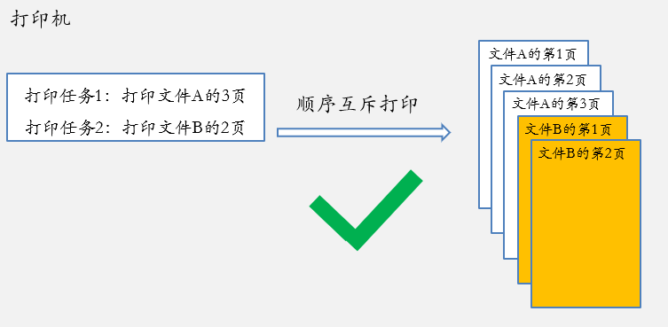
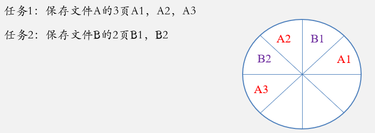
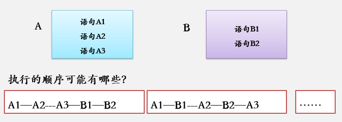
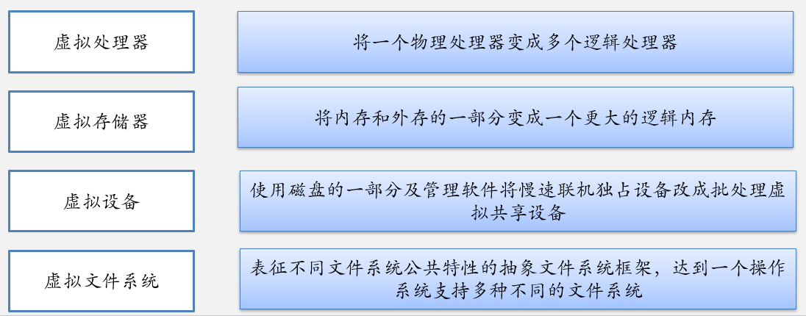

# 导论	

## 1.1 操作系统的功能

- 计算机系统可以粗分为四个组件：
  - 硬件
  - 操作系统
  - 应用程序
  - 用户
- 计算机系统可以分为
  - 硬件
  - 软件
  - 数据
- 操作系统的作用
  - 用户与硬件之间的接口
  - 资源的管理者

## 1.2 操作系统的发展

### 单道批处理系统

- 主要电子器件是**晶体管**，开始使用**磁性存储设备**，**内外存容量增加**，计算机运算速度提高，出现了早期的单道批处理系统。

#### 特点

单道批处理系统内存中只有一道作业，可以自动处理作业

- 自动性
  - 单道批处理系统使计算机能够在操作系统控制下，**自动**地将作业从外存**装入内存**运行。当作业运行完毕后，**自动撤销**已运行完毕的作业，并依次从外存装入下一个作业，使之运行。
- 顺序性
  - 存放在外存中的作业**按顺序**依次被装入内存运行，先进入内存的作业先运行完毕。
- 单道性
  - 任何时刻**内存中只有一道作业**。

### 多道程序系统

- 早期的多道程序系统**不具有交互功能**，被称为多道批处理系统。程序员提交作业后，在作业运行结束，输出结果之前，无法观察和控制作业的运行。
- 解决这一问题的需求非常迫切，于是出现了**分时操作系统**。
  - 在分时操作系统的支持下，**多个用户**可以**同时通过不同的终端使用主机**，主机可以快速响应常用命令。终端用户感觉自己独占计算机资源，并且实现**用户与主机的及时交互**。
- 在分时系统中同时登录系统的多个用户提交的作业**轮流执行**，每个作业都是运行一小段时间就把主机资源让给另一个作业运行一段时间，**多个作业交替执行，分时使用主机资源。**

#### 特点

​		在多道批处理系统中，用户所提交的作业都先存放在外存中并排成一个队列，该队列被称为“后备作业队列”。由操作系统的作业调度程序按一定策略从后备作业队列中选择若干个作业调入内存，使它们共享CPU和系统中的各种资源，以达到提高资源利用率和系统吞吐量的目的。

- 多道性
- 无序性：先进入内存的作业不一定先被调度。
- 调度性：作业调度和进程调度
- 复杂性

### 分时操作系统

#### 特点

- 分时操作系统**允许多个用户通过终端同时使用计算机**。是多道批处理系统的自然延伸，支持多个用户任务同时驻留内存，每个用户通过终端与主机交互时都能得到快速响应。
- 分时系统的特点是
  - 多路性
  - 独立性
  - 及时性
  - 交互性
- 分时系统的优点是向用户提供了人机交互的方便性，使多个用户可以通过不同的终端共享主机。

### 实时操作系统

- 随着计算机的广泛应用，出现了各种实时操作系统。实时操作系统是支持实时计算的系统。
- 实时系统不仅要求系统能正确地计算出结果，而且要求必须在规定的时间内计算出正确结果。
- 如果计算结果正确，但时间超过了规定时间，依然被认为计算出错。

#### 特点

实时系统主要用于实时控制和实时信息处理领域。必须能**及时响应**外部事件的请求，在规定的时间内完成对该事件的处理，并控制所有实时任务协调一致地运行。

- 多路性
- 独立性
  - 每个终端用户独立向实时系统提出服务请求，彼此互不干扰。
- 及时性
  - 实时信息系统对实时性的要求是以人所能接受的等待时间来确定的。
- 交互性
- 可靠性

## 操作系统的特性

### 并发性

- 优点
  - 程序并发性能够驱动不同部件同时工作
  - 减少或消除部件和部件之间的相互等待
  - 改善系统资源利用率，改进系统吞吐量，提高系统效率

- **并发**：指两个或两个以上的事件或活动在**同一时间间隔**内发生
  - 计算机系统中同时存在若干个运行的程序，这些程序交替/穿插着执行。
  - 在多道程序环境下，并发性是指在一段时间内宏观上有多个程序在同时运行
  - 但在单处理机系统中，每一时刻却仅能有一道程序执行，故微观上这些程序只能是分时地交替执行
- **并行**：两个或两个以上的事件或活动在**同一时刻**发生。

### 共享性

- 操作系统中的资源（包括硬件资源和信息资源）可被多个并发执行的进程共同使用，而不是被其中某一个程序所独占

- 两种方式

  - 互斥访问

    - 顺序访问，系统中的某些资源同一时间内只允许一个进程访问

    

  - 同时访问

    - 并发访问，允许同一时间内多个进程对某系资源进行交替穿插的访问。

    

### 异步性

- 也称随机性，在多道程序环境中，程序的执行不是一贯到底，而是走走停停的，何时走何时停，是不可预知的。

### 虚拟性

- 操作系统资源管理技术的特性，虚拟资源管理技术即资源虚化，将物理上的一个实体变成逻辑上的多个对应物，或把物理上的多个实体变成逻辑上的一个对应物。

