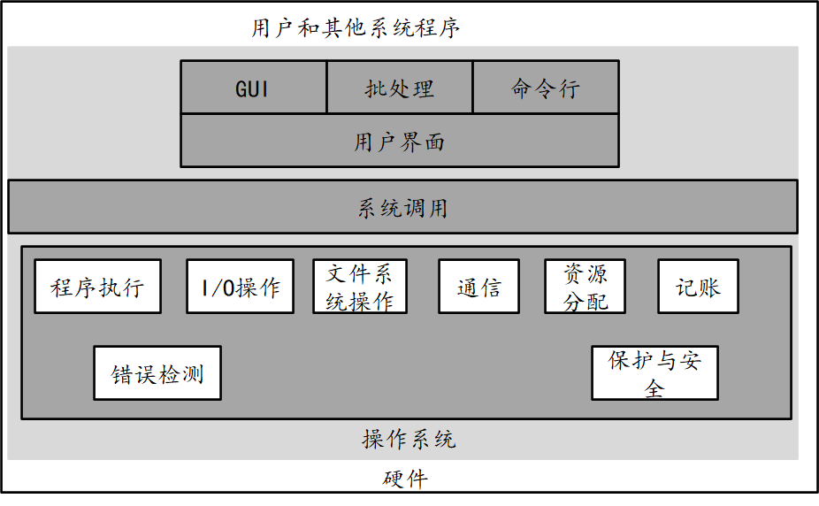
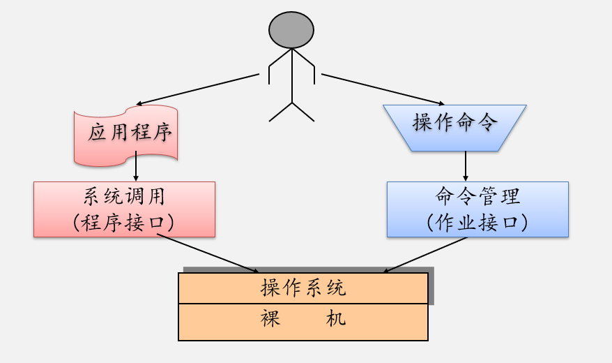
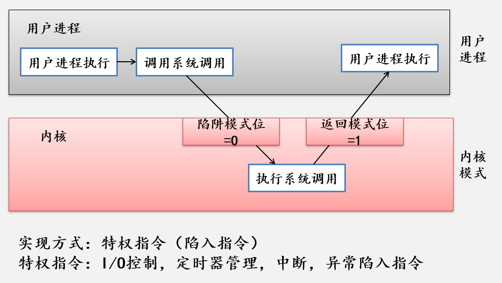

- 单处理器系统
- 多处理器系统
  - 优点：增加**吞吐量**，规模**经济**，增加**可靠**性
  - 类型：非对称处理和对称处理两种
    - 非对称处理：主从结构一个主处理器控制系统，其他处理器向主处理器要任务或者做预先规定的任务
    - 对称处理（SMP）每个处理器都参与完成操作系统的所有任务
    - 处理两种
- 集群系统
  - 将多个CPU组合在一起，由两个或多个独立系统组成，每个节点可为单处理器系统或多个系统
  - 具有高可用性
  - 对称集群和非对称集群

## 操作系统服务

## 操作系统运行模式

### 区分应用程序和操作系统程序

双重模式提供保护手段，防止操作系统和用户程序受到错误用户程序的影响。

- 硬件从内核开始，系统加载
- 用户模式：执行用户程序
- 遇到陷阱和中断 ：用户模式切换到内核模式
- 两种运行模式
  - 用户模式
  - 内核模式（特权模式）
- 记录处理器状态标志
  - 程序状态字PSW
    - CPU的工作状态码
      - 指明管态还是目态，用来说明当前在CPU上执行的是操作系统还是一般用户，从而决定其是否可以使用特权指令或拥有其他的特殊权力

    - 条件码
      - 反映指令执行后的结果特征

    - 中断屏蔽码
      - 指出是否允许中断

  - 控制指令执行顺序并保留和指示与程序有关的系统状态，主要作用是实现程序状态的保护和恢复。
  - 每个程序都有一个与其执行相关的PSW，每个处理器都设置一个PSW寄存器。程序占有处理器执行，它的PSW将占有PSW寄存器。 

- 实现方式
  - 硬件增加模式位，
    - 0：内核模式
    - 1：用户模式

- 处理器状态标志
  - 管理状态（特权状态、系统模式、特态或管态）
  - 用户状态（目标状态、用户模式、常态或目态)

## 系统调用

### 系统调用的类型

- 进程控制 。

  - 结束、中止 。
  - 加载、执行 。
  - 创建进程、 终止进程 。
  - 获取进程属性、 设置进程属性 。
  - 等待时间。
  - 等待事件、信号事件 。

  - 分配和释放内存
- 文件管理
  - 创建文件、 删除文件 。
  - 打开、 关闭 。读、 写、 重新定位 。
  - 获取文件属性、 设置文件属性
- 设备管理
  - 请求设备、 释放设备 。
  - 读、 写、 重新定位 。
  - 获取设备属性、 设置设备属性 。
  - 逻辑附加或分离设备
- 信息维护
  - 获取时间或日期、设置时间或日期 。
  - 获取系统数据、设置系统数据 。
  - 获取进程、 文件或设备属性 。
  - 设置进程、 文件或设备属性
- 通信
  - 创建、删除通信连接 。
  - 发送、 接收消息 。传送状态信息
  - 附加或分离远程设备

### 与函数调用的区别

- 调用形式和实现方式不同
  - 函数调用转向的地址固定，而系统调用按功能号进行；
  - 函数调用在用户态执行，只能访问用户栈，系统调用在核心态执行，访问核心栈。
- 被调用代码的位置不同
  - 函数调用是静态的，调用程序和被调用代码处于同一程序内；
  - 系统调用是动态的，系统调用的代码位于操作系统中。
- 提供方式不同
  - 函数由编程语言提供；
  - 系统调用由操作系统提供。

