## 3.1 进程概念

进程：执行的程序（非正式说法）

进程：有独立功能的程序关于某个数据集合的一次运行活动。不只是程序代码，还包括当前的活动。

- 进程与程序的区别

  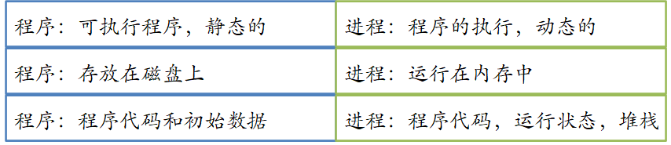

### 进程控制块

- 进程实体存在的标志是操作系统管理进程所使用的数据结构（含核心栈）——进程控制块。
- 进程控制块是进程实体的一部分，是操作系统中最重要的数据结构。
- 操作系统在创建进程时，首先要为进程创建进程控制块，即生成一个进程控制块类型的变量，以存储所创建进程的描述信息。
- 每个进程有唯一的进程控制块，进程控制块是操作系统感知进程存在的唯一标志。


- 注：用“结构体 Struct” 来定义进程控制块

#### 进程控制块内的信息

- 程序状态
  - 新的、 就绪、 运行、 等待、 停止等
- 程序计数器
- CPU寄存器
- CPU调度信息
- 内存管理信息
- 记账信息
  - CPU 时间、 实际使用时间、 时间 期限、 记账数据、 作业或进程数盐等
- I/O状态信息

#### 进程的状态

进程控制块的状态字段描述了进程当前所处的状态。

##### 进程的3种基本状态

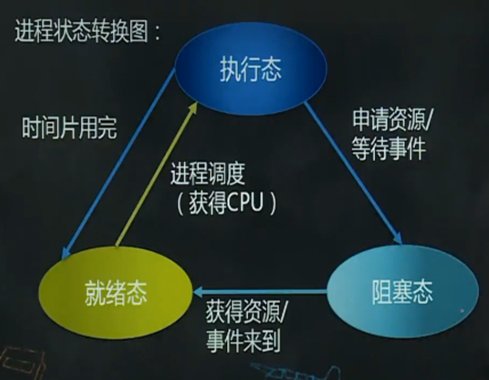

- 就绪态
  - 进程获得CPU就可以运行的状态。在多任务系统中，可以有多个处于就绪态的进程，这些进程被组织成一个或多个就绪队列。
- 执行态
  - 进程获得CPU后正在运行的状态。
- 阻塞态
  - 进程由于等待资源或某个事件的发生而暂停执行的状态。
  - 阻塞态进程获得所需要的资源或其等待的事件发生之后，即转为就绪态。


**进程的特点**

- 动态性:可动态创建,结束,也可是精灵进程
- 并发性:可以被调度轮流占用处理机运行
- 独立性:有独立空间
- 制约性:因访问共享数据或进程间同步而产生制约

## 3.2 进程运行

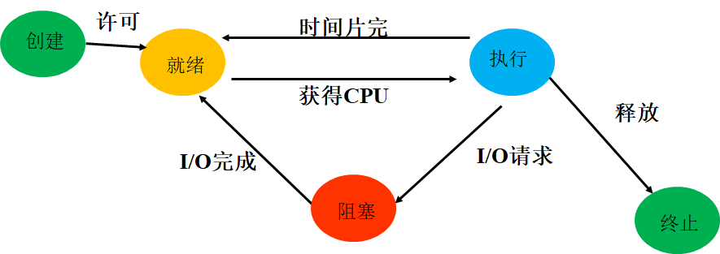

### 3.2.1 进程创建

- 创建状态：
  - 当一个新进程被创建时，进程已拥有了自己的PCB，但进程自身还未进入主存，即创建工作尚未完成，进程还不能被调度运行，其所处的状态就是创建状态。
- 引入创建状态的原因：
  - 保证进程调度必须在创建工作完成后进行，以确保对PCB操作的完整性。增加了管理的灵活性，操作系统可以根据系统性能或主存容量的限制，推迟创建状态进程的提交。
- 创建进程的步骤
  - 为新进程创建PCB，并填写必要的管理信息
  - 把该进程转入就绪状态并插入就绪队列
  - 对于处于创建状态的进程，获得了其所必需的资源，以及对其PCB初始化工作完成后，进程状态便可由**创建状态转入就绪状态**。

#### 操作部分

Linux下进程创建函数fork(  )：通过复制父进程的映像空间生成一个子进程。

fork函数会返回两次，一次是在父进程中返回，另一次是在子进程中返回子进程的返回值是 0，而父进程的返回值则是新子进程的进程 ID。

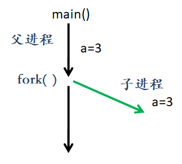

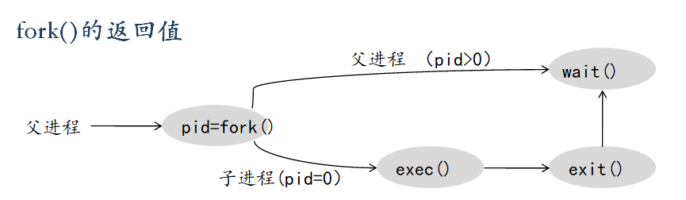

### 3.2.2 进程终止

- 终止进程的步骤
  - 等待操作系统进行善后处理
  - 将其PCB清零，并将PCB空间返还系统
- 几种情况，使进程进入终止状态
  - 子进程使用了超过分配给它的资源。
  - 分配给子进程的任务已不再需要。
  - 父进程退出。
- 进入终止状态的进程以后不能再执行，但在OS中依然保留一个记录（保存状态码和一些计时统计数据，供其他进程收集）。一旦其他进程完成了对终止状态进程的信息提取之后，OS将删除该进程。


## 补充

### 挂起状态

使正在执行的进程暂停执行；若此时用户进程正处于就绪状态而未执行，则该进程暂不接受调度，以便用户研究其执行情况或对程序进行修改。这种静止状态称为挂起状态。


**引入挂起状态的原因**

- 终端用户的请求：当终端用户在自己的程序运行期间发现有可疑问题时，希望暂时使自己的程序静止下来。
- 父进程请求：父进程希望挂起自己的某个子进程，以便考查和修改该子进程，或者协调各子进程间的活动。
- 负荷调节的需要：当实时系统中的工作负荷较重，已可能影响到对实时任务的控制时，可由系统把一些不重要的进程挂起，以便系统能正常运行。
- 操作系统的需要：OS有时希望挂起某些进程，以便检查运行中的资源使用情况或进行记账。


**引入挂起状态后，进程的状态转换**

- 活动就绪→静止就绪
  - 活动就绪状态Readya：当进程处于未被挂起的就绪状态时。
  - 静止就绪状态Readys：当用挂起原语suspend将进程挂起后，该进程便转换为静止就绪状态，处于Readys状态的进程不再被调度执行
- 活动阻塞→静止阻塞
  - 活动阻塞状态Blockeda：进程处于未被挂起的阻塞状态时。
  - 静止阻塞状态Blockeds：当用Suspend原语将处于活动阻塞状态的进程挂起后，进程便转换为静止阻塞状态。处于该状态的进程在其所期待的事件出现后，将从静止阻塞变为静止就绪。

- 静止就绪→活动就绪
  - 处于Readys状态的进程，若用激活原语Active激活后，该进程将转变为Readya状态。
- 静止阻塞→活动阻塞
  - 处于Blockeds状态的进程，若用激活原语Active激活后，进程将转变为Blockeda状态。

### 阻塞状态

操作系统在下列情况可能引起进程的阻塞：

- 请求系统服务。
- 启动某种操作。
- 新数据尚未到达。
- 无新工作可做。

完成进程阻塞的简化过程：

- 将进程的状态改为阻塞态。
- 将进程插入相应的阻塞队列。
- 转进程调度程序，从就绪进程中选择进程为其分配CPU。
- 处于执行态的进程被阻塞后，CPU空闲，需要执行进程调度程序，从就绪进程中选择一个进程让CPU运行。


## 3.3 进程间通信

思考：独立的进程之间如何进行数据交互？

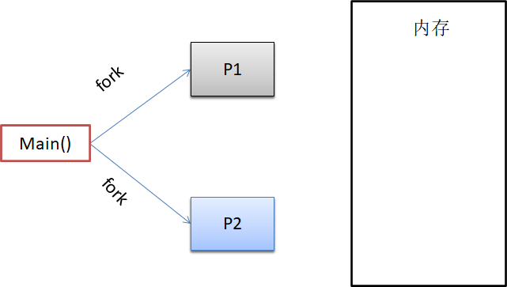


### 进程间的关系

独立进程：不会影响其他进程也不受其他进程影响

协作进程：进程影响其他进程或者受其他进程影响

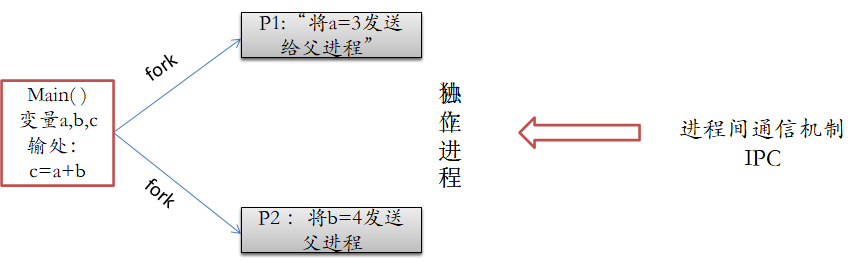

### 进程间通信

**进程间通信机制：提供进程之间进行数据交换和信息传递的机制。**

信息共享：多进程访问和使用同一个信息

计算加速：任务拆分成子任务，可提供快速计算

模块化：按照模块化构造系统

方便：单个用户可同时执行多个任务


**两种进程间通信的模型**

- 共享存储：创建一个进程间共享的存储区域，通过对该共享区域的读写来进行数据交换。共享区域一旦建立好，无需内核介入，

  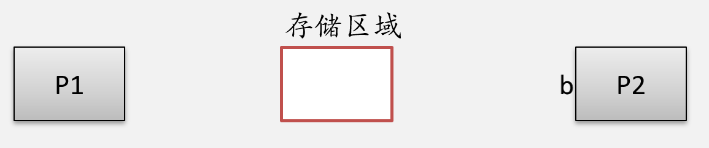

- 消息传递：在协作进程间使用 `send()/receive()` 系统原语句交换信息来实现通信。常用来进行少量数据传递，使用系统调用，需要内核介入耗时较多

  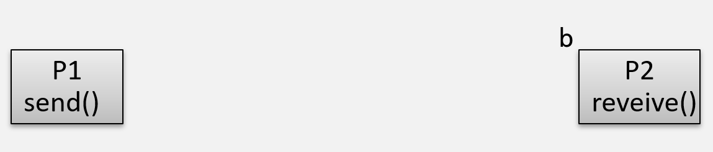

### 共享内存

创建一个进程间共享的内存区域，通过对该共享区域的读写来进行数据交换

需要进程建立共享内存区域

声明一段共享内存区域，接下来将该共享区域附加到自己的地址空间

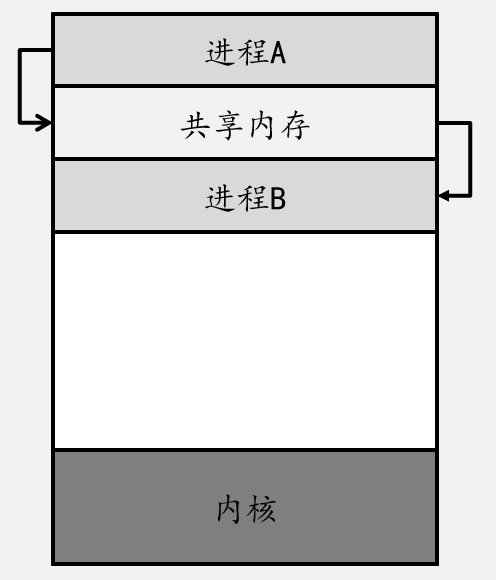


**生产者—消费者问题**：

生产者：生产数据

消费者：取走生产者进程产生的数据

生产者进程与消费者进程协同工作

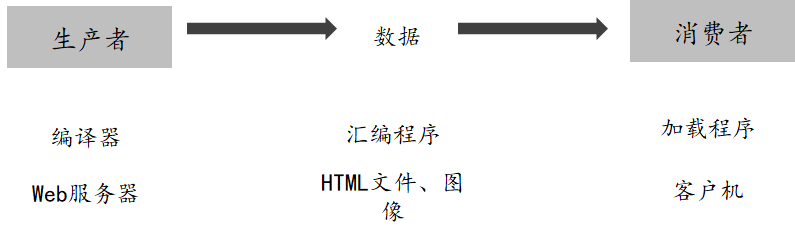


生产者消费者问题解决方案----共享内存

声明一个共享缓冲区


生产者进程生产数据放到缓冲区

消费者进程从缓冲区拿走数据

缓冲区是生产者和消费者进程共享内存区域


#### **缓冲区类型：**

**无界缓冲区**：缓冲区大小无限制

- 生产者可以一直生产数据，但是消费者要等缓冲区有数据之后才可以取数据运行


生产者消费者进程间通信-----有界缓冲区

有界缓冲区声明：

```c
#define BUFFER_SIZE 10

typedef   struct{
…..
}item;
item buffer[BUFFER-1]
int in=0
int out =0
```

```c
while(true){
/*produce  an  item  in next_produced */
While (((in +1)%BUFFER_SIZE)== out )
       ; /*do nothing */
buffer[in]=next_produced;
in = (in + 1)%BUFFER_SIZE
}
```

```c
Item next_consumed

While(true){
     While(in == out)
             ;/*do nothing
       next_consumed = buffer[out];
       out = (out + 1 ) %BUFFER_SIZE;
      /*consumed the item in next_consumed
```

缓冲区空：in = out
缓冲区满：(in + 1) % BUFFER_SIZE   == out

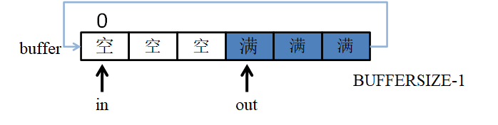


 **有界缓冲区**：缓冲区大小为固定大小

- 生产者要等缓冲区有空闲时，才能生产数据，消费者要等缓冲区有数据时才能消费数据

### 管道通信

共享存储：共享内存和管道通信（共享文件）

管道通信：在磁盘上创建一个特殊的共享文件，通过对该共享文件进行读写来进行数据交换。

共享内存：创建一个进程间共享的内存区域，通过对该共享区域的读写来进行数据交换。


管道通信：在磁盘上创建一个特殊的共享文件，通过对该共享文件进行读写来进行数据交换。

创建管道采用函数

```c
pipe(int fd[])
// fd[0]为管道的读出端，fd[1]为管道的写入端
// 使用普通的函数调用read()和write()访问管道
```

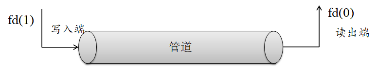


普通管道只能由创建进程所访问

通常情况下，父进程创建一个管道，并使用它与其子进程进行通信，子进程继承父进程创建的管道

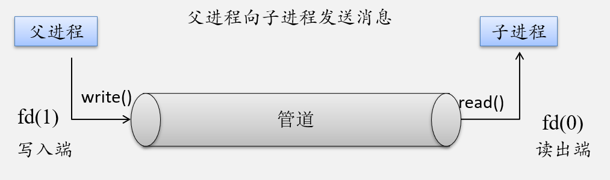

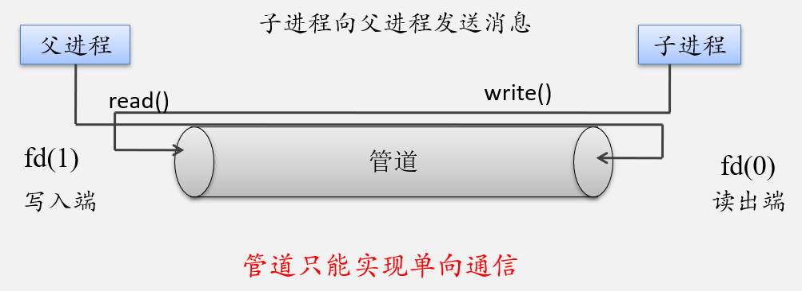


### 消息传递

一个正在执行的进程可在任何时刻向另一个正在执行的进程发送消息；

一个正在执行的进程也可在任何时刻向正在执行的另一个进程请求消息。

消息传递机制紧密地与进程的阻塞和释放相联系。

消息传递工具至少提供两种操作：`Send(message)`、`Receive(message)`


进程之间使用消息传递方式进行通信，就必须互相发送消息和接收消息，他们之间就要有通信链路

**逻辑实现通信链路和操作 send() / receive()**

- 直接或间接通信
- 同步或异步通信
- 自动或显示缓冲


**直接通信：需要通信的每个进程必须明确指定通信的接受者或发送者。**

原语send()和receive（）定义如下

- 原语send（P，message）：把message发送给进程P
- 原语receive（Q，消息）：从进程Q接收message

通信链路应具有以下属性：

- 需要通信的每对进程之间，自动建立链路，进程仅需知道对方身份就可以进行交流
- 每个链路只与两个进程相关
- 每对进程之间只有一个链路

寻址的对称性，发送和接收进程必须指定对方，才可以通信


**寻址的非对称性：发送者指定接收者，接收者不需要指定发送者。**

原语send()和receive()的定义如下：

- Send（P，message）
- Receive(id，message)：从任何进程，接收message，id被设置成与其通信进程的名称


**间接通信：通过邮箱或端口来发送和接收消息。**

邮箱可以抽象成一个对象，进程可以向其中存放消息，也可以从中删除消息。每个邮箱都有唯一的标识符

- 原语send（A，message）：把message传送到邮箱A
- 原语receive（A，message）：从信箱A接收message

该方案通信链路具有的特点：

- 只有在两个进程共享一个邮箱时，才能建立通信链路
- 一个链路可以与两个或更多进程相关联
- 两个通信进程之间可有多个不同链路，每个链路对应于一个邮箱


邮箱可由操作系统创建，也可由用户进程创建，创建者是邮箱的拥有者。

用户进程创建邮箱：**用户进程可为自己建立一个新邮箱**，并作为该进程的一部分。邮箱的拥有者有权从邮箱中读取消息，其他用户则只能将自己构成的消息发送到该邮箱中。当拥有该邮箱的进程结束时，信箱也随之消失。

共享邮箱：它**由某进程创建**，在创建时或创建后，指明它是可共享的，同时须指出共享进程（用户）的名字。邮箱的拥有者和共享者，都有权从邮箱中取走发送给自己的消息。  

公用邮箱：它**由操作系统创建**，并提供给系统中的所有核准进程使用。进程既可把消息发送到该邮箱中，也可从邮箱中读取发送给自己的消息。通常，公用信箱在系统运行期间始终存。


思考：

P1、P2和P3共享一个邮箱A，进程P1发送一个消息到A，而进程P2和P3都对A执行receive()。哪个进程会收到P1发送的消息？ **P2或P3**

- 允许链路最多只能与两个进程关联
- 允许一次最多一个进程执行操作receive()
- 允许系统随意选择一个进程以便接收消息（进程P2和P3两者之一都可以接收消息，但不能两个都可以），系统也可以定义一个算法来选择哪个进程是接收者，系统也可以让发送者指定接收者


在利用邮箱通信时，在发送进程和接收进程之间，存在以下四种关系：

- 一对一关系。这时可为发送进程和接收进程建立一条两者专用的通信链路，使两者之间的交互不受其他进程的干扰。
- 多对一关系。允许提供服务的进程与多个用户进程之间进行交互，也称为客户/服务器交互（client/server interaction）。
- 一对多关系。允许一个发送进程与多个接收进程进行交互，使发送进程可用广播方式，向接收者（多个）发送消息。
- 多对多关系。允许建立一个公用邮箱，让多个进程都能向邮箱中投递消息；也可从邮箱中取走属于自己的消息。


消息传递可以是阻塞()或非阻塞(),也称为**同步或异步**

- 阻塞发送：发送进程阻塞，直到消息由接收进程或邮箱所接收
- 非阻塞发送：发送进程发送消息，并且恢复操作
- 阻塞接收：接收进程阻塞，直到有消息可用
- 非阻塞接收：接收进程收到一个有效消息或空消息

send()和receive()可以不同组合

当send()和receive()都阻塞，则发送者和接收者之间会有交会

解决生产者和消费者问题—send()和receive()都阻塞


直接通信和间接通信时，通信进程交换的消息总是驻留在临时**队列**中，
队列的实现方式有三种：

- 零容量：队列的最大长度为0，因此，链路中不能有任何消息处于等待，对于这种情况，发送者应阻塞，直到接收者接收到消息。这种称为无缓冲系统
- 有限容量：队列长度为n，最多只能有n个消息驻留其中。如果在发送新消息时队列未满，那么该消息可用放在队列中，且发送者可以继续执行而不必等待，如果链路已满，发送者应阻塞，直到队列空间有可用为止
- 无限容量：队列长度可以无限，不管多少消息都可在其中等待，发送者不阻塞

注：有限容量和无限容量称为自动缓冲的消息系统


**信号机制**：软中断，通过发送一个指定信号通知进程某个异常事件发生。 

用户、内核和进程都能生成信号请求：

- 用户 -- 用户 能通过输入ctrl+c，或终端驱动程序分配给信号控制字符的其他任何键来请求内核产生信号。
-  内核 -- 当进程执行出错时，内核检测到事件并给进程发送信号，例如，非法段存取、浮点数溢出、或非法操作码，内核也利用信号通知进程种种特定事件发生。
-  进程 -- 进程 可通过系统调用kill给另一个进程发送信号，一个进程可通过信号与另一个进程通信。

信号通信的实现：信号产生、传送、捕获和释放

- 信号屏蔽位blocked
- 信号发送工作由系统调用kill( )完成  
- 信号响应使用系统调用sigal( )完成


语法：`signal（参数1，参数2）`

- 参数1：要进行处理的信号。系统的信号我们可以再终端键入 kill -l查看(共64个)。其实这些信号时系统定义的宏。

- 参数2：处理的方式（是系统默认还是忽略还是捕获）

SIGINT信号代表由InterruptKey产生

SIG_ING 代表忽略SIGINT信号

SIG_DFL代表执行系统默认操作，其实对于大多数信号的系统默认动作时终止该进程


语法：`kill（参数1，参数2）`

- 参数1：接收信号的进程（组）的进程号。
  - pid > 0：发送给进程号为pid的进程
  - pid = 0：发送给当前进程所属进程组里的所有进程
  - pid = -1：发送给除1号进程和自身以外的所有进程
  - pid < -1：发送给属于进程组-pid的所有进程

- 参数2：发送的信号signo

父进程捕捉到Del信号后，向子进程P1发送信号16，向子进程2发送信号17

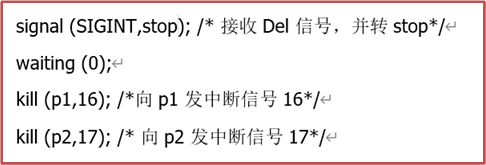

子进程P1捕捉信号16，子进程2捕捉信号17

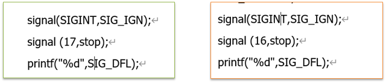


**Linux系统信号分类：**

- 与进程终止相关的信号
- 与进程例外事件相关的信号
- 与进程执行系统调用相关的信号
- 与进程终端交互相关的信号
- 用户进程发信号
- 跟踪进程执行的信号


