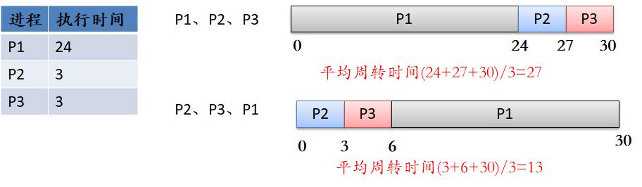
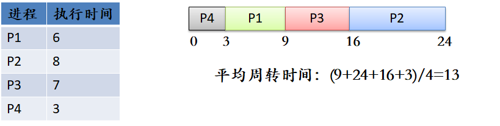
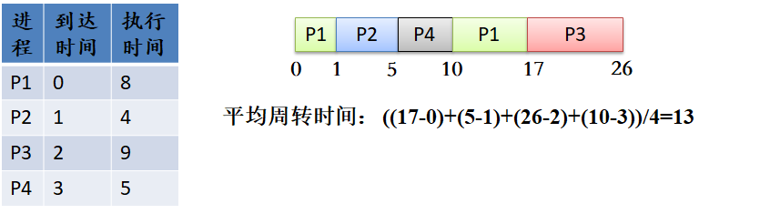
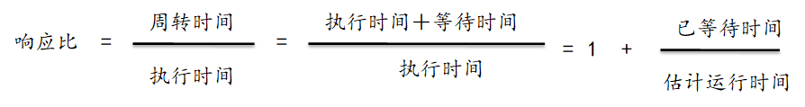
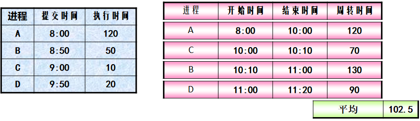
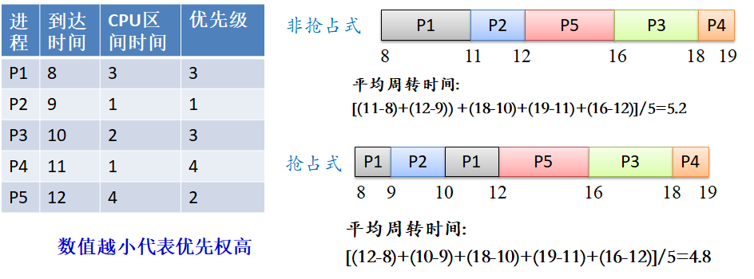
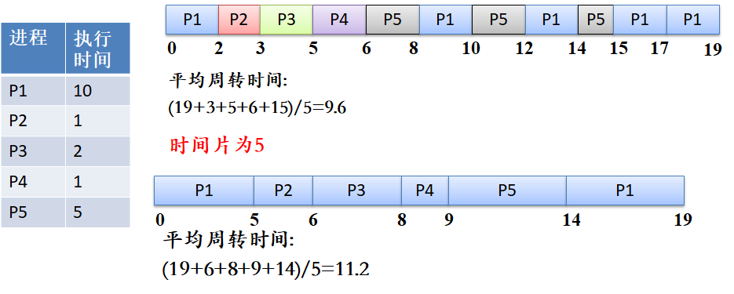
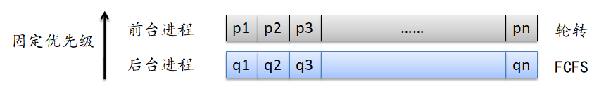
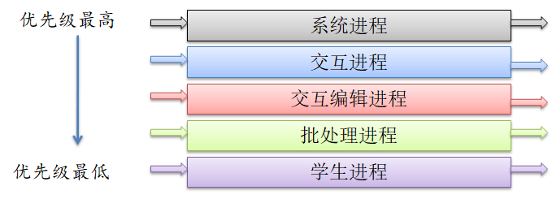
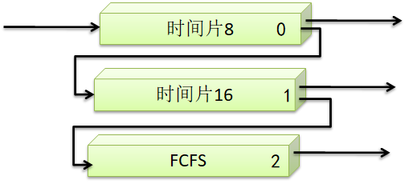

# 调度

## 5.1 概念

调度：当一个进程等待时，操作系统从进程接管CPU控制，将CPU交给另一个进程，并不断重复

调度程序：将CPU控制交给短期调度程序选择的进程

**功能**

- 切换上下文
- 切换到用户模式
- 跳转到用户程序的合适位置，以便重新启动程序

调度程序要尽可能快，每次进程切换都要使用
调度程序停止一个进程而启动另一个所需的时间成为调度延迟。

**进程调度的时机**

- 当一个进程从运行状态切换到等待状态时（如I/O请求，或父进程等待子进程终止）
- 当一个进程从运行状态切换到就绪（抢占式）
- 当一个进程从等待状态切换到就绪时（抢占式）
- 当一个进程终止时。

**抢占与非抢占**

- 抢占式调度：进程运行时可以被操作系统系统以某种原则剥夺其处理机
- 非抢占式调度：进程主动放弃处理机（阻塞或结束）时才重新调度

## 5.2 调度准则

- CPU的调度率：尽可能的忙碌，理论上0~100%，实际上范围应为40%~90%
- 吞吐量：单位时间内完成进程的数量
- 周转时间：进程提交到系统完成的时间
- 等待时间：进程在就绪队列中等待时间之和
- 响应时间：进程提交到产生第一响应的时间

## 5.3 调度算法

### 先来先服务算法（ First-Come，First-Served，FCFS）

先请求CPU的进程被首先分配到CPU，可用FIFO队列来实现

平均周转时间通常**相当长**，与进程的**提交和调度顺序有关**

FCFS适合长进程，有利于CPU繁忙的进程。

### 短进程优先调度算法（ Shortest-Process-First，SPF）

调度取决于进程的下次CPU执行的长度，每次调度时，选择最短CPU执行时间的进程，当两个进程具有同样长度的CPU执行时间，则按照FCFS来处理。

算法易于实现，效率不高，主要弱点是忽视了进程等待时间；会出现饥饿现象。进程所需运行时间不可知。

优点：与FCFS算法相比，短进程优先的算法能有效降低进程的平均等待时间，提高系统的吞吐量。

缺点：对长进程不利、不能保证紧迫进程的及时处理、进程的长度由用户估计而定，可能有偏差。

### 最短剩余时间优先算法（Shortest-Remaining-time-First, SRTF）

抢占式SPF算法也称为最短剩余时间优先的算法。有新的进程进来时，会将新进程与当前运行进程的尚未完成的CPU执行相比。

### 响应比

FCFS只考虑等候时间而忽视了进程的计算时间，SPF只考虑用户估计的进程计算时间而忽视了进程等待时间。能不能既考虑等待时间有考虑运行时间？

响应比最高者优先算法：既考虑等待时间，又考虑的运行时间

- 短进程容易得到较高响应比
- 长进程等待时间足够长后，也将获得足够高的响应比

每次调度前计算响应比，选值最高的调度执行

- A运行完，计算BCD的响应比；
- B=(70+50)/50 =2.4；C= (60+10)/10=7；D= (10+20)/20=1.5 ； **调度C**
- C运行完，计算BD的响应比：
- B=(80+50)/50=2.6；D=(20+20)/20=2；**先调度B后调度D**

### 优先级调度算法

每个进程有自己的优先级，最高优先级的进程会分配到CPU，具有相同优先级的进程按FCFS顺序调度。

**优先权调度算法的类型**

- 非抢占式优先权调度算法
  - 高优先权进程一旦得到处理机，便一直运行下去，直到完成或由于某种事件使该进程主动放弃处理机。
  - 即使更高优先权进程到来，也不能剥夺当前进程的CPU使用权，只能在就绪队列中等待。
- 抢占式优先权调度算法
  - 新到达的就绪进程与正在运行进程的优先权相比较，若新到达进程的优先权高于当前正在运行进程的优先权，则系统会抢占CPU，分配给新到达的进程，正在执行的进程暂停执行。

**优先权的类型**

- 根据优先权的变化特点将优先权的类型分为静态优先权和动态优先权。
  - 静态优先权。在创建时确定，在进程的整个运行期间不变。
  - 动态优先权。进程创建时被赋予的优先权，随进程的推进或随其等待时间的增加而改变。

**动态优先权调度算法可以使系统获得更好的调度性能**

- 优先权调度算法存在的问题和解决方案

  - 无穷阻塞或称饥饿问题。
    - 指就绪态进程因得不到CPU而等待的状态。

  - 优先权调度算法可能使某个低优先权进程无穷等待。

  - 解决方案：老化（Aging）技术。逐渐增加在系统中等待时间很长进程的优先权。

### 时间片轮转调度算法

- 时间片是一个较小的时间单位，通常为10-100ms。
- 每当进程在CPU上连续运行的时间等于一个时间片长度时，操作系统在时钟中断处理过程中会抢占CPU，进行进程切换，用新的就绪进程替代当前进程，被替换的当前进程重新回到就绪队列中。
- 时间片太长，可使多数进程在一个时间片内处理完，可降低进程的周转时间，但可能造成交互用户的响应时间过长。时间片太短，一个进程需经过多次调度才能执行完，会增加进程切换和调度的开销，系统的平均周转时间也较长。

**时间片大小的确定**

- 系统对响应时间的要求。响应时间越短，时间片取值应该越小。
  - 设系统响应时间为T，进程数目为N，时间片为q，则有T=Nq，即在N一定的情况下，T的大小取决于q。
- 就绪队列中进程的数目。进程越多，响应时间越长。当设定了系统的最长响应时间值后，时间片的大小就与系统允许的最大进程数成反比。
-   系统的处理能力。必须保证系统支持的基本命令能在一个时间片内执行完。

**时间片轮转调度算法的性能评价**

- 时间片轮转调度算法的性能依赖于时间片的大小。
- 时间片越大，与先来先服务算法一样。
- 时间片越小，会增加CPU用于进程切换和进程调度的开销。

### 多级队列调度

将就绪队列分成多个单独队列，根据进程属性，如内存大小、进程优先级、进程类型等，一个进程永久分到一个队列。每个队列有自己的调度算法。

有5个队列，优先级由高到低：系统进程、交互进程、交互编辑进程、批处理进程、学生进程；每个队列比更低层的队列具有绝对的优先

采用多级队列调度，降低了进程调度的开销，但对低优先权进程会存在无穷阻塞（饥饿）的问题。多级反馈队列调度算法可以弥补这些不足。

在采用多级反馈队列调度的系统中建立多个优先权不同的就绪队列，为每个队列赋予大小不同的时间片。

有一种反馈策略规定：队列优先权越高，时间片越短。新进程被创建后，先插入预先权最高的队列。仅当高优先权队列空时，才调度优先权次之的队列。同一队列中，采用时间片轮转调度算法。使用CPU时间过多的进程会被移到优先权较低的队列中，在较低优先权队列中等待时间过长的进程会被移动较高优先权队列中，这样就通过使用老化技术阻止了饥饿的发生。

- 允许进程可以在不同的队列之间迁移
- 如果进程使用过多的CPU时间，就将其移动到更低的优先级队列上
- 如果低优先级队列中等待过长的进程会被移动更高的优先级队列中

**多级反馈队列调度算法的设计要考虑以下几个方面的问题**。

1. 就绪队列的数量。
2. 根据进程优先权确定进程应该进入哪个就绪队列的算法。
3. 用以确定进程何时转移到较高优先权队列的算法。
4. 用以确定进程何时转移到较低优先权队列的算法。
5. 用以确定进程在需要服务时应该进入哪个队列的算法。

### 总结

- 先来先服务
  - 实现简单，只考虑进程请求顺序，不考虑进程执行时间
- 最短作业优先
  - 只考虑进程执行时间，不考虑进程等待时间
- 最剩余时间优先
  - 只考虑进程执行时间，不考虑进程等待时间
- 响应比高者优先
  - 既考虑进程执行时间，又考虑进程等待时间
- 优先级调度
  - 按优先级调度
- 时间片轮转
  - 公平性原则
- 多级队列调度
  - 多个队列，队列采用不同调度算法，队列间固定优先级
- 多级反馈队列调度
  - 进程可以在队列中迁移

### 练习

假设有如下一组进程，它们的CPU执行时间以ms来计算，进程均在时刻0到达，进程的执行时间和优先级如下表所示：

| **进程** | **执行时间** | **优先级** |
| -------- | ------------ | ---------- |
| P1       | 2            | 2          |
| P2       | 1            | 1          |
| P3       | 8            | 4          |
| P4       | 4            | 2          |
| P5       | 5            | 3          |

1、分别画出进程采用先来先服务、 短进程优先、非抢占式优先级时进程的执行图

2、并计算出每个进程在上述算法中周转时间和等待时间

3、分析出哪一种算法的平均等待时间最小？哪一种算法的平均周转时间最小

### 公式

等待时间 = 开始时间 - 进入时间

周转时间 = 运行时间 + 等待时间

系统的平均周转时间：各个进程的周转时间总和/进程数。

带权周转时间：周转时间/运行时间。

平均带权周转时间：各个进程的带权周转时间总和/进程数。

### 
