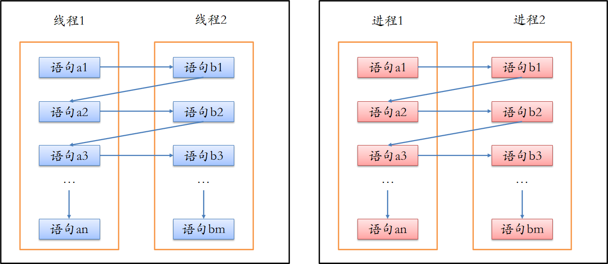
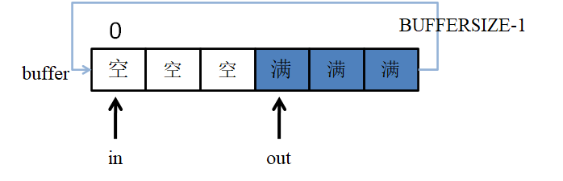
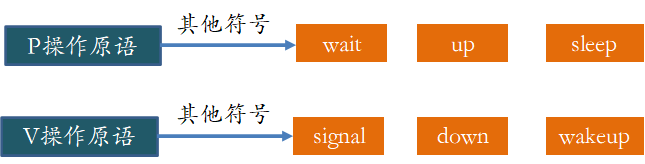
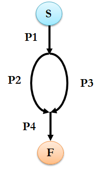
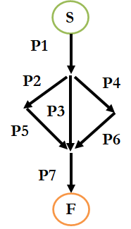
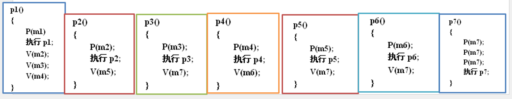
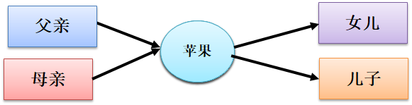
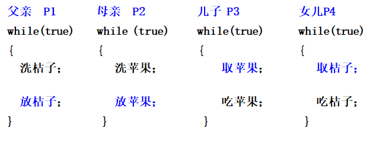

# 同步

## 6.1 并发

进程的并发性：一组进程的执行在时间上是重叠的，即一个进程执行的第一条指令是在另一个进程执行的最后一条指令完成之前开始





并发程序设计的好处

- 能够同时启动多台设备操作

- 充分利用处理器与外围设备，外围设备与外围设备之间的并行工作能力

- 减少设备间的等待

- 提高资源利用率和计算机的工作效率


### 6.1.1 并发进程间关系

- 互斥（竞争）
  - 当多个进程因为争夺临界资源而互斥执行称为进程的互斥。
  - 由于并发进程共用某一资源引起的，一个进程的执行可能影响与其竞争资源的其它进程
  - 进程互斥关系是一种特殊的进程同步关系，即逐次使用互斥共享资源，是对进程使用资源次序上的一种协调。


## 6.2 临界区管理

并发进程中与共享变量有关的程序段叫做临界区

共享变量代表的资源叫做临界资源

并发进程中访问共享变量部分的程序段必须顺序执行，才能保证数据的一致性

临界区问题：进入临界区前，每个进程都要请求许可，实现这个请求的代码称为进入区（PV操作）

退出区：退出对临界资源操作

剩余区：其他代码为剩余区 


临界区问题解决方案需要满足三个要求

- 互斥：如果进程Pi在其临界区内执行，那么其他进程都不能在其临界区执行
- 进步：如果没有进程在其临界区执行，并且有进程需要进入临界区，那么只有那些不在剩余区内执行的进程可以参加选择，以便确定谁能下次进入临界区
- 有限等待：从一个进程做出进入临界区的请求直到这个请求允许为止，其他进程允许进入临界区的次数具有上限

临界区调度原则

- 一次最多只允许一个进程进入临界区内执行
- 如果已有进程在临界区，其他进程试图进入的进程应等待
- 进入临界区内的进程应在有限时间内退出，以便让等待进程中一个进入


**临界资源**：也称独占资源，是指在一段时间内只允许一个进程访问的资源。例如打印机，磁带机，也可以是进程共享的数据、变量等。


**有界缓冲区** · 生产者消费者进程间通信

声明：

```c
#define BUFFER_SIZE 10

typedef struct{
…..
}item;

item buffer[BUFFER-1]
int in=0
int out =0
```

缓冲区空：in=out

缓冲区满：(in + 1) % BUFFER_SIZE  == out




**互斥锁**

采用互斥锁保护临界区，从而防止竞争条件，具体是进程进入临界区时应得到锁，退出临界区时释放锁


## 6.3 中断

中断是改变处理器执行指令顺序的一种事件。

计算机在执行程序的过程中，当遇到中断时，计算机停止现行程序的运行，转向对这些中断事件的处理，处理结束后再返回到现行程序的间断处。

作用：使CPU可以与其他设备并行工作，能有效提高CPU的利用率，改善系统性能，支持系统的异步性。


**中断的类型**

- 中断分为同步中断（内部中断）和异步中断（外部中断）两种。
  - 同步中断（内部中断）。当指令执行时由CPU控制单元产生，称为同步是因为只有在一条指令终止执行后CPU才会发出中断。
  - 异步中断（外部中断）。由其他硬件设备随机产生。
    - 外部中断又分为外部可屏蔽中断和不可屏蔽中断。
      - 外部可屏蔽中断。由I/O设备产生的中断，有两种方式可以屏蔽中断。
        - 一是将标志位寄存器的IF位置0，表示关中断。
        - 二是可以对可编程中断控制器编程来禁止中断请求。
      - 不可屏蔽中断
        - 由紧急事件引起，如硬件故障。


**关中断**

进程在进入临界区之前先关中断，退出临界区时开中断

在关中断期间，进程调度程序失去中断激活的机会，不会切换进程，保证了临界区的互斥执行

关中断适用场合：简单有效，对操作系统自身有用，可在更新共享变量或列表的几条指令期间禁止中断。

缺点：

- 不适合作为通用的互斥机制，关中断时间过长会影响性能和系统效率；限制CPU交叉执行程序的能力
- 不适应于多处理器计算机系统，因为一个处理器关中断，并不能防止进程在其它处理器上执行相同的临界段代码；
- 关中断权力赋予用户会存在危险，若用户未开中断，则系统可能因此而终止。


## 6.4 同步

- 同步（协作）

  - 并发进程为完成同一任务而共享某些数据，形成协作关系。

  - 进程间协同工作的手段（直接制约）

  - 多个相关进程在执行次序上的协调


### 信号量

用信号量的取值来表示资源的使用状况，或某种事件是否发生，以此为基础实现进程的同步。

对不同的共享资源设置被称为信号量的变量，用信号量的取值来表示资源的使用状况，或某种事件是否发生。

通过信号量的取值来判断进程是否能访问与信号量对应的共享资源。

如果整型量 ＞ 0,说明有可用资源；如果整型量 ≤ 0，说明资源忙，进程必须等待。

对于一次只允许一个进程访问的临界资源，可定义一个用于互斥的整型信号量，并将其初始化为1。

信号量和PV操作的功能：解决并发进程的互斥和同步问题


**两种信号量**

- 计数信号量（一般信号量）：值不受限制，用于控制访问具有多个实例的某种资源，信号量的初值表示为可用的资源数量。通常用于提供同步功能。
- 二进制信号量：值只能为0和1，用于提供互斥访问功能。


只能通过两个标准的原子操作：P操作和V操作

​	*：原子操作：内核中执行时不可被中断的过程



P( )和V( )操作定义：

- P(s)；将信号量s减去1，若结果小于0，则调用P(s)的进程被置成等待信号量s的状态。
- V(s)：将信号量s加1，若结果不大于0，则释放一个等待信号量s的进程。

另一种说法：

- P操作意味着请求一个资源，V操作意味着释放一个资源。
- 在一定条件下，P操作代表挂起进程操作，而V操作代表唤醒被挂起进程的操作


**计数信号量**

```c
typedef struct semaphore {
        int value;           //信号量值
        struct pcb *list;    //信号量队列指针
 }; 
```

```c
void P(semaphore &S) {
        S.value--;            
        if(S.value<0)         
                W(S.list);      
}
```

```c
void V(semaphore &S) {
        S.value++;            
        if(S.value<=0)        
                R(S.list);        
}
```


**二进制信号量**

```c
typedef struct semaphore {
        int value;           //信号量值，只能为0和1
        struct pcb *list;    //信号量队列指针
}; 
```

```c
void BP(binary_semaphore &s) {
	if(s.value==1)
	       s.value=0;
	else
	     W(s.list);
}
```

```c
void BV(binary_semaphore &s) {
	if(s.list is empty( ))
	      s.value=1;
	else
	      R(s.list);
}
```


**使用信号量实现互斥**

为临界资源设一互斥信号量mutex，初值为1

将临界区置于P（mutex）和V（mutex）之间

P(mutex) 和 V(mutex)一定要成对出现在同一个进程中

```c
semaphore mutex;
mutex=1;
cobegin
process Pi( ) { //i=1,…,n
	P(mutex);
	{临界区};
	V(mutex);
}
 coend
```


### 进程同步

并发进程之间相互合作，完成一项工作，它们之间有一定的时序关系。

1）P操作(wait)和V操作(signal)操作必须成对出现。

2）P操作wait操作的顺序不能颠倒。必须先对资源信号量（即empty和full）进程P操作wait操作，然后再对互斥信号量进程V操作wait操作。


例1：用信号量机制描述下列并发进程的同步关系



- 解法一：信号量表示进程能否开始。

  - 设信号量m1、m2、m3、m4分别表示进程P1、P2、P3、P4能否开始执行，其初值m1为1，其余均为0。
  - 注：此处 m1 变量 可省略

  ```c
  int m1=1,m2=m3=m4=0 ;
  cobegin
      p1() // P2() // P3() // P4()
  coend
  ```

  ```c
  p1()
  {
      P(m1);
      执行p1;
      V(m2);
      V(m3);
  }
  p2()
  {
      P(m2);
      执行p2;
      V(m4);
  }
  p3()
  {
      P(m3);
      执行p3;
      V(m4);
  }
  p4()
  {
      P(m4);
      P(m4);
      执行p4;
  }
  ```

- 解法二：信号量表示进程是否结束

  - 设信号量m1、m2、m3、m4分别表示进程P1、P2、P3、P4是否结束，其初值均为0。

  ```c
  int m1=1,m2=m3=m4=0 ;
  cobegin
       p1() // P2() // P3() // P4()
  coend
  ```

  ```c
  p1()
  {
      执行p1;
      V(m1);
      V(m1);
  }
  p2()
  {
      P(m1);
      执行p2;
      V(m2);
  }
  p3()
  {
      P(m1);
      执行p3;
      V(m3);
  }
  p4()c
  {
      P(m2);
      P(m3);
      执行p4;
      V(m4);
  }
  ```




- 设信号量m1~m7分别表示进程P1~P7能否开始执行，

- 其初值m1为1，其余均为0。

  ```
  int m1=1,m2=m3=m4=m5=m6=m7=0 ;
  cobegin
       p1() // p2() // p3() // p4() // p5() // p6() // p7()
  coend
  ```




例3-4：吃水果：父亲放桔子，母亲放苹果，儿子取苹果，女儿取桔子  





分析：父母亲先放水果，儿子女儿再取水果；父亲与女儿，母亲与儿子是一个同步关系，父亲与母亲要竞争空盘子。

解法一：设信号量m1表示是否有空盘子，信号量m2表示儿子能否取苹果，m3表示女儿能否取桔子。

```c
int m1=1,m2=0,m3=0；
cobegin
      p1() // p2() // p3() // p4()
coend
```

```c
p1()
{
    while (1)
    {
        洗桔子;
        P(m1);
        放桔子;
        V(m3);
    }
}
p2()
{
    while (1)
    {
        洗苹果;
        P(m1);
        放苹果;
        V(m2);
    }
}
p3()
{
    while (1)
    {
        P(m2);
        取苹果;
        V(m1);
        吃苹果;
    }
}
p4()
{
    while (1)
    {
        P(m3);
        取桔子;
        V(m1);
        吃桔子;
    }
}
```

解法二：设信号量m1表示父亲放完桔子，m2表示母亲放完苹果，信号量m3表示儿子或女儿取完水果。

```c
int m1=0,m2=0,m3=1；
cobegin
      p1() // p2() // p3() // p4()
coend
```

```c
p1()
{
    while (1)
    {
        洗桔子;
        P(m3);
        放桔子;
        V(m1);
    }
}
p2()
{
    while (1)
    {
        洗苹果;
        P(m3);
        放苹果;
        V(m2);
    }
}
p3()
{
    while (1)
    {
        P(m2);
        取苹果;
        V(m3);
        吃苹果;
    }
}
p4()
{
    while (1)
    {
        P(m1);
        取桔子;
        V(m3);
        吃桔子;
    }
}
```


**总结**

- 进程同步有一定的时序关系。
- 信号量表示进程的关键工作是否可以开始或已经结束。
- 信号量的个数与进程的个数一致，有时可以省略部分信号量。
- 对同一个信号量的PV操作不在一个进程中。
- 表示开始：P自己，V别人
- 表示结束：P别人，V自己


## 补充

互斥：PV 操作在同一个进程中

同步：PV操作不在一个进程中