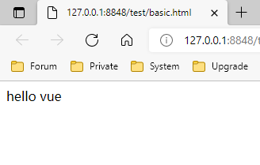
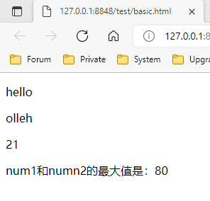
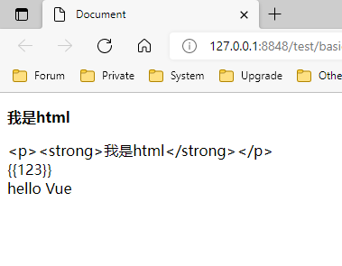
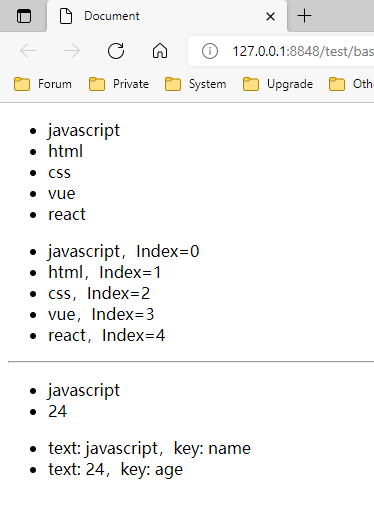

引入：通过 Script 引入本地文件或 CDN ：[安装 — Vue.js (vuejs.org)](https://cn.vuejs.org/v2/guide/installation.html)

## 体验 Vue

```html
<!DOCTYPE html>
<html>
	<head>
		<meta charset="UTF-8">
		<meta name="viewport" content="width=device-width, initial-scale=1.0">
		<meta http-equiv="X-UA-Compatible" content="ie=edge">
		<title></title>
		<script src="https://cdn.jsdelivr.net/npm/vue@2.6.14/dist/vue.js"></script>
	</head>
	<body>
		<div id="app">
			{{ str1 }}
		</div>
	</body>
	<script>
		var vm = new Vue({ //这个Vue对象用来控制某一个标签里面的数据
			el: "#app", //要控制的标签
			data: {
				str1: "hello vue", //定义一个数据，在id为app的标签内部去使用
			}
		})
	</script>
</html>
```

1. 先看 js 代码，会发现创建了一个 Vue 对象

2. 创建 Vue 对象的时候，传入了一个对象：{}

   2.1 {} 中的 el 属性：该属性决定了这个Vue对象挂载到哪一个元素上，很明显，我们这里挂载到了 id 为 app 的元素上。

   2.2 {} 中包含了 data 属性：该属性中通常会存储一些数据，好像上面例子中的 str1 就是直接定义出来的数据




```html
<!DOCTYPE html>
<html>
	<head>
		<meta charset="UTF-8">
		<meta name="viewport" content="width=device-width, initial-scale=1.0">
		<meta http-equiv="X-UA-Compatible" content="ie=edge">
		<title></title>
		<script src="https://cdn.jsdelivr.net/npm/vue@2.6.14/dist/vue.js"></script>
	</head>
	<body>
		<div id="app">
			<p>{{ str1 }}</p>
			<p>{{ str1.split("").reverse().join("") }}</p> <!-- 翻转字符串 -->
			<p>{{num+1}}</p>
			<p>num1和numn2的最大值是：{{ num1 > num2 ? num1 : num2 }}</p>
		</div>
	</body>
	<script>
		var vm = new Vue({
			el: "#app",
			data: {
				str1: "hello",
				num: 20,
				num1: 40,
				num2: 80
			}
		})
	</script>
</html>
```




## Vue 指令

v-if 和 v-show 都是来控制标签是否显示，但是也有区别，v-show 是对样式层面的控制，v-if 是对 DOM 节点的控制。

```html
<!DOCTYPE html>
<html>
	<head>
		<meta charset="utf-8" />
		<title></title>
		<script src="./js/vue.js"></script>
	</head>
	<body>

<div id="app">
	<!-- v-if指令的作用： 控制标签是否展示，不展示则删除 -->
	<div v-if="bool1">bool1 = true 时显示</div>

	<!-- bool1的值为true 第一个盒子被保留，删除第二个盒子， -->
	<!-- 为false的话，第2个盒子保留，删除第1个盒子 -->
	<div v-if="bool1">bool1 = true 时显示</div>
	<div v-else>bool1 = false 时显示</div>

	<div v-if="type=='a'">type = a 显示</div>
	<div v-else-if="type=='b'">type = b 显示</div>
	<div v-else-if="type=='c'">type = c 显示</div>
	<div v-else>上述三个条件都不成立显示</div>

	<!--不会删除标签，根据bool1是true还是false决定盒子是显示还是隐藏(在控制display属性的值)-->
	<div v-show="bool1">v-show的用法</div>

</div>
<script>
	var vm = new Vue({
		el: "#app",
		data: {
			bool1: true,
			type: "z"
		}
	})
</script>
```


## 模板语法的插值操作 (不常用)

v-html    往标签内部插入html文本

v-text    往标签内部插入普通文本(解析不了标签)

v-pre    在界面上直接展示胡子语法

v-cloak    隐藏数据渲染到页面之前，胡子语法在界面上的展示

```html
<!DOCTYPE html>
<head>
	<meta charset="UTF-8">
	<meta name="viewport" content="width=device-width, initial-scale=1.0">
	<title>Document</title>
	<style>
		[v-cloak] {
			display: none;
		}
	</style>
</head>
<body>
	<div id="app">

		<!-- 往标签内部插入html文本 -->
		<div v-html="htmlTxt"></div>

		<!-- 往标签内部插入普通文本(解析不了标签) -->
		<div v-text="htmlTxt"></div>

		<!-- 在界面上直接展示胡子语法 -->
		<div v-pre>{{123}}</div>

		<!-- 隐藏数据渲染到页面之前，胡子语法在界面上的展示 -->
		<div v-cloak>hello {{textTxt}}</div>
	</div>
</body>
<script src="https://cdn.jsdelivr.net/npm/vue/dist/vue.js"></script>
<script>
	let vm = new Vue({
		el: '#app',
		data: {
			htmlTxt: '<p><strong>我是html</strong></p>',
			textTxt: 'Vue'
		}
	})
</script>
</html>
```




## 列表和对象的渲染 (初步)

```html
<!DOCTYPE html>
<head>
	<meta charset="UTF-8">
	<title>Document</title>
	<style>
		[v-cloak] {
			display: none;
		}
	</style>
</head>
<body>
	<div id="app">
		<ul>
			<!--i是列表中的每一个数据-->
			<li v-for="i in list1">{{ i }}</li>
		</ul>
		<ul>
			<!--i是列表中的每一个数据 j是每一个数据的下标-->
			<li v-for="(i, j) in list1">{{ i }}，Index={{ j }}</li>
		</ul>

		<hr>

		<ul>
			<!--i是my_obj对象中的值-->
			<li v-for="i in my_obj">{{i}}</li>
		</ul>

		<ul>
			<!--i是my_obj对象中的值 j是my_obj对象中的键名-->
			<li v-for="(i, j) in my_obj">text: {{i}}，key: {{j}}</li>
		</ul>

	</div>
</body>
<script src="./js/vue.js"></script>
<script>
	var vm = new Vue({
		el: "#app",
		data: {
			list1: ["javascript", "html", "css", "vue", "react"],
			my_obj: {
				name: "javascript",
				age: 24
			}
		}
	})
</script>
</html>
```




