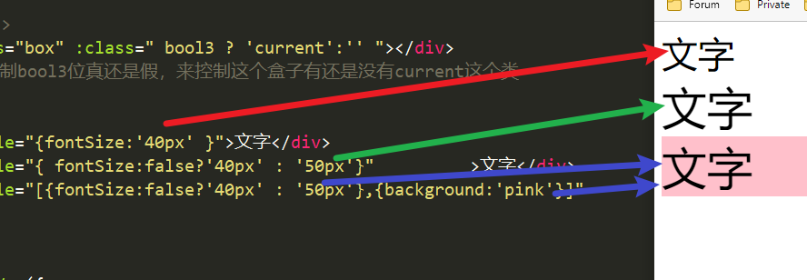
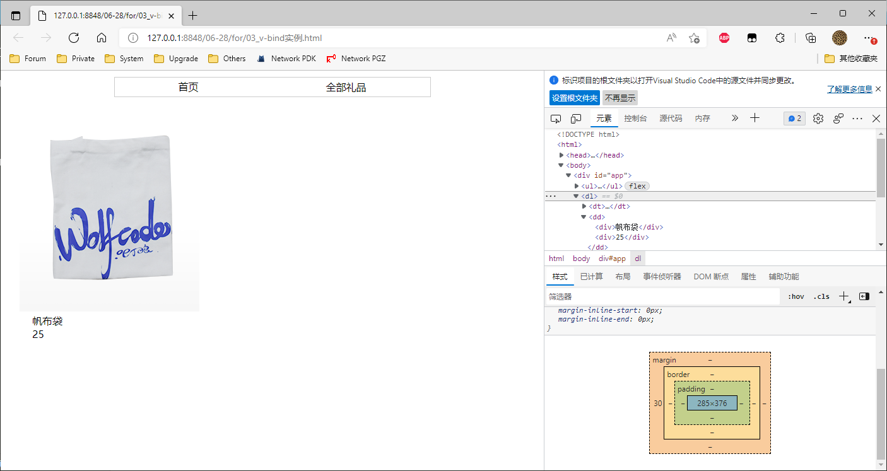
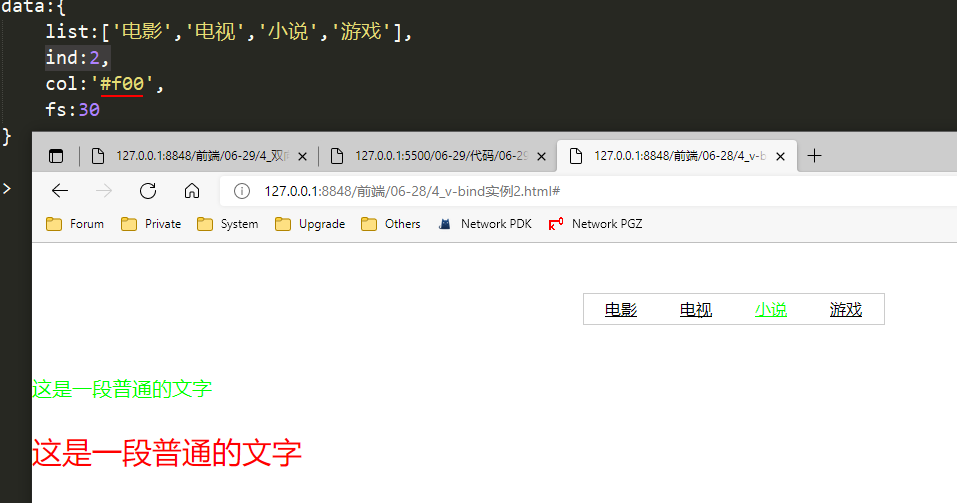
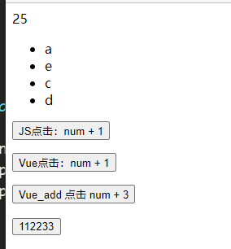
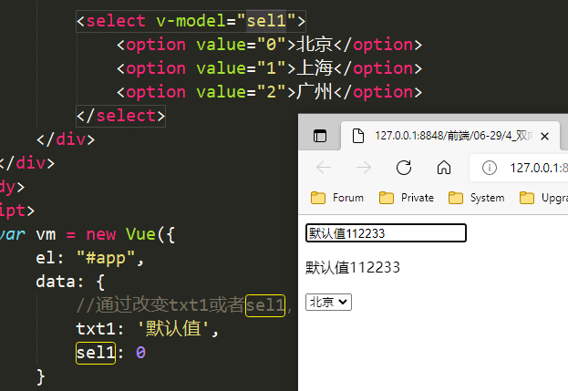
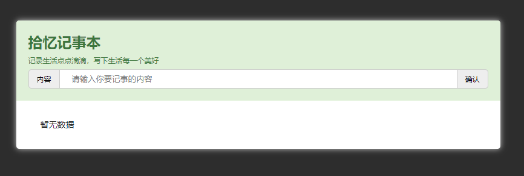

## 标签属性指令 v-bind

语法： `v-bind:属性名字="所需要绑定的数据"` 

简写：`:属性名="所需要绑定的数据"`

```html
<!DOCTYPE html>
<html>
	<head>
		<meta charset="utf-8">
		<title></title>
		<script src="vue.js"></script>
	</head>
	<body>
		<div id="app">
			<!-- 
				标签的原生属性不能直接绑定数据，需要使用v指令  v-bind
				v-bind  属性绑定指令
			-->
			<a v-bind:href="bd">百度</a>
			<a :href="tb">淘宝</a>
			<a :href="tb">淘宝</a>
		</div>
		<script>
			var vm = new Vue({
				el: "#app",
				data: {
					bd: "https://www.baidu.com",
					tb: "https://www.taobao.com"
				}
			})
		</script>
	</body>
</html>
```


Vue 控制类名、Style样式

```html
<!DOCTYPE html>
<html>
	<head>
		<meta charset="utf-8">
		<title></title>
		<script src="vue.js"></script>
	</head>
	<body>
		<div id="app">
			<!--控制标签的类名 :class= 的值可以是 js对象 {类名：布尔值} -->
			<div class="box" :class="{box1:bool1, box2:bool2}"></div>

			<!--控制标签的类名 :class= 的值可以是 数组 [类名1，类名2] -->
			<div class="box" :class="['box3', 'box4']"></div>

			<!--掌握-->
			<div class="box" :class=" bool3 ? 'current':'' "></div>
			<!--通过控制bool3位真还是假，来控制这个盒子有还是没有current这个类-->


			<div :style="{fontSize:'40px' }">文字</div>
			<div :style="{ fontSize:false?'40px' : '50px'}">文字</div>
			<div :style="[{fontSize:false?'40px' : '50px'},{background:'pink'}]">文字</div>
		</div>
	</body>
	<script>
		var vm = new Vue({
			el: "#app",
			data: {
				bool1: true,
				bool2: false,
				bool3: true
			}
		})
	</script>
</html>
```



### 实例1

```html
<!DOCTYPE html>
<html>
	<head>
		<meta charset="utf-8">
		<title></title>
		<style>
			* {
				padding: 0;
				margin: 0;
			}

			ul {
				list-style: none;
				width: 500px;
				height: 30px;
				line-height: 30px;
				display: flex;
				justify-content: space-around;
				border: 1px solid #ccc;
				margin: 10px auto;
				/* background-color: #ccc; */
			}

			a {
				color: black;
				text-decoration: none;
			}
			dl{
				width: 285px;
				margin-left: 30px;
			}
			dl > dd > div{
				margin-left: 20px;
			}
		</style>
		<script src="../vue.js"></script>
	</head>
	<body>
		<div id="app">
			<ul>
				<li v-for="(item,index) in navList"><a v-bind:href="item.url">{{item.title}}</a></li>
			</ul>
			<dl>
				<dt></dt>
				<dd>
					<div>{{img.name}}</div>
					<div>{{img.coin}}</div>
				</dd>
			</dl>
		</div>
	</body>
	<script>
		var app = new Vue({
			el: '#app',
			data: {
				navList: [{
						title: '首页',
						url: 'https://sc.wolfcode.cn/index.html'
					},
					{
						title: '全部礼品',
						url: 'https://sc.wolfcode.cn/moreGoods.html'
					},
				],
				img: {
					id: 1,
					name: "帆布袋",
					title: "帆布袋",
					coin: 25,
					coverImg: "https://sc.wolfcode.cn/upload/images/product_images/20200629/c68be5b2-9b81-42a8-893f-b47fe83b25e5.png",
				},
			},
		})
	</script>
</html>
```




### 实例2

```html
<!DOCTYPE html>
<html>
	<head>
		<meta charset="utf-8">
		<title></title>
		<script src="./js/v2.6.10/vue.js"></script>
		<style>
			*{
				padding: 0;
				margin: 0;
			}
			.box{
				width: 300px;
				height: 30px;
				border: 1px solid #ccc;
				line-height: 30px;
				margin: 50px auto;
			}
			.box ul{
				/* 弹性布局需要设置在横向显示标签的父标签上 */
				display: flex;
				justify-content: space-around;
				list-style: none;
			}
			.box ul li a{
				color: #000;
			}
			.box ul li .active{
				color: #0f0;
			}
		</style>
	</head>
	<body>
		<div id="app">
			<div class="box">
				<!-- 
					v-bind指令简写 :
						简写语法： :属性名="需要绑定的数据"
				 -->
				<ul>
					<!-- <li><a href="#" class="active">综艺</a></li> -->
					<li v-for="(item,index) in list">
						<!-- <a href="#" class="当前列表的下标 == 预设值的下标 ? active : '' ">{{item}}</a> -->
						<!-- <a href="#" v-bind:class="index == ind ? 'active' : '' ">{{item}}</a> -->
						
						<a href="#" :class="index == ind ? 'active' : '' ">{{item}}</a>
					</li>
				</ul>
			</div>
			
			<p style="color: #0f0;font-size: 20px; margin-top: 20px;">这是一段普通的文字</p>
			<p :style="{color:col,fontSize:fs+'px',marginTop:fs+'px'}">这是一段普通的文字</p>
			
		</div>
	</body>
	<script>
		var app = new Vue({
			el:"#app",
			data:{
				list:['电影','电视','小说','游戏'],
				ind:2,
				col:'#f00',
				fs:30
			}
		})
	</script>
</html>
```



## v-on事件绑定


```html
<!DOCTYPE html>
<html>
	<head>
		<meta charset="utf-8" />
		<title></title>
		<script src="../vue.js"></script>
	</head>
	<body>
		<div id="app">
			{{num}}
			<ul>
				<li v-for="(item,index) in arr">{{item}}</li>
			</ul>
			<p><button onclick="clickHandle()">JS点击：num + 1</button></p>
			<p><button v-on:click="clickHandle">Vue点击：num + 1</button></p>
			<!-- v-on 简写方法：@事件名="出发的事件函数" -->
			<p><button @click="add(3)">Vue_add 点击 num + 3</button></p>
			<p><button @click="fun">112233</button></p>
		</div>
	</body>
	<script>
		var app = new Vue({
			el: "#app",
			data: {
				num: 20,
				arr: ['a', 'b', 'c']
			},
			methods: {
				// ES6 对象成员方法 创建方法
				clickHandle() {
					console.log(this)
					console.log(this.num)
					console.log(this.arr)
					this.num++			// 数字增加
					this.arr[1] = 'e'	// 数组的第二个元素变为e
					this.arr.push('d')	// 更新页面内容
				},
				// ES5 对象成员方法 创建方法: add:function(num){
				add(num) {
					// console.log(num)
					this.num += num
				},
				fun(event) {
					console.log(event)
				}
			}
		})

		function clickHandle() {
			// alert("被点到了")
			console.log(app.num) // 注：要省略data
			app.num++
			app.arr[1] = 'e'
		}
	</script>
</html>
```



## 表单数据绑定 v-model (双向数据绑定)


```html
<!DOCTYPE html>
<html>
	<head>
		<meta charset="utf-8">
		<title></title>
		<style></style>
		<script src="../vue.js"></script>
	</head>
	<body>
		<div id="app">
			<div id="app">
				<input type="text" v-model="txt1"> <!-- v-model表示了用户输入的这个数据-->
				<p>{{ txt1 }}</p>

				<select v-model="sel1">
					<option value="0">北京</option>
					<option value="1">上海</option>
					<option value="2">广州</option>
				</select>
			</div>
		</div>
	</body>
	<script>
		var vm = new Vue({
			el: "#app",
			data: {
				//通过改变txt1或者sel1，来使对应的表单元素的v-model的值发生了变化，所以这个表单元素的value就变化了(v-model看成我们之前将的value)
				txt1: '默认值',
				sel1: 0
			}
		})
	</script>
</html>
```



### 原理

`v-model` 本质上包含了两个操作：

1. `v-bind` 绑定input元素的value属性
2. `v-on` 指令绑定input元素的input事件

即：:value="txtVal" 和 @input="handleInput"

```html
......
	<div id="app">
        <!-- <input type="text" v-model="txtVal"> -->
        <input type="text" :value="txtVal" @input="handleInput">
        <p>{{ txtVal }}</p>
    </div>
    <script>
        var vm = new Vue({
            el:"#app",
            data:{
                txtVal:""
            },
            methods:{
                handleInput(e){
                    console.log(e)
                    this.txtVal = e.target.value
                }
            }
        })
    </script>
......
```

即：

```html
<input type="text" v-model="textVal"/>
<!-- 等同于 -->
<input type="text" v-bind:value="textVal" v-on:input="textVal = $event.target.value"/>
```


## 综合案例：记事本


```html
<!DOCTYPE html>
<html>
	<head>
		<meta charset="utf-8">
		<title></title>
		<script src="./js/v2.6.10/vue.js"></script>
		<style>
			* {
				padding: 0;
				margin: 0;
			}

			ul {
				list-style: none;
			}

			body {
				background-color: #2d2d2d;
			}

			#box {
				width: 800px;
				margin: 50px auto;
				background-color: #fff;
				box-shadow: 0 0 10px #ccc;
				border-radius: 5px;
				overflow: hidden;
			}

			#box .head {
				background-color: #DFF0D8;
				padding: 20px;
			}

			#box .head h2 {
				color: #3C763D;
			}

			#box .head p {
				font-size: 12px;
				color: #3C763D;
				line-height: 30px;
			}

			#box .head .input {
				height: 30px;
				line-height: 30px;
				border-radius: 5px;
				background-color: #EEEEEE;
				overflow: hidden;
				border: 1px solid #ccc;

			}

			#box .head .input span {
				display: inline-block;
				width: 50px;
				height: 30px;
				text-align: center;
				font-size: 12px;
				float: left;
			}

			#box .head .input input {
				float: left;
				width: calc(100% - 102px);
				border: none;
				outline: none;
				height: 30px;
				text-indent: 20px;
			}


			#box .head .input span:first-child {
				border-right: 1px solid #ccc;
			}

			#box .head .input span:last-child {
				border-left: 1px solid #ccc;
				cursor: pointer;
			}

			#box .list {
				padding: 20px;
			}

			#box .list li {
				border-bottom: 1px dashed #ccc;
				height: 40px;
				font-size: 14px;
				color: #2D2D2D;
			}

			#box .list li:last-child {
				line-height: 40px;
				border-bottom: none;
				padding: 0 20px;
			}

			#box .list li span {
				float: left;
				height: 20px;
				line-height: 20px;
				margin: 10px 0;
				text-align: center;
			}

			#box .list li span:first-child {
				width: 50px;
				border-right: 1px solid #ccc;
				margin-right: 10px;
			}

			#box .list li span:last-child {
				width: 30px;
				background: url(./img/icon.png) no-repeat center center;
				background-size: 100%;
				float: right;
				margin-right: 20px;
				cursor: pointer;
			}

			#box .list li:last-child b:first-child {
				float: left;
			}

			#box .list li:last-child b:last-child {
				float: right;
				cursor: pointer;
			}
		</style>
	</head>
	<body>
		<div id="box">
			<div class="head">
				<h2>拾忆记事本</h2>
				<p>记录生活点点滴滴，写下生活每一个美好</p>
				<div class="input">
					<span>内容</span><input type="text" placeholder="请输入你要记事的内容" v-model.trim="inputTxt"
						@keyup.enter="add" /><span @click='add'>确认</span>
				</div>
			</div>

			<ul class="list">
				<!-- v-for循环列出列表 -->
				<li v-for="(item,index) in list">
					<!-- 前面的序号 -->
					<span class="xh">{{ index + 1 }}</span>
					<!-- 列表内容 -->
					<span>{{item}}</span>
					<!-- 关闭按钮 -->
					<!-- 添加点击移除事件，要传形参 -->
					<span class="qc" @click="del(index)"></span>
				</li>
				<li v-if="list.length !== 0">
					<b>
						总数：{{list.length}}
					</b>
					<b @click="clear">清除</b>
				</li>
				<li v-else>
					暂无数据
				</li>
			</ul>
		</div>
	</body>
	<script>
		var app = new Vue({
			el: "#box",
			data: {
				list: [],
				inputTxt: ''
			},
			methods: {
				add() {
					// 判断当前输入框是否为空
					if (this.inputTxt.length == 0) {
						alert('不能为空，请输入内容！')
						return;
					}
					//可以增加数组的元素，但是不能更新虚拟DOM
					// this.list[this.list.length] = this.inputTxt;
					// 追加内容
					this.list.push(this.inputTxt);
					//清空输入框
					this.inputTxt = '';
					// 将数据存储到本地
					localStorage.setItem('list', JSON.stringify(this.list))


					// localStorage.setItem('name', '张三')
					// console.log(localStorage.getItem('name'));

					// console.log(JSON.stringify(this.list));
					// console.log(typeof JSON.stringify(this.list));
				},
				del(index) {
					// 对话框
					var bool = confirm('确定是否删除？')
					// console.log(bool);
					if (bool) {
						this.list.splice(index, 1);
						// 重新赋值本地存储的list变量
						localStorage.setItem('list', JSON.stringify(this.list));
					}

				},
				clear() {
					// 对话框
					var bool = confirm('是否全部清除记录？');
					if (bool) {
						this.list = []
						// 重新赋值本地存储的list变量
						localStorage.setItem('list', '[]');
					}
				}
			},
			created() { //生命周期钩子函数---创建时

				// 判断是否有存储数据
				// console.log(localStorage.getItem('list'));
				if (localStorage.getItem('list') !== null) {
					//赋值之前需要将数据进行json格式解析
					this.list = JSON.parse(localStorage.getItem('list'))
				}
			}
		})
	</script>
</html>

```




