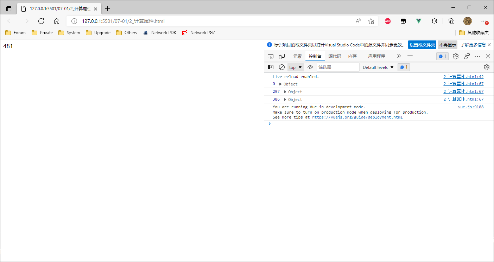
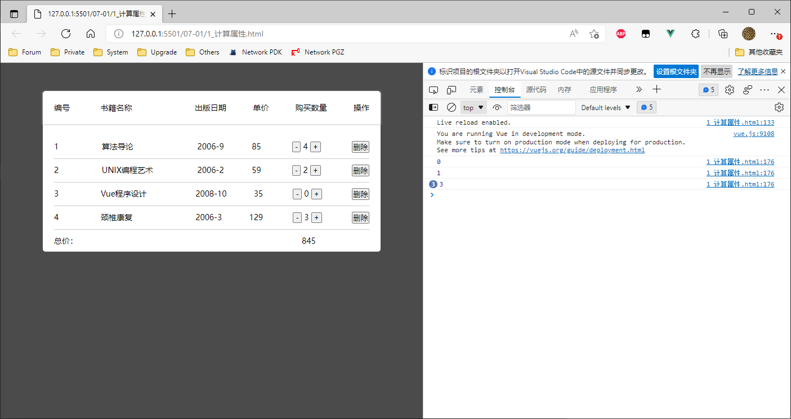
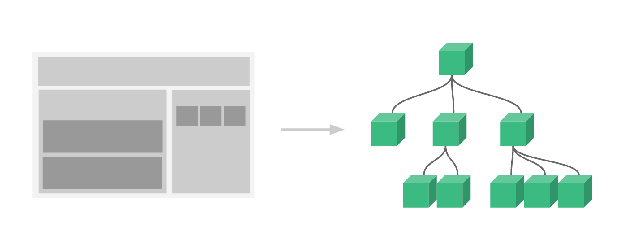
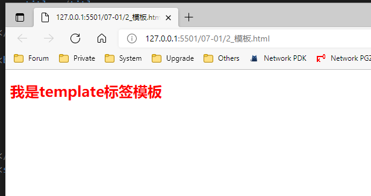
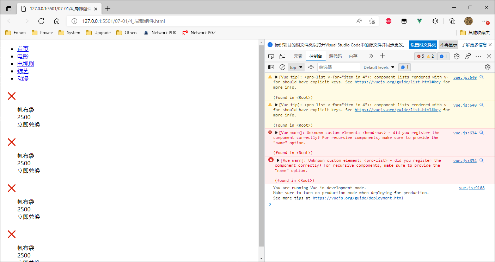
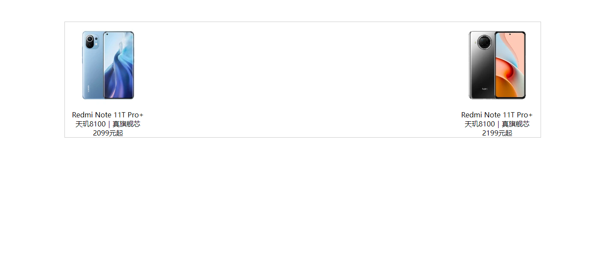
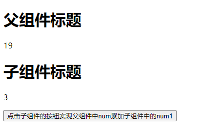

## Computed 计算属性

computed（计算属性）  的作用主要是对原数据进行改造输出。

```html
<!DOCTYPE html>
<html>

<head>
    <meta charset="utf-8">
    <title></title>
    <script src="../vue.js"></script>
</head>

<body>
    <div id="app">
        {{total}}
    </div>
</body>
<script>
    var vm = new Vue({
        el: "#app",
        data: {
            arr: [
                { name: 'Vuejs入门', price: 99, count: 3 },
                { name: 'Vuejs底层', price: 89, count: 1 },
                { name: 'Vuejs从入门到放弃', price: 19, count: 5 },
            ]
        },
        computed: {
            //computed里面的方法必须有返回值！这个return值将来在视图中被{{total}}引用
            total() {
                var a = this.arr.reduce(function (pre, current) {

                    console.log(pre, current)

                    // var total = 当前这次的 price*count + 上一次的total
                    var total = current.price * current.count + pre
                    return total
                }, 0)
                return a
            }
        }

    })
</script>

</html>
```




实例：

```html
<!DOCTYPE html>
<html>

<head>
    <meta charset="utf-8">
    <title></title>
    <script src="../vue.js"></script>
    <style>
        * {
            margin: 0;
            padding: 0;
        }

        ul,
        li {
            list-style: none;
        }

        body {
            background-color: rgb(75, 75, 75);
            font-size: 14px;
        }

        .box {
            width: 600px;
            margin: 50px auto;
            background-color: #fff;
            border-radius: 5px;
            border: 2ox solid #ccc;
        }

        .box .title {
            display: flex;
            justify-content: space-between;
            box-shadow: 0 1px 3px #ccc;
            margin-bottom: 20px;
            padding: 20px;
        }

        .box .title li:nth-child(1) {
            width: 35px;
        }

        .box .title li:nth-child(2) {
            width: 120px;
        }

        /* content内容框的内边距 */
        .box .content {
            padding: 0 20px;
        }

        .box .content li {
            display: flex;
            justify-content: space-between;
            padding: 10px 0;
            border-bottom: 1px solid #ccc;
        }

        .box .content li:last-child {
            border-bottom: none;
        }

        .box .content li:last-child span:nth-child(1) {
            width: 100px;
        }

        .box .content li span:nth-child(1) {
            width: 35px;
        }

        .box .content li span:nth-child(2) {
            width: 120px;
        }

        .box .content li span:nth-child(5) {
            width: 52px;
            height: 20px;
            margin: 0 5px;
        }
    </style>
</head>

<body>
    <div id="app">
        <div class="box">
            <ul class="title">
                <li v-for="item in headers" v-text="item"></li>
            </ul>
            <ul class="content">
                <li v-for="(item, index) in list">
                    <span>{{index + 1}}</span>
                    <span>{{item.name}}</span>
                    <span>{{item.date}}</span>
                    <span>{{item.price}}</span>
                    <!-- 使用 <span> 来组合行内元素，以便通过样式来格式化它们。 -->
                    <span><input type="button" value=" - " @click="sub(index)"> {{item.num}} <input @click="add(index)"
                            type="button" value=" + "></span>
                    <span><button @click="del(index)">删除</button></span>
                </li>
                <li><span>总价：</span><span>{{total}}</span></li>
            </ul>
        </div>
    </div>
</body>
<script>
    var app = new Vue({
        el: "#app",
        data: {
            headers: ['编号', '书籍名称', '出版日期', '单价', '购买数量', '操作'],
            list: [{
                name: "算法导论",
                date: '2006-9',
                price: 85,
                num: 3
            },
            {
                name: 'UNIX编程艺术',
                date: '2006-2',
                price: 59,
                num: 1
            },
            {
                name: 'Vue程序设计',
                date: '2008-10',
                price: 35,
                num: 2
            },
            {
                name: '颈椎康复',
                date: '2006-3',
                price: 129,
                num: 1
            }
            ]
        },
        methods: {
            add(index) {
                console.log(index)
                this.list[index].num++
            },
            sub(index) {
                if (this.list[index].num <= 0) {
                    return
                }
                this.list[index].num--
            },
            del(index) {
                this.list.splice(index, 1)
            }
        },
        // 计算属性，必须要有返回值
        computed: {
            total() {
                var sum = 0;
                // 商品价格累加  (数组的遍历)
                // for (var i = 0; i < this.list.length; i++) {
                // 	sum += this.list[i].num * this.list[i].price;
                // }
                // es6  箭头函数
                // this.list.forEach(function() {

                // })
                // this.list.forEach((item) => {
                // 	// console.log(item);
                // 	sum += item.num * item.price
                // })
                this.list.map((item) => {
                    sum += item.num * item.price
                })
                return sum;
            }
        }
    })
</script>

</html>
```



### 参数说明

补充：reduce方法(数组遍历高阶用法)

​		reduce() 方法为数组的每个值（从左到右）执行提供的函数。简单理解就是遍历数组，并将数组内的每个元素（从左到右）放到回调函数中执行，并将返回结果再放回回调函数中执行，直至遍历完数组后，将最终结果返回到方法的调用处。

具体语法如下：

```
array.reduce(function(total, currentValue, currentIndex, arr), initialValue)

参数说明：
	total:				必选。表示上一次调用回调时的返回值，或者初始值 initialValue;	
	currentValue:		必选。表示当前正在处理的数组元素;
	currentIndex:		可选。表示当前正在处理的数组元素的索引，若提供init值，则索引为0，否则索引为1；
	arr:				可选。表示原数组；
	initialValue:		可选。初始值
```


## 组件化

**什么是组件化？**

> 面对复杂问题的处理方式，把问题拆解成很多个能处理的小问题，再将其放在整体中，会发现大的问题也会迎刃而解。
>
> 而组件化的思想也类似：
>
> 1. 如果我们实现一个页面结构和逻辑非常复杂的页面时，如果全部一起实现会变得非常复杂，而且也不利于后续的维护和迭代功能。
> 2. 但如果我们这时候把页面分成一个个小的功能块，每个功能块能完成属于自己这部分独立的功能，那么整个页面之后的维护和迭代也会变得非常容易。

* 组件化开发的优势：可维护性高    可复用性高


**Vue组件化思想**

> 组件化是Vue重要的思想
>
> 1. 它提供了一种抽象，让我们可以开发出一个个独立可复用的小组件来构造我们的应用。
> 2. 任何的应用都会被抽象成一颗组件树。



> 组件化思想的应用开发：
>
> 1. 有了组件化的思想，我们在之后的开发中就要充分的利用它。
> 2. 尽可能的将页面拆分成一个个小的、可复用的组件。
> 3. 这样让我们的代码更加方便组织和管理，并且扩展性也更强。


### 1. Vue 的模板

模板的作用：模板占位符，可帮助我们包裹元素，但在循环过程当中，template不会被渲染到页面上


#### 模板的创建方法：

**第一种：直接写在选项里的模板**

```html
<script type="text/javascript">
var app=new Vue({
     el:'#app',
     data:{
         message:'hello Vue!'
      },
     template:`
        <h1 style="color:red">我是选项模板</h1>
     `
})
</script>
```


**第二种：写在template标签里的模板**

```html
<template id="demo2">
    <h2 style="color:red">我是template标签模板</h2>
</template>

<script type="text/javascript">
    var app = new Vue({
        el: '#app',
        data: {
            message: 'hello Vue!'
        },
        // 注：需要写上这句，才会在UI上显示出来
        template: '#demo2'
    })
</script>
```


**第三种：写在script标签里的模板**

```html
<script type="x-template" id="demo3">
	<h2 style="color:red">我是script标签模板</h2>
</script>

<script type="text/javascript">
    var app=new Vue({
        el:'#app',
        data:{
            message:'hello Vue!'
        },
        template:'#demo3'
    })
</script>
```


### 2. 全局组件

通过 `Vue.component('组件名称', {})` ，通过这个方法注册的都是全局组件，也就是他们再注册之后可以用在任何新创建的`Vue` 实例挂载的区域内。

```html
<!DOCTYPE html>
<html>

<head>
    <meta charset="utf-8">
    <title></title>
    <script src="../vue.js"></script>
</head>

<body>
    <div id="app">
    </div>

    <template id="demo2">
        <h2 style="color:red">我是template标签模板</h2>
    </template>
</body>
<script>
    var app = new Vue({
        el: '#app',
        data: {
            message: 'hello Vue!'
        },
        template: '#demo2'		// 用这句话将模板插入HTML中
    })
</script>

</html>
```




实例2：

```html
<!DOCTYPE html>
<html>

<head>
    <meta charset="utf-8">
    <title></title>
    <script src="../vue.js"></script>
</head>

<body>
    <div id="app">
        <my-con></my-con>
        <div>
            <my-con></my-con>
        </div>
    </div>
    <my-con></my-con>
</body>
<script>
    Vue.component('my-con', {
        template: '<section><h3>组件标题</h3><p>组件内容</p></section>'
    })
    const vm = new Vue({
        el: '#app'
    })
</script>

</html>
```

> 上面案例中，在`<div id="app">...</div>` 外的组件 `my-con` 没有替换成组件真正的页面结构，是因为 `new Vue()` 挂载在 `id=app` 的节点上，不在这个节点上标签，不会受到Vue的影响。


### 3. 局部组件

> 通过 `Vue.component` 方式注册的组件，称之为全局组件。任何地方都可以使用。全局注册往往是不够理想的。比如，如果你使用一个像 webpack 这样的构建系统，全局注册所有的组件意味着即便你已经不再使用一个组件了，它仍然会被包含在你最终的构建结果中。这造成了用户下载的 JavaScript 的无谓的增加。

```html
<!DOCTYPE html>
<html>

<head>
    <meta charset="utf-8">
    <title></title>
    <script src="../vue.js"></script>
</head>

<body>
    <div id="app">
        <head-nav></head-nav>
        <div class="content">
            <pro-list v-for="item in 4"></pro-list>
        </div>
    </div>

    <div id="box">
        <head-nav></head-nav>
        <div class="content">
            <pro-list v-for="item in 4"></pro-list>
        </div>
    </div>

    <template id="list">
        <div>
            <dl>
                <dt></dt>
                <dd>帆布袋</dd>
                <dd>2500</dd>
                <dd>立即兑换</dd>
            </dl>
        </div>
    </template>

    <template id="com">
        <div>
            <ul class="nav">
                <li><a href="#">首页</a></li>
                <li><a href="#">电影</a></li>
                <li><a href="#">电视剧</a></li>
                <li><a href="#">综艺</a></li>
                <li><a href="#">动漫</a></li>
            </ul>
        </div>
    </template>
</body>
<script>
    var app = new Vue({
        el: "#app",
        data: {},
        components: {
            // 创建局部组建
            // "组件名": { 参数}
            "proList": {
                template: "#list"
            },
            "headNav": {
                template: "#com"
            }
        }
    })
    // #box 中无法使用 #app 的局部组件，所以有报错
    var box = new Vue({
        el: "#box",
        data: {},
        components: {

        },
    })
</script>

</html>
```




### 4. 父子组件间的通讯

#### 父级传子级

> 在组件中，使用选项props来声明需要从父级接收到的数据。
>
> props的值有两种方式：
>
> 1. 字符串数组，数组中的字符串就是传递时的名称。
> 2. 对象，对象可以设置传递时的类型（String，Number，Boolean，Array， Object，Date，Function，Symbol），也可以设置默认值等。


```html
<body>
  <div id="app1">
    <my-con1></my-con1>
  </div>
</body>

<template id="template2">
  <section>
    <h3>{{title}}B</h3>
    <p>组件内容B</p>
    <!-- my-con1组件内的aa组件 --> 
    <aa v-bind:parent-txt="childtxt"></aa>
  </section>
</template>
<script>
  var componentB = {
    template: '#template2',
    data() {
      return {
        title: 'zj',
        childtxt: 'child text'
      }
    },
    components: {
      'aa': {
        template: '<div>{{parentTxt}}</div>',
        props: ['parent Txt']
      }
    }
  }
  
  const vm1 = new Vue({
    el: '#app1',
    components: {
      'my-con1': componentB
    }
  })
</script>
```


课上实例：

```html
<!DOCTYPE html>
<html>
	<head>
		<meta charset="utf-8">
		<title></title>
		<script src="./js/vue.js"></script>
		<style>
			* {
				padding: 0;
				margin: 0;
			}

			.box {
				width: 1100px;
				margin: 50px auto;
				display: flex;
				justify-content: space-between;
				flex-wrap: wrap;
				border: 1px solid #ccc;
				text-align: center;
			}
		</style>
	</head>
	<body>
		<div id="app">
			<div class="box">
				<item v-for='(item,index) in list' :item='item'></item>
			</div>
		</div>
		<template id="template1">
			<dl>
				<dt></dt>
				<dd>{{item.title}}</dd>
				<dd>{{item.txt}}</dd>
				<dd>{{item.price}}元起</dd>
			</dl>
		</template>
	</body>
	<script>
		var app = new Vue({
			el: "#app",
			data: {
				list: [{
					img: "./img/row-1-right-1.webp",
					title: 'Redmi Note 11T Pro+',
					txt: '天玑8100｜真旗舰芯',
					price: 2099
				}, {
					img: "./img/row-1-right-2.webp",
					title: 'Redmi Note 11T Pro+',
					txt: '天玑8100｜真旗舰芯',
					price: 2199
				}]
			},
			components: {
				'item': {
					template: '#template1',
					// 需要定义一个自定义属性来接收父组件传递过来的数据
					// 自定义属性在组件中相当于是变量
					props: ['item']
				}
			},

		})
	</script>
</html>
```




#### 子级传递父级

> 子组件向父组件传递数据，通过自定义事件

```html
<!DOCTYPE html>
<html>
	<head>
		<meta charset="utf-8">
		<title></title>
		<script src="./js/v2.6.10/vue.js"></script>
	</head>
	<body>
		<div id="app">
			<component-a></component-a>
		</div>
		<template id="tem1">
			<div>
				<h1>{{titleA}}</h1>
				<p>{{numA}}</p>
				<component-b @change-num-a="changeNum"></component-b>
			</div>
		</template>
		<template id="tem2">
			<div>
				<h2>{{titleB}}</h2>
				<button @click='clickHandle'>点击子组件按钮，将子组件的数据num2累加到父组件的num1中</button>
			</div>
		</template>
	</body>
	<script>
		// 子组件
		var componentB = {
			template: '#tem2',
			data() {
				return {
					titleB: '子组件标题',
					numB: 3
				}
			},
			methods: {
				clickHandle() {
					this.$emit('change-num-a', this.numB)
				}
			},
		}

		//父组件
		var componentA = {
			template: '#tem1',
			data() {
				return {
					titleA: '父组件标题',
					numA: 2
				}
			},
			components: {
				componentB
			},
			methods: {
				changeNum(numB) {
					this.numA += numB;
				}
			},
		}
		var app = new Vue({
			el: "#app",
			data: {},
			components: {
				componentA
			},
		})
	</script>
</html>

```


课堂实例：

```html
<!DOCTYPE html>
<html>

<head>
	<meta charset="utf-8">
	<title></title>
	<script src="./js/vue.js"></script>
</head>

<body>
	<div id="app">
		<!-- 子组件传递数据给父组件，本质上是通过自定义事件传递 -->

		<!-- 调用父组件 -->
		<com-a></com-a>
	</div>

	<!-- 父组件 -->
	<template id="template1">
		<div>
			<h1>父组件标题</h1>
			<p>{{num}}</p>
			<!-- 在父组件中是不可以直接调用子组件里面的数据 -->
			<!-- <p>{{num1}}</p> -->
			<!-- 调用子组件 -->
			<com-b @comachange='changeHandle'></com-b>
		</div>
	</template>

	<!-- 子组件 -->
	<template id="template2">
		<div>
			<h1>子组件标题</h1>
			<p>{{num1}}</p>
			<button @click="comBClickHandle">点击子组件的按钮实现父组件中num累加子组件中的num1</button>
		</div>
	</template>
</body>
<script>
	var app = new Vue({
		el: "#app",
		data: {},
		// 创建父组件
		components: {
			"comA": {
				template: '#template1',
				data() {
					return {
						num: 1
					}
				},
				methods: {
					changeHandle(num1) {
						// console.log(num1);
						this.num += num1;
						// this.num = this.num + num1;
					}
				},
				// 创建子组件
				// 注：子组件不能跟父组件同级，否则会替代父组件
				components: {
					"comB": {
						template: '#template2',
						data() {
							return {
								num1: 3
							}
						},
						methods: {
							comBClickHandle() {
								// this.$emit('自定义事件的名字', 需要传递的数据)，给父组件传递数据
								this.$emit('comachange', this.num1)
							}
						},
					}
				},
			}
		},
	})
</script>

</html>
```




