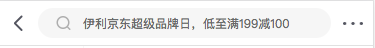
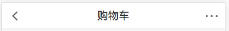
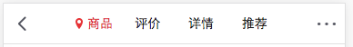
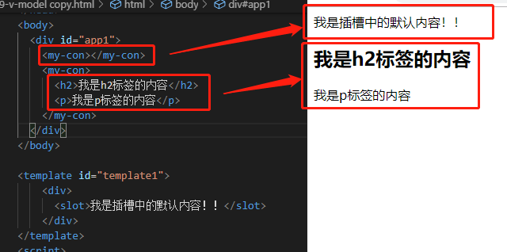
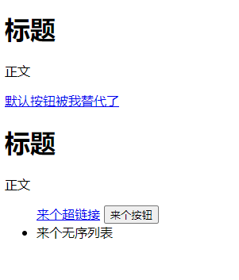
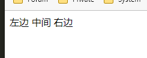
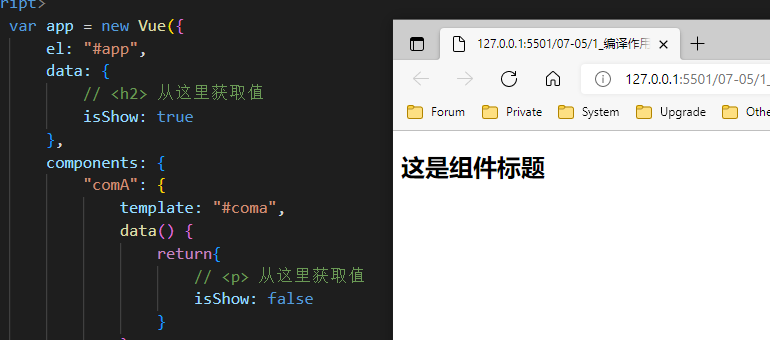
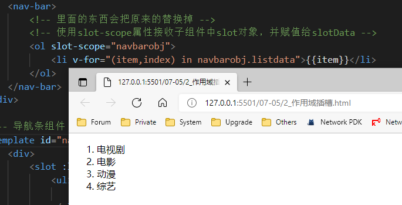
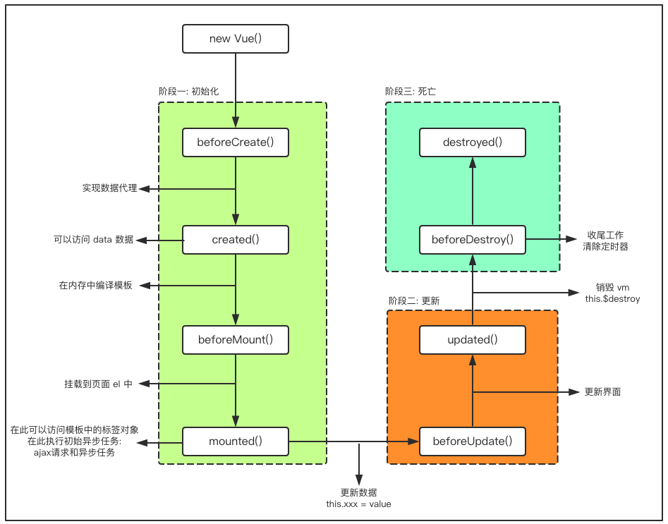

# 插槽

### 1. 为什么使用 slot

> slot翻译为插槽，组件的插槽：
>
> 1. 组件的插槽也是为了让我们封装的组件更加具有扩展性。
> 2. 让使用者可以决定组件内容的一些内容到底展示什么。

**京东头部导航栏例子：**









### 2. 如何在组件中使用 slot 呢？

> 如何去封装这类的组件呢？
>
> 1. 它们也很多区别，但是也有很多共性。
> 2. 如果，我们每一个单独去封装一个组件，显然不合适：比如每个页面都返回，这部分内容我们就要重复去封装。
> 3. 但是，如果我们封装成一个，好像也不合理：有些左侧是菜单，有些是返回，有些中间是搜索，有些是文字，等等
>
> 如何封装合适呢？**抽取共性，保留不同**
>
> 1. 最好的封装方式就是将共性抽取到组件中，将不同暴露为插槽。
> 2. 一旦我们预留了插槽，就可以让使用者根据自己的需求，决定插槽中插入什么内容。
> 3. 是搜索框，还是文字，还是菜单。由调用者自己来决定。

### 3. slot 的基本使用（匿名插槽）

> 了解了为什么用slot，我们再来谈谈如何使用slot？
>
> 1. 在子组件中，使用特殊的元素`<slot>`就可以为子组件开启一个插槽。
> 2. 该插槽插入什么内容取决于父组件如何使用。




实例：

```html
<!DOCTYPE html>
<html>

<head>
    <meta charset="utf-8">
    <title></title>
    <script src="../vue.js"></script>
</head>

<body>
    <div id="app">
        <news>
            <a href="#">默认按钮被我替代了</a>
        </news>
        <news>
            <ul>
                <a href="#">来个超链接</a>
                <button>来个按钮</button>
                <li>来个无序列表</li>
            </ul>
        </news>
    </div>
    <template id="template1">
        <div>
            <h1>标题</h1>
            <p>正文</p>
            <!-- 在组件代码中预留一个代码位置，用<slot>标签 -->
            <slot>
                <!-- 可在预留位添加默认代码 -->
                <!-- 若有新配置，此默认选项将被替代 -->
                <button>默认按钮</button>
            </slot>
        </div>
    </template>
</body>
<script>
    var app = new Vue({
        el: "#app",
        data: {},
        components: {
            'news': {
                template: '#template1'
            }
        }
    })
</script>

</html>
```



### 4. 具名插槽

> 当子组件的功能复杂时，子组件的插槽可能并非是一个。
>
> 1. 比如我们封装一个导航栏的子组件，可能就需要三个插槽，分别代表左边、中间、右边。
> 2. 那么，外面在给插槽插入内容时，如何区分插入的是哪一个呢？
> 3. 这个时候，我们就需要给插槽起一个名字
>
> 如何使用具名插槽呢？
>
> 1. 非常简单，只要给slot元素一个name属性即可
> 2. `<slot name='myslot'></slot>`


实例;

```html
<!DOCTYPE html>
<html>

<head>
    <meta charset="utf-8">
    <title></title>
    <script src="../vue.js"></script>
</head>

<body>
    <div id="app">
        <nav-bar></nav-bar>
    </div>
    <template id="nav">
        <div>
            <div class="box">
                <slot name="left">
                    <!-- 默认代码 -->
                    左边
                </slot>
                <slot name="center">
                    <!-- 默认代码 -->
                    中间
                </slot>
                <slot name="right">
                    <!-- 默认代码 -->
                    右边
                </slot>
            </div>
        </div>
    </template>
</body>
<script>
    var app = new Vue({
        el: "#app",
        data: {},
        components: {
            "navBar": {
                template: "#nav"
            }
        }
    })
</script>

</html>
```




### 5. 编译作用域

官方解释：插槽跟模板的其它地方一样可以访问相同的实例 property (也就是相同的“作用域”)，而**不能**访问别 的作用域。

官方给出了一条准则：**父组件模板的所有东西都会在父级作用域内编译；子组件模板的所有东西都会在子级作用域内编译。**

而我们在使用<sl v-show="isShow"></sl>的时候，整个组件的使用过程是相当于在父组件中出现的。

那么他的作用域就是父组件，使用的属性也是属于父组件的属性。

因此，isShow使用的是Vue实例中的属性，而不是子组件的属性。

```html
<!DOCTYPE html>
<html>

<head>
    <meta charset="utf-8">
    <title></title>
    <script src="../vue.js"></script>
</head>

<body>
    <div id="app">
        <com-a v-if="isShow"></com-a>
    </div>
    <template id="coma">
        <div>
            <h2>这是组件标题</h2>
            <p v-if="isShow">这是组件的正文</p>
        </div>
    </template>
</body>
<script>
    var app = new Vue({
        el: "#app",
        data: {
            // <h2> 从这里获取值
            isShow: true
        },
        components: {
            "comA": {
                template: "#coma",
                data() {
                    return{
                        // <p> 从这里获取值
                        isShow: false
                    }
                }
            }
        }
    })
</script>

</html>
```




### 6. 作用域插槽

默认情况下，父组件使用子组件，插槽数据默认是拿父组件的数据，而不是子组件拿数据。

**作用域插槽**在父组件使用我们的子组件时， 插槽的数据从子组件中拿到数据，而不是从父组件拿到。

```html
<!DOCTYPE html>
<html>

<head>
    <meta charset="utf-8">
    <title></title>
    <script src="../vue.js"></script>
</head>

<body>
    <div id="app">
        <nav-bar>
            <!-- 里面的东西会把原来的替换掉 -->
            <!-- 使用slot-scope属性接收子组件中slot对象，并赋值给slotData -->
            <ol slot-scope="navbarobj">
                <li v-for="(item,index) in navbarobj.listdata">{{item}}</li>
            </ol>
        </nav-bar>
    </div>

    <!-- 导航条组件 -->
    <template id="nav">
        <div>
            <slot :listdata="navList">
                <ul>
                    <li v-for="(item,index) in navList">{{item}}</li>
                </ul>
            </slot>
        </div>
    </template>
</body>
<script>
    var app = new Vue({
        el: "#app",
        data: {

        },
        components: {
            "navBar": {
                template: "#nav",
                data() {
                    return {
                        navList: ["电视剧", "电影", "动漫", "综艺"]
                    }
                },
            }
        }
    })
</script>

</html>
```



#### 多种写法

```html
<!-- 1、基本写法 -->
<one-comp>
    <button slot-scope="scope">按钮{{scope.msg}}</button>
</one-comp>

<!-- 2、基本写法之模板写法 -->
<one-comp>
    <template slot-scope="scope">
        <button>按钮{{scope.msg}}</button>
    </template>
</one-comp>

<!-- 3、指令写法 -->
<one-comp v-slot:btn="scope">
    <button>按钮{{scope.msg}}</button>
</one-comp>

<!-- 4、指令写法之模板写法 -->
<one-comp>
    <template v-slot:btn="scope">
        <button>按钮{{scope.msg}}</button>
    </template>
</one-comp>
```


### 7. Vue 生命周期

官方解释：每个 Vue 实例在被创建时都要经过一系列的初始化过程——例如，需要设置数据监听、编译模板、将实例挂载到 DOM 并在数据变化时更新 DOM 等。同时在这个过程中也会运行一些叫做**生命周期钩子**的函数，这给了用户在不同阶段添加自己的代码的机会。


阶段示意图：




```html
<!DOCTYPE html>
<html>

<head>
    <meta charset="utf-8">
    <title></title>
    <script src="../vue.js"></script>
</head>

<body>
    <div id="app">
        {{num}}
        <button @click="clickHandle">num++</button>
    </div>
    <!-- 注：要写在外面，$destroy 为销毁Vue实例的方法 -->
    <button onclick="app.$destroy()">销毁Vue实例</button>
</body>
<script>
    var app = new Vue({
        el: "#app",
        data: {
            num: 1
        },
        methods: {
            clickHandle() {
                this.num++
            }
        },
        // 创建之前
        beforeCreate() {
            console.log("创建前的钩子函数")
            console.log(this.num)
        },
        // 创建之后
        // 此时数据被创建，可以开始使用数据
        created() {
            console.log("创建后的钩子函数")
            console.log(this.num)
        },
        // 挂载前
        beforeMount() {
            console.log("挂载前的钩子函数")
            console.log(this.num)
        },
        // 挂载后
        mounted() {
            console.log("挂载后的钩子函数")
            console.log(this.num)
        },
        // 数据更新前
        beforeUpdate() {
            console.log("数据更新前的钩子函数")
            console.log(this.num)
        },
        // 数据更新后
        updated() {
            console.log("数据更新后的钩子函数")
            console.log(this.num)
        },
        // 程序销毁前
        beforeDestroy() {
            console.log("程序销毁前的钩子函数") 
            console.log(this.num)           
        },
        // 程序销毁后
        destroyed() {
            console.log("程序销毁后的钩子函数")    
            console.log(this.num)  
        },
    })
</script>

</html>
```


