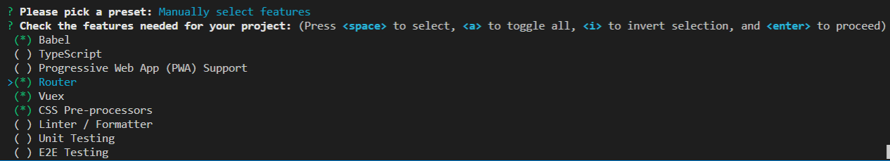
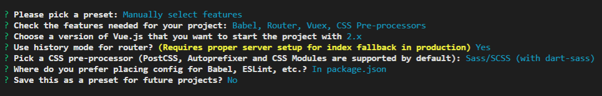
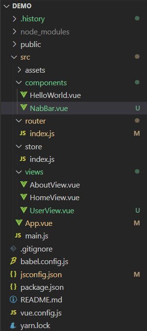
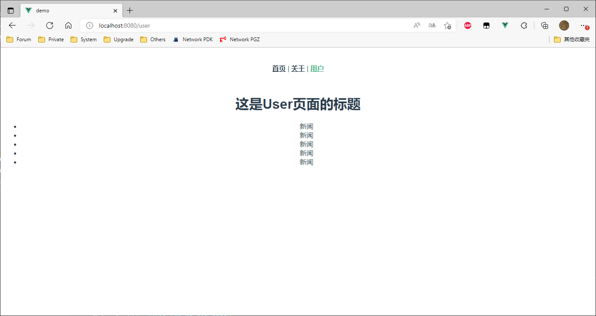

## 安装 Node.js 

[Download | Node.js (nodejs.org)](https://nodejs.org/en/download/)


## 安装Vue CLI脚手架的包：

**推荐使用 Yarn**

```bash
npm install -g @vue/cli
# OR
yarn global add @vue/cli
```

安装之后，你就可以在命令行中访问 `vue` 命令。你可以通过简单运行 `vue`，看看是否展示出了一份所有可用命令的帮助信息，来验证它是否安装成功。

你还可以用这个命令来检查其版本是否正确 (4.x)：

```bash
vue --version
vue -V
```


如果安装比较慢，可以把下载源切换成淘宝的源：

npm  对应的淘宝下载源设置：

```shell
//切换taobao镜像源
npm config set registry https://registry.npm.taobao.org/
// 查看下载源
npm config get registry
```

yarn  对应的淘宝下载源设置：

```shell
//切换taobao镜像源
yarn config set registry https://registry.npm.taobao.org/

// 查看下载源
yarn config get registry
```


## 创建项目

### 初始化项目

**vue create**

运行以下命令来创建一个新项目：

```bash
vue create hello-world
```


你会被提示选取一个 preset。你可以选默认的包含了基本的 Babel + ESLint 设置的 preset，也可以选“手动选
择特性”来选取需要的特性。



对于每一项的功能，此处做个简单描述：

​	TypeScript 														支持使用 TypeScript 书写源码。

​	Progressive Web App (PWA) Support			PWA支持

​	Router																路由

​	Vuex																	状态管理

​	CSS Pre-processors										  支持 CSS 预处理器。

​	Linter / Formatter											支持代码风格检查和格式化。

​	Unit Testing														支持单元测试。	

​	E2E Testing														支持 E2E 测试。

如果你决定手动选择特性，在操作提示的最后你可以选择将已选项保存为一个将来可复用的 preset


> ~/.vuerc
>
> 被保存的 preset 将会存在用户的 home 目录下一个名为 `.vuerc` 的 JSON 文件里。如果你想要修改被保存的 preset / 选项，可以编辑这个文件。
>
> 在项目创建的过程中，你也会被提示选择喜欢的包管理器或使用[淘宝 npm 镜像源](https://npm.taobao.org/)以更快地安装依赖。这些选择也将会存入 `~/.vuerc`。





### 基础 (1)

**启动项目**

```shell
🎉  Successfully created project demo.
👉  Get started with the following commands:

 $ cd demo
 $ yarn serve
```

> yarn serve 时执行的命令在  `[demo] \> package.json \> scripts` 里


**Vue UI**

```bash
perry@Perry-HonLap18 MINGW64 /d/perry/Documents/Vue
$ cd demo/

perry@Perry-HonLap18 MINGW64 /d/perry/Documents/Vue/demo (master)
$ vue ui
🚀  Starting GUI...
🌠  Ready on http://localhost:8000
```


#### 目录结构

```c
├─build                 // 保存一些webpack的初始化配置,项目构建
│ ├─build.js            // 生产环境构建
│ ├─check-version.js    // 检查npm、node版本
│ ├─vue-loader.conf.js  // webpack loader配置
│ ├─webpack.base.conf.js// webpack基础配置
│ ├─webpack.dev.conf.js // 开发环境配置，构建本地开发服务器
│ ├─webpack.prod.conf.js// 生产环境的配置
│
├─config                // config文件夹保存一些项目初始化的配置
│ ├─dev.env.js          // 开发环境的配置
│ ├─index.js            // 项目一些配置变量
│ ├─prod.env.js         // 生产环境的配置
│
├─dist                  // 打包后的项目
├─node_modules          // 依赖包
│
├─src                   // 源码目录
│ ├─assets              // 静态文件目录
│ ├─components          // 组件文件
│ ├─router              // 路由
│ ├─App.vue             // 是项目入口文件
│ ├─main.js             // 是项目的核心文件，入口
├─static                // 静态资源目录 
├─.babelrc              // Babel的配置文件
├─.editorconfig         // 代码规范配置文件
├─.gitignore            // git忽略配置文件
├─.postcssrc.js         // postcss插件配置文件
├─index.html            // 页面入口文件
├─package-lock.json     // 项目包管控文件
├─package.json          // 项目配置
└─README.md             // 项目说明书
```


#### 路由使用

Router/index.js 

```js
import Vue from 'vue'
// 1. 导入 vue-router
import VueRouter from 'vue-router'
import HomeView from '../views/HomeView.vue'
import UserView from '../views/UserView'

// 2. 将VueRouter挂载到Vue实例
Vue.use(VueRouter)

// 3. 路由映射表
const routes = [
  {
    path: '/',
    name: 'home',
    // 3.1 需要Line4
    component: HomeView
  },
  {
    path: '/about',
    name: 'about',

    // route level code-splitting
    // this generates a separate chunk (about.[hash].js) for this route
    // which is lazy-loaded when the route is visited.
    component: () => import(/* webpackChunkName: "about" */ '../views/AboutView.vue')
  },
  {
    // 3.2 需要Line5
    path: '/user',
    component: UserView
  }
]

// 4. 实例化VueRouter (需要Line3)
const router = new VueRouter({
  mode: 'history',
  base: process.env.BASE_URL,
  // 5. 配置映射表（数组，对象模式"[{}]"），但一般会在另一边单独设置，即Line11的const routes
  routes
})

// 7. 确认<4>中已赋给变量，配置导出默认路由
export default router

```

可以看到，我们有两种引入组件的方式。第一种比较能理解，第二种我们称之为“路由懒加载”。而这个懒加载中，有个 `webpackChunkName`，这东西我们称为魔法注释。

> 魔法注释的作用：
>
> webpack在打包的时候，对异步引入的库代码（lodash）进行代码分割时，为分割后的代码块取得名字。
>
> Vue中运用import的懒加载语句以及webpack的魔法注释，在项目进行webpack打包的时候，对不同模块进行代码分割，在首屏加载时，用到哪个模块再加载哪个模块，实现懒加载进行页面的优化。
>
> 当你 `npm run build` 之后，生成的js文件中，就能看到以魔法注释定义的js文件名。


#### 实例项目



创建组件：components/NavBar.vue

```vue
<!-- dev -->
<template>
    <!-- div>ul>li{新闻}*5 -->
    <div>
        <ul>
            <li>新闻</li>
            <li>新闻</li>
            <li>新闻</li>
            <li>新闻</li>
            <li>新闻</li>
        </ul>
    </div>
</template>

<script>
export default {

}
</script>

<style>
</style>
```


添加路由：router/index.js

```js
import Vue from 'vue'
// 1. 导入 vue-router
import VueRouter from 'vue-router'
import HomeView from '../views/HomeView.vue'
import UserView from '../views/UserView'

// 2. 将VueRouter挂载到Vue实例
Vue.use(VueRouter)

// 3. 路由映射表
const routes = [
  {
    path: '/',
    name: 'home',
    // 3.1 需要Line4
    component: HomeView
  },
  {
    path: '/about',
    name: 'about',

    // route level code-splitting
    // this generates a separate chunk (about.[hash].js) for this route
    // which is lazy-loaded when the route is visited.
    component: () => import(/* webpackChunkName: "about" */ '../views/AboutView.vue')
  },
  {
    // 3.2 需要Line5
    path: '/user',
    component: UserView
  }
]

// 4. 实例化VueRouter (需要Line3)
const router = new VueRouter({
  mode: 'history',
  base: process.env.BASE_URL,
  // 5. 配置映射表（数组，对象模式"[{}]"），但一般会在另一边单独设置，即Line11的const routes
  routes
})

// 7. 确认<4>中已赋给变量，配置导出默认路由
export default router
```


添加页面模板：views/UserView.vue

```vue
<!-- 快速创建：dev -->
<template>
  <div class="user">
    <h1>这是User页面的标题</h1>
      <!-- 3.2 对应components/NavBar.vue -->
    <Navbar></Navbar>
  </div>
</template>

<script>
// 1. 导入components里的组件
import Navbar from "../components/NabBar.vue"
export default {
  components: {
    // 组件名 : 对应的组件值
    // 2. "Navbar": NavBar (键值一样的 ES6中可以省略，写成以下效果)
    Navbar
    // 3.1 最后到页面中导入(Line5)
  }
}
</script>

<style>
</style>
```


修改主页 App.vue

```vue
<template>
  <div id="app">
    <nav>
      <router-link to="/">首页</router-link> |
      <router-link to="/about">关于</router-link> |
      <!-- 新增内容： -->
      <router-link to="/user">用户</router-link>
    </nav>
    <router-view/>
  </div>
</template>

<style lang="scss">
#app {
  font-family: Avenir, Helvetica, Arial, sans-serif;
  -webkit-font-smoothing: antialiased;
  -moz-osx-font-smoothing: grayscale;
  text-align: center;
  color: #2c3e50;
}

nav {
  padding: 30px;

  a {
    font-weight: bold;
    color: #2c3e50;

    &.router-link-exact-active {
      color: #42b983;
    }
  }
}
</style>
```


修bug：../jsconfig.json

```json
{
  "compilerOptions": {
    "target": "es5",
    "module": "esnext",
    "baseUrl": "./",
    "moduleResolution": "node",
    // 加入这句，App.vue 中才不会报路由错
    "jsx": "preserve",
    "paths": {
      "@/*": [
        "src/*"
      ]
    },
    "lib": [
      "esnext",
      "dom",
      "dom.iterable",
      "scripthost"
    ]
  }
}
```




