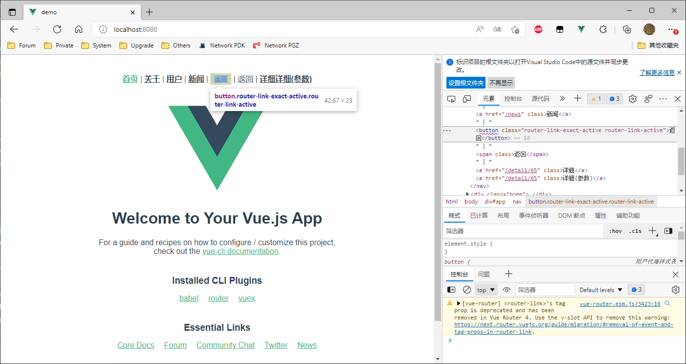
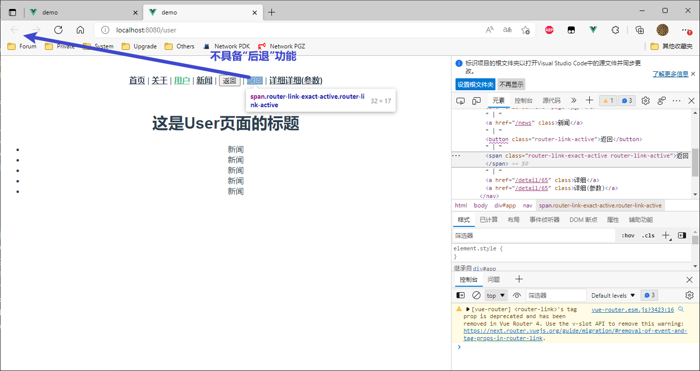
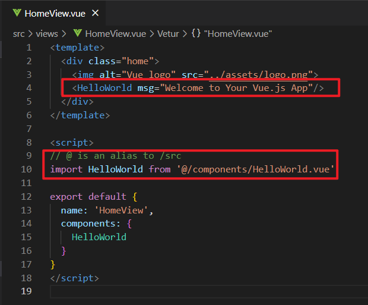
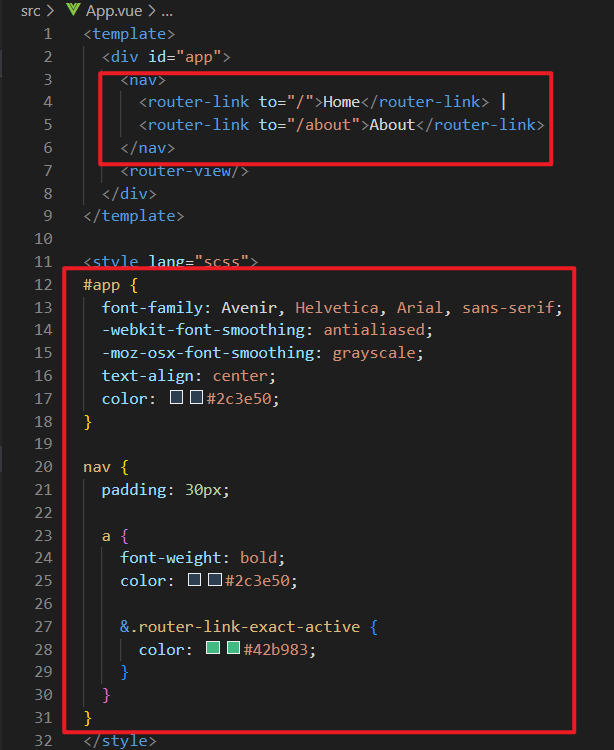
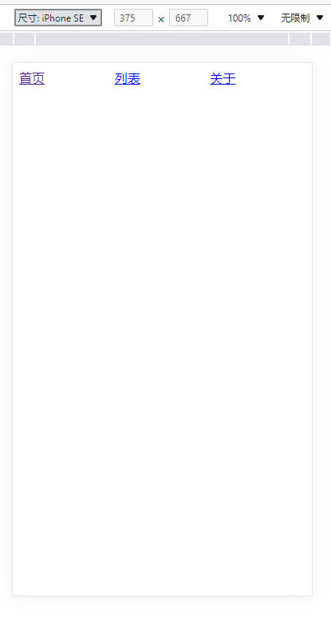
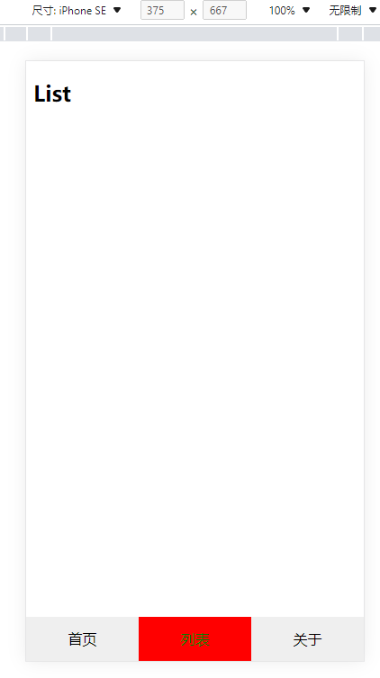
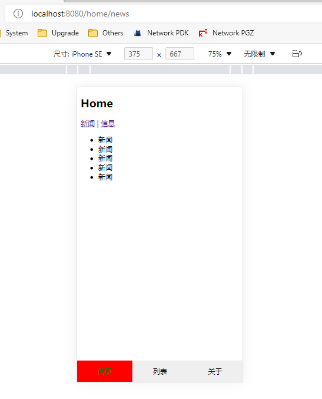

## 懒加载 (推荐使用)

当一个vue项目很大的时候,对于一些“暂时”用不到的组件,我们可以不进行加载,等到用到次组件时再加载。这样可以优化spa应用首次加载白屏情况,也给用户更好的体验。这就是vue路由懒加载。

懒加载的方式

```js
// 方式一: 结合Vue的异步组件和Webpack的代码分析（基本不用）
const User = resolve => { require.ensure(['@/views/User.vue'], () => { resolve(require('@/views/User.vue')) }) };

// 方式二: AMD写法（基本不用）
const User = resolve => require(['@/views/User.vue'], resolve);

// 方式三: 在ES6中, 我们可以有更加简单的写法来组织Vue异步组件和Webpack的代码分割.（常用方法）
const Home = () => import(/* webpackChunkName: "user" */ '../views/User.vue')
```


## 路由模式

vue中的路由默认时hash模式，使用 URL 的 hash 来模拟一个完整的 URL，于是当 URL 改变时，页面不会重新加载。如果不想要 hash的模式，我们可以用路由的history 模式，这种模式充分利用 `history.pushState` API 来完成 URL 跳转而无须重新加载页面。

> hash 虽然出现URL中，但不会被包含在HTTP请求中，对后端完全没有影响，因此改变hash不会重新加载页面。
>
> history模式提供了对历史记录进行修改的功能，只是当它们执行修改时，虽然改变了当前的URL，但你浏览器不会立即向后端发送请求。history模式，会出现404 的情况，需要后台配置。
>
> 
>
> 404 错误：
>
> 1、hash模式下，仅hash符号之前的内容会被包含在请求中，如 http://www.xxx.com, 因此对于后端来说，即使没有做到对路由的全覆盖，也不会返回404错误；
>
> 2、history模式下，前端的url必须和实际向后端发起请求的url 一致，如http://www.xxx.com/book/id 。如果后端缺少对/book/id 的路由处理，将返回404错误。

## 路由跳转方式

我们可以使用 `router-link` 标签来实现跳转，如：

```vue
<div id="nav">
  <router-link to="/">Home</router-link> |
  <router-link to="/user">User</router-link>
</div>
<router-view/>
```

然后通过 `router-view` 来显示页面。`router-link` 最终会被渲染为a标签。

`router-link` 默认会被解析为a标签，如果想让它转换成其他的标签，就需要添加tag属性：

```vue
<router-link tag="li" to="/user">User</router-link>
<!-- 此时，`router-link` 就被解析为li标签。 -->
```

实例：

```html
<!-- <router-link> 相当于 <a>，用于跳转 -->
<router-link to="/">首页</router-link> |
<router-link to="/about">关于</router-link> |
<!-- 新增内容： -->
<router-link to="/user">用户</router-link> |
<router-link to="/news">新闻</router-link> |
<!-- router-link tag属性可以修改编译后的标签 -->
<router-link to="../" tag="button">返回</router-link> |
<!-- router-link replace属性意为"替换(覆盖之前的路径)" -->
```




### replace 属性 

指 “替换” ，即”堆栈“，如在刚打开网页时点击具有 `replace` 属性的标签，则无法使用浏览器的 “后退” 功能

> 默认的都为 `push()` 方法，即 ”堆加“

```html
<!-- <router-link> 相当于 <a>，用于跳转 -->
<router-link to="/">首页</router-link> |
<router-link to="/about">关于</router-link> |
<!-- 新增内容： -->
<router-link to="/user">用户</router-link> |
<router-link to="/news">新闻</router-link> |
<!-- router-link tag属性可以修改编译后的标签 -->
<router-link to="../" tag="button">返回</router-link> |
<!-- router-link replace属性意为"替换(覆盖之前的路径)" -->
<!-- 与上面push()追加的不一样，replace属性使浏览器无法后退回上一个页面 -->
<router-link to="/user" tag="span" replace>返回</router-link> |
```




## 程式导航

我们还有别的方式：

```js
// 简写
this.$router.push('/user')

// 完整的写法
this.$router.push({path: '/user'})
```

我们除了push，还有go、forward、back这几个来触发不同情况的跳转。


实例：Vue.js

```html
<template>
  <div id="app">
    <div id="nav">
      <button @click="userClick">user</button>
      <button @click="aboutClick">about</button>
      <button @click="goClick">go-1</button>
      <button @click="go1Click">go 1</button>
    </div>
        <router-view />
  </div>
</template>
```

```html
<script>
export default {
  data() {
    return {
      id1: 65,
      id2: 66,
      list: [],
    };
  },
  methods:{
    userClick(){
      // this.$router.push('/user')
      this.$router.replace('/user')
    },
    aboutClick(){
      // this.$router.push('/about')
      this.$router.replace('/about')

    },
    goClick(){
      // 返回上一页
      this.$router.go(-1)
    },
    go1Click(){
      this.$router.go(1)
    },
  }
</script>
```


## 路由命名

当我们给路由命名后：

```js
const router = new VueRouter({
  routes: [
    {
      path: '/user/:userId',
      name: 'User',			// 对路由进行命名
      component: () => import(/* webpackChunkName: "user" */ '../views/User.vue')
    }
  ]
})
```

携带参数：

```js
router.push({ name: 'user', params: { userId: 123 }})
```

而在User组件中，可以通过 `$route.params.userId` 获取到参数：

```vue
<div>
  用户页{{$route.params.userId}}
</div>
```


## query传参

使用params传参，得到的结果与使用query传参得到的结果有以下区别：

```js
this.$router.push({name: "User", params: {userId: 123}})    // http://localhost:8081/user/123
this.$router.push({name: "User", query: {userId: 123}})       // http://localhost:8081/?userId=123
```

<font color="red">编程式导航中，使用name进行路径跳转，携带参数可以通过params和query，其中query会将参数携带在导航路径上，而使用path进行路径跳转，无法携带params，只能携带query。</font>


params参数传参写法相当于在路径**直接添加**：

```js
//App.vue中：
this.$router.push('/user/12');

// router/index.js中：
path: '/user/:userId',
    
// User.vue中：
created(){
    console.log(this.$route.params.userId);    // 获取到用户id12
}
```


实例：

```js
// router/index.js
import Vue from 'vue'
import VueRouter from 'vue-router'
import Home from '../views/Home.vue'

const News = () => import('../views/News')


Vue.use(VueRouter)
const routes = [
  {
    path: '/',
    name: 'Home',
    component: Home
  },
  {
    path: '/about',
    name: 'About',
    component: () => import(/* webpackChunkName: "about" */ '../views/About.vue')
  },
  { 
    path: '/news',
    component:News
  },
  {
    path:'/user',
    component:() => import('../views/User')
  },
  {
    // path:'/detail/65',
    // 动态路由
    path:'/detail/:itemId',
    component:() => import('../views/Detail')
  },
  {
    path: '/profeil',
    component:() => import('../views/Profeil')
  }
]
const router = new VueRouter({
  mode: 'history',
  base: process.env.BASE_URL,
  routes
})

export default router
```

```vue
// App.vue
<template>
  <div id="app">
    <div id="nav">
      <!-- 参数 -->
      <router-link :to="'/detail/' + id1">手机</router-link> |
      <router-link :to="'/detail/' + id2">花洒</router-link> | 
      <router-link :to="{path: '/detail', query: {userId: 123}}">111</router-link> |
      <router-link :to="{path: '/profeil', query: {name: 'zhangsan', age: 25}}">个人中心</router-link> 
    </div>
    <router-view />
  </div>
</template>

<script>
export default {
  data() {
    return {
      id1: 65,
      id2: 66,
      list: [],
    };
  },
```

```vue
// Detail.vue
<template>
  <div>
    <h2>详情页</h2>
    <!-- 获取商品的详细数据，先回去到商品的id -->
    {{getItemId}}
  </div>
</template>

<script>
export default {
  data () {
    return {
      itemId:null
    }
  }
  computed:{
    getItemId(){
      let itemId = this.$route.params.itemId;
      this.$data.itemId = itemId
      return itemId;
    }
  }
}
</script>
<style></style>
```


## 重定向

```js
// router/index.js
const routes = [
  {
    path: '/',
    redirect: '/home'		// 这就是路由的重定向，重新定义跳转路径
  },
  {
    path: '/home',    // 改成这个之后，原来的/就没有对用的组件了
    component: () => import('@/views/Home.vue')
  },
  
  ...  ...
  {
    path: '*',		// 匹配所有剩余的路由，只要不是上面提及的页面，全部跳转到404页面
    component: () => import('@/views/Page404.vue')
  }
]
```


## 实例：底部Tab栏

创建项目；

- `jsconfig.json`中的`compilerOptions`配置项里面添加` "jsx": "preserve"` 。

```js
  "compilerOptions": {
    ...
    "jsx": "preserve",
    ...
}
```

- 删除components/HelloWorld.vue

- 删除views/HomeView.vue中的HelloWorld



- App.vue 中删除无用代码



创建 views/List.vue 用来做底栏

```vue
<template>
  <div>
    <h2>List</h2>
  </div>
</template>

<script>
export default {

}
</script>

<style>

</style>
```

- src/router/index.js 配置路由

```js
import Vue from 'vue'
import VueRouter from 'vue-router'
import HomeView from '../views/HomeView.vue'

Vue.use(VueRouter)

const routes = [
  {
    path: '/',
    // name: 'home',
    // component: HomeView
    // 根路径一般进行重定向：
    redirect: '/home'
  },
  // 设置home的路由
  {
    path: '/home',
    component: HomeView
  },
  {
    path: '/about',
    name: 'about',
    // route level code-splitting
    // this generates a separate chunk (about.[hash].js) for this route
    // which is lazy-loaded when the route is visited.
    component: () => import(/* webpackChunkName: "about" */ '../views/AboutView.vue')
  },
  // 配置路由
  {
    path: '/list',
    component: () => import('../views/List.vue')
  }
]

const router = new VueRouter({
  mode: 'history',
  base: process.env.BASE_URL,
  routes
})

export default router
```

- 编写 TabBar 组件

```vue
<template>
    <div id="tabbar">
        <!-- 因为要设置css，所以再加一层div -->
        <div class="tabbar-box">
            <router-link to="/home">首页</router-link>
            <router-link to="/list">列表</router-link>
            <router-link to="/about">关于</router-link>
        </div>
    </div>
</template>

<script>
export default {

}
</script>

<!-- 使用scss样式编写(可嵌套) -->
<style lang="scss">
#tabbar{
    .tarbar-box{
        display: flex;
        .item{
            flex: 1;    // 指每个容器占一份（即可用空间平均分配）
        }
    }
}
</style>
```

- 修改 App.vue

```vue
<template>
  <div id="app">
    <router-view />
    <!-- 因为导航栏要显示在下面，所以在下面写 -->
    <!-- 3. 使用 -->
    <Tabbar></Tabbar>

  </div>
</template>

<script>
// 1.导入
import Tabbar from './components/Tabbar.vue'
export default {
  // 2.定义（绑定）
  components: {
    Tabbar
  }
}
</script>

<style lang="scss">
</style>
```

此时效果：



- 修改 src/views/HomeView.vue

```vue
<template>
  <div class="home">
    <h2>Home</h2>
  </div>
</template>

<script>

export default {
  name: 'HomeView',
  components: {
  }
}
</script>
```

- 修改 TabBar 组件 样式表

```vue
<template>
    <div id="tabbar">
        <!-- 因为要设置css，所以再加一层div -->
        <div class="tabbar-box">
            <router-link class="item" to="/home">首页</router-link>
            <router-link class="item" to="/list">列表</router-link>
            <router-link class="item" to="/about">关于</router-link>
        </div>
    </div>
</template>

<script>
export default {

}
</script>

<!-- 使用scss样式编写(可嵌套) -->
<style lang="scss">
#tabbar{
    .tabbar-box{
        display: flex;
        position: fixed;
        left: 0;
        right: 0;
        bottom: 0;
        text-align: center;
        height: 49px;
        line-height: 49px;
        background-color: #efefef;
        .item{
            // 指每个容器占一份（即可用空间平均分配）
            flex: 1;
            text-decoration: none;
            color: #000
        }
        // 配置当前页面（这是自带的class）
        // .router-link-exact-active{
        //     color: red;
        // }
        // 3. 定义样式
        .active{
            color:green;
            background-color: #f00;
        }
    }
}
</style>
```

PS: 修改路由：

```js
...
const router = new VueRouter({
  mode: 'history',
  base: process.env.BASE_URL,
  routes,
  // 1. 路由里也可以配置当前页面的class
  linkActiveClass: 'active'
  // 2. 然后到Tabbar.vue中定义样式
})
...
```




## 路由嵌套

在 Home.vue 中加入新闻、消息模块，并添加router-view显示区域

```vue
<template>
  <div class="home">
    <h2>Home</h2>
    <router-link>新闻</router-link>
    <router-link>信息</router-link>
    <router-view></router-view>
  </div>
</template>

<script>

export default {
  name: 'HomeView',
  components: {
  }
}
</script>
```


在 components/Home 中新建 Home.vue 和 Message.vue

```vue
<template>
  <div>
    <ul>
        <li>新闻</li>
        <li>新闻</li>
        <li>新闻</li>
        <li>新闻</li>
        <li>新闻</li>
    </ul>
  </div>
</template>

<script>
export default {

}
</script>

<style>

</style>
```

```vue
<template>
  <div>
    <ul>
        <li>消息</li>
        <li>消息</li>
        <li>消息</li>
        <li>消息</li>
        <li>消息</li>
    </ul>
  </div>
</template>

<script>
export default {

}
</script>

<style>

</style>
```

修改 HomeView.vue

```vue
<template>
  <div class="home">
    <h2>Home</h2>
    <!-- 注意 to 路径 -->
    <router-link to="/home/news">新闻</router-link> |
    <router-link to="/home/message">信息</router-link>
    <router-view></router-view>
  </div>
</template>

<script>

export default {
  name: 'HomeView',
  components: {
  }
}
</script>
```

在 router/index.js 的 home路由中设置子路由

```js
// 设置home的路由
{
  path: '/home',
  component: HomeView,
  // 设置子路由，让News和Message显示在Home下面
  children: [
    // 添加根路径，让子路由自动显示“News”
    { path: '', redirect: 'news' },
    // 注意 path 不需要 "/"
    { path: 'news', component: News },
    { path: 'message', component: () => import('../components/Home/Message.vue') }
  ]
},
```

效果：



*：此项目在Vuex中扔继续使用


