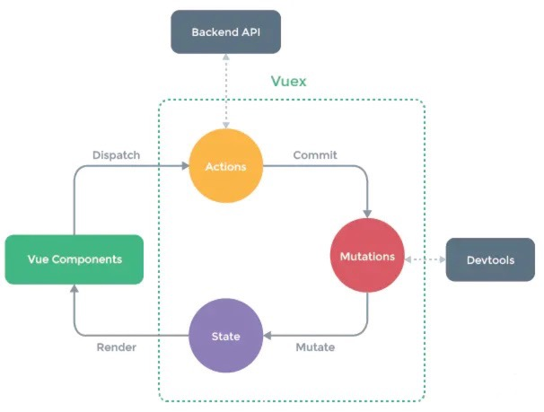
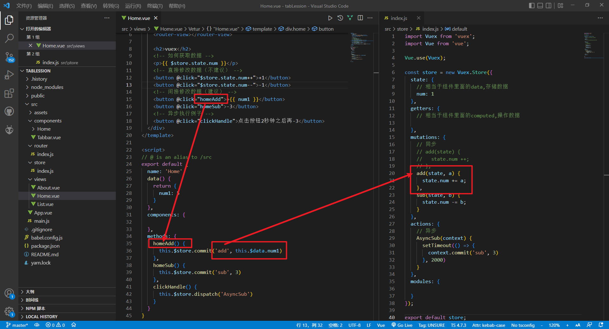
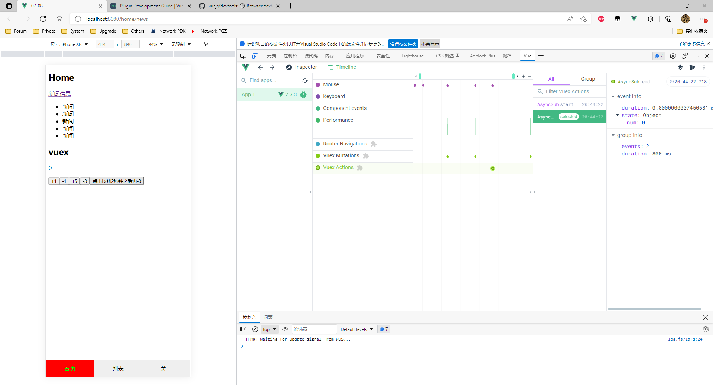
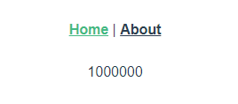

官方定义：

> Vuex 是一个专为 Vue.js 应用程序开发的**状态管理模式**。它采用集中式存储管理应用的所有组件的状态，并以相应的规则保证状态以一种可预测的方式发生变化。

说得直白点，vuex就是vue.js中管理数据状态的一个库，通过创建一个集中的数据存储，供程序中所有组件访问。 

一个数据只要放在了vuex中，当前项目**所有的组件都可以直接访问这个数据**。

普通的父传子和子传父，或是兄弟组件之间的互传值，都是两个组件之间的数据连接，但如果数据需要多组件共享，并且数据量庞大，那么就不适宜用中央事件总线来解决。此时，我们需要一个更加强大的，能够维护庞大数据的东西，它就是vuex，我们称之为：状态管理。





> 如果您不打算开发大型单页应用，使用 Vuex 可能是繁琐冗余的。确实是如此——如果您的应用够简单，您最好不要使用 Vuex。一个简单的 [store 模式](https://cn.vuejs.org/v2/guide/state-management.html#简单状态管理起步使用) 就足够您所需了。但是，如果您需要构建一个中大型单页应用，您很可能会考虑如何更好地在组件外部管理状态，Vuex 将会成为自然而然的选择。


## 常用方法介绍：

```js
import Vue from 'vue'
import Vuex from 'vuex'

Vue.use(Vuex)

export default new Vuex.Store({
  state: {      // 相当于组件里的data，用来存数据，只不过这个数据是所有组件公用的。
  },
  getters: {    // 相当于组件里的computed，用于操作数据 (计算)；getters的返回值会根据它的依赖被缓存起来，且只有当它的依赖值发生了改变才会被重新计算。
  },
  mutations: {  // 同步操作方法（类似单线程，指代码要一行一行往下执行，上一个执行完后才能执行下一个）
  },
  actions: {    // 异步操作方法（类似多线程）
  },
  modules: {
  }
})
```


## state, mutations, actions 实例：

**\*：在 Tabbar 项目中继续进行**


修改 Home.vue

```vue
<template>
  <div class="home">
    <h2>Home</h2>
    <router-link to="/home/news">新闻</router-link>
    <router-link to="/home/message">信息</router-link>
    <router-view></router-view>

    <h2>vuex</h2>
    <!-- 如何获取数据 -->
    <p>{{ $store.state.num }}</p>
    <!-- 直接修改数据（不建议） -->
    <button @click="$store.state.num++">+1</button>
    <button @click="$store.state.num--">-1</button>
    <!-- 间接修改数据（建议） -->
    <button @click="homeAdd">+{{ num1 }}</button>
    <button @click="homeSub">-3</button>
    <!-- 异步执行例子 -->
    <button @click="clickHandle">点击按钮2秒钟之后再-3</button>
  </div>
</template>

<script>
// @ is an alias to /src
export default {
  name: 'Home',
  data() {
    return {
      num1: 5
    }
  },
  components: {

  },
  methods: {
    homeAdd() {
      this.$store.commit('add', this.$data.num1)
    },
    homeSub() {
      this.$store.commit('sub', 3)
    },
    clickHandle() {
      this.$store.dispatch('AsyncSub')
    }
  }
}
</script>
```

```js
import Vuex from 'vuex';
import Vue from 'vue';

Vue.use(Vuex);

const store = new Vuex.Store({
  state: {
    // 相当于组件里面的data,存储数据
    num: 1
  },
  getters: {
    // 相当于组件里面的computed,操作数据

  },
  mutations: {
    // 同步
    // add(state) {
    //   state.num ++;
    // },
    add(state, a) {
      state.num += a;
    },
    sub(state, b) {
      state.num -= b;
    }
  },
  actions: {
    // 异步
    AsyncSub(context) {
      setTimeout(() => {
        context.commit('sub', 3)
      }, 2000)
    }
  },
  modules: {

  }
});

export default store;
```




**为什么要这样“间接”修改数据**

使得变量可控，有历史查看。




## getters 实例：

App.vue

```vue
<template>
  <div id="app">
    <nav>
      <router-link to="/">Home</router-link> |
      <router-link to="/about">About</router-link>
    </nav>
    <router-view/>
  </div>
</template>

<style lang="scss">
#app {
  font-family: Avenir, Helvetica, Arial, sans-serif;
  -webkit-font-smoothing: antialiased;
  -moz-osx-font-smoothing: grayscale;
  text-align: center;
  color: #2c3e50;
}

nav {
  padding: 30px;

  a {
    font-weight: bold;
    color: #2c3e50;

    &.router-link-exact-active {
      color: #42b983;
    }
  }
}
</style>
```


/store/index.js

```js
import Vue from 'vue'
import Vuex from 'vuex'
import state from './state'

Vue.use(Vuex)

export default new Vuex.Store({
  state: {
    num: 1
  },
  getters: {
    getterNumFun(state){
      return (state.num*1000) * (state.num*1000);
    }
  },
  mutations: {
  },
  actions: {
  },
  modules: {
  }
})
```


HomeView.vue

```vue
<template>
  <div class="home">
      {{getNum}}
      <!-- <button @click="fun">fun</button> -->
  </div>
</template>

<script>
// @ is an alias to /src
import HelloWorld from '@/components/HelloWorld.vue'

export default {
  name: 'HomeView',
  components: {
    HelloWorld
  },
  computed:{
    getNum(){
      // return (this.$store.state.num * 100) * (this.$store.state.num * 100)
      return this.$store.getters.getterNumFun
    }
  },
  methods: {
    // getNum(){
    //   return (this.$store.state.num * 100) * (this.$store.state.num * 100)
    // }
  },
}
</script>
```




