## Low

### 源代码

```php
<?php

$headerCSP = "Content-Security-Policy: script-src 'self' https://pastebin.com hastebin.com www.toptal.com example.com code.jquery.com https://ssl.google-analytics.com ;"; // allows js from self, pastebin.com, hastebin.com, jquery and google analytics.

header($headerCSP);

# These might work if you can't create your own for some reason
# https://pastebin.com/raw/R570EE00
# https://www.toptal.com/developers/hastebin/raw/cezaruzeka

?>
<?php
if (isset ($_POST['include'])) {
$page[ 'body' ] .= "
    <script src='" . $_POST['include'] . "'></script>
";
}
$page[ 'body' ] .= '
<form name="csp" method="POST">
    <p>You can include scripts from external sources, examine the Content Security Policy and enter a URL to include here:</p>
    <input size="50" type="text" name="include" value="" id="include" />
    <input type="submit" value="Include" />
</form>
';
```


### 代码分析

对 HTTP 头定义了 CSP 标签，从而定义了可以接受外部 JavaScript 资源的白名单

> https://pastebin.com 
>
> hastebin.com 
>
> www.toptal.com 
>
> example.com 
>
> code.jquery.com 
>
> https://ssl.google-analytics.com


### 漏洞利用

打开 https://pastebin.com  看看，发现是个分享文本内容的网站；

尝试在文本内容中嵌入一段 JS 代码

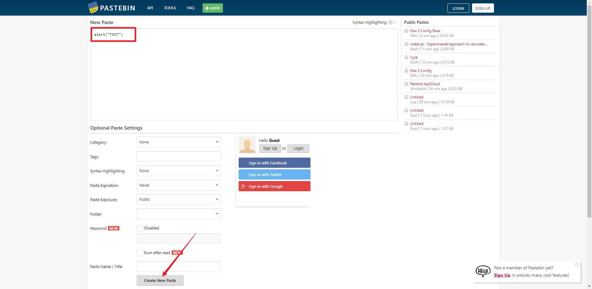

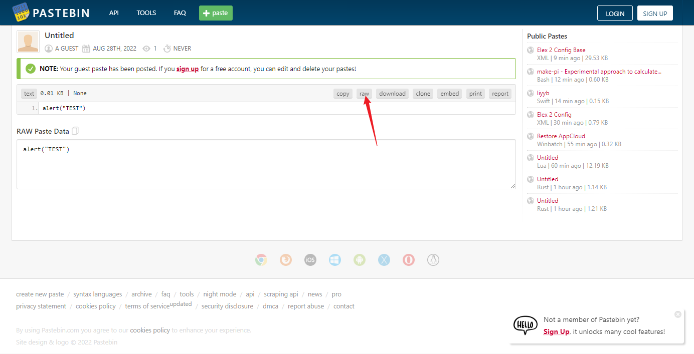

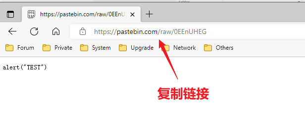

返回DVWA 粘贴并包含，即可弹窗

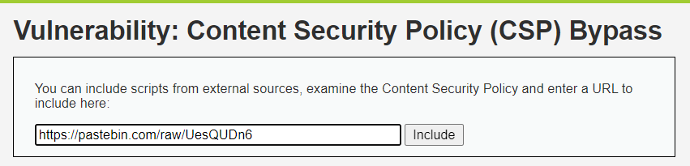

注：可见其返回200，但是他不弹窗啊！！

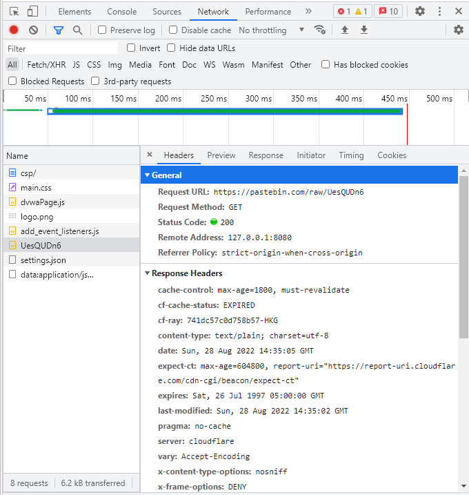


看了下机场的航班发送日志，他上了飞往 HK 的航班，但一样不弹。~~（不会吧不会吧 有人连某些地方说的网络环境问题都信）~~

然后去看了眼 Console，

有意思 JS 被拒绝了！

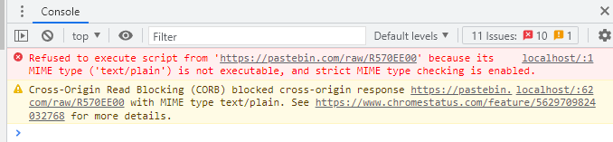


那直接换个网站吧。。

来白名单里的另一个 [链接](hastebin.com) 创一个，然后保存，切换到仅文本

> PS：各位检票员请记得让他上飞机。

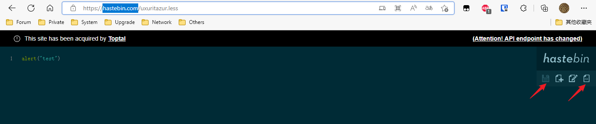

拿链接：https://hastebin.com/raw/uxuritazur

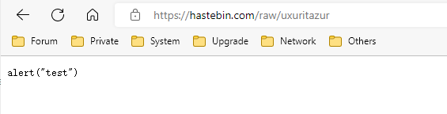


粘贴到 DVWA 并 include，搞定

> PS：各位检票员请记得让他上飞机。

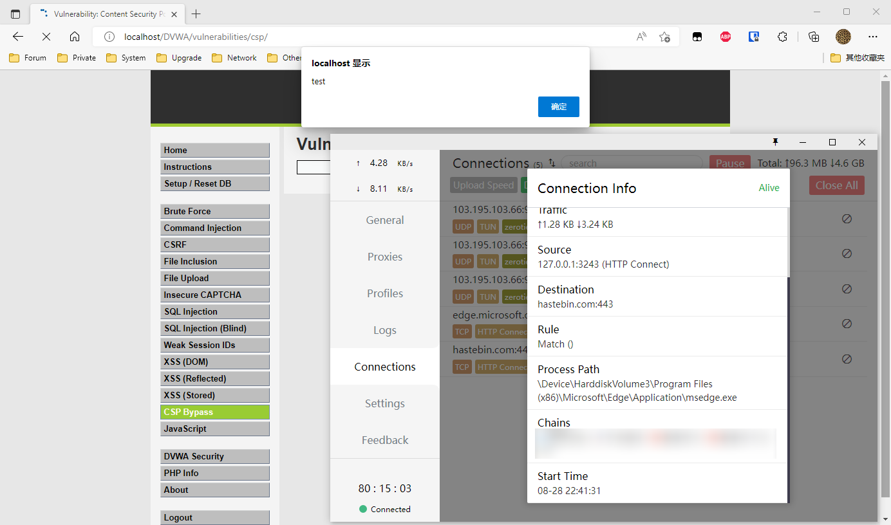


## Medium

### 源代码

```php
<?php

$headerCSP = "Content-Security-Policy: script-src 'self' 'unsafe-inline' 'nonce-TmV2ZXIgZ29pbmcgdG8gZ2l2ZSB5b3UgdXA=';";

header($headerCSP);

// Disable XSS protections so that inline alert boxes will work
header ("X-XSS-Protection: 0");

# <script nonce="TmV2ZXIgZ29pbmcgdG8gZ2l2ZSB5b3UgdXA=">alert(1)</script>

?>
<?php
if (isset ($_POST['include'])) {
$page[ 'body' ] .= "
    " . $_POST['include'] . "
";
}
$page[ 'body' ] .= '
<form name="csp" method="POST">
    <p>Whatever you enter here gets dropped directly into the page, see if you can get an alert box to pop up.</p>
    <input size="50" type="text" name="include" value="" id="include" />
    <input type="submit" value="Include" />
</form>
';
```


### 代码分析

源码中nonce参数无任何过滤，注入时直接令 nonce 为设定好的值即可。


### 漏洞利用

源码里注释居然就有一个，试一下，成功：

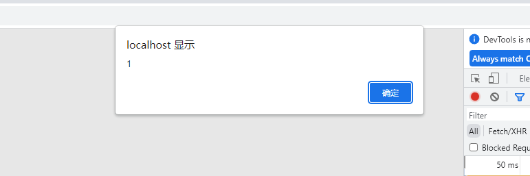


试一下改改内容，成功

```html
<script nonce="TmV2ZXIgZ29pbmcgdG8gZ2l2ZSB5b3UgdXA=" > alert('TEST')</script>
```

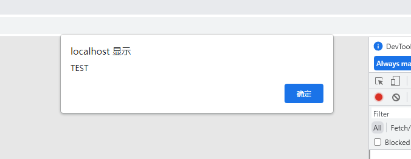


## High

### 源代码

```php
<?php
$headerCSP = "Content-Security-Policy: script-src 'self';";

header($headerCSP);

?>
<?php
if (isset ($_POST['include'])) {
$page[ 'body' ] .= "
    " . $_POST['include'] . "
";
}
$page[ 'body' ] .= '
<form name="csp" method="POST">
    <p>The page makes a call to ' . DVWA_WEB_PAGE_TO_ROOT . '/vulnerabilities/csp/source/jsonp.php to load some code. Modify that page to run your own code.</p>
    <p>1+2+3+4+5=<span id="answer"></span></p>
    <input type="button" id="solve" value="Solve the sum" />
</form>

<script src="source/high.js"></script>
';
```

```js
// high.js
function clickButton() {
    var s = document.createElement("script");
    s.src = "source/jsonp.php?callback=solveSum";
    document.body.appendChild(s);
}

function solveSum(obj) {
	if ("answer" in obj) {
		document.getElementById("answer").innerHTML = obj['answer'];
	}
}

var solve_button = document.getElementById ("solve");

if (solve_button) {
	solve_button.addEventListener("click", function() {
		clickButton();
	});
}
```


### 代码分析

这个级别没有输入框了。

先看一下 CSP 头, 发现只有 `script-src 'self';`，只允许本界面加载的 javascript 执行。

然后研究了一下这个点击显示答案的逻辑 (逻辑在 `source/high.js`里），

大致如下: 

1. 点击按钮
2. js 生成一个 script 标签 (src 指向 source/jsonp.php?callback=solveNum) , 并把它加入到 DOM 中
3. js 中定义了一个 solveNum 的函数
4. script 标签会把远程加载的 `solveSum({"answer":"15"})` 当作 js 代码执行


### 漏洞利用

看着好像 除了改JS没什么头绪，那看看jsonp.php那？好像没有任何过滤，试试用 HackBar include 一下，成了

```html
include=<script src="source/jsonp.php?callback=alert('TEST');"></script>
```

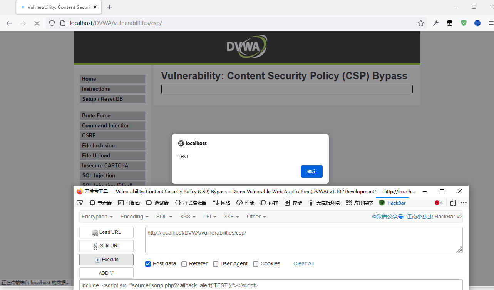

## Impossible

### 源代码

```php
<?php

$headerCSP = "Content-Security-Policy: script-src 'self';";

header($headerCSP);

?>
<?php
if (isset ($_POST['include'])) {
$page[ 'body' ] .= "
    " . $_POST['include'] . "
";
}
$page[ 'body' ] .= '
<form name="csp" method="POST">
    <p>Unlike the high level, this does a JSONP call but does not use a callback, instead it hardcodes the function to call.</p><p>The CSP settings only allow external JavaScript on the local server and no inline code.</p>
    <p>1+2+3+4+5=<span id="answer"></span></p>
    <input type="button" id="solve" value="Solve the sum" />
</form>

<script src="source/impossible.js"></script>
';

vulnerabilities/csp/source/impossible.js
function clickButton() {
    var s = document.createElement("script");
    s.src = "source/jsonp_impossible.php";
    document.body.appendChild(s);
}

function solveSum(obj) {
    if ("answer" in obj) {
        document.getElementById("answer").innerHTML = obj['answer'];
    }
}

var solve_button = document.getElementById ("solve");

if (solve_button) {
    solve_button.addEventListener("click", function() {
        clickButton();
    });
}
```


### 代码分析

修复了 callback 参数可被控制问题，从根源杜绝了Bug。

对比：

> high level：
>
> ```javascript
> s.src = "source/jsonp.php?callback=solveSum";
> ```
>
> impossible level：
>
> ```javascript
> s.src = "source/jsonp_impossible.php";
> ```


