## **准备**

**工具**

- OWASP

- kali 2022.1


**步骤**

启动 OWASP，并进入DVWA，进入：admin、password

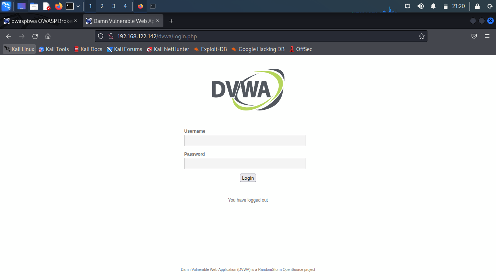


## Low

确认安全等级为low

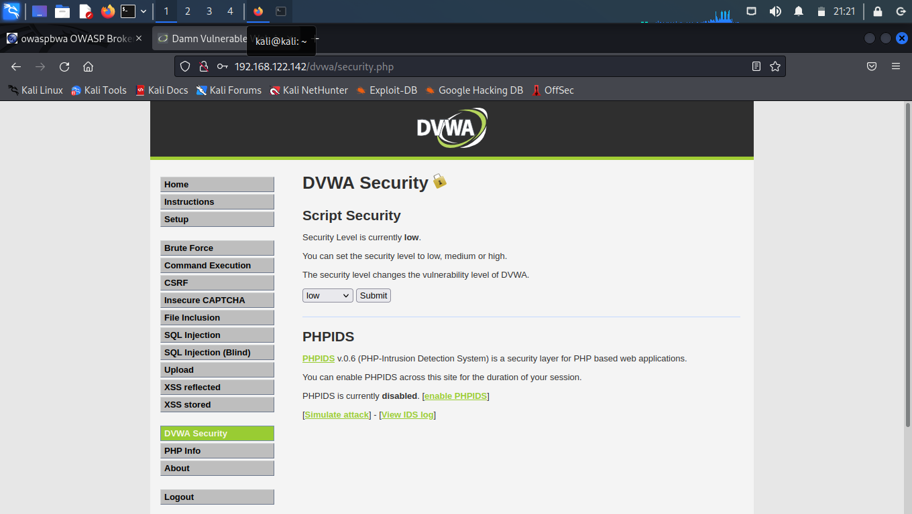


观察源代码

```php
<?php

if( isset( $_GET['Login'] ) ) {

    $user = $_GET['username'];
    
    $pass = $_GET['password'];
    $pass = md5($pass);

    $qry = "SELECT * FROM `users` WHERE user='$user' AND password='$pass';";
    $result = mysql_query( $qry ) or die( '<pre>' . mysql_error() . '</pre>' );

    if( $result && mysql_num_rows( $result ) == 1 ) {
        // Get users details
        $i=0; // Bug fix.
        $avatar = mysql_result( $result, $i, "avatar" );

        // Login Successful
        echo "<p>Welcome to the password protected area " . $user . "</p>";
        echo '';
    } else {
        //Login failed
        echo "<pre><br>Username and/or password incorrect.</pre>";
    }

    mysql_close();
}

?>
```


方法一：尝试SQL注入：成功通过


方法二：

随便输点东西，然后将数据包发送到 Intruder

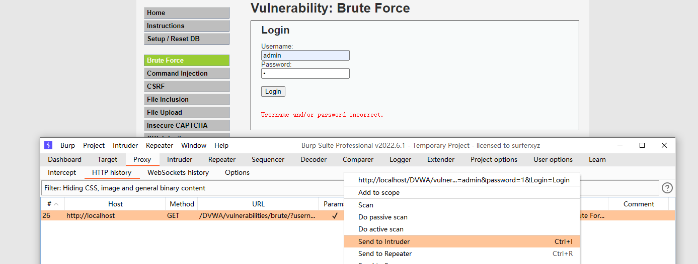

标记可爆破的地方为变量

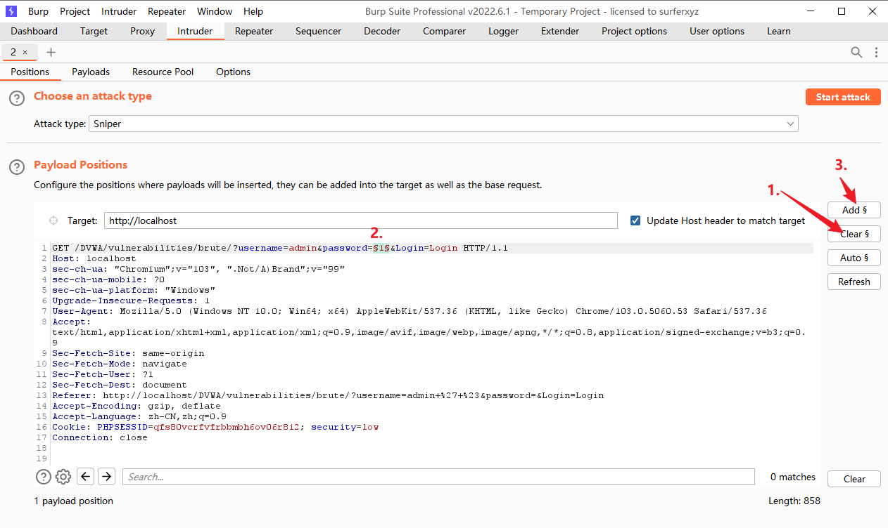

载入弱密码字典

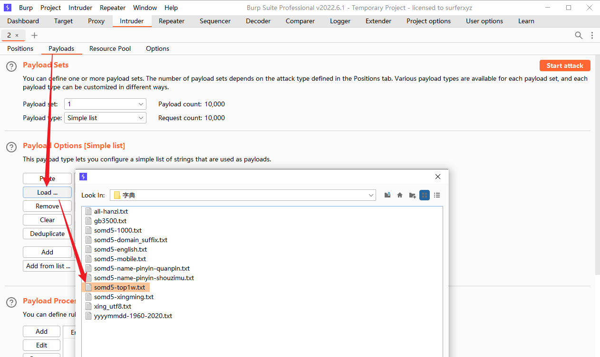

返回长度不一样的就是密码

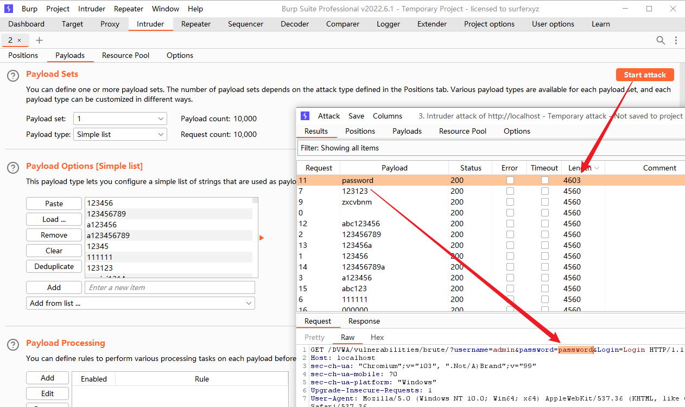


## Medium

观察其代码：

```php
<?php

if( isset( $_GET[ 'Login' ] ) ) {

    // Sanitise username input
    $user = $_GET[ 'username' ];
    $user = mysql_real_escape_string( $user );

    // Sanitise password input
    $pass = $_GET[ 'password' ];
    $pass = mysql_real_escape_string( $pass );
    $pass = md5( $pass );

    $qry = "SELECT * FROM `users` WHERE user='$user' AND password='$pass';";
    $result = mysql_query( $qry ) or die( '<pre>' . mysql_error() . '</pre>' );

    if( $result && mysql_num_rows($result) == 1 ) {
        // Get users details
        $i=0; // Bug fix.
        $avatar = mysql_result( $result, $i, "avatar" );

        // Login Successful
        echo "<p>Welcome to the password protected area " . $user . "</p>";
        echo '';
    } else {
        //Login failed
        echo "<pre><br>Username and/or password incorrect.</pre>";
    }

    mysql_close();
}

?>
```

`mysqli_real_escape_string(string,connection)` ：函数会对字符串string中的特殊符号（\x00，\n，\r，\，‘，“，\x1a）进行转义，基本可以抵抗SQL注入

`$GLOBALS` ：引用全局作用域中可用的全部变量。$GLOBALS 这种全局变量用于在 PHP 脚本中的任意位置访问全局变量（从函数或方法中均可）。PHP 在名为 $GLOBALS[index] 的数组中存储了所有全局变量。变量的名字就是数组的键。 

可以看到，medium级别的代码对用户输入的参数进行了简单的过滤，对一些预定义字符进行了转义，基本上防止了SQL注入。还有一个措施就是如果密码输错了，则延时两秒之后才能再次提交。

这依然可以和 low 级别的爆破一样，只不过时间长了点而已。因为试一次密码要过滤2秒才能试下一个。


启动Burp Suite，配置Firefox代理，转到 Brute Force，随便输入点东西，如：123，123，-> login，得到抓包结果

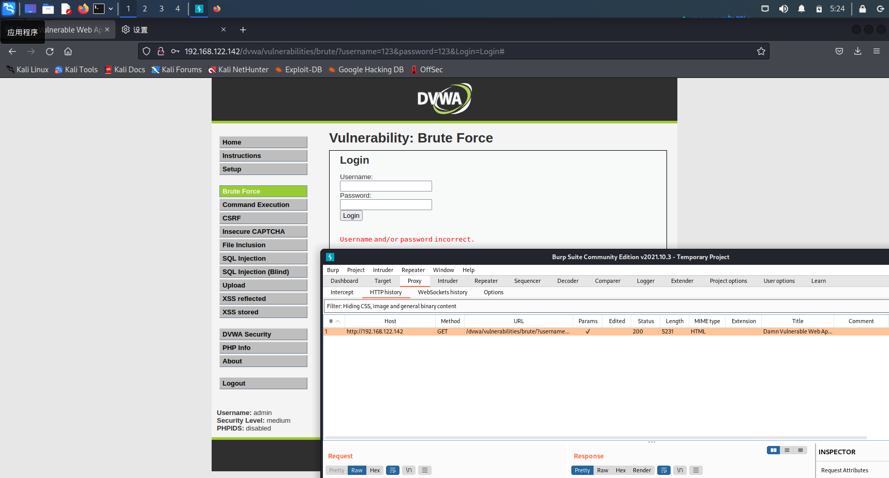


将其Send to Intruder，在intruder的positions选择中，先点击clear$清除所有的变量。

然后分别给username和password这两个字段后面的内容添加add$，添加变量并将attack type的值设置为cluster bomb在intruder的positions选择中，先点击clear$清除所有的变量。

然后分别给username和password这两个字段后面的内容添加add$，添加变量并将attack type的值设置为cluster bomb。


分别给1、2 Load字典

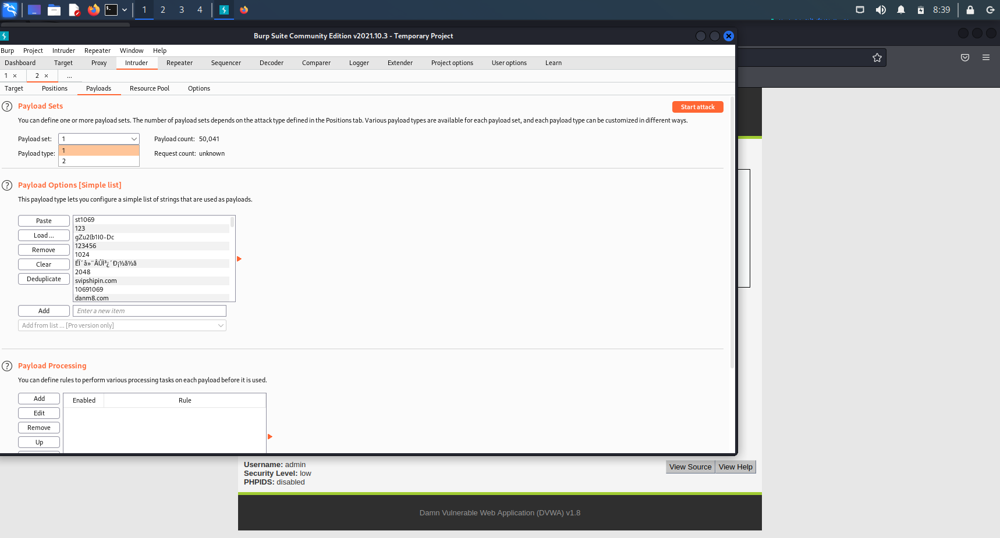


点击Start attack，观察Length，易得 密码为 admin password，返回测试，成功通过

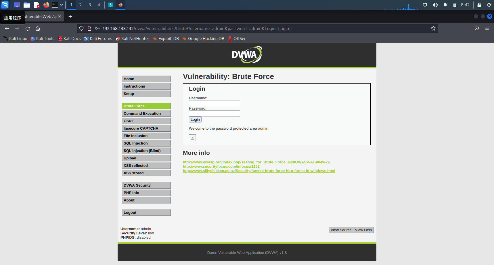


## High (Easy)

观察源代码

```php
<?php

if( isset( $_GET[ 'Login' ] ) ) {

    // Sanitise username input
    $user = $_GET[ 'username' ];
    $user = stripslashes( $user );
    $user = mysql_real_escape_string( $user );

    // Sanitise password input
    $pass = $_GET[ 'password' ];
    $pass = stripslashes( $pass );
    $pass = mysql_real_escape_string( $pass );
    $pass = md5( $pass );

    $qry = "SELECT * FROM `users` WHERE user='$user' AND password='$pass';";
    $result = mysql_query($qry) or die('<pre>' . mysql_error() . '</pre>' );

    if( $result && mysql_num_rows( $result ) == 1 ) {
        // Get users details
        $i=0; // Bug fix.
        $avatar = mysql_result( $result, $i, "avatar" );

        // Login Successful
        echo "<p>Welcome to the password protected area " . $user . "</p>";
        echo '';
    } else {
        // Login failed
        sleep(3);
        echo "<pre><br>Username and/or password incorrect.</pre>";
        }

    mysql_close();
}

?>
```


High中 加入了Login参数，通过抓包，可以看到，登录验证时提交了三个参数：username、password、Login；**（与他人High中含有token不同，我的没有token，此阶段按实际情况进行实验。）**

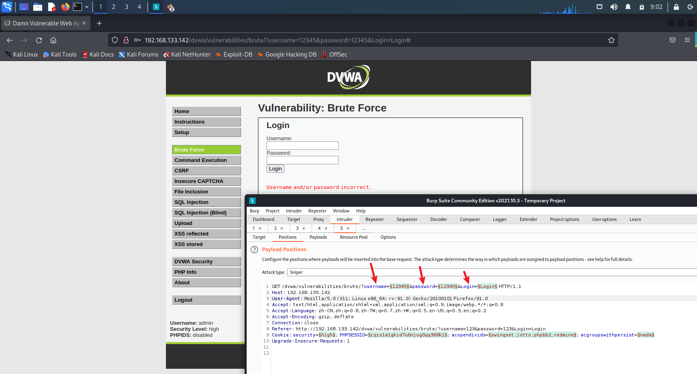


老规矩爆破：admin admin

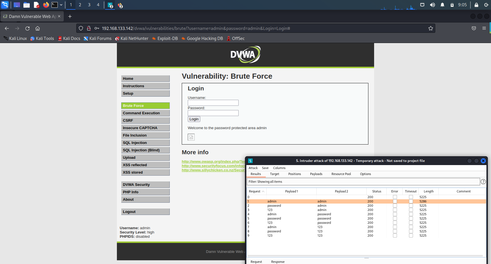


## High

源代码：

```php
Brute Force Source
vulnerabilities/brute/source/high.php
<?php

if( isset( $_GET[ 'Login' ] ) ) {
    // Check Anti-CSRF token
    checkToken( $_REQUEST[ 'user_token' ], $_SESSION[ 'session_token' ], 'index.php' );

    // Sanitise username input
    $user = $_GET[ 'username' ];
    $user = stripslashes( $user );
    $user = ((isset($GLOBALS["___mysqli_ston"]) && is_object($GLOBALS["___mysqli_ston"])) ? mysqli_real_escape_string($GLOBALS["___mysqli_ston"],  $user ) : ((trigger_error("[MySQLConverterToo] Fix the mysql_escape_string() call! This code does not work.", E_USER_ERROR)) ? "" : ""));

    // Sanitise password input
    $pass = $_GET[ 'password' ];
    $pass = stripslashes( $pass );
    $pass = ((isset($GLOBALS["___mysqli_ston"]) && is_object($GLOBALS["___mysqli_ston"])) ? mysqli_real_escape_string($GLOBALS["___mysqli_ston"],  $pass ) : ((trigger_error("[MySQLConverterToo] Fix the mysql_escape_string() call! This code does not work.", E_USER_ERROR)) ? "" : ""));
    $pass = md5( $pass );

    // Check database
    $query  = "SELECT * FROM `users` WHERE user = '$user' AND password = '$pass';";
    $result = mysqli_query($GLOBALS["___mysqli_ston"],  $query ) or die( '<pre>' . ((is_object($GLOBALS["___mysqli_ston"])) ? mysqli_error($GLOBALS["___mysqli_ston"]) : (($___mysqli_res = mysqli_connect_error()) ? $___mysqli_res : false)) . '</pre>' );

    if( $result && mysqli_num_rows( $result ) == 1 ) {
        // Get users details
        $row    = mysqli_fetch_assoc( $result );
        $avatar = $row["avatar"];

        // Login successful
        echo "<p>Welcome to the password protected area {$user}</p>";
        echo "";
    }
    else {
        // Login failed
        sleep( rand( 0, 3 ) );
        echo "<pre><br />Username and/or password incorrect.</pre>";
    }

    ((is_null($___mysqli_res = mysqli_close($GLOBALS["___mysqli_ston"]))) ? false : $___mysqli_res);
}

// Generate Anti-CSRF token
generateSessionToken();

?>
```

`stripslashes(string)`： 去除掉string字符的反斜杠＼

`mysqli_real_escape_string(string,connection)` ：函数会对字符串string中的特殊符号（\x00，\n，\r，\，‘，“，\x1a）进行转义。

`$GLOBALS` ：引用全局作用域中可用的全部变量。$GLOBALS 这种全局变量用于在 PHP 脚本中的任意位置访问全局变量（从函数或方法中均可）。PHP 在名为 $GLOBALS[index] 的数组中存储了所有全局变量。变量的名字就是数组的键。

High级别的代码使用了Anti-CSRF token来抵御CSRF的攻击，使用了stripslashes函数和mysqli_real_esacpe_string来抵御SQL注入和XSS的攻击。

由于使用了Anti-CSRF token，每次服务器返回的登陆页面中都会包含一个随机的user_token的值，用户每次登录时都要将user_token一起提交。服务器收到请求后，会优先做token的检查，再进行sql查询。所以，我们不能再利用burpsuite进行无脑式的爆破了。


随便输入点东西BP抓包看看，发现加入了user_token

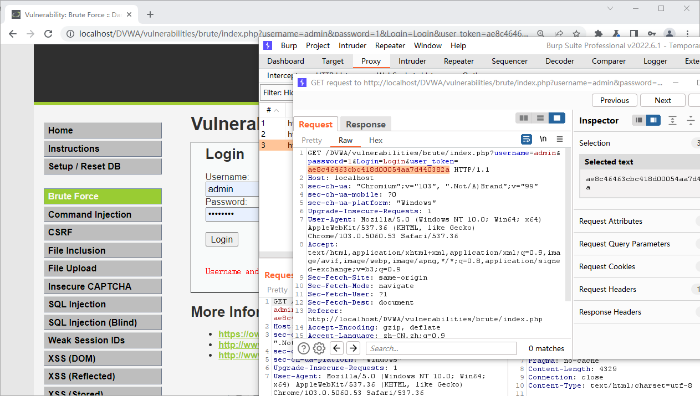


将包发送到Intruder，

​	因为有多个变量，攻击模式pitchfork，并标记两个变量

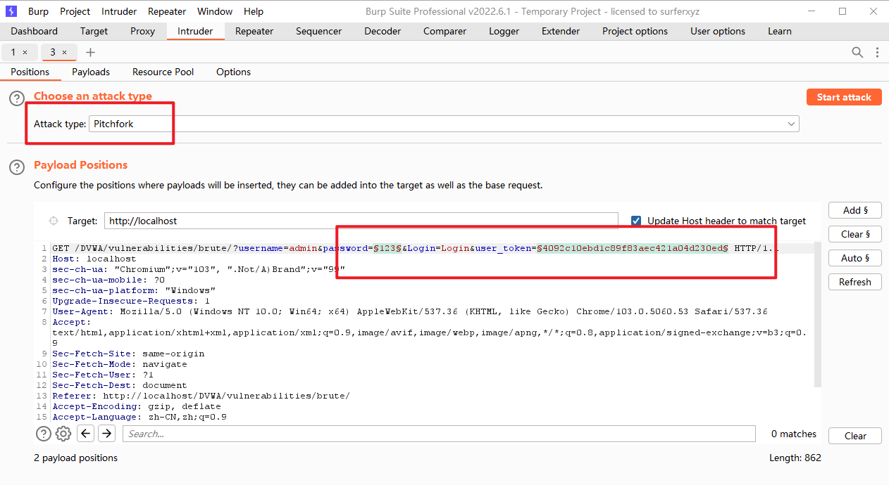


到Options中的Grep-Extract模块进行相应设置

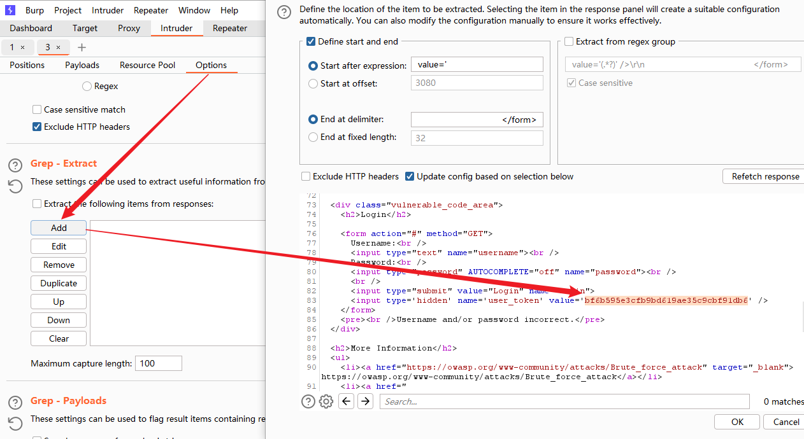


配置最高线程为1

> pitchfork 不支持多线程

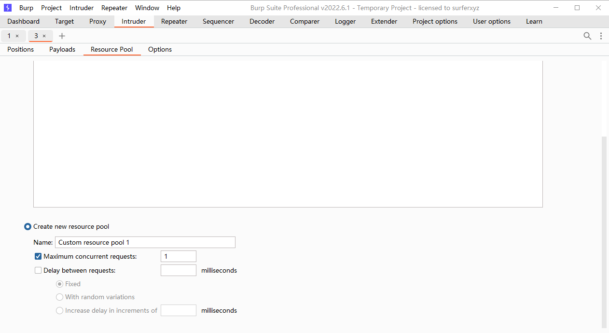


回到Payloads，设置第一个参数为弱密码类型，并导入密码库

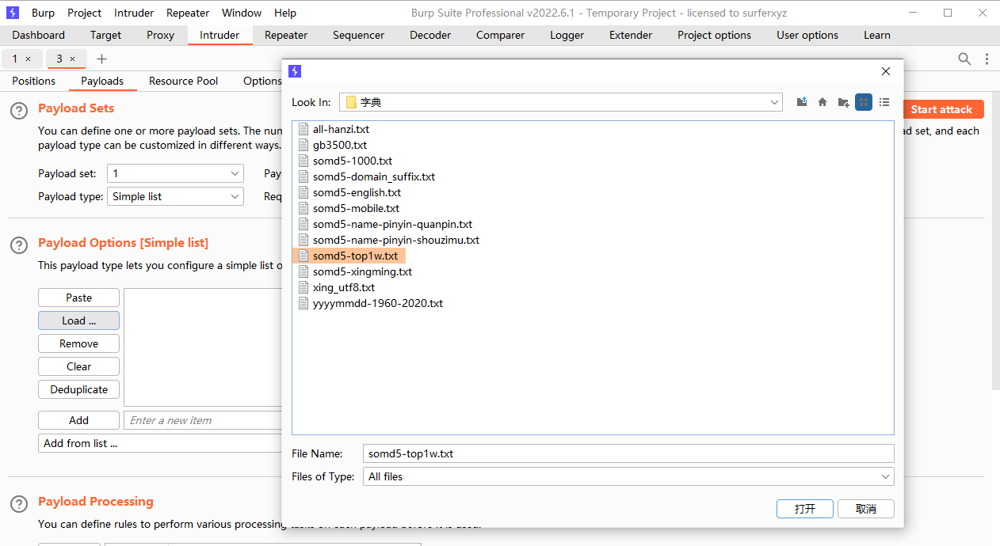

配置第二个参数

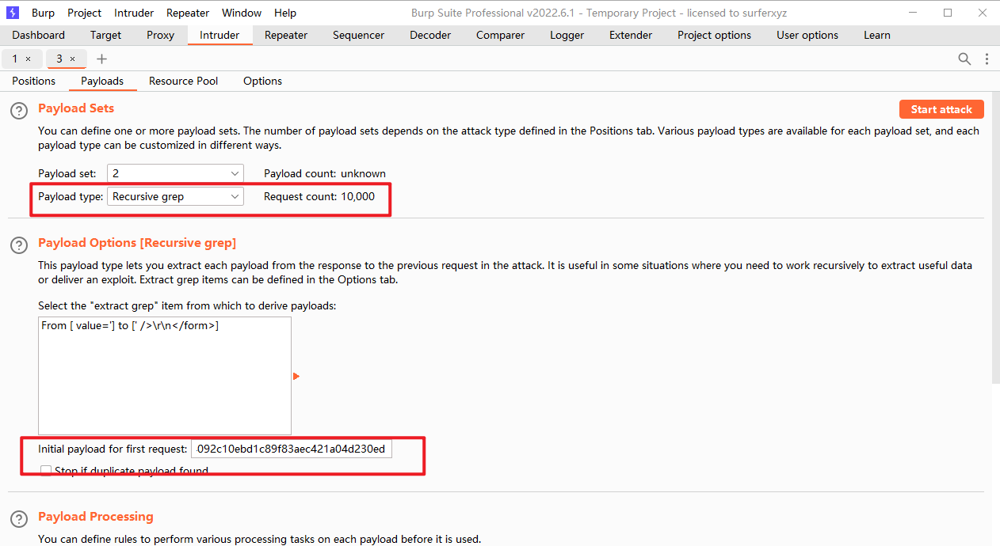


攻击一段时间后，发现返回长度不同的数据，其中一个就是密码

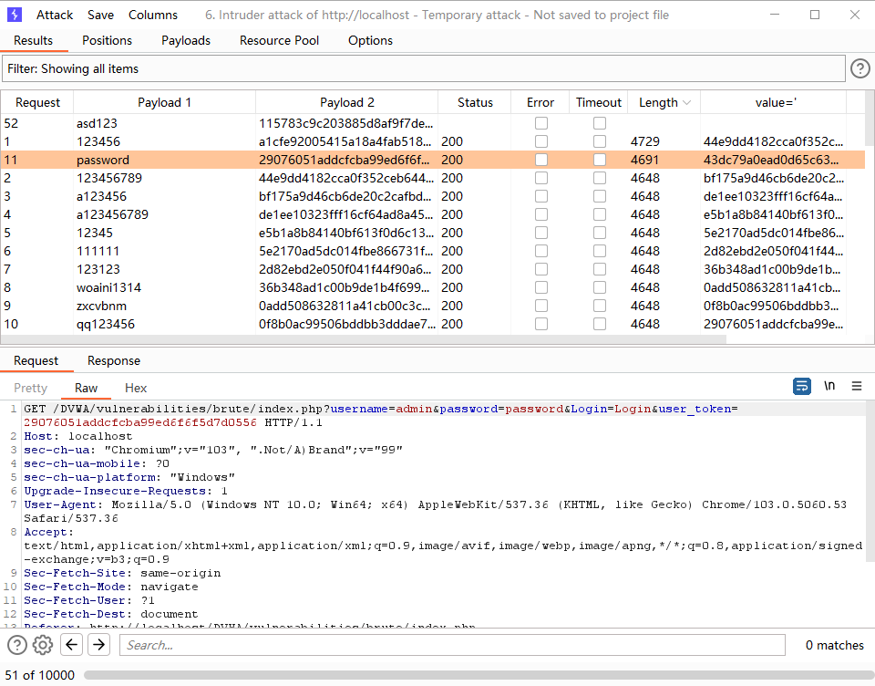


## impossible 分析

kali上的DVWA没有此等级，转到Windows端，并启用impossible等级

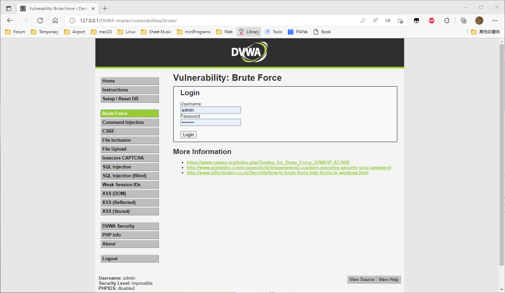


查看源代码

```php
<?php

if( isset( $_POST[ 'Login' ] ) && isset ($_POST['username']) && isset ($_POST['password']) ) {
    // Check Anti-CSRF token
    checkToken( $_REQUEST[ 'user_token' ], $_SESSION[ 'session_token' ], 'index.php' );

    // Sanitise username input
    $user = $_POST[ 'username' ];
    $user = stripslashes( $user );
    $user = ((isset($GLOBALS["___mysqli_ston"]) && is_object($GLOBALS["___mysqli_ston"])) ? mysqli_real_escape_string($GLOBALS["___mysqli_ston"],  $user ) : ((trigger_error("[MySQLConverterToo] Fix the mysql_escape_string() call! This code does not work.", E_USER_ERROR)) ? "" : ""));

    // Sanitise password input
    $pass = $_POST[ 'password' ];
    $pass = stripslashes( $pass );
    $pass = ((isset($GLOBALS["___mysqli_ston"]) && is_object($GLOBALS["___mysqli_ston"])) ? mysqli_real_escape_string($GLOBALS["___mysqli_ston"],  $pass ) : ((trigger_error("[MySQLConverterToo] Fix the mysql_escape_string() call! This code does not work.", E_USER_ERROR)) ? "" : ""));
    $pass = md5( $pass );

    // Default values
    $total_failed_login = 3;
    $lockout_time       = 15;
    $account_locked     = false;

    // Check the database (Check user information)
    $data = $db->prepare( 'SELECT failed_login, last_login FROM users WHERE user = (:user) LIMIT 1;' );
    $data->bindParam( ':user', $user, PDO::PARAM_STR );
    $data->execute();
    $row = $data->fetch();

    // Check to see if the user has been locked out.
    if( ( $data->rowCount() == 1 ) && ( $row[ 'failed_login' ] >= $total_failed_login ) )  {
        // User locked out.  Note, using this method would allow for user enumeration!
        //echo "<pre><br />This account has been locked due to too many incorrect logins.</pre>";

        // Calculate when the user would be allowed to login again
        $last_login = strtotime( $row[ 'last_login' ] );
        $timeout    = $last_login + ($lockout_time * 60);
        $timenow    = time();

        /*
        print "The last login was: " . date ("h:i:s", $last_login) . "<br />";
        print "The timenow is: " . date ("h:i:s", $timenow) . "<br />";
        print "The timeout is: " . date ("h:i:s", $timeout) . "<br />";
        */

        // Check to see if enough time has passed, if it hasn't locked the account
        if( $timenow < $timeout ) {
            $account_locked = true;
            // print "The account is locked<br />";
        }
    }

    // Check the database (if username matches the password)
    $data = $db->prepare( 'SELECT * FROM users WHERE user = (:user) AND password = (:password) LIMIT 1;' );
    $data->bindParam( ':user', $user, PDO::PARAM_STR);
    $data->bindParam( ':password', $pass, PDO::PARAM_STR );
    $data->execute();
    $row = $data->fetch();

    // If its a valid login...
    if( ( $data->rowCount() == 1 ) && ( $account_locked == false ) ) {
        // Get users details
        $avatar       = $row[ 'avatar' ];
        $failed_login = $row[ 'failed_login' ];
        $last_login   = $row[ 'last_login' ];

        // Login successful
        echo "<p>Welcome to the password protected area <em>{$user}</em></p>";
        echo "";

        // Had the account been locked out since last login?
        if( $failed_login >= $total_failed_login ) {
            echo "<p><em>Warning</em>: Someone might of been brute forcing your account.</p>";
            echo "<p>Number of login attempts: <em>{$failed_login}</em>.<br />Last login attempt was at: <em>${last_login}</em>.</p>";
        }

        // Reset bad login count
        $data = $db->prepare( 'UPDATE users SET failed_login = "0" WHERE user = (:user) LIMIT 1;' );
        $data->bindParam( ':user', $user, PDO::PARAM_STR );
        $data->execute();
    } else {
        // Login failed
        sleep( rand( 2, 4 ) );

        // Give the user some feedback
        echo "<pre><br />Username and/or password incorrect.<br /><br/>Alternative, the account has been locked because of too many failed logins.<br />If this is the case, <em>please try again in {$lockout_time} minutes</em>.</pre>";

        // Update bad login count
        $data = $db->prepare( 'UPDATE users SET failed_login = (failed_login + 1) WHERE user = (:user) LIMIT 1;' );
        $data->bindParam( ':user', $user, PDO::PARAM_STR );
        $data->execute();
    }

    // Set the last login time
    $data = $db->prepare( 'UPDATE users SET last_login = now() WHERE user = (:user) LIMIT 1;' );
    $data->bindParam( ':user', $user, PDO::PARAM_STR );
    $data->execute();
}

// Generate Anti-CSRF token
generateSessionToken();

?>
```


后端代码解析：

1、$_GET收集来自表单中的值

2、user_token：用户token

3、is_numeric()函数用于检测变量是否为数字或数字字符串。

4、prepare ()准备要执行的SQL语句并返回一个 PDOStatement 对象

5、bindParam () 绑定一个参数到指定的变量名

6、execute()方法返回对象

7、fetch是一种HTTP数据请求的方式，是XMLHttpRequest的一种替代方案。

8、rowCount — 返回受上一个 SQL 语句影响的行数

