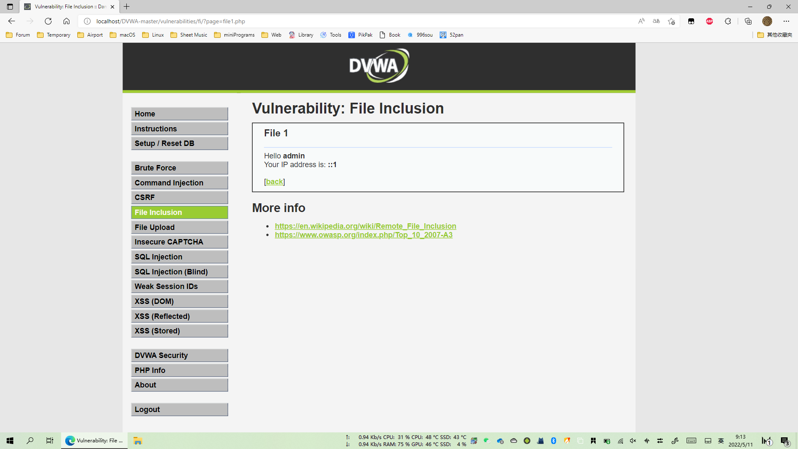
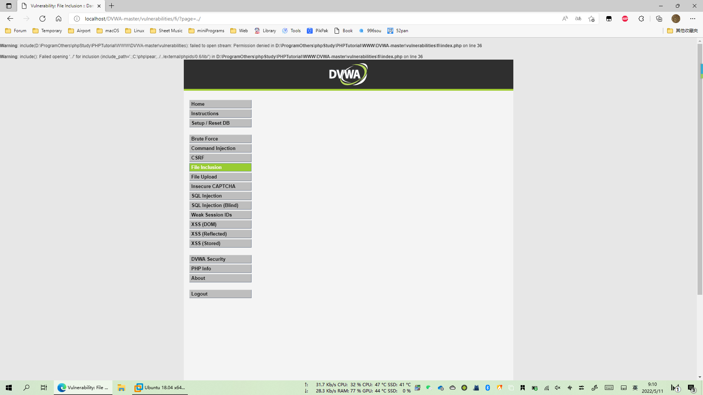
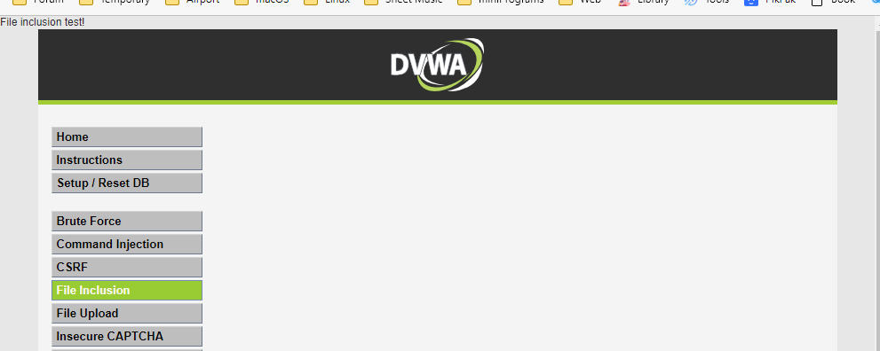
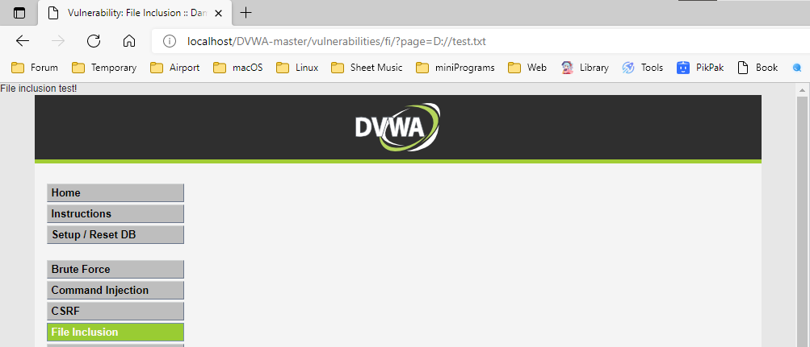
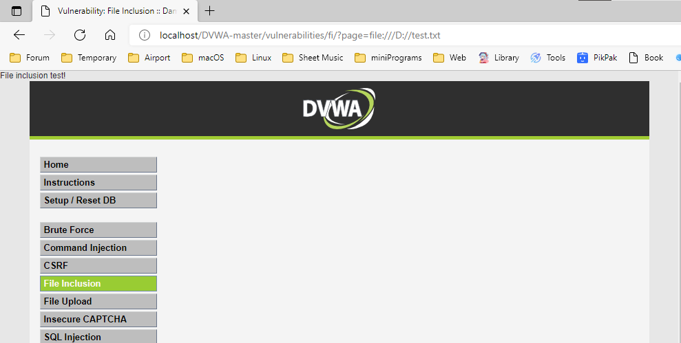
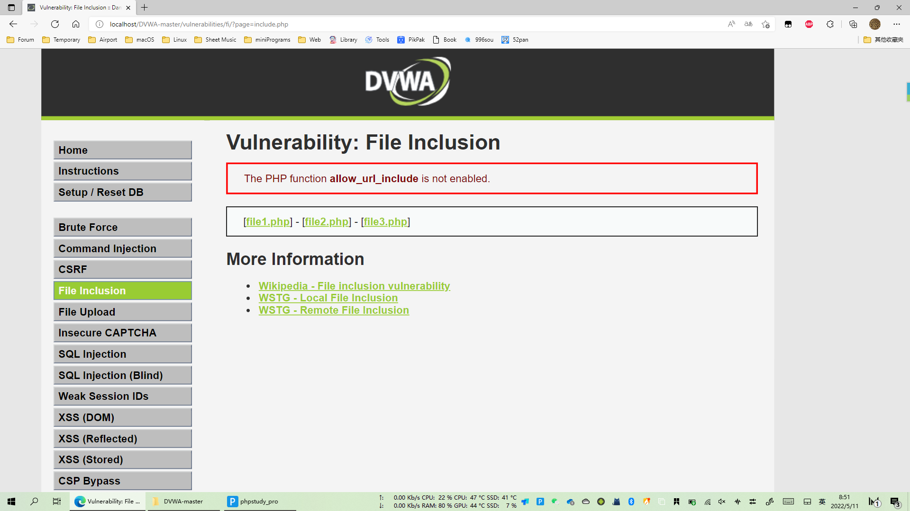
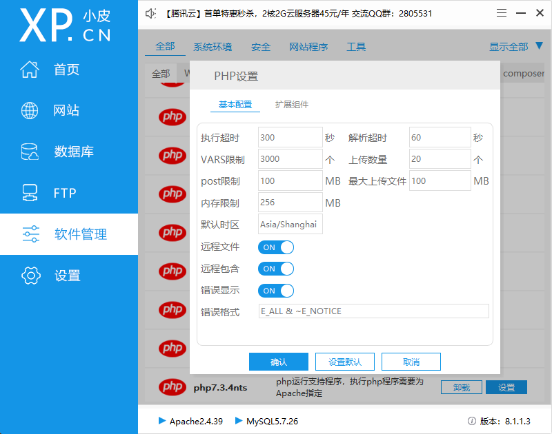
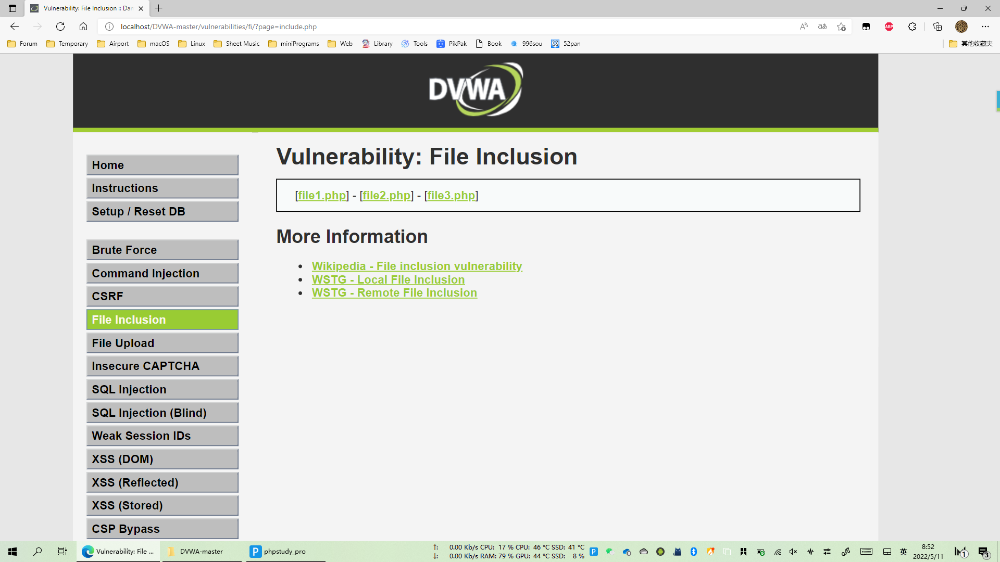

## Low

源代码

```php
<?php

// The page we wish to display
$file = $_GET[ 'page' ];

?>
```

可以看出文件包含是在url通过GET传参的方式获取文件。

### 漏洞利用

随便从URL中换个文件试试



经过测试发现可以直接获取服务器文件路径：




尝试直接包含一个本地文件，成功。




## Medium

### 源代码

```php
<?php

// The page we wish to display
$file = $_GET[ 'page' ];

// Input validation
$file = str_replace( array( "http://", "https://" ), "", $file );
$file = str_replace( array( "../", "..\"" ), "", $file );

?>
```

可以看到，Medium级别的代码增加了str_replace函数，对page参数进行了一定的处理，将”http:// ”、”https://”、 ” ../”、”..\”替换为空字符，即删除。这里只是过滤了远程包含，但没有过滤本地包含。

使用str_replace函数是极其不安全的，因为可以使用双写绕过替换规则。例如 `page=htthttp://p://` 时，str_replace函数会将 `http://` 删除，于是`page=http://`，成功执行远程命令。

### 漏洞利用

测试本地包含，同Low，成功




## High

### 源代码

```js
<?php

// The page we wish to display
$file = $_GET[ 'page' ];

// Input validation
if( !fnmatch( "file*", $file ) && $file != "include.php" ) {
    // This isn't the page we want!
    echo "ERROR: File not found!";
    exit;
}

?>
```

High级别的代码使用了fnmatch函数检查page参数，要求page参数的开头必须是file，服务器才会去包含相应的文件。
High级别的代码规定只能包含file开头的文件，看似安全，但是依然可以利用file协议绕过防护策略。


### 漏洞利用

尝试本地包含，成功。




## Impossible

源代码

```php
<?php

// The page we wish to display
$file = $_GET[ 'page' ];

// Only allow include.php or file{1..3}.php
if( $file != "include.php" && $file != "file1.php" && $file != "file2.php" && $file != "file3.php" ) {
    // This isn't the page we want!
    echo "ERROR: File not found!";
    exit;
}

?>
```

分析：

Impossible级别的代码使用了白名单机制进行防护，page参数必须为“include.php”、“file1.php”、“file2.php”、“file3.php”之一，彻底杜绝了文件包含漏洞。


## 常见问题



解决方案：更改PHP配置



