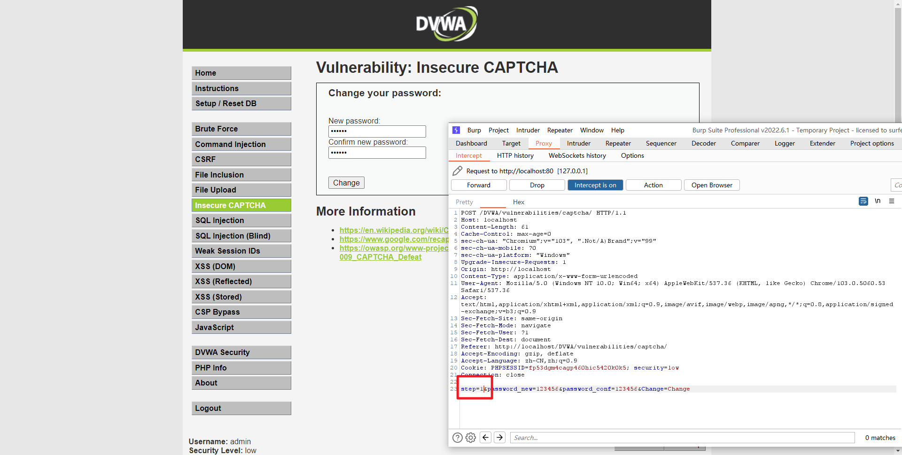
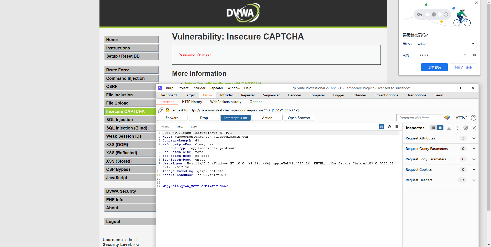
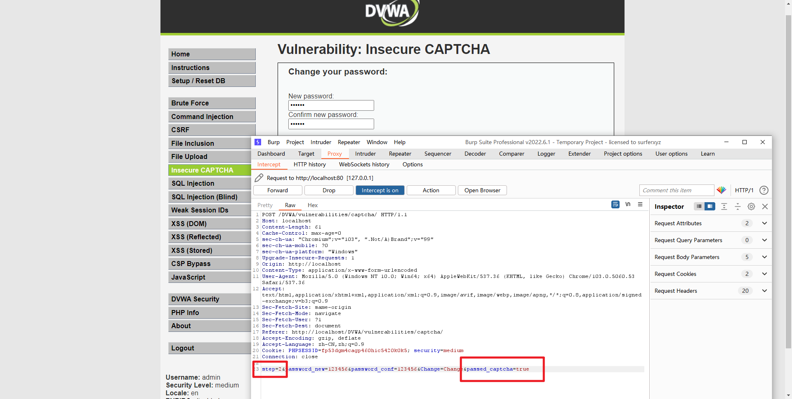
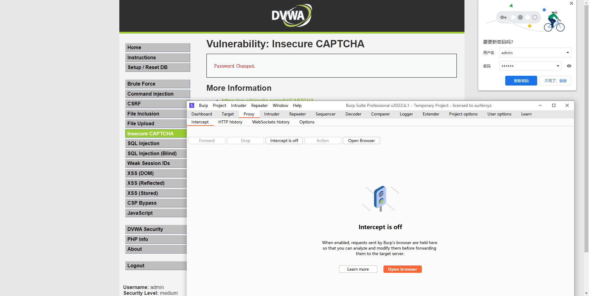
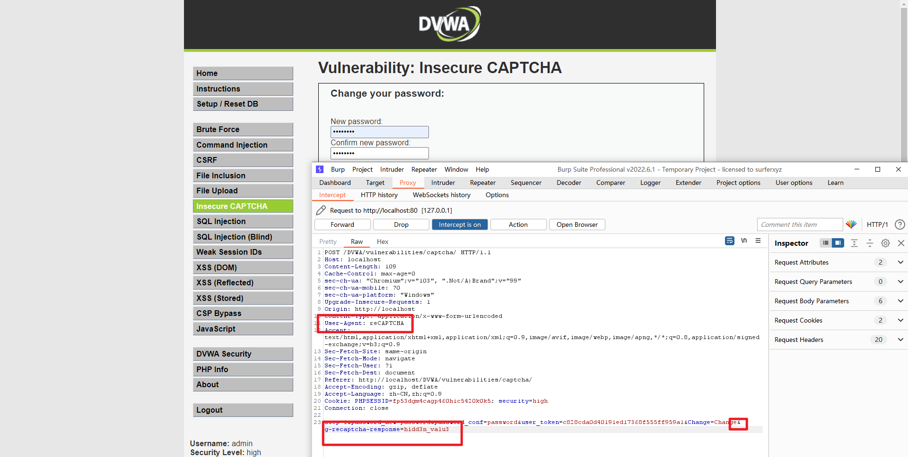
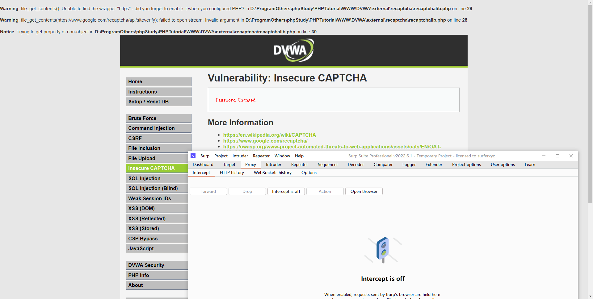

## Low

### 源代码

```php
<?php

if( isset( $_POST[ 'Change' ] ) && ( $_POST[ 'step' ] == '1' ) ) {
    // Hide the CAPTCHA form
    $hide_form = true;

    // Get input
    $pass_new  = $_POST[ 'password_new' ];
    $pass_conf = $_POST[ 'password_conf' ];

    // Check CAPTCHA from 3rd party
    $resp = recaptcha_check_answer(
        $_DVWA[ 'recaptcha_private_key'],
        $_POST['g-recaptcha-response']
    );

    // Did the CAPTCHA fail?
    if( !$resp ) {
        // What happens when the CAPTCHA was entered incorrectly
        $html     .= "<pre><br />The CAPTCHA was incorrect. Please try again.</pre>";
        $hide_form = false;
        return;
    }
    else {
        // CAPTCHA was correct. Do both new passwords match?
        if( $pass_new == $pass_conf ) {
            // Show next stage for the user
            echo "
                <pre><br />You passed the CAPTCHA! Click the button to confirm your changes.<br /></pre>
                <form action=\"#\" method=\"POST\">
                    <input type=\"hidden\" name=\"step\" value=\"2\" />
                    <input type=\"hidden\" name=\"password_new\" value=\"{$pass_new}\" />
                    <input type=\"hidden\" name=\"password_conf\" value=\"{$pass_conf}\" />
                    <input type=\"submit\" name=\"Change\" value=\"Change\" />
                </form>";
        }
        else {
            // Both new passwords do not match.
            $html     .= "<pre>Both passwords must match.</pre>";
            $hide_form = false;
        }
    }
}

if( isset( $_POST[ 'Change' ] ) && ( $_POST[ 'step' ] == '2' ) ) {
    // Hide the CAPTCHA form
    $hide_form = true;

    // Get input
    $pass_new  = $_POST[ 'password_new' ];
    $pass_conf = $_POST[ 'password_conf' ];

    // Check to see if both password match
    if( $pass_new == $pass_conf ) {
        // They do!
        $pass_new = ((isset($GLOBALS["___mysqli_ston"]) && is_object($GLOBALS["___mysqli_ston"])) ? mysqli_real_escape_string($GLOBALS["___mysqli_ston"],  $pass_new ) : ((trigger_error("[MySQLConverterToo] Fix the mysql_escape_string() call! This code does not work.", E_USER_ERROR)) ? "" : ""));
        $pass_new = md5( $pass_new );

        // Update database
        $insert = "UPDATE `users` SET password = '$pass_new' WHERE user = '" . dvwaCurrentUser() . "';";
        $result = mysqli_query($GLOBALS["___mysqli_ston"],  $insert ) or die( '<pre>' . ((is_object($GLOBALS["___mysqli_ston"])) ? mysqli_error($GLOBALS["___mysqli_ston"]) : (($___mysqli_res = mysqli_connect_error()) ? $___mysqli_res : false)) . '</pre>' );

        // Feedback for the end user
        echo "<pre>Password Changed.</pre>";
    }
    else {
        // Issue with the passwords matching
        echo "<pre>Passwords did not match.</pre>";
        $hide_form = false;
    }

    ((is_null($___mysqli_res = mysqli_close($GLOBALS["___mysqli_ston"]))) ? false : $___mysqli_res);
}

?>
```

### 代码分析

源码的逻辑判断修改密码被分成了 2 个步骤。

首先是使用 **recaptcha_check_answer()** 函数检查用户输入的验证码，验证通过后服务器返回表单。

接着用户使用提交 post 方法提交修改的密码，服务器完成更改密码的操作。

注意到服务器仅检查 Change、step 参数来判断用户是否通过了验证，而区分 2 个步骤使用的 step 参数是我们可控的。


### 漏洞利用

抓包 Step 参数 1 改 2 



Forward 搞定




## Medium

### 源代码

```php
<?php

if( isset( $_POST[ 'Change' ] ) && ( $_POST[ 'step' ] == '1' ) ) {
    // Hide the CAPTCHA form
    $hide_form = true;

    // Get input
    $pass_new  = $_POST[ 'password_new' ];
    $pass_conf = $_POST[ 'password_conf' ];

    // Check CAPTCHA from 3rd party
    $resp = recaptcha_check_answer(
        $_DVWA[ 'recaptcha_private_key' ],
        $_POST['g-recaptcha-response']
    );

    // Did the CAPTCHA fail?
    if( !$resp ) {
        // What happens when the CAPTCHA was entered incorrectly
        $html     .= "<pre><br />The CAPTCHA was incorrect. Please try again.</pre>";
        $hide_form = false;
        return;
    }
    else {
        // CAPTCHA was correct. Do both new passwords match?
        if( $pass_new == $pass_conf ) {
            // Show next stage for the user
            echo "
                <pre><br />You passed the CAPTCHA! Click the button to confirm your changes.<br /></pre>
                <form action=\"#\" method=\"POST\">
                    <input type=\"hidden\" name=\"step\" value=\"2\" />
                    <input type=\"hidden\" name=\"password_new\" value=\"{$pass_new}\" />
                    <input type=\"hidden\" name=\"password_conf\" value=\"{$pass_conf}\" />
                    <input type=\"hidden\" name=\"passed_captcha\" value=\"true\" />
                    <input type=\"submit\" name=\"Change\" value=\"Change\" />
                </form>";
        }
        else {
            // Both new passwords do not match.
            $html     .= "<pre>Both passwords must match.</pre>";
            $hide_form = false;
        }
    }
}

if( isset( $_POST[ 'Change' ] ) && ( $_POST[ 'step' ] == '2' ) ) {
    // Hide the CAPTCHA form
    $hide_form = true;

    // Get input
    $pass_new  = $_POST[ 'password_new' ];
    $pass_conf = $_POST[ 'password_conf' ];

    // Check to see if they did stage 1
    if( !$_POST[ 'passed_captcha' ] ) {
        $html     .= "<pre><br />You have not passed the CAPTCHA.</pre>";
        $hide_form = false;
        return;
    }

    // Check to see if both password match
    if( $pass_new == $pass_conf ) {
        // They do!
        $pass_new = ((isset($GLOBALS["___mysqli_ston"]) && is_object($GLOBALS["___mysqli_ston"])) ? mysqli_real_escape_string($GLOBALS["___mysqli_ston"],  $pass_new ) : ((trigger_error("[MySQLConverterToo] Fix the mysql_escape_string() call! This code does not work.", E_USER_ERROR)) ? "" : ""));
        $pass_new = md5( $pass_new );

        // Update database
        $insert = "UPDATE `users` SET password = '$pass_new' WHERE user = '" . dvwaCurrentUser() . "';";
        $result = mysqli_query($GLOBALS["___mysqli_ston"],  $insert ) or die( '<pre>' . ((is_object($GLOBALS["___mysqli_ston"])) ? mysqli_error($GLOBALS["___mysqli_ston"]) : (($___mysqli_res = mysqli_connect_error()) ? $___mysqli_res : false)) . '</pre>' );

        // Feedback for the end user
        echo "<pre>Password Changed.</pre>";
    }
    else {
        // Issue with the passwords matching
        echo "<pre>Passwords did not match.</pre>";
        $hide_form = false;
    }

    ((is_null($___mysqli_res = mysqli_close($GLOBALS["___mysqli_ston"]))) ? false : $___mysqli_res);
}

?>
```


### 代码分析

Medium 级别的代码在 step = 2 的状态时，添加了对参数 passed_captcha 的检查，如果没通过则提示。

但是并没有什么卵用，因为 passed_captcha 仍是可控的


### 漏洞利用

抓个包，改 Step 和 添加passed_captcha



转发，完美通过




## High

### 源代码

```php
<?php

if( isset( $_POST[ 'Change' ] ) ) {
    // Hide the CAPTCHA form
    $hide_form = true;

    // Get input
    $pass_new  = $_POST[ 'password_new' ];
    $pass_conf = $_POST[ 'password_conf' ];

    // Check CAPTCHA from 3rd party
    $resp = recaptcha_check_answer(
        $_DVWA[ 'recaptcha_private_key' ],
        $_POST['g-recaptcha-response']
    );

    if (
        $resp || 
        (
            $_POST[ 'g-recaptcha-response' ] == 'hidd3n_valu3'
            && $_SERVER[ 'HTTP_USER_AGENT' ] == 'reCAPTCHA'
        )
    ){
        // CAPTCHA was correct. Do both new passwords match?
        if ($pass_new == $pass_conf) {
            $pass_new = ((isset($GLOBALS["___mysqli_ston"]) && is_object($GLOBALS["___mysqli_ston"])) ? mysqli_real_escape_string($GLOBALS["___mysqli_ston"],  $pass_new ) : ((trigger_error("[MySQLConverterToo] Fix the mysql_escape_string() call! This code does not work.", E_USER_ERROR)) ? "" : ""));
            $pass_new = md5( $pass_new );

            // Update database
            $insert = "UPDATE `users` SET password = '$pass_new' WHERE user = '" . dvwaCurrentUser() . "' LIMIT 1;";
            $result = mysqli_query($GLOBALS["___mysqli_ston"],  $insert ) or die( '<pre>' . ((is_object($GLOBALS["___mysqli_ston"])) ? mysqli_error($GLOBALS["___mysqli_ston"]) : (($___mysqli_res = mysqli_connect_error()) ? $___mysqli_res : false)) . '</pre>' );

            // Feedback for user
            echo "<pre>Password Changed.</pre>";

        } else {
            // Ops. Password mismatch
            $html     .= "<pre>Both passwords must match.</pre>";
            $hide_form = false;
        }

    } else {
        // What happens when the CAPTCHA was entered incorrectly
        $html     .= "<pre><br />The CAPTCHA was incorrect. Please try again.</pre>";
        $hide_form = false;
        return;
    }

    ((is_null($___mysqli_res = mysqli_close($GLOBALS["___mysqli_ston"]))) ? false : $___mysqli_res);
}

// Generate Anti-CSRF token
generateSessionToken();

?>
```


### 代码分析

跟前面两个等级相比，High等级改成了单步执行，同时引入了新的参数 `g-recaptcha-response` ，加入验证user-agent。

原理为验证 resp（谷歌验证码返回的结果）是 false，并且参数 g-recaptcha-response 不等于 hidd3n_valu3 或 http 包头的 User-Agent 参数不等于 reCAPTCHA 时认为验证码输入错误，反之则认为已经通过了验证码的检查。

但是， `g-recaptcha-response` 和 `User-Agent` 都是可控的，还是能跳。


### 漏洞利用

抓包改 `g-recaptcha-response` 和 `User-Agent` 




转发，搞定：




## Impossible

### 源代码

```php
<?php

if( isset( $_POST[ 'Change' ] ) ) {
    // Hide the CAPTCHA form
    $hide_form = true;

    // Get input
    $pass_new  = $_POST[ 'password_new' ];
    $pass_conf = $_POST[ 'password_conf' ];

    // Check CAPTCHA from 3rd party
    $resp = recaptcha_check_answer(
        $_DVWA[ 'recaptcha_private_key' ],
        $_POST['g-recaptcha-response']
    );

    if (
        $resp || 
        (
            $_POST[ 'g-recaptcha-response' ] == 'hidd3n_valu3'
            && $_SERVER[ 'HTTP_USER_AGENT' ] == 'reCAPTCHA'
        )
    ){
        // CAPTCHA was correct. Do both new passwords match?
        if ($pass_new == $pass_conf) {
            $pass_new = ((isset($GLOBALS["___mysqli_ston"]) && is_object($GLOBALS["___mysqli_ston"])) ? mysqli_real_escape_string($GLOBALS["___mysqli_ston"],  $pass_new ) : ((trigger_error("[MySQLConverterToo] Fix the mysql_escape_string() call! This code does not work.", E_USER_ERROR)) ? "" : ""));
            $pass_new = md5( $pass_new );

            // Update database
            $insert = "UPDATE `users` SET password = '$pass_new' WHERE user = '" . dvwaCurrentUser() . "' LIMIT 1;";
            $result = mysqli_query($GLOBALS["___mysqli_ston"],  $insert ) or die( '<pre>' . ((is_object($GLOBALS["___mysqli_ston"])) ? mysqli_error($GLOBALS["___mysqli_ston"]) : (($___mysqli_res = mysqli_connect_error()) ? $___mysqli_res : false)) . '</pre>' );

            // Feedback for user
            echo "<pre>Password Changed.</pre>";

        } else {
            // Ops. Password mismatch
            $html     .= "<pre>Both passwords must match.</pre>";
            $hide_form = false;
        }

    } else {
        // What happens when the CAPTCHA was entered incorrectly
        $html     .= "<pre><br />The CAPTCHA was incorrect. Please try again.</pre>";
        $hide_form = false;
        return;
    }

    ((is_null($___mysqli_res = mysqli_close($GLOBALS["___mysqli_ston"]))) ? false : $___mysqli_res);
}

// Generate Anti-CSRF token
generateSessionToken();

?>
```


### 代码分析

加如Anti-CSRF token 机制防御CSRF攻击，利用PDO技术防护sql注入。

不存在漏洞。


