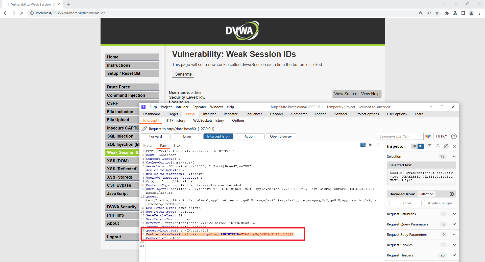
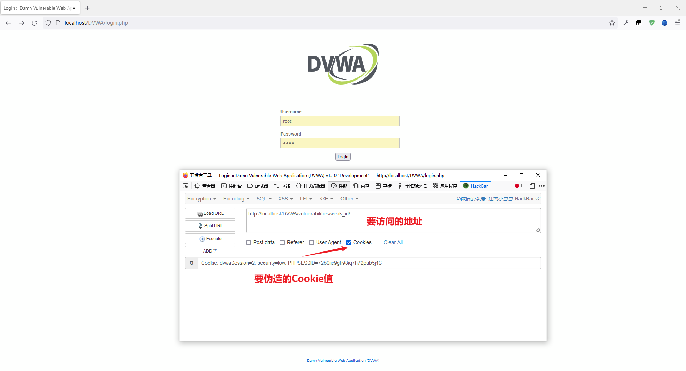
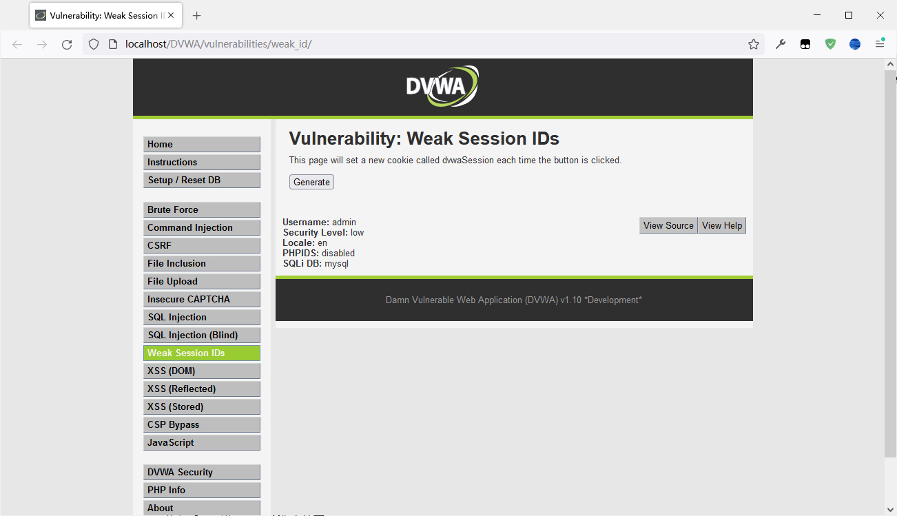
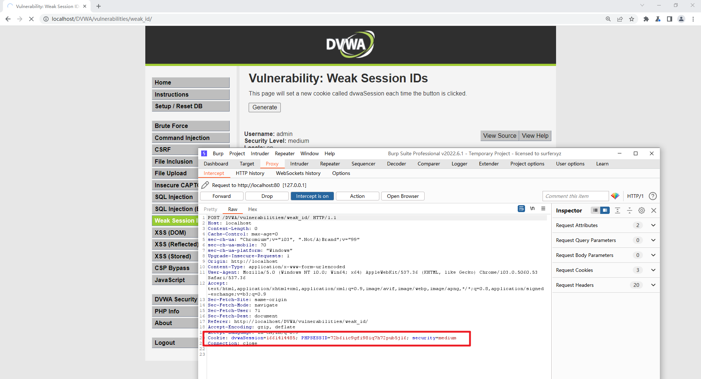
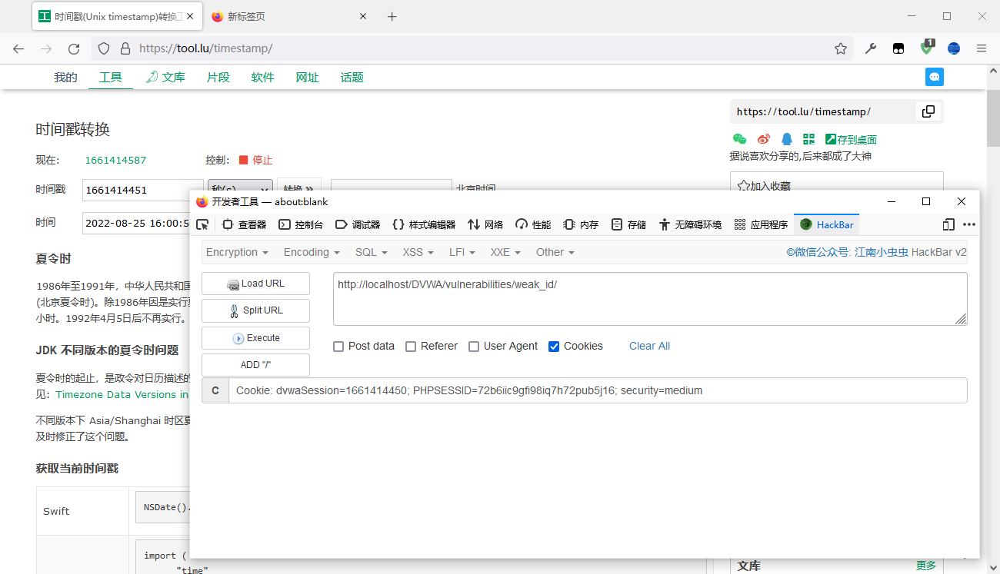
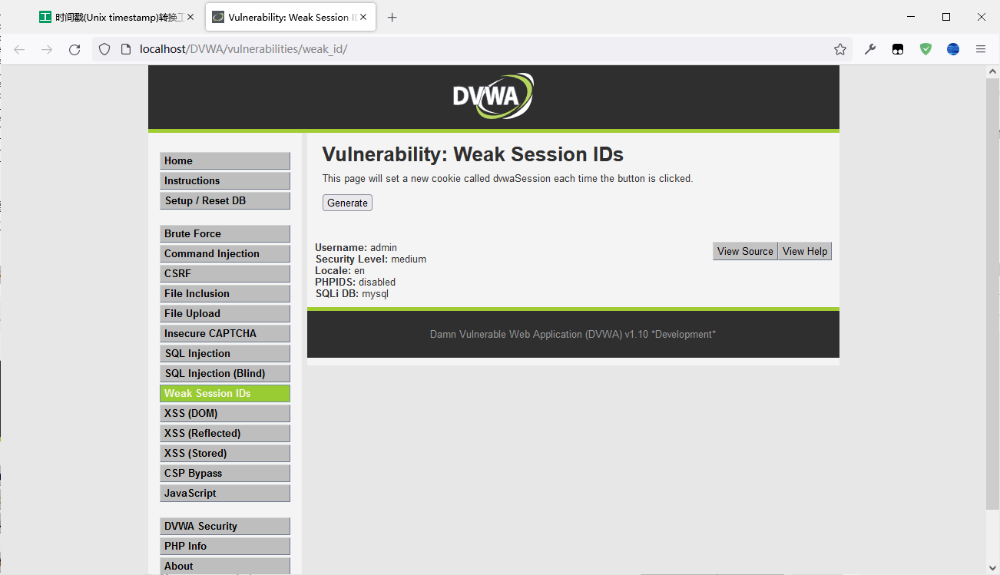

 

## Low

### 源代码

```php
<?php

$html = "";

if ($_SERVER['REQUEST_METHOD'] == "POST") {
    if (!isset ($_SESSION['last_session_id'])) {
        $_SESSION['last_session_id'] = 0;
    }
    $_SESSION['last_session_id']++;
    $cookie_value = $_SESSION['last_session_id'];
    setcookie("dvwaSession", $cookie_value);
}
?>
```

### 代码分析

首先有一个判断函数 `!isset()` ，如果用户 SESSION 中的 `last_session_id` 不存在就设为 0，然后累加，

将这个值使用 `setcookie()` 函数，将这个值发送到浏览器端作为浏览器端的 cookie 。	

这种有规律的session可以推断出来，绕过账号密码。

### 漏洞利用

先用BP抓包，点击Generate，并复制 Cookie 行内容




换一个浏览器，打开 [HackerBar](https://github.com/Mr-xn/hackbar2.1.3)，配置URL与需要伪造的内容




执行后即可进入 URL 所指向的页面



## Medium

### 源代码

```php
<?php

$html = "";

if ($_SERVER['REQUEST_METHOD'] == "POST") {
    $cookie_value = time();
    setcookie("dvwaSession", $cookie_value);
}
?>
```


### 代码分析

易见，基于时间戳生成。


### 漏洞利用

与Low同理，伪造一下即可

原版：



伪造一下：




成功进入，甚至用当前时间的时间戳也可以



## High

### 源代码

```php
<?php

$html = "";

if ($_SERVER['REQUEST_METHOD'] == "POST") {
    if (!isset ($_SESSION['last_session_id_high'])) {
        $_SESSION['last_session_id_high'] = 0;
    }
    $_SESSION['last_session_id_high']++;
    $cookie_value = md5($_SESSION['last_session_id_high']);
    setcookie("dvwaSession", $cookie_value, time()+3600, "/vulnerabilities/weak_id/", $_SERVER['HTTP_HOST'], false, false);
}

?>
```


### 代码分析

首先使用 `!isset()` 函数对 session 变量进行检查，如果没有进行赋值。则设置为 0，然后每一次都递增 1。
然后将 session 变量进行MD5加密后赋值为 cookie_value 变量。
最后，将 cookie_value 这个值发送给浏览器作为 cookie 。


### 漏洞利用

MD5虽然在理论上是个单向加密算法，但实际上仍可通过彩虹、碰撞等方式爆破。

> 环境异常，抓包内容与High等级源码不对应，抓包内容为Impossible等级，重启无果，省略。
>
> High等级与Low等级基本同理，除了多了个MD5。


## Impossible

### 源代码

```php
<?php

$html = "";

if ($_SERVER['REQUEST_METHOD'] == "POST") {
    $cookie_value = sha1(mt_rand() . time() . "Impossible");
    setcookie("dvwaSession", $cookie_value, time()+3600, "/vulnerabilities/weak_id/", $_SERVER['HTTP_HOST'], true, true);
}
?>
```


### 代码分析

使用随机数+时间戳+固定字符串（“Impossible”）进行 sha1 运算，作为 session Id，基本不太可能碰撞成功


