# DVWA: XSS

## DOM Based Cross Site Scripting (XSS)

### Low

#### 源代码

```php
<?php

# No protections, anything goes

?>
```


#### ~~代码分析~~

~~这就没必要了吧~~


#### 漏洞利用

看一眼默认效果

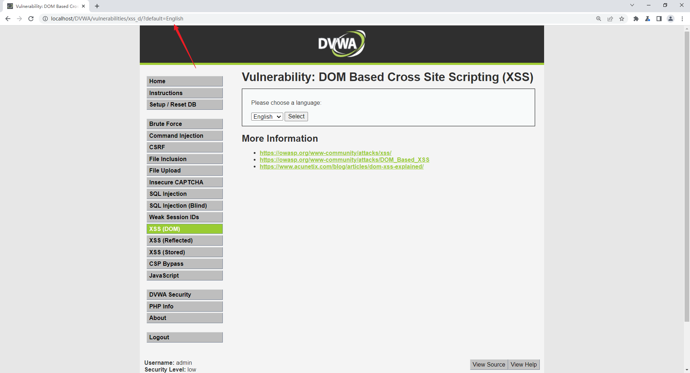

改一下URL，访问，搞定

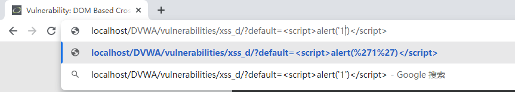

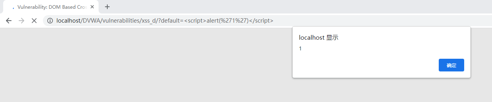


### Medium

#### 源代码

```php
<?php

// Is there any input?
if ( array_key_exists( "default", $_GET ) && !is_null ($_GET[ 'default' ]) ) {
    $default = $_GET['default'];
    
    # Do not allow script tags
    if (stripos ($default, "<script") !== false) {
        header ("location: ?default=English");
        exit;
    }
}

?>
```


#### 代码分析

`stripos()` 函数：查找字符串在另一字符串中第一次出现的位置（不区分大小写）。(strpos区分大小写)

`header()` 函数：向客户端发送原始的 HTTP 报头。

服务端当default参数存在且不为空的时候处理, 并且过滤了`<script>`标签，如果出现则自动跳到 English，同时利用 strpos 过滤大小写


#### 漏洞利用

#### 法一：用HTML标签执行JS

如利用 img 标签：

```
default=English"></option></select>
```

#### 法二：用Url截断，加 # 号

```
#default=<script>alert('XSS')</script>
```


### High

#### 源代码

```php
<?php

// Is there any input?
if ( array_key_exists( "default", $_GET ) && !is_null ($_GET[ 'default' ]) ) {

    # White list the allowable languages
    switch ($_GET['default']) {
        case "French":
        case "English":
        case "German":
        case "Spanish":
            # ok
            break;
        default:
            header ("location: ?default=English");
            exit;
    }
}

?>
```


#### 代码分析

用了白名单的过滤方法, default变量中的值，必须是French，English，German，Spanish才行否则就进行跳转结束运行


#### 漏洞利用

用Url截断，加 # 号

```
#default=<script>alert('XSS')</script>
```


### Impossible

#### 源代码

```php
<?php

# Don't need to do anything, protection handled on the client side

?>
```


#### 代码分析

在前端做过滤，输入的任何参数都是经过URL编码，然后直接赋值给option标签，而后端不进行任何过滤。

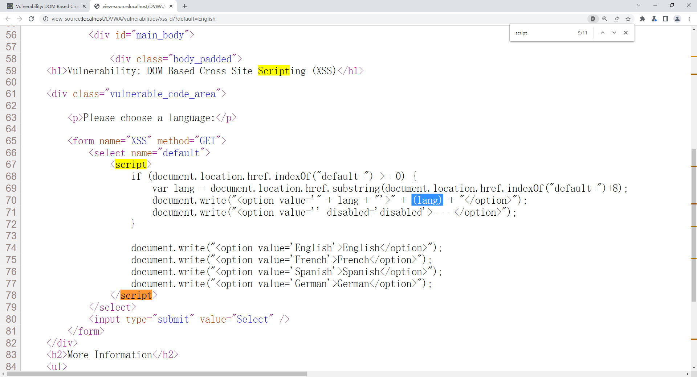

## Reflected Cross Site Scripting (XSS)

### Low

#### 源代码

```php
<?php

header ("X-XSS-Protection: 0");

// Is there any input?
if( array_key_exists( "name", $_GET ) && $_GET[ 'name' ] != NULL ) {
    // Feedback for end user
    echo '<pre>Hello ' . $_GET[ 'name' ] . '</pre>';
}

?>
```

#### 分析

代码直接采用get方式传入了name参数，并没有任何的过滤与检查，存在明显的XSS漏洞。

#### 漏洞利用

尝试最普通的payload测试：输入“\<script\>alert(/21215250327/)\</script\>”，并点击Submit，成功弹出Alert

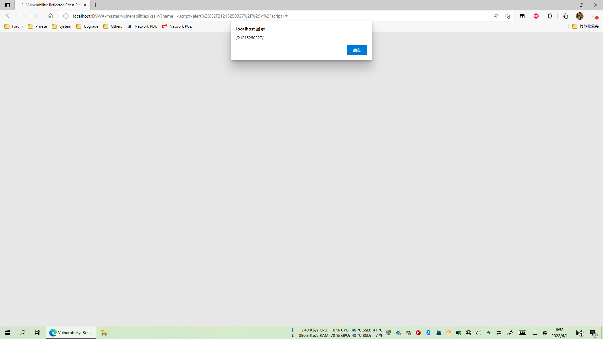


### Medium

#### 源代码

```php
<?php

header ("X-XSS-Protection: 0");

// Is there any input?
if( array_key_exists( "name", $_GET ) && $_GET[ 'name' ] != NULL ) {
    // Get input
    $name = str_replace( '<script>', '', $_GET[ 'name' ] );

    // Feedback for end user
    echo "<pre>Hello ${name}</pre>";
}

?>
```

#### 代码分析

易见，在Medium等级中，对输入进行了过滤，使用str_replace函数将输入中的`<script>`替换为空，但是这种黑名单防护机制是可以很容易绕过的，比如使用大小写混合、双写模式等。

#### 漏洞例用

使用大小写混合模式尝试注入 `<ScRipt>alert(/21215250327/);</ScRipt>` ，成功弹出 Alert

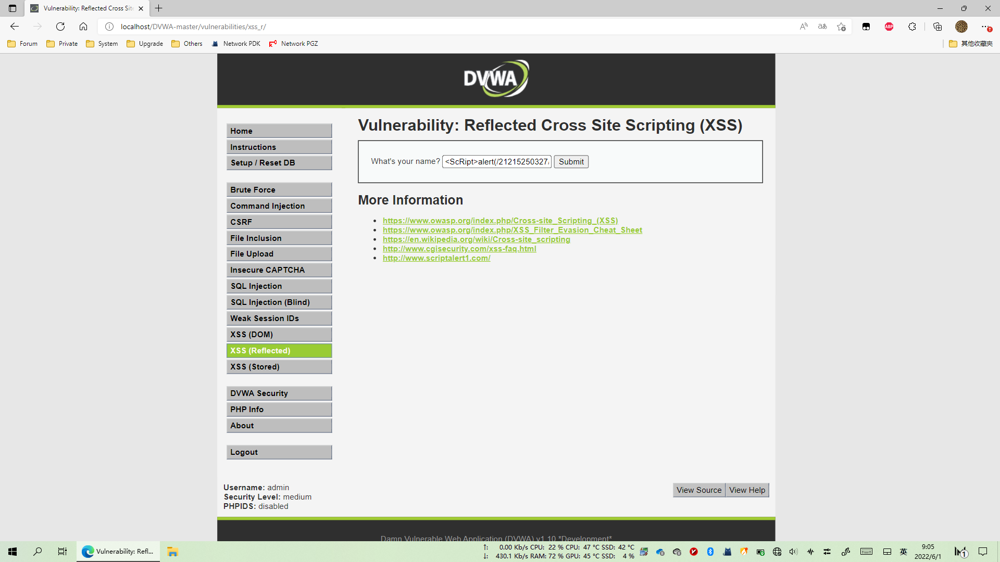

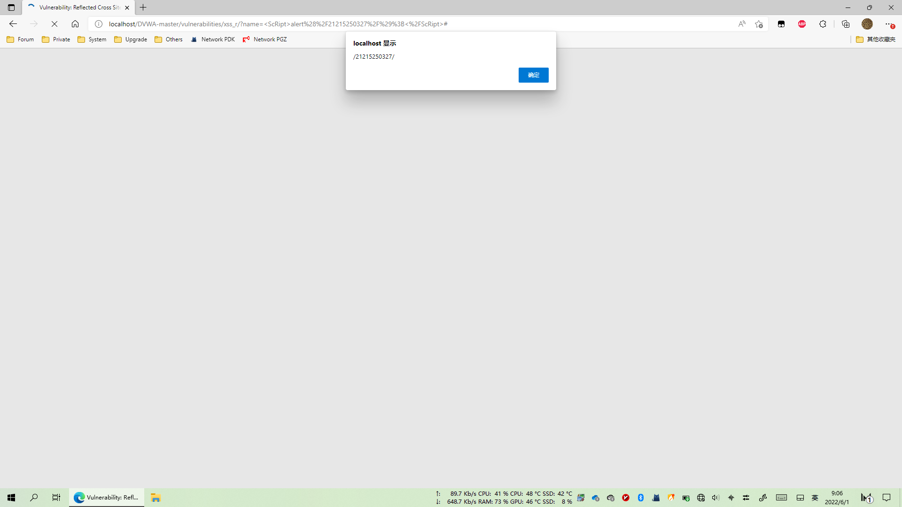

### High

#### 源代码

```php
<?php
header ("X-XSS-Protection: 0");

// Is there any input?
if( array_key_exists( "name", $_GET ) && $_GET[ 'name' ] != NULL ) {
    // Get input
    $name = preg_replace( '/<(.*)s(.*)c(.*)r(.*)i(.*)p(.*)t/i', '', $_GET[ 'name' ] );

    // Feedback for end user
    echo "<pre>Hello ${name}</pre>";
}

?>
```

#### 代码分析

High等级的代码同样使用黑名单过滤输入，preg_replace() 函数用于正则表达式的搜索和替换，这使得双写绕过、大小写混淆绕过不再有效。但是，仍然可以通过img、body等标签的事件或者iframe、src等标签的构造可利用的js代码。

#### 漏洞利用

使用 img 标签和其编码转换后的 XSS payload：\ ， 成功弹出Alert

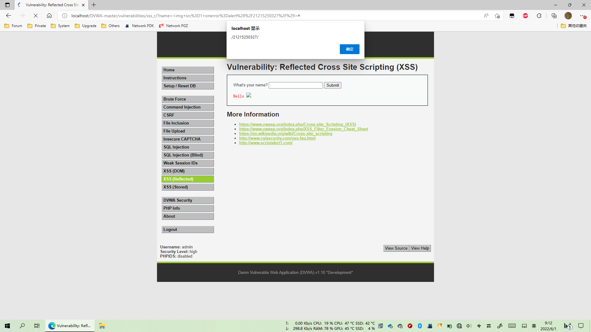


### Impossible

#### 源代码

```php
<?php

// Is there any input?
if( array_key_exists( "name", $_GET ) && $_GET[ 'name' ] != NULL ) {
    // Check Anti-CSRF token
    checkToken( $_REQUEST[ 'user_token' ], $_SESSION[ 'session_token' ], 'index.php' );

    // Get input
    $name = htmlspecialchars( $_GET[ 'name' ] );

    // Feedback for end user
    echo "<pre>Hello ${name}</pre>";
}

// Generate Anti-CSRF token
generateSessionToken();

?>
```

#### 代码分析

这里使用了一个htmlspecialchars函数，htmlspecialchars()这个函数的的功能：是把预定义的字符&、"、'、<、>转换为 HTML 实体，防止浏览器将其作为HTML元素。还加入了Anti-CSRF token，防止结合CSRF（跨站请求伪造）攻击

```
& （和号）成为 &amp;
" （双引号）成为 &quot; 
' （单引号）成为 &apos;//生效需要加 ENT_QUOTES 参数
< （小于）成为 &lt;
> （大于）成为 &gt;
```


# Stored Cross Site Scripting (XSS)

### Low

#### 源代码

```kotlin
<?php

if( isset( $_POST[ 'btnSign' ] ) ) {
    // Get input
    $message = trim( $_POST[ 'mtxMessage' ] );
    $name    = trim( $_POST[ 'txtName' ] );

    // Sanitize message input
    $message = stripslashes( $message );
    $message = ((isset($GLOBALS["___mysqli_ston"]) && is_object($GLOBALS["___mysqli_ston"])) ? mysqli_real_escape_string($GLOBALS["___mysqli_ston"],  $message ) : ((trigger_error("[MySQLConverterToo] Fix the mysql_escape_string() call! This code does not work.", E_USER_ERROR)) ? "" : ""));

    // Sanitize name input
    $name = ((isset($GLOBALS["___mysqli_ston"]) && is_object($GLOBALS["___mysqli_ston"])) ? mysqli_real_escape_string($GLOBALS["___mysqli_ston"],  $name ) : ((trigger_error("[MySQLConverterToo] Fix the mysql_escape_string() call! This code does not work.", E_USER_ERROR)) ? "" : ""));

    // Update database
    $query  = "INSERT INTO guestbook ( comment, name ) VALUES ( '$message', '$name' );";
    $result = mysqli_query($GLOBALS["___mysqli_ston"],  $query ) or die( '<pre>' . ((is_object($GLOBALS["___mysqli_ston"])) ? mysqli_error($GLOBALS["___mysqli_ston"]) : (($___mysqli_res = mysqli_connect_error()) ? $___mysqli_res : false)) . '</pre>' );

    //mysql_close();
}

?>
```

#### 代码分析

相关函数：

```
trim(string,charlist)
```

函数移除字符串两侧的空白字符或其他预定义字符，预定义字符包括\0、\t、\n、\x0B、\r以及空格，可选参数charlist支持添加额外需要删除的字符。

```
mysqli_real_escape_string(string,connection)
```

函数会对字符串中的特殊符号（\x00，\n，\r，\，'，"，\x1a）进行转义。

```
stripslashes(string)
```

函数删除字符串中的反斜杠。

可以看到，对输入并没有做XSS方面的过滤与检查，且存储在数据库中，因此这里存在明显的存储型XSS漏洞。

#### 漏洞利用

尝试payload，成功弹出Alert

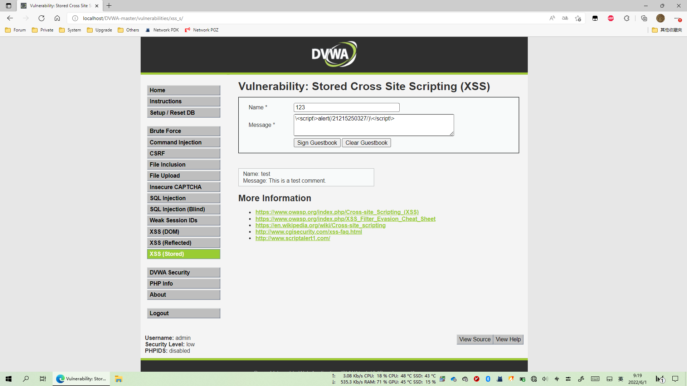

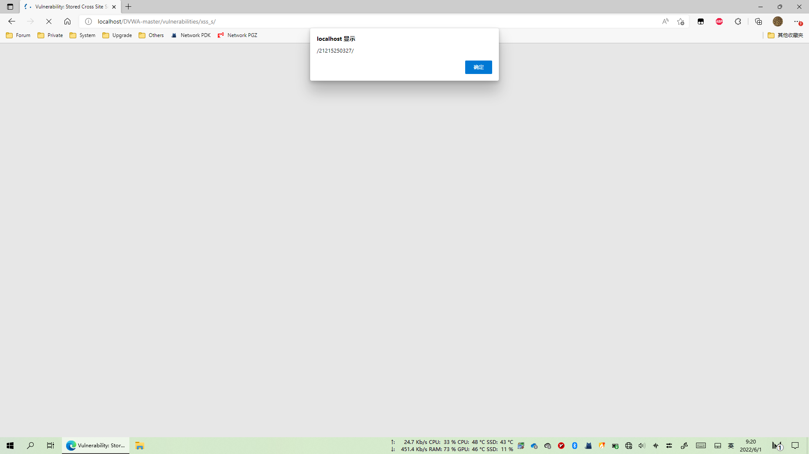


### Medium

#### 源代码

```php
<?php

if( isset( $_POST[ 'btnSign' ] ) ) {
    // Get input
    $message = trim( $_POST[ 'mtxMessage' ] );
    $name    = trim( $_POST[ 'txtName' ] );

    // Sanitize message input
    $message = strip_tags( addslashes( $message ) );
    $message = ((isset($GLOBALS["___mysqli_ston"]) && is_object($GLOBALS["___mysqli_ston"])) ? mysqli_real_escape_string($GLOBALS["___mysqli_ston"],  $message ) : ((trigger_error("[MySQLConverterToo] Fix the mysql_escape_string() call! This code does not work.", E_USER_ERROR)) ? "" : ""));
    $message = htmlspecialchars( $message );

    // Sanitize name input
    $name = str_replace( '<script>', '', $name );
    $name = ((isset($GLOBALS["___mysqli_ston"]) && is_object($GLOBALS["___mysqli_ston"])) ? mysqli_real_escape_string($GLOBALS["___mysqli_ston"],  $name ) : ((trigger_error("[MySQLConverterToo] Fix the mysql_escape_string() call! This code does not work.", E_USER_ERROR)) ? "" : ""));

    // Update database
    $query  = "INSERT INTO guestbook ( comment, name ) VALUES ( '$message', '$name' );";
    $result = mysqli_query($GLOBALS["___mysqli_ston"],  $query ) or die( '<pre>' . ((is_object($GLOBALS["___mysqli_ston"])) ? mysqli_error($GLOBALS["___mysqli_ston"]) : (($___mysqli_res = mysqli_connect_error()) ? $___mysqli_res : false)) . '</pre>' );

    //mysql_close();
}

?>
```


#### 代码分析

`strip_tags()`函数剥去字符串中的HTML、XML以及PHP的标签，但允许使用`<b>`标签。

`addslashes()`函数返回在预定义字符（单引号、双引号、反斜杠、NULL）之前添加反斜杠的字符串。

可以看到，由于对message参数使用了htmlspecialchars函数进行编码，因此无法再通过message参数注入XSS代码，但是对于name参数，只是简单过滤了`<script>`字符串，仍然存在存储型的XSS。


#### 漏洞利用

Name限制字符数量，尝试在Message中注入：`\<ScRipt\>alert(/21215250327/);\</ScRipt\>`，出现意料之中的失败；

将Name文本框的Maxsize改大

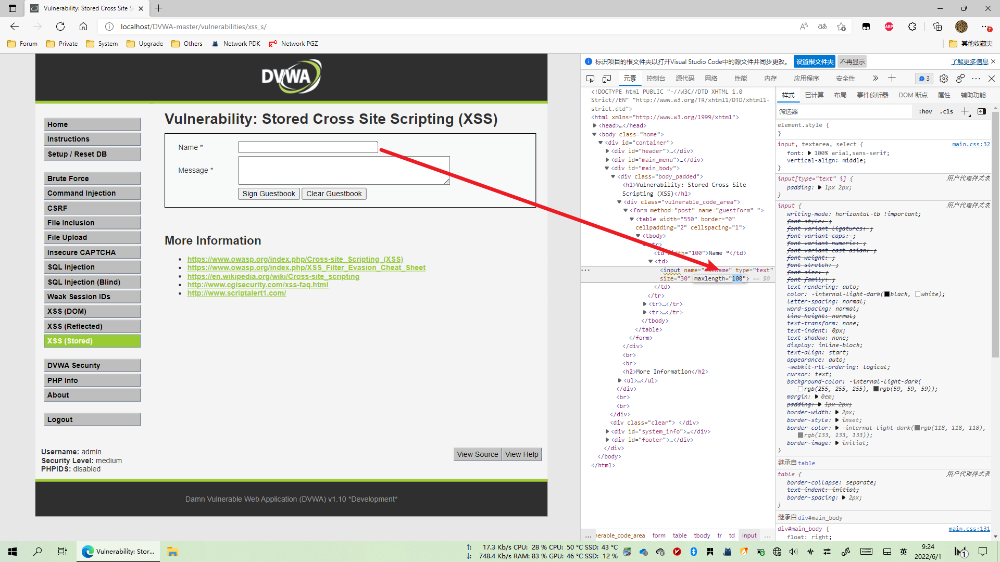

输入并Sign Guestbook

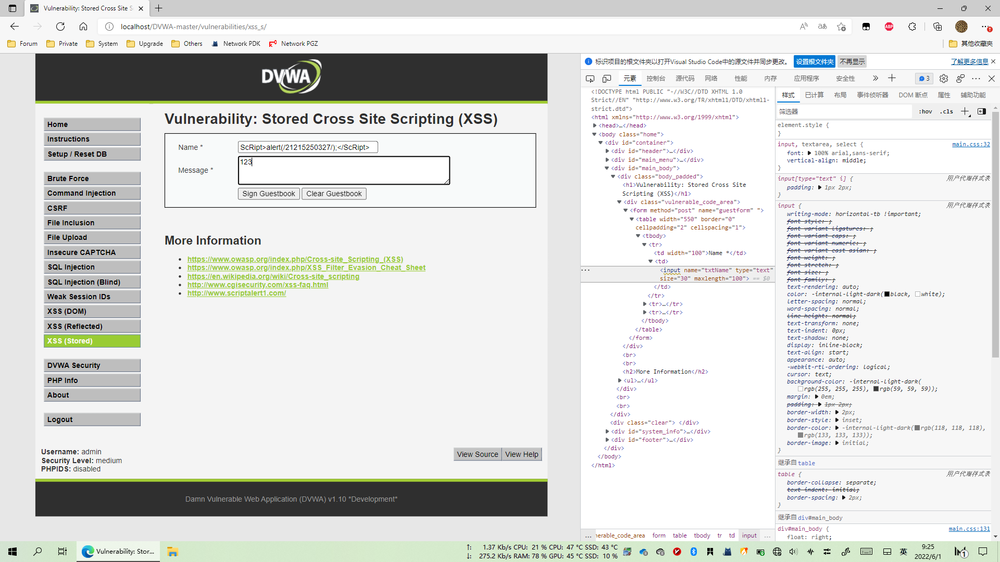

成功弹出 Alert

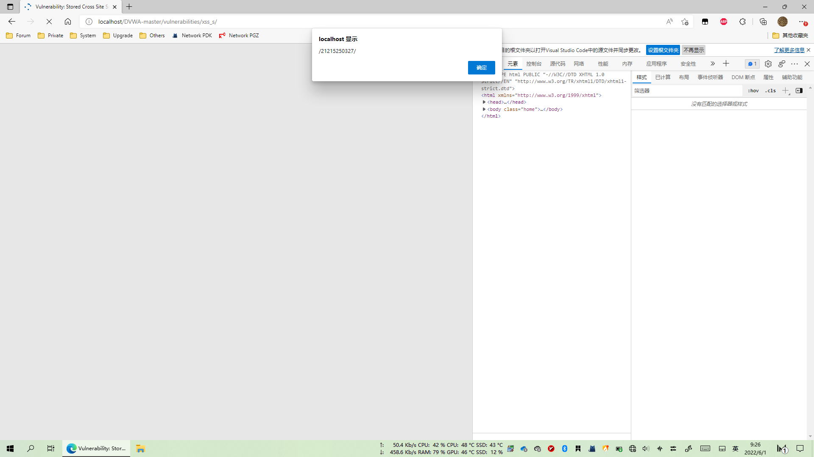


### High

#### 源代码

```php
<?php

if( isset( $_POST[ 'btnSign' ] ) ) {
    // Get input
    $message = trim( $_POST[ 'mtxMessage' ] );
    $name    = trim( $_POST[ 'txtName' ] );

    // Sanitize message input
    $message = strip_tags( addslashes( $message ) );
    $message = ((isset($GLOBALS["___mysqli_ston"]) && is_object($GLOBALS["___mysqli_ston"])) ? mysqli_real_escape_string($GLOBALS["___mysqli_ston"],  $message ) : ((trigger_error("[MySQLConverterToo] Fix the mysql_escape_string() call! This code does not work.", E_USER_ERROR)) ? "" : ""));
    $message = htmlspecialchars( $message );

    // Sanitize name input
    $name = preg_replace( '/<(.*)s(.*)c(.*)r(.*)i(.*)p(.*)t/i', '', $name );
    $name = ((isset($GLOBALS["___mysqli_ston"]) && is_object($GLOBALS["___mysqli_ston"])) ? mysqli_real_escape_string($GLOBALS["___mysqli_ston"],  $name ) : ((trigger_error("[MySQLConverterToo] Fix the mysql_escape_string() call! This code does not work.", E_USER_ERROR)) ? "" : ""));

    // Update database
    $query  = "INSERT INTO guestbook ( comment, name ) VALUES ( '$message', '$name' );";
    $result = mysqli_query($GLOBALS["___mysqli_ston"],  $query ) or die( '<pre>' . ((is_object($GLOBALS["___mysqli_ston"])) ? mysqli_error($GLOBALS["___mysqli_ston"]) : (($___mysqli_res = mysqli_connect_error()) ? $___mysqli_res : false)) . '</pre>' );

    //mysql_close();
}

?>
```

#### 代码分析

可以看到，这里使用正则表达式过滤了\<script\>标签，但是却忽略了img、iframe等其它危险的标签，因此name参数依旧存在存储型XSS。

#### 漏洞例用

改Name字段的Maxsize，输入\

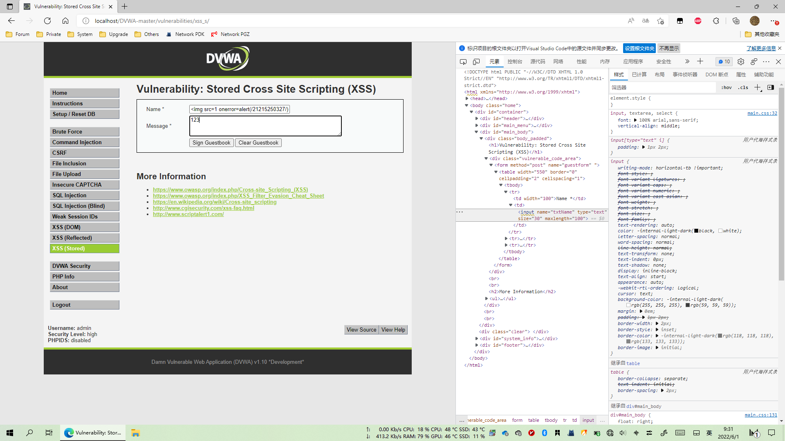

成功弹出Alert

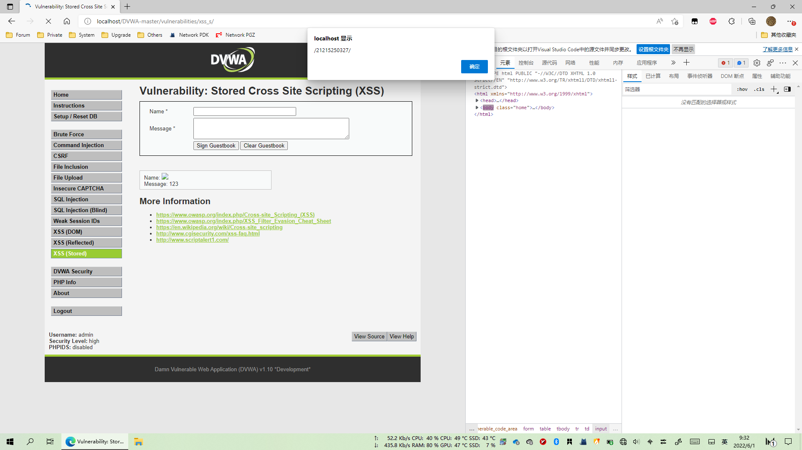


### Impossible

#### 源代码

```php
<?php

if( isset( $_POST[ 'btnSign' ] ) ) {
    // Check Anti-CSRF token
    checkToken( $_REQUEST[ 'user_token' ], $_SESSION[ 'session_token' ], 'index.php' );

    // Get input
    $message = trim( $_POST[ 'mtxMessage' ] );
    $name    = trim( $_POST[ 'txtName' ] );

    // Sanitize message input
    $message = stripslashes( $message );
    $message = ((isset($GLOBALS["___mysqli_ston"]) && is_object($GLOBALS["___mysqli_ston"])) ? mysqli_real_escape_string($GLOBALS["___mysqli_ston"],  $message ) : ((trigger_error("[MySQLConverterToo] Fix the mysql_escape_string() call! This code does not work.", E_USER_ERROR)) ? "" : ""));
    $message = htmlspecialchars( $message );

    // Sanitize name input
    $name = stripslashes( $name );
    $name = ((isset($GLOBALS["___mysqli_ston"]) && is_object($GLOBALS["___mysqli_ston"])) ? mysqli_real_escape_string($GLOBALS["___mysqli_ston"],  $name ) : ((trigger_error("[MySQLConverterToo] Fix the mysql_escape_string() call! This code does not work.", E_USER_ERROR)) ? "" : ""));
    $name = htmlspecialchars( $name );

    // Update database
    $data = $db->prepare( 'INSERT INTO guestbook ( comment, name ) VALUES ( :message, :name );' );
    $data->bindParam( ':message', $message, PDO::PARAM_STR );
    $data->bindParam( ':name', $name, PDO::PARAM_STR );
    $data->execute();
}

// Generate Anti-CSRF token
generateSessionToken();

?>
```

#### 代码分析

可以看到，通过使用htmlspecialchars函数将几种特殊字符转义为HTML实体，mysqli_real_escape_string函数对单引号'转义，防止进行SQL注入,彻底防治了存储型 XSS 的利用和危害。


