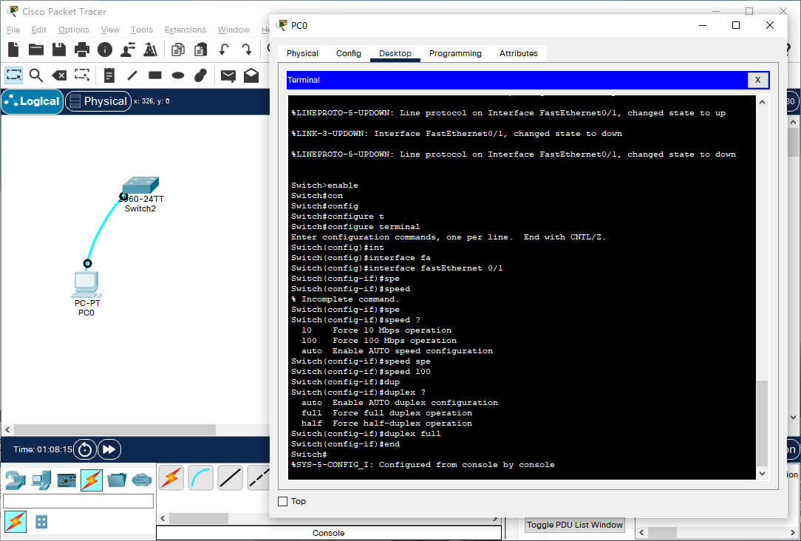

# 命令

1. 切入模式

```
Switch>							 					!用户模式
Switch>en											!特权模式
Switch>enable                       				!特权模式
Switch#config terminal           					!全局配置模式
Enter configuration commands, one per line.  End with CNTL/Z.
Switch(config)#interface fastethernet 0/1        	!进入交换机F0/1接口模式;此处0表示槽位，1表示具体端口号
Switch(config-if)#exit                           	!退回到上一级
Switch(config)#end                               	!直接回到特权模式
Switch(config)#^Z             						!CTRL+Z退回到特权模式
Switch(config)# line console 0						!控制台模式
```

2. 交换机基本操作

```
Switch>?      						!显示当前模式下所有可执行的命令
Switch#co?            			   	!显示当前模式下所有以co开头的命令
Switch#copy ?          			 	!显示copy命令可执行的参数
Switch#conf ter         			!交换机命令支持命令的简写
Switch(config)# hostname  switch1	!设置设备名
Router#show ip int b				!查看接口列表
Router#show mac-address-table		!查看MAC地址表
Router#reload						!重启
Router# show running-config			!查看所有配置 (Router#show run)
Router# copy running-config startup-config	            !保存设备配置 (Router#write)
Router(config)# int f0/0			                    !配置端口
Router(config-if)# ip add 192.168.1.254  255.255.255.0	!给路由器接口配置IP地址(二层交换机不支持)
Router(config-if)#no shutdown		!启用端口
Router(config-if)#shutdown			!禁用端口

Router(config-if)#int vlan 1		!配置vlan1
Router(config-if)#ip add 192.168.1.253 255.255.255.0	!配置VLAN IP
```

3. 远程登陆配置（括号内为视图）

```
Switch(config)#enable password	!设置进入特权模式的密码
Switch(config-line)				!设置通过Console端口连接设备/Telnet远程登陆时的密码

!设置Console连接设备密码
Switch(config)#line console 0
Switch(config-line)#password 123456
Switch(config)#login

!设置Telnet远程登录密码
Switch(config)#line vty 0 4
Switch(config-line)#password 123456
Switch(config)#login

!加密所有密码
Switch(config)#service password-encryption
```


# 实践

- PT中生成**交换机、终端设备**，并使用**配置线**相连，打开PC终端，即可配置交换机



```
Switch>enable								!进入特权模式
Switch#configure terminal					!进入全局配置模式
Enter configuration commands, one per line.  End with CNTL/Z.
Switch(config)#interface fastEthernet 0/1	!进入交换机F0/1接口模式;此处0表示槽位，1表示具体端口号
Switch(config-if)#speed ?					!speed命令的帮助信息
  10    Force 10 Mbps operation
  100   Force 100 Mbps operation
  auto  Enable AUTO speed configuration
Switch(config-if)#speed 100		!设置端口速率
Switch(config-if)#duplex ?		!duplex命令的帮助信息
  auto  Enable AUTO duplex configuration
  full  Force full duplex operation
  half  Force half-duplex operation
Switch(config-if)#duplex full	!设置双工模式:全双工
Switch(config-if)#end			!返回特权模式(当成回到根目录理解?)
Switch#
%SYS-5-CONFIG_I: Configured from console by console
```

- `show version` 查看当前版本

```
Switch#show version 
Cisco IOS Software, C2960 Software (C2960-LANBASEK9-M), Version 15.0(2)SE4, RELEASE SOFTWARE (fc1)
Technical Support: http://www.cisco.com/techsupport
Copyright (c) 1986-2013 by Cisco Systems, Inc.
Compiled Wed 26-Jun-13 02:49 by mnguyen

ROM: Bootstrap program is C2960 boot loader
BOOTLDR: C2960 Boot Loader (C2960-HBOOT-M) Version 12.2(25r)FX, RELEASE SOFTWARE (fc4)

Switch uptime is 39 minutes
System returned to ROM by power-on
System image file is "flash:c2960-lanbasek9-mz.150-2.SE4.bin"


This product contains cryptographic features and is subject to United
States and local country laws governing import, export, transfer and
use. Delivery of Cisco cryptographic products does not imply
third-party authority to import, export, distribute or use encryption.
Importers, exporters, distributors and users are responsible for
compliance with U.S. and local country laws. By using this product you
agree to comply with applicable laws and regulations. If you are unable
to comply with U.S. and local laws, return this product immediately.

A summary of U.S. laws governing Cisco cryptographic products may be found at:
http://www.cisco.com/wwl/export/crypto/tool/stqrg.html

If you require further assistance please contact us by sending email to
export@cisco.com.

cisco WS-C2960-24TT-L (PowerPC405) processor (revision B0) with 65536K bytes of memory.
Processor board ID FOC1010X104
Last reset from power-on
1 Virtual Ethernet interface
24 FastEthernet interfaces
2 Gigabit Ethernet interfaces
The password-recovery mechanism is enabled.

64K bytes of flash-simulated non-volatile configuration memory.
Base ethernet MAC Address       : 00:17:59:A7:51:80
Motherboard assembly number     : 73-10390-03
Power supply part number        : 341-0097-02
Motherboard serial number       : FOC10093R12
Power supply serial number      : AZS1007032H
Model revision number           : B0
Motherboard revision number     : B0
Model number                    : WS-C2960-24TT-L
System serial number            : FOC1010X104
Top Assembly Part Number        : 800-27221-02
Top Assembly Revision Number    : A0
Version ID                      : V02
CLEI Code Number                : COM3L00BRA
Hardware Board Revision Number  : 0x01


Switch Ports Model              SW Version            SW Image
------ ----- -----              ----------            ----------
*    1 26    WS-C2960-24TT-L    15.0(2)SE4            C2960-LANBASEK9-M


Configuration register is 0xF
```

- `show running-config` 显示当前配置信息

```
Switch#show running-config 
Building configuration...

Current configuration : 1104 bytes
!
version 15.0
no service timestamps log datetime msec
no service timestamps debug datetime msec
no service password-encryption
!
hostname Switch
!
!
!
!
!
!
spanning-tree mode pvst
spanning-tree extend system-id
!
interface FastEthernet0/1
 duplex full
 speed 100
!
interface FastEthernet0/2
!
 --More-- 
```

- 执行命令时若出现 `more` ,
  - 使用 "Ctrl + C" 中断显示
  - 使用 "Space" 或 "Enter" 继续显示