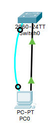

1. 新建PT拓扑图



2. 配置交换机管理IP地址

```
Switch(config)#interface vlan 1		!对整个vlan1进行配置和管理IP地址（注：此处IP地址必须和PC同一网段
Switch(config-if)#ip add...			
```

```
Switch>enable 
Switch#conf t	!相当于config terminal：进入全局配置模式
Enter configuration commands, one per line.  End with CNTL/Z.

!配置交换机的管理IP地址
Switch(config)# interface vlan 1	!默认情况下交换机所有端口都在vlan1
Switch(config-if)#ip address 192.168.1.1 255.255.255.0

!开启vlan1的状态
Switch(config-if)#no shutdown
Switch(config-if)#
%LINK-5-CHANGED: Interface Vlan1, changed state to up
%LINEPROTO-5-UPDOWN: Line protocol on Interface Vlan1, changed state to up

! 退回上一步
Switch(config-if)#exit
```

3. 配置用户登录密码

```
Switch(config)#enable password		!设置进入特权模式的密码
Switch(config)#line vty 0 4
Switch(config-line)#password 123456	!配置远程登陆密码
Switch(config)#login
```

```
!设置进入特权模式的登录密码
Switch(config)#enable password 123456

!设置Telnet远程登录密码
Switch(config)#line vty 0 4
Switch(config-line)#password 112233
Switch(config-line)#login
Switch(config-line)#end
Switch#
%SYS-5-CONFIG_I: Configured from console by console
```

4. 查看

```
Switch#show run							!相当于show running-config
Building configuration...

Current configuration : 1135 bytes
!
version 15.0
no service timestamps log datetime msec
no service timestamps debug datetime msec
no service password-encryption
!
hostname Switch
!
enable password 123456					!特权模式密码
!
!
!
!
!
!
spanning-tree mode pvst
spanning-tree extend system-id
!
interface FastEthernet0/1
......
interface FastEthernet0/24
!
interface GigabitEthernet0/1
!
interface GigabitEthernet0/2
!
interface Vlan1
 ip address 192.168.1.1 255.255.255.0	!vlan1的IP地址
!
!
!
!
line con 0
!
line vty 0 4
 password 112233						!远程登录密码
 login
line vty 5 15
 login
!
!
!
!
end
```

5. 设置PC1的IP地址

   IPv4 Address: 192.168.1.2

   Subnet Mask: 255.255.255.0

   Default Gateway: 192.168.1.1

6. 在PC1上配置交换机

```
!先ping一下通不通
Pinging 192.168.1.1 with 32 bytes of data:

Request timed out.
Reply from 192.168.1.1: bytes=32 time<1ms TTL=255
Reply from 192.168.1.1: bytes=32 time<1ms TTL=255
Reply from 192.168.1.1: bytes=32 time<1ms TTL=255

Ping statistics for 192.168.1.1:
    Packets: Sent = 4, Received = 3, Lost = 1 (25% loss),
Approximate round trip times in milli-seconds:
    Minimum = 0ms, Maximum = 0ms, Average = 0ms
    
!Telent连接
C:\>telnet 192.168.1.1
Trying 192.168.1.1 ...Open


User Access Verification

Password: 		!输入远程登录密码112233，无回显。
Switch>enable
Password: 		!输入特权模式密码123456，无回显。
Switch#conf t
Enter configuration commands, one per line.  End with CNTL/Z.
Switch(config)#exit

!查看
Switch#show run	!相当于show running-config
Building configuration...

Current configuration : 1135 bytes
!
version 15.0
no service timestamps log datetime msec
no service timestamps debug datetime msec
no service password-encryption
!
hostname Switch
!
enable password 123456
!
!
!
!
!
!
spanning-tree mode pvst
spanning-tree extend system-id
!
interface FastEthernet0/1
......
interface FastEthernet0/24
!
interface GigabitEthernet0/1
!
interface GigabitEthernet0/2
!
interface Vlan1
 ip address 192.168.1.1 255.255.255.0
!
!
!
!
line con 0
!
line vty 0 4
 password 112233
 login
line vty 5 15
 login
!
!
!
!
end
```

