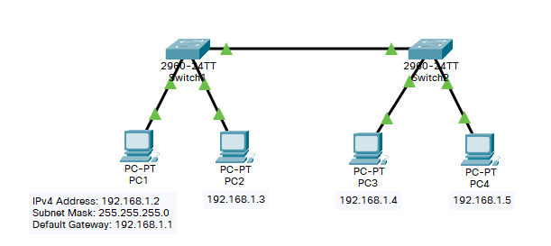

- 背景：

​        某一公司内财务部、销售部的PC通这2台交换机实现通信；要求财务部和销售部内的PC可以互通，但为了数据安全起见，销售部和财务部需要进行互相隔离，现要在交换机上做适当配置来实现这一目的。

- 原理

​        VLAN是指在 个物理网段内，进行逻辑的划分，划分成若干个虚拟局域网。VLAN最大的特性是不受物理位置的限制，可以进行灵活的划分。VLAN具备了一个物理网段所具备的特性。相同VLAN内的主机可以相瓦直接信，不同VLAN间的三机之间互相访问必须经由路由设备进行转发。广播数据包只可以在本VLAN内进行广播，不能传输到其他VLAN中。
Port VLAN是实现VLAN的方式之一，它利月交换机的端口进行VLAN的划分，一个端口只能属于一个VLAN.

​        Tag VLAN是基无交换机端口的另处一种类型，主要用工使交换机的相同Vlan内的主机之间可以直接迹间：…同时对无不同lan的主机进行隔离。Tag VLAN遵循IEEE802.1Q协议的标准。在使用配置了Tag VLAN的端口进行数据传输时，需要在数据帧内添加4个字节的802.1Q标签信息，用于标示该数据帧属于那个VLAN，便于对端交换机接收到数据帧后进行准确的过滤。

## 拓扑图及主机IP配置



## 划分VLAN、设置Tag VLAN Trunk

- 配置Switch1（Switch2同理，省略）

```
Switch>en									!进入特权模式
Switch#conf t								!进入全局配置模式
Enter configuration commands, one per line.  End with CNTL/Z.
Switch(config)#vlan 2						!划分VLAN2
Switch(config-vlan)#exit
Switch(config)#vlan 3						!划分VLAN3
Switch(config-vlan)#exit
Switch(config)#interface fa 0/1				!进入0/1端口(与PC1相连)
Switch(config-if)#switchport access vlan 2	!划分到VLAN2
Switch(config-if)#exit
Switch(config)#int fa 0/2					!进入0/2端口(与PC2相连)
Switch(config-if)#switchport access vlan 3	!划分到VLAN3
Switch(config-if)#exit
Switch(config)#interface fa 0/24			!进入0/24端口(与Switch2相连)
Switch(config-if)#switchport mode trunk 	!工作模式设置Trunk

Switch(config-if)#
%LINEPROTO-5-UPDOWN: Line protocol on Interface FastEthernet0/24, changed state to down
 
%LINEPROTO-5-UPDOWN: Line protocol on Interface FastEthernet0/24, changed state to up

Switch(config-if)#end
```


```
Switch(config-if)#switchport mode ?
  access   Set trunking mode to ACCESS unconditionally
  	!只能属于1个VLAN，且该端口不打tag，一般用于连接计算机端口；
  dynamic  Set trunking mode to dynamically negotiate access or trunk mode
  	! auto选项下：只有邻居交换机主动与自己协商时才会变成Trunk接口，所以它是一种被动模式，当邻居接口为Trunk/desirable之一时，才会成为Trunk。如果不能形成trunk模式，则工作在access模式。
  	! desirable选项下：主动与对协商成为Trunk接口的可能性，如果邻居接口模式为Trunk/desirable/auto之一，则接口将变成trunk接口工作。如果不能形成trunk模式，则工作在access模式。
  trunk    Set trunking mode to TRUNK unconditionally
  	!可以允许多个VLAN通过，且该端口都是打tag的，一般用于交换机之间的连接；
```

```
Switch#show vlan							!显示VLAN
VLAN Name                             Status    Ports
---- -------------------------------- --------- -------------------------------
1    default                          active    Fa0/3, Fa0/4, Fa0/5, Fa0/6
                                                Fa0/7, Fa0/8, Fa0/9, Fa0/10
                                                Fa0/11, Fa0/12, Fa0/13, Fa0/14
                                                Fa0/15, Fa0/16, Fa0/17, Fa0/18
                                                Fa0/19, Fa0/20, Fa0/21, Fa0/22
                                                Fa0/23, Gig0/1, Gig0/2
2    VLAN0002                         active    Fa0/1
3    VLAN0003                         active    Fa0/2
1002 fddi-default                     active    
1003 token-ring-default               active    
1004 fddinet-default                  active    
1005 trnet-default                    active    

VLAN Type  SAID       MTU   Parent RingNo BridgeNo Stp  BrdgMode Trans1 Trans2
---- ----- ---------- ----- ------ ------ -------- ---- -------- ------ ------
1    enet  100001     1500  -      -      -        -    -        0      0
2    enet  100002     1500  -      -      -        -    -        0      0
3    enet  100003     1500  -      -      -        -    -        0      0
1002 fddi  101002     1500  -      -      -        -    -        0      0   
1003 tr    101003     1500  -      -      -        -    -        0      0   
1004 fdnet 101004     1500  -      -      -        ieee -        0      0   
1005 trnet 101005     1500  -      -      -        ibm  -        0      0   
 --More-- 
```

- 配置后：
  - VLAN2：PC1、PC3
  - VLAN3：PC2、PC4

## 测试

- 从PC1 (192.168.1.2) 测试与PC2、PC3、PC4的连通性

```
Packet Tracer PC Command Line 1.0
C:\>ping 192.168.1.3		!与PC2测试

Pinging 192.168.1.3 with 32 bytes of data:

Request timed out.

Ping statistics for 192.168.1.3:
    Packets: Sent = 1, Received = 0, Lost = 1 (100% loss),

C:\>ping 192.168.1.4		!与PC3测试

Pinging 192.168.1.4 with 32 bytes of data:

Reply from 192.168.1.4: bytes=32 time<1ms TTL=128

Ping statistics for 192.168.1.4:
    Packets: Sent = 1, Received = 1, Lost = 0 (0% loss),
Approximate round trip times in milli-seconds:
    Minimum = 0ms, Maximum = 0ms, Average = 0ms

C:\>ping 192.168.1.5		!与PC4测试

Pinging 192.168.1.5 with 32 bytes of data:

Request timed out.

Ping statistics for 192.168.1.5:
    Packets: Sent = 1, Received = 0, Lost = 1 (100% loss),

```

- 从PC4 (192.168.1.5) 测试与PC1、PC2、PC3的连通性

```
C:\>ping 192.168.1.2		!与PC1测试

Pinging 192.168.1.2 with 32 bytes of data:

Request timed out.

Ping statistics for 192.168.1.2:
    Packets: Sent = 1, Received = 0, Lost = 1 (100% loss),

C:\>ping 192.168.1.3		!与PC2测试

Pinging 192.168.1.3 with 32 bytes of data:

Reply from 192.168.1.3: bytes=32 time<1ms TTL=128

Ping statistics for 192.168.1.3:
    Packets: Sent = 1, Received = 1, Lost = 0 (0% loss),
Approximate round trip times in milli-seconds:
    Minimum = 0ms, Maximum = 0ms, Average = 0ms

C:\>ping 192.168.1.4		!与PC3测试

Pinging 192.168.1.4 with 32 bytes of data:

Request timed out.

Ping statistics for 192.168.1.4:
    Packets: Sent = 1, Received = 0, Lost = 1 (100% loss),

```

