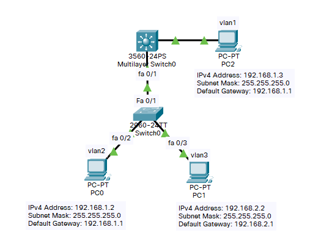

- 背景

​        某企业有两个主要部门，技术部和销售部，分处于不同的办公室，为了安全和便于管理对两个部门的主机进行了VLAN的划分，技术部和销售部分处于不同的VLAN。现由于业务的需求需要销售部和技术部的主机能够相互访问，获得相应的资源，两个部门的交换机通过一台三层交换机进行了连接。

- 原理

​        三层交换机具备网络层的功能，实现VLAN相互访问的原理是：利用三层交换机的路由功能，通过识别数据包的IP地址，查找路由表进行选路转发。三层交换机利用直连路由可以实现不同VLAN之间的互相访问。三层交换机给接口配置IP地址，采用SVI（交换虚拟接口）的方式实现VLAN间互连.SVI是指为交换机中的VLAN创建虚拟接口，并且配置IP地址。

## 拓扑图与主机配置



## 配置 双层交换机(2960)

- 划分VLAN

```
Switch>en										!特权模式
Switch#conf t									!全局配置
Enter configuration commands, one per line.  End with CNTL/Z.
Switch(config)#vlan 2							!划分vlan2
Switch(config-vlan)#exit
Switch(config)#vlan 3							!划分vlan3
Switch(config-vlan)#exit
Switch(config)#int fa 0/2						!配置0/2口
Switch(config-if)#switchport  access vlan 2		!划分到vlan2
Switch(config-if)#int fa 0/3					!配置0/3口
Switch(config-if)#sw
Switch(config-if)#switchport access vlan 3		!划分到vlan3
Switch(config-if)#int fa 0/1					!配置0/1口
Switch(config-if)#switchport mode trunk 		!切换工作模式

Switch(config-if)#
%LINEPROTO-5-UPDOWN: Line protocol on Interface FastEthernet0/1, changed state to down

%LINEPROTO-5-UPDOWN: Line protocol on Interface FastEthernet0/1, changed state to up

! 查看Vlan表
Switch#show vlan

VLAN Name                             Status    Ports
---- -------------------------------- --------- -------------------------------
1    default                          active    Fa0/4, Fa0/5, Fa0/6, Fa0/7
                                                Fa0/8, Fa0/9, Fa0/10, Fa0/11
                                                Fa0/12, Fa0/13, Fa0/14, Fa0/15
                                                Fa0/16, Fa0/17, Fa0/18, Fa0/19
                                                Fa0/20, Fa0/21, Fa0/22, Fa0/23
                                                Fa0/24, Gig0/1, Gig0/2
2    VLAN0002                         active    Fa0/2
3    VLAN0003                         active    Fa0/3
1002 fddi-default                     active    
1003 token-ring-default               active    
1004 fddinet-default                  active    
1005 trnet-default                    active    

VLAN Type  SAID       MTU   Parent RingNo BridgeNo Stp  BrdgMode Trans1 Trans2
---- ----- ---------- ----- ------ ------ -------- ---- -------- ------ ------
1    enet  100001     1500  -      -      -        -    -        0      0
2    enet  100002     1500  -      -      -        -    -        0      0
3    enet  100003     1500  -      -      -        -    -        0      0
1002 fddi  101002     1500  -      -      -        -    -        0      0   
 --More-- 
```

## 配置 三层交换机(3560)

- 划分VLAN

```
Switch>en					!权限模式
Switch#conf t				!全局配置
Enter configuration commands, one per line.  End with CNTL/Z.
Switch(config)#vlan 2		!划分vlan2
Switch(config-vlan)#exit
Switch(config)#vlan 3		!划分vlan3
Switch(config-vlan)#exit
Switch(config)#int fa 0/1	!配置f0/1口

Switch(config-if)#switchport mode trunk 
Command rejected: An interface whose trunk encapsulation is "Auto" can not be configured to "trunk" mode.
! 出现上述错误，先给端口封装dot1Q协议，再切换为trunk模式，命令如下
Switch(config-if)#switchport trunk encapsulation dot1q
! 或先转换为acc模式，再转为trunk模式，命令如下
Switch(config-if)#switchport mode access

Switch(config-if)#switchport mode trunk
Switch(config-if)#exit
Switch(config)#ip routing	!启用交换机的路由功能
```

- 创建VLAN2、VLAN3的虚接口，配置其IP地址

```
Switch(config)#int vlan 2
Switch(config-if)#ip address 192.168.1.1 255.255.255.0
Switch(config-if)#no shutdown
Switch(config-if)#exit
Switch(config)#int vlan 3
Switch(config-if)#ip address 192.168.2.1 255.255.255.0
Switch(config-if)#no shut
Switch(config-if)#exit
Switch(config)#end
Switch#
%SYS-5-CONFIG_I: Configured from console by console
```

- 查看路由表，可以看到两条直连线路

```
Switch#show ip rou
Codes: C - connected, S - static, I - IGRP, R - RIP, M - mobile, B - BGP
       D - EIGRP, EX - EIGRP external, O - OSPF, IA - OSPF inter area
       N1 - OSPF NSSA external type 1, N2 - OSPF NSSA external type 2
       E1 - OSPF external type 1, E2 - OSPF external type 2, E - EGP
       i - IS-IS, L1 - IS-IS level-1, L2 - IS-IS level-2, ia - IS-IS inter area
       * - candidate default, U - per-user static route, o - ODR
       P - periodic downloaded static route

Gateway of last resort is not set

C    192.168.1.0/24 is directly connected, Vlan2
C    192.168.2.0/24 is directly connected, Vlan3

Switch#
```

- 将f0/2划分到vlan2

```
Switch(config)#int fa 0/2
Switch(config-if)#switchport access vlan 2
Switch(config-if)#exit
Switch(config)# end
Switch#show vlan

VLAN Name                             Status    Ports
---- -------------------------------- --------- -------------------------------
1    default                          active    Fa0/3, Fa0/4, Fa0/5, Fa0/6
                                                Fa0/7, Fa0/8, Fa0/9, Fa0/10
                                                Fa0/11, Fa0/12, Fa0/13, Fa0/14
                                                Fa0/15, Fa0/16, Fa0/17, Fa0/18
                                                Fa0/19, Fa0/20, Fa0/21, Fa0/22
                                                Fa0/23, Fa0/24, Gig0/1, Gig0/2
2    VLAN0002                         active    Fa0/2
3    VLAN0003                         active    
1002 fddi-default                     active    
1003 token-ring-default               active    
1004 fddinet-default                  active    
1005 trnet-default                    active    

VLAN Type  SAID       MTU   Parent RingNo BridgeNo Stp  BrdgMode Trans1 Trans2
---- ----- ---------- ----- ------ ------ -------- ---- -------- ------ ------
1    enet  100001     1500  -      -      -        -    -        0      0
2    enet  100002     1500  -      -      -        -    -        0      0
3    enet  100003     1500  -      -      -        -    -        0      0
1002 fddi  101002     1500  -      -      -        -    -        0      0   
 --More-- 
```

## 测试

- PC2 (192.168.1.3) 分别 ping PC0 (192.168.1.2)、PC1 (192.168.2.2)

```
C:\>ping 192.168.1.2

Pinging 192.168.1.2 with 32 bytes of data:

Reply from 192.168.1.2: bytes=32 time<1ms TTL=128

Ping statistics for 192.168.1.2:
    Packets: Sent = 1, Received = 1, Lost = 0 (0% loss),
Approximate round trip times in milli-seconds:
    Minimum = 0ms, Maximum = 0ms, Average = 0ms

C:\>ping 192.168.2.2

Pinging 192.168.2.2 with 32 bytes of data:

Reply from 192.168.2.2: bytes=32 time<1ms TTL=127

Ping statistics for 192.168.2.2:
    Packets: Sent = 1, Received = 1, Lost = 0 (0% loss),
Approximate round trip times in milli-seconds:
    Minimum = 0ms, Maximum = 0ms, Average = 0ms

```

