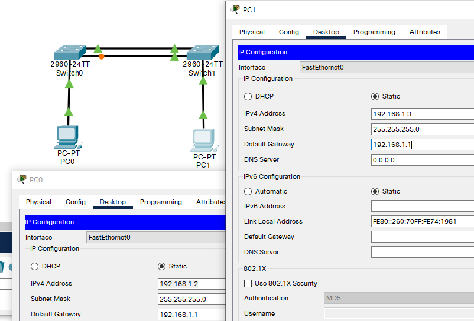
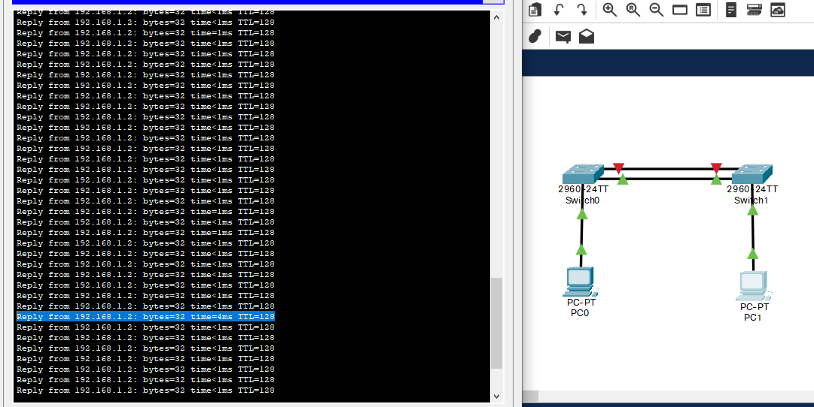

## 例

- 背景
  - 学校为了开展计算机教学和网络小公，建立了一个计算机教室和一个校办公区，这两处的计算机网络通过两台交换机互连组成内部校园网，为了提高网络的可靠性，作为网络管理员，你要用2条链路将交换机互连，地要求在交换机上做适当凹置，使网络避免环路。
- 原理
  - 生成树协议 (spanning-tree)，作用是再交换网络中提供冗余备份链路，并接解决交换网络中的环路问题
  - 成树协议是利用SPA算法，在存在交换环路的网络中生成一个没有环路的树形网络，运用该算法将交换网络的冗余备份链路从逻辑上断开，当生链路出现故障时，能够自动的切换到备份链路，保证数据的正常转发；生成树协议版本：STP，RSTP（快速生成树）、MSTP（多生成树协议）
  - 生成树协议的特点收敛时间长。从主要链路出现故障到切换至快速生成树在生成树协议的基础上增加了两种端口角色；替接端口和备份端口，分别做为根端口和指定端口的冗余端口，当根端口出现故障时，冗条端口不需要经过50秒的收敛时间，可以直接切换到替换端口或备份端口，从而实现RSTP协议小于1的快速收敛
- 步骤
  - 新建packet tracer拓扑图（如图）
  - 默认情况下STP协议启用的。通过两台交换机之间传送BPDU协议数据单元，选出根交换机、根端口等，以便确定端口的转发状态。上图中标记为黄色的端口处于block堵塞状态设置sto；
  - 查看交换机show spanning-tree状态，了解根交换机和根端口情况；
  - 通过更改交换机生成树的优先级spanning-tree vlan * priority 4096可以变化根交换机的角色。
  - 测试：当主链路处于down状态时候，能够自动的切换到备份链路，保证数据的正常转发。

## 拓扑及主机IP配置



## 设置交换机

1. 查看交换机工作状态（此时Switch0的Fa/02处于堵塞状态）

```
Switch>en
Switch#show spanning-tree 				!查看生成树协议
VLAN0001
  Spanning tree enabled protocol ieee
  Root ID    Priority    32769
             Address     00D0.581B.334D
             Cost        19
             Port        1(FastEthernet0/1)
             Hello Time  2 sec  Max Age 20 sec  Forward Delay 15 sec

  Bridge ID  Priority    32769  (priority 32768 sys-id-ext 1)
             Address     00E0.B009.CCA9
             Hello Time  2 sec  Max Age 20 sec  Forward Delay 15 sec
             Aging Time  20

Interface        Role Sts Cost      Prio.Nbr Type
---------------- ---- --- --------- -------- --------------------------------
Fa0/10           Desg FWD 19        128.10   P2p
Fa0/1            Root FWD 19        128.1    P2p
Fa0/2            Altn BLK 19        128.2    P2p

```

- 根交换机：Switch1
  - 根端口：Fa 0/1
  - 备端口：Fa 0/2

2. 更改设备名

```
Switch#conf t
Enter configuration commands, one per line.  End with CNTL/Z.
Switch(config)#hostname S0
```

3. 将 Fa0/10 (与PC0相连) 划分到VLAN 10

```
S0(config)#int fa0/10
S0(config-if)#switchport access vlan 10
% Access VLAN does not exist. Creating vlan 10
S0(config-if)#exit
```

4. 将Fa 0/1、Fa 0/2 工作模式都改为 trunk

```
S0(config)#int range fa 0/1 - 2
S0(config-if-range)#switchport mode trunk
S0(config-if-range)#exit
```

5. 将生成树模式改为快速生成树协议

```
S0(config)#spanning-tree mode rapid-pvst 
S0(config)#end
```

6. **S1 同理**
7. 查看spanning-tree

```
S1#show spanning-tree 
VLAN0001
  Spanning tree enabled protocol rstp
  Root ID    Priority    32769
             Address     00D0.581B.334D
             This bridge is the root
             Hello Time  2 sec  Max Age 20 sec  Forward Delay 15 sec

  Bridge ID  Priority    32769  (priority 32768 sys-id-ext 1)
             Address     00D0.581B.334D
             Hello Time  2 sec  Max Age 20 sec  Forward Delay 15 sec
             Aging Time  20

Interface        Role Sts Cost      Prio.Nbr Type
---------------- ---- --- --------- -------- --------------------------------
Fa0/1            Desg FWD 19        128.1    P2p
Fa0/2            Desg FWD 19        128.2    P2p

VLAN0010
  Spanning tree enabled protocol rstp
  Root ID    Priority    32778
             Address     00D0.581B.334D
             This bridge is the root
             Hello Time  2 sec  Max Age 20 sec  Forward Delay 15 sec

  Bridge ID  Priority    32778  (priority 32768 sys-id-ext 10)
             Address     00D0.581B.334D
             Hello Time  2 sec  Max Age 20 sec  Forward Delay 15 sec
 --More-- 
```

## 测试

1. PC1 ping PC0

```
C:\>ping -t 192.168.1.2
```

2. 确认可通后，进入S1，将Fa 0/1关闭

```
S1#conf t
Enter configuration commands, one per line.  End with CNTL/Z.
S1(config)#int fa 0/1
S1(config-if)#shut

S1(config-if)#
%LINK-5-CHANGED: Interface FastEthernet0/1, changed state to administratively down

%LINEPROTO-5-UPDOWN: Line protocol on Interface FastEthernet0/1, changed state to down
```

3. 查看关闭 Fa 0/1 后 PC1 与 PC0 是否依然能正常通信



