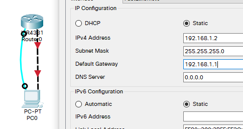
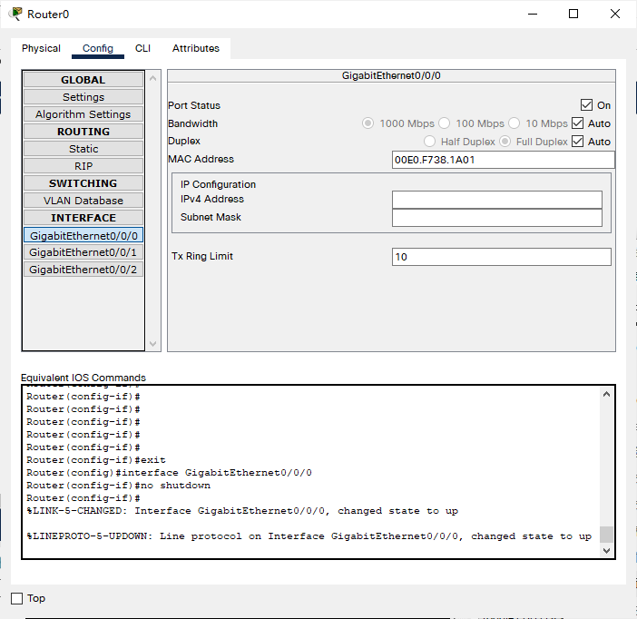
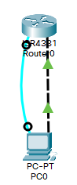

## 例

- 背景
  - 你是某公司新进的网管，公司要求你熟悉网络产品，首先要求你登录路由器，了解、掌握路由器的命令行操作；
  - 作为网络管理员，你第一次在设备机房对路由器进行了初次配置后，希望以后在办公室或出差时也可以对设各进行远程管理，现要在路由器上做适当配置。
- 原理
  - 路由器的管理方式基本分为两种：带内管理和带外管理。通过路山器的Console口管理路山器属于带外管理，不占用路由器的网络接口，其特点是需要使用配置线缆，近距离配置。第一次配置时必须利用Console端口进行配置。

## 拓扑与主机IP配置

- 注：用 直连线(实线)  /  交叉线(虚线) 均可



## 路由器配置

- 注：
  - 交换机端口默认启用
  - 路由器端口默认禁用
    - 此处再图形界面下直接启用 0/0 接口（与PC0相连）



- 路由器拥有动态路由配置功能，如RIP、OSPF

```
Router#conf t
Enter configuration commands, one per line.  End with CNTL/Z.

Router(config)#router rip ?
  <cr>
Router(config)#router rip 
Router(config-router)#exit

Router(config)#router ospf ?
  <1-65535>  Process ID
Router(config)#router ospf 1
OSPF process 1 cannot start. There must be at least one "up" IP interface
Router(config-router)#exit
```

- 配置特权模式密码

```
Router(config)#hostname R0
R0(config)#enable secret 112233		!设置特权模式登录密码
R0(config)#exit

R0>en								!重新进入
Password: 
R0#
```

- 配置telnet登录密码

```
R0(config)#line vty 0 4
R0(config-line)#pass
R0(config-line)#password 123456
R0(config-line)#login
R0(config-line)#exit
```

- 配置接口IP地址

```
R0(config)#interface gigabitEthernet 0/0/0
R0(config-if)#ip address 192.168.1.1 255.255.255.0
R0(config-if)#no shut
R0(config-if)#end
R0#
%SYS-5-CONFIG_I: Configured from console by console
```

- 此时，主机与路由器的连接状态指示已变为绿色



## 测试

- 在 PC0 中ping网关

```
C:\>ping 192.168.1.1

Pinging 192.168.1.1 with 32 bytes of data:

Reply from 192.168.1.1: bytes=32 time<1ms TTL=255
Reply from 192.168.1.1: bytes=32 time<1ms TTL=255

Ping statistics for 192.168.1.1:
    Packets: Sent = 2, Received = 2, Lost = 0 (0% loss),
Approximate round trip times in milli-seconds:
    Minimum = 0ms, Maximum = 0ms, Average = 0ms

Control-C
^C
```

- 尝试telnet登录，并进入特权模式

```
C:\>telnet 192.168.1.1
Trying 192.168.1.1 ...Open


User Access Verification

Password: 
R0>en
Password: 
R0#
```

