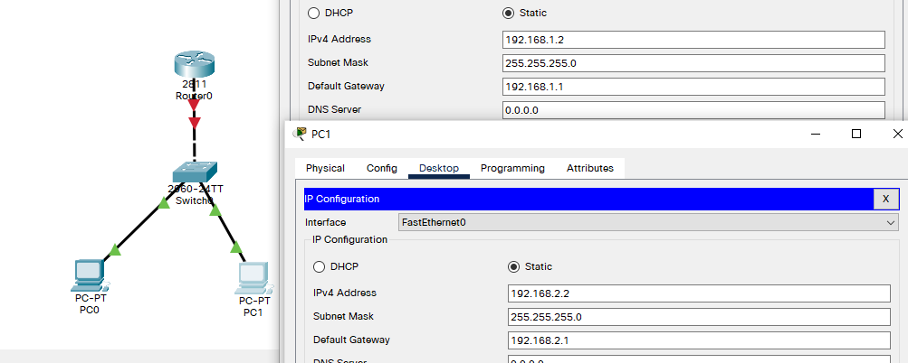

## 例

- 目标
  - 掌握单臂路由配置方法；通过单臂路由实现不同VLAN间互相通信；

- 背景
  - 某企业有两个主要部门，技术部和销售部，分处于不同的办公室，为了安全和便于管理对两个部门的主机进行了VLAN的划分，技术部和销售部分处于不同的VLAN，现由于业务的需求需要销售部和技术部的主机能够相互访问，获得相应的资源，两个部门的交换机通过一台路由器进行了连接。
- 原理
  - 单臂路由：是为实现VLAN间通信的三层网络设备路由器，它只需要一个以太接口，通过创建子接口可以承担所有VLAN的网关，而在不同的VLAN间转发数据。
- 步骤
  - 新建packet tracer拓扑图（如图）
  - 当交换机设置成两个vlan时，逻辑上已经成为两个网络，广播被隔离了。两个vlan的网络要通信，必须通过路由器，如果接入路由器的，个物理端口，则必须有两个子按口分别与两个vlan对应，同时还要求与路由器相联的交换机的端口f/1要设置为trunk，因为这个口要通过两个vlan的数据包。
  - 检查设置情况，应该能正确的看到van和trunk信息。
  - 计算机的网关分别指向路由器的子接口。
  - 配置子接口，开启路由器物理接口。
  - 默认封装为dot1q协议。
  - 配置路由器子接口ip地址。

## 拓扑与主机IP配置



## 两层交换机配置

- 划分vlan与更改工作模式

```
Switch>en
Switch#conf t									!进入全局配置
Enter configuration commands, one per line.  End with CNTL/Z.
Switch(config)#vlan 2
Switch(config-vlan)#exit
Switch(config)#vlan 3
Switch(config-vlan)#exit
Switch(config)#in fa 0/2
Switch(config-if)#switchport access vlan 2		!将fa0/2划分到vlan2
Switch(config-if)#exit
Switch(config)#int fa 0/3
Switch(config-if)#switchport access vlan 3		!将fa0/3划分到vlan3
Switch(config-if)#int fa 0/1
Switch(config-if)#switchport mode trunk 		!将fa0/1工作模式改为trunk
```

## 路由器配置

- 启用端口

```
Would you like to enter the initial configuration dialog? [yes/no]: n


Press RETURN to get started!


Router>en
Router#conf t
Enter configuration commands, one per line.  End with CNTL/Z.
Router(config)#int fa 0/0
Router(config-if)#no shut		!启用 fa0/0端口

Router(config-if)#
%LINK-5-CHANGED: Interface FastEthernet0/0, changed state to up

%LINEPROTO-5-UPDOWN: Line protocol on Interface FastEthernet0/0, changed state to up

Router(config-if)#exit
```

- 子接口配置
  - 注：此处接口地址即主机网关

```
Router(config)#interface fastEthernet 0/0.1					!进入0/0.1子接口
Router(config-subif)#
%LINK-5-CHANGED: Interface FastEthernet0/0.1, changed state to up

%LINEPROTO-5-UPDOWN: Line protocol on Interface FastEthernet0/0.1, changed state to up

Router(config-subif)#encapsulation dot1Q 2					!更改封装模式为dot1Q 末尾参数为vlan号？
Router(config-subif)#ip address 192.168.1.1 255.255.255.0	!设置IP地址
Router(config-subif)#exit


Router(config)#int fa 0/0.2									!进入0/0.2子接口
Router(config-subif)#
%LINK-5-CHANGED: Interface FastEthernet0/0.2, changed state to up

%LINEPROTO-5-UPDOWN: Line protocol on Interface FastEthernet0/0.2, changed state to up

Router(config-subif)#encapsulation dot1Q 3					!更改封装模式为dot1Q 末尾参数为vlan号？
Router(config-subif)#ip add
Router(config-subif)#ip address 192.168.2.1 255.255.255.0	!设置IP地址
Router(config-subif)#end


```

- 查看路由表
  - 可以看到直连路由

```
Router#show ip route 
Codes: L - local, C - connected, S - static, R - RIP, M - mobile, B - BGP
       D - EIGRP, EX - EIGRP external, O - OSPF, IA - OSPF inter area
       N1 - OSPF NSSA external type 1, N2 - OSPF NSSA external type 2
       E1 - OSPF external type 1, E2 - OSPF external type 2, E - EGP
       i - IS-IS, L1 - IS-IS level-1, L2 - IS-IS level-2, ia - IS-IS inter area
       * - candidate default, U - per-user static route, o - ODR
       P - periodic downloaded static route

Gateway of last resort is not set

     192.168.1.0/24 is variably subnetted, 2 subnets, 2 masks
C       192.168.1.0/24 is directly connected, FastEthernet0/0.1
L       192.168.1.1/32 is directly connected, FastEthernet0/0.1
     192.168.2.0/24 is variably subnetted, 2 subnets, 2 masks
C       192.168.2.0/24 is directly connected, FastEthernet0/0.2
L       192.168.2.1/32 is directly connected, FastEthernet0/0.2
```

## 测试能否通信

- 从 PC0 ping 网关

```
C:\>ping 192.168.1.1

Pinging 192.168.1.1 with 32 bytes of data:

Reply from 192.168.1.1: bytes=32 time<1ms TTL=255
Reply from 192.168.1.1: bytes=32 time<1ms TTL=255
Reply from 192.168.1.1: bytes=32 time<1ms TTL=255
Reply from 192.168.1.1: bytes=32 time<1ms TTL=255

Ping statistics for 192.168.1.1:
    Packets: Sent = 4, Received = 4, Lost = 0 (0% loss),
Approximate round trip times in milli-seconds:
    Minimum = 0ms, Maximum = 0ms, Average = 0ms
```

- 从 PC0 ping PC1

```
Pinging 192.168.2.2 with 32 bytes of data:

Request timed out.
Reply from 192.168.2.2: bytes=32 time<1ms TTL=127
Reply from 192.168.2.2: bytes=32 time<1ms TTL=127
Reply from 192.168.2.2: bytes=32 time<1ms TTL=127

Ping statistics for 192.168.2.2:
    Packets: Sent = 4, Received = 3, Lost = 1 (25% loss),
Approximate round trip times in milli-seconds:
    Minimum = 0ms, Maximum = 0ms, Average = 0ms
```

