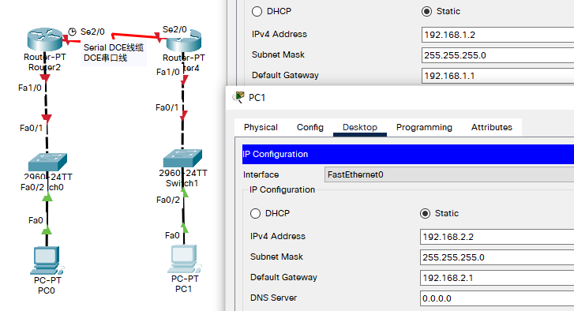

## 例

- 目标
  - 掌握静态路由的配置方法和技巧；
  - 掌握通过静态路由方式实现网络的连通性：
  - 熟悉广域网线缆的连接方式；
- 背景
  - 学校有新旧两个校区，每个校区是个独立的局域网，为了使新旧校区能够正常相互通讯，共享资源。每个校区出口利用一台路山器进行连接，两台路由器间学校申请了一条2M的DDN专线进行相连，要求你做适当配置实现两个校区间的正常相互访问。
- 原理
  - 路由器属于网路层设备，能够根据IP包头的信息，选择一条最佳路径，将数据包转发出去。实现不同网段的主机之间的互相访问。路由器是根据路由表进行选路和转发的。而路由表里就是由一条条路由信息组成。
  - 生成路由表主要有两种方法：手工配置和动态配置，即静态路由协议配置和动态路由协议配置。
  - 静态路由是指由网络管理员手工配置的路由信息。
  - 静念路由除了具有简单、高效、可靠的优点外，它的另一个好处是网络安全保密性高。
  - 缺省路由可以看作是静念路由的一种特殊情况。当数据在查找路由表时，没有找到和目标相匹配的路由表项时，为数据指定的路由。
- 步骤
  - 新建packet tracer拓扑图（如图）
    - 在路由器R1，R2 配置接口的IP地址和R1串口上的时钟频率；
    - 查看路由器生成的直连路由：
    - 在路由器R1，R2 配置静态路由；
    - 验证R1，R2上的静态路由配置；
    - 将PC1，PC2主机默认网关分别设置为与路由器接口F1/0 IP地址。
    - PC1，PC2主机之间可以互相通信；

## 拓扑与主机IP配置



## 配置路由器

- R0

```
Router>en
Router#conf t
Enter configuration commands, one per line.  End with CNTL/Z.
Router(config)#hostname R0
R0(config)#int fa 1/0
R0(config-if)#no shut

R0(config-if)#
%LINK-5-CHANGED: Interface FastEthernet1/0, changed state to up

%LINEPROTO-5-UPDOWN: Line protocol on Interface FastEthernet1/0, changed state to up

R0(config-if)#ip address 192.168.1.1 255.255.255.0
R0(config-if)#exit
R0(config)#int serial 2/0
R0(config-if)#ip address 192.168.3.1 255.255.255.0
R0(config-if)#clock rate 64000						!配置时钟频率
R0(config-if)#int ser 2/0
R0(config-if)#no shut

R0(config-if)#
%LINK-5-CHANGED: Interface Serial2/0, changed state to up

%LINEPROTO-5-UPDOWN: Line protocol on Interface Serial2/0, changed state to up

R0(config-if)#end
R0#
%SYS-5-CONFIG_I: Configured from console by console
```

- R1 基本同理，但因为 R0 已配置 IP地址 和 时钟频率 ，故 R1 无需设置时钟频率
  - 设置完成后查看路由表，可以看到有两条直连路由

```
Router>en
Router#conf t
Enter configuration commands, one per line.  End with CNTL/Z.
Router(config)#hostname R1
R1(config)#int fa 1/0
R1(config-if)#no shut

R1(config-if)#
%LINK-5-CHANGED: Interface FastEthernet1/0, changed state to up

%LINEPROTO-5-UPDOWN: Line protocol on Interface FastEthernet1/0, changed state to up

R1(config-if)#ip address 192.168.2.1 255.255.255.0
R1(config-if)#int serial 2/0
R1(config-if)#ip address 192.168.3.2 255.255.255.0
R1(config-if)#no shut

%LINK-5-CHANGED: Interface Serial2/0, changed state to down

%LINEPROTO-5-UPDOWN: Line protocol on Interface Serial2/0, changed state to u

R1(config-if)#end

R1#show ip route 
Codes: C - connected, S - static, I - IGRP, R - RIP, M - mobile, B - BGP
       D - EIGRP, EX - EIGRP external, O - OSPF, IA - OSPF inter area
       N1 - OSPF NSSA external type 1, N2 - OSPF NSSA external type 2
       E1 - OSPF external type 1, E2 - OSPF external type 2, E - EGP
       i - IS-IS, L1 - IS-IS level-1, L2 - IS-IS level-2, ia - IS-IS inter area
       * - candidate default, U - per-user static route, o - ODR
       P - periodic downloaded static route

Gateway of last resort is not set

C    192.168.2.0/24 is directly connected, FastEthernet1/0
C    192.168.3.0/24 is directly connected, Serial2/0

```

- PC1 与 PC2 在不同网段，要让两个不同网段通信，需要再R0、R1做静态路由配置
  - R0
  
  ```
  R0>en
  R0#show ip rou
  Codes: C - connected, S - static, I - IGRP, R - RIP, M - mobile, B - BGP
         D - EIGRP, EX - EIGRP external, O - OSPF, IA - OSPF inter area
         N1 - OSPF NSSA external type 1, N2 - OSPF NSSA external type 2
         E1 - OSPF external type 1, E2 - OSPF external type 2, E - EGP
         i - IS-IS, L1 - IS-IS level-1, L2 - IS-IS level-2, ia - IS-IS inter area
         * - candidate default, U - per-user static route, o - ODR
         P - periodic downloaded static route
  
  Gateway of last resort is not set
  
  C    192.168.1.0/24 is directly connected, FastEthernet1/0
  C    192.168.3.0/24 is directly connected, Serial2/0
  
  
  R0#conf t												!进入全局配置模式
  Enter configuration commands, one per line.  End with CNTL/Z.
  R0(config)#ip rou ?
    A.B.C.D  Destination prefix
  R0(config)#ip rou 192.168.2.0 ?
    A.B.C.D  Destination prefix mask
  R0(config)#ip rou 192.168.2.0 255.255.255.0 ?
    A.B.C.D          Forwarding router's address
    Dialer           Dialer interface
    Ethernet         IEEE 802.3
    FastEthernet     FastEthernet IEEE 802.3
    GigabitEthernet  GigabitEthernet IEEE 802.3z
    Loopback         Loopback interface
    Null             Null interface
    Serial           Serial
  R0(config)#ip rou 192.168.2.0 255.255.255.0 192.168.3.2	!ip rou 目标网络 掩码 下一跳
  R0(config)#end
  R0#
  %SYS-5-CONFIG_I: Configured from console by console
  
  R0#show ip rou											!查看路由表
  Codes: C - connected, S - static, I - IGRP, R - RIP, M - mobile, B - BGP
         D - EIGRP, EX - EIGRP external, O - OSPF, IA - OSPF inter area
         N1 - OSPF NSSA external type 1, N2 - OSPF NSSA external type 2
         E1 - OSPF external type 1, E2 - OSPF external type 2, E - EGP
         i - IS-IS, L1 - IS-IS level-1, L2 - IS-IS level-2, ia - IS-IS inter area
         * - candidate default, U - per-user static route, o - ODR
         P - periodic downloaded static route
  
  Gateway of last resort is not set
  
  C    192.168.1.0/24 is directly connected, FastEthernet1/0
  S    192.168.2.0/24 [1/0] via 192.168.3.2
  C    192.168.3.0/24 is directly connected, Serial2/0
  
  ```
  
  - R1
  
  ```
  R1>en
  R1#conf t
  Enter configuration commands, one per line.  End with CNTL/Z.
  R1(config)#ip route 192.168.1.0 255.255.255.0 192.168.3.1
  R1(config)#end
  R1#
  %SYS-5-CONFIG_I: Configured from console by console
  
  R1#show ip rou
  Codes: C - connected, S - static, I - IGRP, R - RIP, M - mobile, B - BGP
         D - EIGRP, EX - EIGRP external, O - OSPF, IA - OSPF inter area
         N1 - OSPF NSSA external type 1, N2 - OSPF NSSA external type 2
         E1 - OSPF external type 1, E2 - OSPF external type 2, E - EGP
         i - IS-IS, L1 - IS-IS level-1, L2 - IS-IS level-2, ia - IS-IS inter area
         * - candidate default, U - per-user static route, o - ODR
         P - periodic downloaded static route
  
  Gateway of last resort is not set
  
  S    192.168.1.0/24 [1/0] via 192.168.3.1
  C    192.168.2.0/24 is directly connected, FastEthernet1/0
  C    192.168.3.0/24 is directly connected, Serial2/0
  ```

## 测试

- 在 PC0 ping PC1

```
C:\>ipconfig

FastEthernet0 Connection:(default port)

   Connection-specific DNS Suffix..: 
   Link-local IPv6 Address.........: FE80::2D0:BCFF:FE58:ABB9
   IPv6 Address....................: ::
   IPv4 Address....................: 192.168.1.2
   Subnet Mask.....................: 255.255.255.0
   Default Gateway.................: ::
                                     192.168.1.1

Bluetooth Connection:

   Connection-specific DNS Suffix..: 
   Link-local IPv6 Address.........: ::
   IPv6 Address....................: ::
   IPv4 Address....................: 0.0.0.0
   Subnet Mask.....................: 0.0.0.0
   Default Gateway.................: ::
                                     0.0.0.0

C:\>ping 192.168.2.2

Pinging 192.168.2.2 with 32 bytes of data:

Request timed out.
Reply from 192.168.2.2: bytes=32 time=1ms TTL=126
Reply from 192.168.2.2: bytes=32 time=1ms TTL=126
Reply from 192.168.2.2: bytes=32 time=1ms TTL=126

Ping statistics for 192.168.2.2:
    Packets: Sent = 4, Received = 3, Lost = 1 (25% loss),
Approximate round trip times in milli-seconds:
    Minimum = 1ms, Maximum = 1ms, Average = 1ms

```


