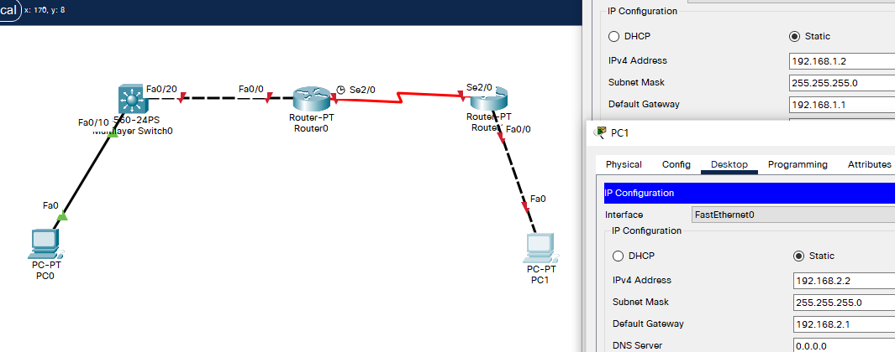

## 例

- 目标
  - 掌握RIP协议的配置方法；
  - 掌握查看通过动态路山协议RIP学习产生的路由；
  - 熟悉广域网线缆的连接方式；
- 背景
  - 假设校园网通过一台三层交换机连到校园网出口路由器上，路由器再和校园外的另一台路由器连接。现要做适当配置，实现校园网内部主机与校园网外部主机之间的相互通信。为了简化网管的管理维护工作，学校决定采用RIP V2协议实现互通。
- 原理
  - RIP（Routing Information Protocols，路由信息协议）是应用较早、使用较普通的IGP内部网关协议，适用用于小型同类网络，是距离矢量协议；
  - RIP协议跳数做为衡量路径开销的，RIP协议里规定最大跳数为15；
  - RIP协议有两个版本：
    - RIPv1：有类路由协议，不支持VLSM，以广播形式进行路由信息的更新，更新周期为30秒；
    - RIPv2：无类路由协议，支持VLSM，以组播形式进行路由更新。
- 步骤
  - 新建packet tracer拓扑图（如图）
    - 在本实验中的三层交换机上划分VLAN10和VLAN20，其中VLAN10用于连接校园网主机，VIAN20用于连接R1
    - 路由器之间通过V.35电缆通过串口连接，DCE端连接在R1上，配置其时钟频率64000
    - 主机和交换机通过直连线连接，主机与路由器通过交叉线连接。
    - 在S3560上配置RIP V2路由协议。
    - 在路由器R1，R2上配置RIP V2路由协议。
    - 将PC1、PC2主机默认网关分别设置为与直连网络设备接口IP地址。
    - 验证PC1，PC2主机之间可以互相通信：

## 拓扑与主机IP配置




## 三层交换机配置

- 划分VLAN

  ```
  Switch>en
  Switch#conf t
  Enter configuration commands, one per line.  End with CNTL/Z.
  Switch(config)#hostname S0
  S0(config)#vlan 10
  S0(config-vlan)#exit
  S0(config)#vlan 20
  S0(config-vlan)#exit
  S0(config)#int fa 0/10
  S0(config-if)#switchport access vlan 10
  S0(config-if)#int fa 0/20
  S0(config-if)#switchport access vlan 20
  S0(config-if)#exit
  S0(config)#end
  S0#
  %SYS-5-CONFIG_I: Configured from console by console
  
  S0#show vlan
  
  VLAN Name                             Status    Ports
  ---- -------------------------------- --------- -------------------------------
  1    default                          active    Fa0/1, Fa0/2, Fa0/3, Fa0/4
                                                  Fa0/5, Fa0/6, Fa0/7, Fa0/8
                                                  Fa0/9, Fa0/11, Fa0/12, Fa0/13
                                                  Fa0/14, Fa0/15, Fa0/16, Fa0/17
                                                  Fa0/18, Fa0/19, Fa0/21, Fa0/22
                                                  Fa0/23, Fa0/24, Gig0/1, Gig0/2
  10   VLAN0010                         active    Fa0/10
  20   VLAN0020                         active    Fa0/20
  1002 fddi-default                     active    
  1003 token-ring-default               active    
  1004 fddinet-default                  active    
  1005 trnet-default                    active    
  
  VLAN Type  SAID       MTU   Parent RingNo BridgeNo Stp  BrdgMode Trans1 Trans2
  ---- ----- ---------- ----- ------ ------ -------- ---- -------- ------ ------
  1    enet  100001     1500  -      -      -        -    -        0      0
  10   enet  100010     1500  -      -      -        -    -        0      0
  20   enet  100020     1500  -      -      -        -    -        0      0
  1002 fddi  101002     1500  -      -      -        -    -        0      0   
   --More-- 
  
  ```

- 设置IP

  ```
  S0#conf t
  Enter configuration commands, one per line.  End with CNTL/Z.
  S0(config)#interface vlan 10
  S0(config-if)#
  %LINK-5-CHANGED: Interface Vlan10, changed state to up
  
  %LINEPROTO-5-UPDOWN: Line protocol on Interface Vlan10, changed state to up
  
  S0(config-if)#ip address 192.168.1.1 255.255.255.0
  S0(config-if)#no shut
  S0(config-if)#exit
  S0(config)#int
  S0(config)#interface vlan 20
  S0(config-if)#
  %LINK-5-CHANGED: Interface Vlan20, changed state to up
  
  S0(config-if)#ip address 192.168.3.1 255.255.255.0
  S0(config-if)#no shut
  S0(config-if)#exit
  S0(config)#ip routing					! 启用交换机的路由功能
  S0(config)#end
  ```

- 查看路由表

  ```
  S0#
  %SYS-5-CONFIG_I: Configured from console by console
  
  S0#show ip rou
  S0#show ip route 
  Codes: C - connected, S - static, I - IGRP, R - RIP, M - mobile, B - BGP
         D - EIGRP, EX - EIGRP external, O - OSPF, IA - OSPF inter area
         N1 - OSPF NSSA external type 1, N2 - OSPF NSSA external type 2
         E1 - OSPF external type 1, E2 - OSPF external type 2, E - EGP
         i - IS-IS, L1 - IS-IS level-1, L2 - IS-IS level-2, ia - IS-IS inter area
         * - candidate default, U - per-user static route, o - ODR
         P - periodic downloaded static route
  
  Gateway of last resort is not set
  
  C    192.168.1.0/24 is directly connected, Vlan10
  
  ```

- 查看运行状态

  ```
  S0#show run
  Building configuration...
  
  Current configuration : 1369 bytes
  !
  version 12.2(37)SE1
  no service timestamps log datetime msec
  no service timestamps debug datetime msec
  no service password-encryption
  !
  hostname S0
  !
   --More-- 
  !
  interface FastEthernet0/10
   switchport access vlan 10
  !
   --More-- 
  !
  interface FastEthernet0/20
   switchport access vlan 20
   --More-- 
  interface Vlan10
   mac-address 0004.9ab0.6801
   ip address 192.168.1.1 255.255.255.0
  !
  interface Vlan20
   mac-address 0004.9ab0.6802
   ip address 192.168.3.1 255.255.255.0
   --More-- 
  end
  ```

- RIP视图下发布直连路由

  ```
  S0#conf t
  Enter configuration commands, one per line.  End with CNTL/Z.
  S0(config)#rout
  S0(config)#router rip
  S0(config-router)#network 192.168.1.0
  S0(config-router)#network 192.168.3.0
  S0(config-router)#version 2				!配置版本号
  S0(config-router)#end
  S0#
  %SYS-5-CONFIG_I: Configured from console by console
  
  S0#show ip rou
  Codes: C - connected, S - static, I - IGRP, R - RIP, M - mobile, B - BGP
         D - EIGRP, EX - EIGRP external, O - OSPF, IA - OSPF inter area
         N1 - OSPF NSSA external type 1, N2 - OSPF NSSA external type 2
         E1 - OSPF external type 1, E2 - OSPF external type 2, E - EGP
         i - IS-IS, L1 - IS-IS level-1, L2 - IS-IS level-2, ia - IS-IS inter area
         * - candidate default, U - per-user static route, o - ODR
         P - periodic downloaded static route
  
  Gateway of last resort is not set
  
  C    192.168.1.0/24 is directly connected, Vlan10
  ```

  

## 配置R0

- IP与时钟频率

  ```
  Router>en
  Router#conf t
  Enter configuration commands, one per line.  End with CNTL/Z.
  Router(config)#hostname R0
  R0(config)#int fa 0/0
  R0(config-if)#no shut
  
  R0(config-if)#
  %LINK-5-CHANGED: Interface FastEthernet0/0, changed state to up
  
  %LINEPROTO-5-UPDOWN: Line protocol on Interface FastEthernet0/0, changed state to up
  
  R0(config-if)#ip address 192.168.3.2 255.255.255.0
  R0(config-if)#interface serial 2/0
  R0(config-if)#no shut
  
  %LINK-5-CHANGED: Interface Serial2/0, changed state to down
  R0(config-if)#ip address 192.168.4.1 255.255.255.0
  R0(config-if)#clock rate 64000
  R0(config-if)#end
  R0#
  %SYS-5-CONFIG_I: Configured from console by console
  
  R0#show ip rou
  Codes: C - connected, S - static, I - IGRP, R - RIP, M - mobile, B - BGP
         D - EIGRP, EX - EIGRP external, O - OSPF, IA - OSPF inter area
         N1 - OSPF NSSA external type 1, N2 - OSPF NSSA external type 2
         E1 - OSPF external type 1, E2 - OSPF external type 2, E - EGP
         i - IS-IS, L1 - IS-IS level-1, L2 - IS-IS level-2, ia - IS-IS inter area
         * - candidate default, U - per-user static route, o - ODR
         P - periodic downloaded static route
  
  Gateway of last resort is not set
  
  C    192.168.3.0/24 is directly connected, FastEthernet0/0
  ```

- 配置RIP与发布直连路由

  ```
  R0#conf t
  Enter configuration commands, one per line.  End with CNTL/Z.
  
  R0(config)#router rip
  R0(config-router)#network 192.168.3.0
  R0(config-router)#network 192.168.4.0
  R0(config-router)#version 2
  R0(config-router)#end
  ```

## 配置R1

- IP

  ```
  Router>en
  Router#conf t
  Enter configuration commands, one per line.  End with CNTL/Z.
  Router(config)#hostname R1
  R1(config)#int fa 0/0
  R1(config-if)#no shut
  
  R1(config-if)#
  %LINK-5-CHANGED: Interface FastEthernet0/0, changed state to up
  
  %LINEPROTO-5-UPDOWN: Line protocol on Interface FastEthernet0/0, changed state to up
  
  R1(config-if)#ip address 192.168.2.1 255.255.255.0
  R1(config-if)#exit 
  R1(config)#int serial 2/0
  R1(config-if)#no shut
  
  R1(config-if)#
  %LINK-5-CHANGED: Interface Serial2/0, changed state to up
  
  R1(config-if)#ip address 
  %LINEPROTO-5-UPDOWN: Line protocol on Interface Serial2/0, changed state to up
  
  % Incomplete command.
  R1(config-if)#ip address 192.168.4.2 255.255.255.0
  R1(config-if)#end
  R1#
  %SYS-5-CONFIG_I: Configured from console by console
  
  R1#show ip rou
  Codes: C - connected, S - static, I - IGRP, R - RIP, M - mobile, B - BGP
         D - EIGRP, EX - EIGRP external, O - OSPF, IA - OSPF inter area
         N1 - OSPF NSSA external type 1, N2 - OSPF NSSA external type 2
         E1 - OSPF external type 1, E2 - OSPF external type 2, E - EGP
         i - IS-IS, L1 - IS-IS level-1, L2 - IS-IS level-2, ia - IS-IS inter area
         * - candidate default, U - per-user static route, o - ODR
         P - periodic downloaded static route
  
  Gateway of last resort is not set
  												!注：此时路由表只有2项
  C    192.168.2.0/24 is directly connected, FastEthernet0/0
  C    192.168.4.0/24 is directly connected, Serial2/0
  ```

- 配置RIP与发布直连路由

  ```
  R1#conf t
  Enter configuration commands, one per line.  End with CNTL/Z.
  R1(config)#router rip
  R1(config-router)#network 192.168.2.0
  R1(config-router)#network 192.168.4.0
  R1(config-router)#version 2
  R1(config-router)#end
  R1#
  %SYS-5-CONFIG_I: Configured from console by console
  
  R1#show ip route 
  Codes: C - connected, S - static, I - IGRP, R - RIP, M - mobile, B - BGP
         D - EIGRP, EX - EIGRP external, O - OSPF, IA - OSPF inter area
         N1 - OSPF NSSA external type 1, N2 - OSPF NSSA external type 2
         E1 - OSPF external type 1, E2 - OSPF external type 2, E - EGP
         i - IS-IS, L1 - IS-IS level-1, L2 - IS-IS level-2, ia - IS-IS inter area
         * - candidate default, U - per-user static route, o - ODR
         P - periodic downloaded static route
  
  Gateway of last resort is not set
  												!此时路由表已有4项
  R    192.168.1.0/24 [120/2] via 192.168.4.1, 00:00:08, Serial2/0
  C    192.168.2.0/24 is directly connected, FastEthernet0/0
  R    192.168.3.0/24 [120/1] via 192.168.4.1, 00:00:08, Serial2/0
  C    192.168.4.0/24 is directly connected, Serial2/0
  ```

- 同时 R0、S0 上的路由表也有4项了

  ```
  R0#show ip rou
  Codes: C - connected, S - static, I - IGRP, R - RIP, M - mobile, B - BGP
         D - EIGRP, EX - EIGRP external, O - OSPF, IA - OSPF inter area
         N1 - OSPF NSSA external type 1, N2 - OSPF NSSA external type 2
         E1 - OSPF external type 1, E2 - OSPF external type 2, E - EGP
         i - IS-IS, L1 - IS-IS level-1, L2 - IS-IS level-2, ia - IS-IS inter area
         * - candidate default, U - per-user static route, o - ODR
         P - periodic downloaded static route
  
  Gateway of last resort is not set
  
  R    192.168.1.0/24 [120/1] via 192.168.3.1, 00:00:14, FastEthernet0/0
  R    192.168.2.0/24 [120/1] via 192.168.4.2, 00:00:14, Serial2/0
  C    192.168.3.0/24 is directly connected, FastEthernet0/0
  C    192.168.4.0/24 is directly connected, Serial2/0
  ```

  ```
  S0#show ip rou
  Codes: C - connected, S - static, I - IGRP, R - RIP, M - mobile, B - BGP
         D - EIGRP, EX - EIGRP external, O - OSPF, IA - OSPF inter area
         N1 - OSPF NSSA external type 1, N2 - OSPF NSSA external type 2
         E1 - OSPF external type 1, E2 - OSPF external type 2, E - EGP
         i - IS-IS, L1 - IS-IS level-1, L2 - IS-IS level-2, ia - IS-IS inter area
         * - candidate default, U - per-user static route, o - ODR
         P - periodic downloaded static route
  
  Gateway of last resort is not set
  
  C    192.168.1.0/24 is directly connected, Vlan10
  R    192.168.2.0/24 [120/2] via 192.168.3.2, 00:00:23, Vlan20
  C    192.168.3.0/24 is directly connected, Vlan20
  R    192.168.4.0/24 [120/1] via 192.168.3.2, 00:00:23, Vlan20
  ```

## 测试 PC0 ping PC1

```
C:\>ipconfig

FastEthernet0 Connection:(default port)

   Connection-specific DNS Suffix..: 
   Link-local IPv6 Address.........: FE80::290:CFF:FE8D:59D6
   IPv6 Address....................: ::
   IPv4 Address....................: 192.168.1.2
   Subnet Mask.....................: 255.255.255.0
   Default Gateway.................: ::
                                     192.168.1.1

Bluetooth Connection:

   Connection-specific DNS Suffix..: 
   Link-local IPv6 Address.........: ::
   IPv6 Address....................: ::
   IPv4 Address....................: 0.0.0.0
   Subnet Mask.....................: 0.0.0.0
   Default Gateway.................: ::
                                     0.0.0.0

C:\>ping 192.168.2.2

Pinging 192.168.2.2 with 32 bytes of data:

Request timed out.
Request timed out.
Reply from 192.168.2.2: bytes=32 time=1ms TTL=125
Reply from 192.168.2.2: bytes=32 time=1ms TTL=125

Ping statistics for 192.168.2.2:
    Packets: Sent = 4, Received = 2, Lost = 2 (50% loss),
Approximate round trip times in milli-seconds:
    Minimum = 1ms, Maximum = 1ms, Average = 1ms
```


