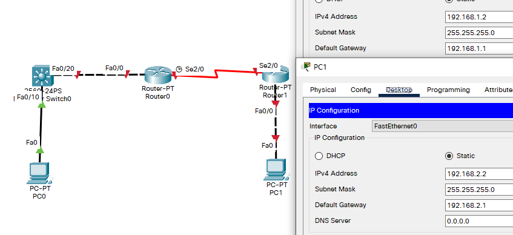

## 例

- 目标
  - 掌握OSPF协议的配置方法；
  - 掌握查看通过动态路由协议OSPF学习产生的路由；
  - 熟悉广域网线缆的连接方式；
- 背景
  - 假设某公司通过一台三层交换机连到公司出口路由器上，路由器再和公司外的另一台路由器连接。现要做适当配置，实现公司内部主机与公司外部主机之间的相互通信。为了简化网管的管理维护工作，公司决定采用OSPF协议实现互通。
- 原理
  - OSPF开放式最短路径优先协议，是目前网络中应用最广泛的路由协议之一。属于内部网关路由协议，能够适应各种规模的网络环境，是典型的链路状态办议。OSPF路由协议通过向全网扩散本设备的链路状态信息，使网络中每台设备最终同步一个具有全网链路状态的数据库，然后路由器采用SPF算法，以自己为根，计算到达其他网络的最短路径，最终形成全网络路由信息。
- 步骤
  - 新建packet tracer拓扑图（如图）
  - 在本实验中的三层交换机上划分VLAN10和VLAN20，其中VLAN10用于连接校园网主机，VIAN20用于连接R1。
  - 路由器之间通过V.35电缆通过串口连接，DCE端连接在R1上，配置其时钟频率64000
  - 主机和交换机通过直连线连接，主机与路由器通过交叉线连接。
  - 在S3560上配置OSPF路由协议。
  - 在路由器R1，R2上配置OSPF路由协议。
  - 将PC1，PC2主机默认网关分别设置为与直连网络设备接口IP地址。
  - 验证PC1，PC2主机之间可以互相通信；

## 拓扑与主机IP配置



## S0配置

- 划分VLAN

  ```
  Switch>en
  Switch#conf t
  Enter configuration commands, one per line.  End with CNTL/Z.
  Switch(config)#hostname S0
  S0(config)#vlan 10
  S0(config-vlan)#exit
  S0(config)#vlan 20
  S0(config-vlan)#exit
  S0(config)#int fa 0/10
  S0(config-if)#switchport access vlan 10
  S0(config-if)#exit
  S0(config)#int fa 0/20
  S0(config-if)#sw
  S0(config-if)#switchport ac
  S0(config-if)#switchport access vlan 20
  S0(config-if)#exit
  ```

- 配置IP地址

  ```
  S0(config)#interface vlan 10
  S0(config-if)#
  %LINK-5-CHANGED: Interface Vlan10, changed state to up
  
  %LINEPROTO-5-UPDOWN: Line protocol on Interface Vlan10, changed state to up
  
  S0(config-if)#ip add
  S0(config-if)#ip address 192.168.1.1 255.255.255.0
  S0(config-if)#no shut
  S0(config-if)#exit
  S0(config)#interface vlan 20
  S0(config-if)#
  %LINK-5-CHANGED: Interface Vlan20, changed state to up
  
  S0(config-if)#ip address 192.168.3.1 255.255.255.0
  S0(config-if)#no shut
  S0(config-if)#end
  S0#
  %SYS-5-CONFIG_I: Configured from console by console
  ```

- 启用交换机的路由功能，可以看到目前只有一条直连路由

  ```
  S0#conf t
  Enter configuration commands, one per line.  End with CNTL/Z.
  S0(config)#ip routing
  S0(config)#end
  S0#
  %SYS-5-CONFIG_I: Configured from console by console
  
  S0#show ip rou
  Codes: C - connected, S - static, I - IGRP, R - RIP, M - mobile, B - BGP
         D - EIGRP, EX - EIGRP external, O - OSPF, IA - OSPF inter area
         N1 - OSPF NSSA external type 1, N2 - OSPF NSSA external type 2
         E1 - OSPF external type 1, E2 - OSPF external type 2, E - EGP
         i - IS-IS, L1 - IS-IS level-1, L2 - IS-IS level-2, ia - IS-IS inter area
         * - candidate default, U - per-user static route, o - ODR
         P - periodic downloaded static route
  
  Gateway of last resort is not set
  
  C    192.168.1.0/24 is directly connected, Vlan10
  ```

- 配置与OSPF

  ```
  S0#conf t
  Enter configuration commands, one per line.  End with CNTL/Z.
  S0(config)#router ospf 1
  S0(config-router)#network 192.168.1.0 0.0.0.255 area 0		! 0.0.0.255 是因为此处是“反掩码(OSPF wild card bits)”，
  S0(config-router)#network 192.168.3.0 0.0.0.255 area 0		! 0.0.0.255 是因为此处是“反掩码(OSPF wild card bits)”，
  S0(config-router)#end
  S0#
  %SYS-5-CONFIG_I: Configured from console by console
  
  S0#show ip rou
  Codes: C - connected, S - static, I - IGRP, R - RIP, M - mobile, B - BGP
         D - EIGRP, EX - EIGRP external, O - OSPF, IA - OSPF inter area
         N1 - OSPF NSSA external type 1, N2 - OSPF NSSA external type 2
         E1 - OSPF external type 1, E2 - OSPF external type 2, E - EGP
         i - IS-IS, L1 - IS-IS level-1, L2 - IS-IS level-2, ia - IS-IS inter area
         * - candidate default, U - per-user static route, o - ODR
         P - periodic downloaded static route
  
  Gateway of last resort is not set
  
  C    192.168.1.0/24 is directly connected, Vlan10
  ```

## R0配置

- 配置IP

  ```
  Router>en	
  Router#conf t
  Enter configuration commands, one per line.  End with CNTL/Z.
  Router(config)#hostname R0
  R0(config)#in fa 0/0
  R0(config-if)#no shut
  
  R0(config-if)#
  %LINK-5-CHANGED: Interface FastEthernet0/0, changed state to up
  
  %LINEPROTO-5-UPDOWN: Line protocol on Interface FastEthernet0/0, changed state to up
  
  R0(config-if)#ip address 192.168.3.2 255.255.255.0
  R0(config-if)#exit
  R0(config)#int serial 2/0
  R0(config-if)#no shut
  
  %LINK-5-CHANGED: Interface Serial2/0, changed state to down
  R0(config-if)#clock rate 64000		!时钟频率
  R0(config-if)#ip address 192.168.4.1 255.255.255.0
  R0(config-if)#end
  R0#
  %SYS-5-CONFIG_I: Configured from console by console
  
  R0#show ip rou
  Codes: C - connected, S - static, I - IGRP, R - RIP, M - mobile, B - BGP
         D - EIGRP, EX - EIGRP external, O - OSPF, IA - OSPF inter area
         N1 - OSPF NSSA external type 1, N2 - OSPF NSSA external type 2
         E1 - OSPF external type 1, E2 - OSPF external type 2, E - EGP
         i - IS-IS, L1 - IS-IS level-1, L2 - IS-IS level-2, ia - IS-IS inter area
         * - candidate default, U - per-user static route, o - ODR
         P - periodic downloaded static route
  
  Gateway of last resort is not set
  
  C    192.168.3.0/24 is directly connected, FastEthernet0/0
  ```

- OSPF配置

  ```
  R0#conf t
  Enter configuration commands, one per line.  End with CNTL/Z.
  R0(config)#router ospf 1
  R0(config-router)#network 192.168.3.0 0.0.0.255 area 0
  R0(config-router)#network 192.168.4.0 0.0.0.255 area 0
  R0(config-router)#end
  R0#
  %SYS-5-CONFIG_I: Configured from console by console
  
  00:17:44: %OSPF-5-ADJCHG: Process 1, Nbr 192.168.3.1 on FastEthernet0/0 from LOADING to FULL, Loading Done
  
  R0#show ip rou
  Codes: C - connected, S - static, I - IGRP, R - RIP, M - mobile, B - BGP
         D - EIGRP, EX - EIGRP external, O - OSPF, IA - OSPF inter area
         N1 - OSPF NSSA external type 1, N2 - OSPF NSSA external type 2
         E1 - OSPF external type 1, E2 - OSPF external type 2, E - EGP
         i - IS-IS, L1 - IS-IS level-1, L2 - IS-IS level-2, ia - IS-IS inter area
         * - candidate default, U - per-user static route, o - ODR
         P - periodic downloaded static route
  
  Gateway of last resort is not set
  
  O    192.168.1.0/24 [110/2] via 192.168.3.1, 00:00:02, FastEthernet0/0
  C    192.168.3.0/24 is directly connected, FastEthernet0/0
  ```

## R1配置

- 配置IP

  ```
  Router>en
  Router#conf t
  Enter configuration commands, one per line.  End with CNTL/Z.
  Router(config)#hostname R1
  R1(config)#int fa 0/0
  R1(config-if)#no shut
  
  R1(config-if)#
  %LINK-5-CHANGED: Interface FastEthernet0/0, changed state to up
  
  %LINEPROTO-5-UPDOWN: Line protocol on Interface FastEthernet0/0, changed state to up
  
  R1(config-if)#ip address 192.168.2.1 255.255.255.0
  R1(config-if)#exit
  R1(config)#int serial 2/0
  R1(config-if)#no shut
  
  R1(config-if)#
  %LINK-5-CHANGED: Interface Serial2/0, changed state to up
  
  %LINEPROTO-5-UPDOWN: Line protocol on Interface Serial2/0, changed state to up
  
  R1(config-if)#ip address 192.168.4.2 255.255.255.0
  R1(config-if)#end
  R1#
  %SYS-5-CONFIG_I: Configured from console by console
  
  R1#show ip rou
  Codes: C - connected, S - static, I - IGRP, R - RIP, M - mobile, B - BGP
         D - EIGRP, EX - EIGRP external, O - OSPF, IA - OSPF inter area
         N1 - OSPF NSSA external type 1, N2 - OSPF NSSA external type 2
         E1 - OSPF external type 1, E2 - OSPF external type 2, E - EGP
         i - IS-IS, L1 - IS-IS level-1, L2 - IS-IS level-2, ia - IS-IS inter area
         * - candidate default, U - per-user static route, o - ODR
         P - periodic downloaded static route
  
  Gateway of last resort is not set
  
  C    192.168.2.0/24 is directly connected, FastEthernet0/0
  C    192.168.4.0/24 is directly connected, Serial2/0
  ```

- OSPF 配置

  ```
  R1#conf t
  Enter configuration commands, one per line.  End with CNTL/Z.
  R1(config)#router ospf ?
    <1-65535>  Process ID
  R1(config)#router ospf 1
  R1(config-router)#network 192.168.2.0 0.0.0.255 area 0
  R1(config-router)#network 192.168.4.0 0.0.0.255 area 0
  R1(config-router)#
  00:30:19: %OSPF-5-ADJCHG: Process 1, Nbr 192.168.4.1 on Serial2/0 from LOADING to FULL, Loading Done
  
  R1(config-router)#end
  R1#
  %SYS-5-CONFIG_I: Configured from console by console
  
  R1#show ip rou
  Codes: C - connected, S - static, I - IGRP, R - RIP, M - mobile, B - BGP
         D - EIGRP, EX - EIGRP external, O - OSPF, IA - OSPF inter area
         N1 - OSPF NSSA external type 1, N2 - OSPF NSSA external type 2
         E1 - OSPF external type 1, E2 - OSPF external type 2, E - EGP
         i - IS-IS, L1 - IS-IS level-1, L2 - IS-IS level-2, ia - IS-IS inter area
         * - candidate default, U - per-user static route, o - ODR
         P - periodic downloaded static route
  
  Gateway of last resort is not set
  
  O    192.168.1.0/24 [110/66] via 192.168.4.1, 00:00:40, Serial2/0
  C    192.168.2.0/24 is directly connected, FastEthernet0/0
  O    192.168.3.0/24 [110/65] via 192.168.4.1, 00:00:40, Serial2/0
  C    192.168.4.0/24 is directly connected, Serial2/0
  ```

## 测试

- 在R0上查看路由表

  ```
  R0>en
  R0#show ip rou
  Codes: C - connected, S - static, I - IGRP, R - RIP, M - mobile, B - BGP
         D - EIGRP, EX - EIGRP external, O - OSPF, IA - OSPF inter area
         N1 - OSPF NSSA external type 1, N2 - OSPF NSSA external type 2
         E1 - OSPF external type 1, E2 - OSPF external type 2, E - EGP
         i - IS-IS, L1 - IS-IS level-1, L2 - IS-IS level-2, ia - IS-IS inter area
         * - candidate default, U - per-user static route, o - ODR
         P - periodic downloaded static route
  
  Gateway of last resort is not set
  
  O    192.168.1.0/24 [110/2] via 192.168.3.1, 00:14:35, FastEthernet0/0
  O    192.168.2.0/24 [110/65] via 192.168.4.2, 00:01:58, Serial2/0
  C    192.168.3.0/24 is directly connected, FastEthernet0/0
  C    192.168.4.0/24 is directly connected, Serial2/0
  ```

- 在S0上查看路由表

  ```
  S0>en
  S0#show ip rou
  Codes: C - connected, S - static, I - IGRP, R - RIP, M - mobile, B - BGP
         D - EIGRP, EX - EIGRP external, O - OSPF, IA - OSPF inter area
         N1 - OSPF NSSA external type 1, N2 - OSPF NSSA external type 2
         E1 - OSPF external type 1, E2 - OSPF external type 2, E - EGP
         i - IS-IS, L1 - IS-IS level-1, L2 - IS-IS level-2, ia - IS-IS inter area
         * - candidate default, U - per-user static route, o - ODR
         P - periodic downloaded static route
  
  Gateway of last resort is not set
  
  C    192.168.1.0/24 is directly connected, Vlan10
  O    192.168.2.0/24 [110/66] via 192.168.3.2, 00:02:22, Vlan20
  C    192.168.3.0/24 is directly connected, Vlan20
  O    192.168.4.0/24 [110/65] via 192.168.3.2, 00:12:27, Vlan20
  ```

- PC0 ping PC1

  ```
  C:\>ipconfig
  
  FastEthernet0 Connection:(default port)
  
     Connection-specific DNS Suffix..: 
     Link-local IPv6 Address.........: FE80::2E0:8FFF:FE50:6D26
     IPv6 Address....................: ::
     IPv4 Address....................: 192.168.1.2
     Subnet Mask.....................: 255.255.255.0
     Default Gateway.................: ::
                                       192.168.1.1
  
  C:\>ping 192.168.2.2
  
  Pinging 192.168.2.2 with 32 bytes of data:
  
  Request timed out.
  Reply from 192.168.2.2: bytes=32 time=1ms TTL=125
  Reply from 192.168.2.2: bytes=32 time=1ms TTL=125
  Reply from 192.168.2.2: bytes=32 time=13ms TTL=125
  
  Ping statistics for 192.168.2.2:
      Packets: Sent = 4, Received = 3, Lost = 1 (25% loss),
  Approximate round trip times in milli-seconds:
      Minimum = 1ms, Maximum = 13ms, Average = 5ms
  ```

  

