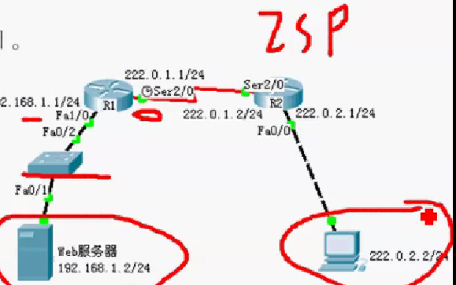
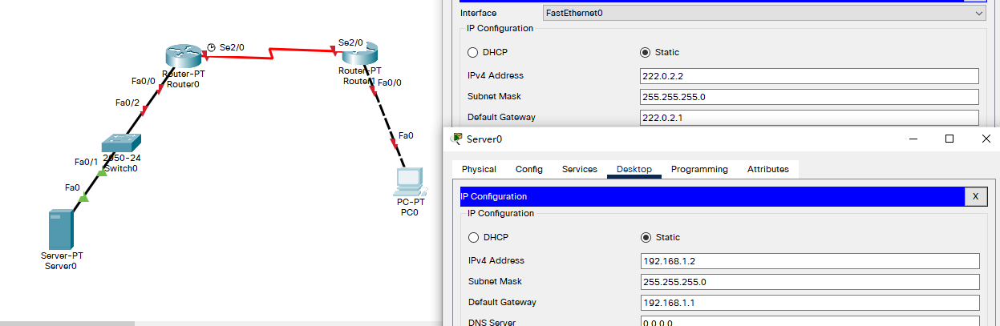

## 例

- 目标

  - 理解NAT网络地址转换的原理及功能；
  - 掌握静态NAT的配置，实现局域网访问互联网；

- 背景

  - 你是某公司的网络管理员，欲发布公司的WWW服务。
  - 要求将内网Web服务器IP地址映射为全局IP地址，实现外部网络可访问公司内部Web服务器。

- 原理

  - 网络地址转换NAT（Network Address Translation），被广泛应用于各种类型Internet接入方式和各种类型的网络中。原因很简单，NAT不仅完美地解决了IP地址不足的问题，而且还能够有效地避免来自网络外部的攻击，隐藏并保护网络内部的计算机。
  - 默认情况下，内部IP地址是无法被路由到外网的，内部主机10.1.1.1要与外部internet通信，IP包到达NAT路由器时，IP包头的源地址10.1.1.1被替换成一个合法的外网IP，并在NAT转换表中保存这条记录。当外部主机发送一个应答到内网时，NAT路由器收到后，查看当前NAT转换表，用10.1.1.1替换掉这个外网地址。

- 步骤

  ​	

  - 新建packet tracer拓扑图（如图）
  - R1为公司出口路由器，其与外部路由器之间通过V.35电缆串日连接，DCE端连接在R1上，配置其时钟频率64000；
  - 配置PC机、服务器及路由器接口IP地址；
  - 在各路由器上配置静态路由协议，让pc间能相互ping通；
  - 在R1上配置静态NAT
  - 在R1上定义内外部网络接口。
  - 验证主机之间的互通性。

## 拓扑与主机IP配置



## R0 配置

- 配置 IP 与时钟频率

```
Router>en
Router#conf t
Enter configuration commands, one per line.  End with CNTL/Z.
Router(config)#host R0
R0(config)#int fa 0/0
R0(config-if)#ip add 192.168.1.1 255.255.255.0
R0(config-if)#no shut

R0(config-if)#
%LINK-5-CHANGED: Interface FastEthernet0/0, changed state to up

%LINEPROTO-5-UPDOWN: Line protocol on Interface FastEthernet0/0, changed state to up

R0(config-if)#int s 2/0
R0(config-if)#ip add 222.0.1.1 255.255.255.0
R0(config-if)#no shut

%LINK-5-CHANGED: Interface Serial2/0, changed state to down
R0(config-if)#clock rate 64000
R0(config-if)#
```

## R1 配置

- 配置 IP

```
Router>en
Router#conf t
Enter configuration commands, one per line.  End with CNTL/Z.
Router(config)#host R1
R1(config)#int s 2/0
R1(config-if)#ip add 222.0.1.2 255.255.255.0
R1(config-if)#no shut

R1(config-if)#
%LINK-5-CHANGED: Interface Serial2/0, changed state to up

R1(config-if)#int fa 0/0
R1(config-if)#
%LINEPROTO-5-UPDOWN: Line protocol on Interface Serial2/0, changed state to up

R1(config-if)#ip add 222.0.2.1 255.255.255.0
R1(config-if)#no shut

R1(config-if)#
%LINK-5-CHANGED: Interface FastEthernet0/0, changed state to up

%LINEPROTO-5-UPDOWN: Line protocol on Interface FastEthernet0/0, changed state to up
```

## 做静态路由 (RIP/OSPF也可)

- R0

  ```
  R0(config)#ip route 222.0.2.0 255.255.255.0 222.0.1.2
  ```

- R1

  ```
  R1(config)#ip route 192.168.1.0 255.255.255.0 222.0.1.1
  R1(config)#end
  R1#
  %SYS-5-CONFIG_I: Configured from console by console
  
  R1#show ip rou
  Codes: C - connected, S - static, I - IGRP, R - RIP, M - mobile, B - BGP
         D - EIGRP, EX - EIGRP external, O - OSPF, IA - OSPF inter area
         N1 - OSPF NSSA external type 1, N2 - OSPF NSSA external type 2
         E1 - OSPF external type 1, E2 - OSPF external type 2, E - EGP
         i - IS-IS, L1 - IS-IS level-1, L2 - IS-IS level-2, ia - IS-IS inter area
         * - candidate default, U - per-user static route, o - ODR
         P - periodic downloaded static route
  
  Gateway of last resort is not set
  
  S    192.168.1.0/24 [1/0] via 222.0.1.1
  C    222.0.1.0/24 is directly connected, Serial2/0
  C    222.0.2.0/24 is directly connected, FastEthernet0/0
  ```

## PC0 与 Server0 的连通性测试

- ping

  ```
  C:\>ping 192.168.1.2
  
  Pinging 192.168.1.2 with 32 bytes of data:
  
  Request timed out.
  Reply from 192.168.1.2: bytes=32 time=1ms TTL=126
  Reply from 192.168.1.2: bytes=32 time=10ms TTL=126
  Reply from 192.168.1.2: bytes=32 time=6ms TTL=126
  
  Ping statistics for 192.168.1.2:
      Packets: Sent = 4, Received = 3, Lost = 1 (25% loss),
  Approximate round trip times in milli-seconds:
      Minimum = 1ms, Maximum = 10ms, Average = 5ms
  ```

- 浏览器

  

- 在实验中可行，但在实际公网环境中，直接输入对方的内网地址是无法访问的。

- 所以需要将Server0的内网地址转换为公网地址

- 静态NAT步骤

  - 配置路由器IP地址及路由策略（已完成）

  - 指定端口（哪些输入内部，哪些属于外部）

    - 此处 R0 中 Fa0/0 属于内部，Se2/0 属于外部

  - 将内部地址映射到公网地址**（在R0上配置）**

    ```
    R0(config)#int fa 0/0
    R0(config-if)#ip nat inside										!标记为内部端口
    R0(config-if)#int s 2/0
    R0(config-if)#ip nat outside									!标记为外部端口
    R0(config-if)#exit
    R0(config)#ip nat inside ?
      source  Source address translation
    R0(config)#ip nat inside source ?
      list    Specify access list describing local addresses
      static  Specify static local->global mapping
    R0(config)#ip nat inside source static ?
      A.B.C.D  Inside local IP address
      tcp      Transmission Control Protocol
      udp      User Datagram Protocol
    R0(config)#ip nat inside source static 192.168.1.2 222.0.1.3	!映射
    R0(config)#end
    R0#
    %SYS-5-CONFIG_I: Configured from console by console
    
    R0#show ip nat rt
    R0#show ip nat tr
    R0#show ip nat translations 
    Pro  Inside global     Inside local       Outside local      Outside global
    ---  222.0.1.3         192.168.1.2        ---                ---
    ```

- PC0 测试 通过公网IP访问 Server0

  

- 在 R0上再次查看NAT，可以看到多了一条tcp访问记录

  ```
  R0#show ip nat translations 
  Pro  Inside global     Inside local       Outside local      Outside global
  ---  222.0.1.3         192.168.1.2        ---                ---
  tcp 222.0.1.3:80       192.168.1.2:80     222.0.2.2:1026     222.0.2.2:1026
  ```

  

  