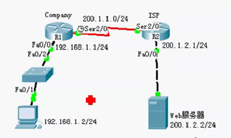
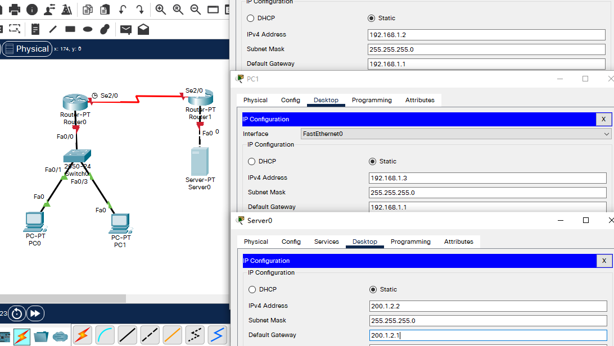

## 例

- 目标

  - 理解NAT网络地址转换的原理及功能；
  - 掌握NAPT的配置，实现局域网访问互联网；

- 背景

  - 你是某公司的网络管理员，公司办公网需要接入互联网，公司只向ISP申请了一条专线，该专线分配了一个公网IP地址，配置实现全公司的主机都能访问外网。

- 原理

  - NAT将网络划分为内部网络和外部网络两部分，局域网主机利用NAT访问网络时，是将局域网内部的本地地址转换为全局地址（互联网合法的IP地址）后转发数据包；
  - NAT分为两种类型：NAT（网络地址转换）和 NAPT（网络端口地址转换IP地址对应一个全局地址）
    - NAPT：使用不同的端口来映射多个内网IP地址到一个指定的外网IP地址，多对一。
  - NAPT采用端口多路复用方式。内部网络的所有主机均可共享一个合法外部IP地址实现对Internet的访问，从而可以最大限度地节约IP地址资源。同时，又可隐藏网络内部的所有主机，有效避免来自Internet的攻击。因此，目前网络中应用最多的就是端口多路复用方式。

- 步骤

  

  - 新建packet tracer拓扑图（如图）
  - R1为公司出口路由器，其与ISP路由器之间通过V.35电缆串口连接，DCE端连接在R1上，配置其时钟频率64000；
  - 配置PC机、服务器及路由器接口IP地址；
  - 在各路由器上配置静态路由协议，让pc间能相互ping通；
  - 在R1上配置NAPT
  - 在R1上定义内外部网络接口
  - 验证主机之间的互通性

## 拓扑与设备IP配置



## R0 IP配置

```
Router>en
Router#conf t
Enter configuration commands, one per line.  End with CNTL/Z.
Router(config)#host R0
R0(config)#int fa 0/0
R0(config-if)#ip add 192.168.1.1 255.255.255.0		!配置局域网内部默认网关
R0(config-if)#no shut

R0(config-if)#
%LINK-5-CHANGED: Interface FastEthernet0/0, changed state to up

%LINEPROTO-5-UPDOWN: Line protocol on Interface FastEthernet0/0, changed state to up

R0(config-if)#int s 2/0
R0(config-if)#ip add 200.1.1.1 255.255.255.0		!配置IP
R0(config-if)#no shut

%LINK-5-CHANGED: Interface Serial2/0, changed state to down
R0(config-if)#clock rate 64000						!配置时钟
R0(config-if)#
```

## R1 IP配置

```
Router>en
Router#conf t
Enter configuration commands, one per line.  End with CNTL/Z.
Router(config)#host R1
R1(config)#int s 2/0
R1(config-if)#ip add 200.1.1.2 255.255.255.0		!配置局域网内部默认网关
R1(config-if)#no shut

R1(config-if)#
%LINK-5-CHANGED: Interface Serial2/0, changed state to up

%LINEPROTO-5-UPDOWN: Line protocol on Interface Serial2/0, changed state to up

R1(config-if)#int fa 0/0
R1(config-if)#ip add 200.1.2.1 255.255.255.0	!配置IP
R1(config-if)#no shut

R1(config-if)#
%LINK-5-CHANGED: Interface FastEthernet0/0, changed state to up

%LINEPROTO-5-UPDOWN: Line protocol on Interface FastEthernet0/0, changed state to up

```

## 静态路由配置

- R0

  ```
  R0(config)#ip route 200.1.2.0 255.255.255.0 200.1.1.2
  ```

- R1

  ```
  R1(config)#ip route 192.168.1.0 255.255.255.0 200.1.1.1
  R1(config)#end
  R1#
  %SYS-5-CONFIG_I: Configured from console by console
  
  R1#show ip rou
  Codes: C - connected, S - static, I - IGRP, R - RIP, M - mobile, B - BGP
         D - EIGRP, EX - EIGRP external, O - OSPF, IA - OSPF inter area
         N1 - OSPF NSSA external type 1, N2 - OSPF NSSA external type 2
         E1 - OSPF external type 1, E2 - OSPF external type 2, E - EGP
         i - IS-IS, L1 - IS-IS level-1, L2 - IS-IS level-2, ia - IS-IS inter area
         * - candidate default, U - per-user static route, o - ODR
         P - periodic downloaded static route
  
  Gateway of last resort is not set
  
  S    192.168.1.0/24 [1/0] via 200.1.1.1
  C    200.1.1.0/24 is directly connected, Serial2/0
  C    200.1.2.0/24 is directly connected, FastEthernet0/0
  ```

- 尝试在 PC0 ping Server 0：可ping通（Web浏览器也可通过IP直接访问Server0）

  ```
  C:\>ipconfig
  
  FastEthernet0 Connection:(default port)
  
     Connection-specific DNS Suffix..: 
     Link-local IPv6 Address.........: FE80::20A:F3FF:FE90:D747
     IPv6 Address....................: ::
     IPv4 Address....................: 192.168.1.2
     Subnet Mask.....................: 255.255.255.0
     Default Gateway.................: ::
                                       192.168.1.1
  
  Bluetooth Connection:
  
     Connection-specific DNS Suffix..: 
     Link-local IPv6 Address.........: ::
     IPv6 Address....................: ::
     IPv4 Address....................: 0.0.0.0
     Subnet Mask.....................: 0.0.0.0
     Default Gateway.................: ::
                                       0.0.0.0
  
  C:\>ping 200.1.2.2
  
  Pinging 200.1.2.2 with 32 bytes of data:
  
  Request timed out.
  Reply from 200.1.2.2: bytes=32 time=1ms TTL=126
  Reply from 200.1.2.2: bytes=32 time=1ms TTL=126
  Reply from 200.1.2.2: bytes=32 time=1ms TTL=126
  
  Ping statistics for 200.1.2.2:
      Packets: Sent = 4, Received = 3, Lost = 1 (25% loss),
  Approximate round trip times in milli-seconds:
      Minimum = 1ms, Maximum = 1ms, Average = 1ms
  ```


## R0 NAPT配置

- 配置路由IP地址及路由策略（已完成）

- 访问控制列表

  - 允许哪些网段出去（可做基本，可做高级）

  ```
  R0(config)#access-list ?
    <1-99>     IP standard access list
    <100-199>  IP extended access list
  R0(config)#access-list 1 ?
    deny    Specify packets to reject
    permit  Specify packets to forward
    remark  Access list entry comment
  R0(config)#access-list 1 p
  R0(config)#access-list 1 permit ?
    A.B.C.D  Address to match
    any      Any source host
    host     A single host address
  R0(config)#access-list 1 permit 192.168.1.0 0.0.0.255
  ```

- 做地址池

  ```
  R0(config)# ip nat ?
    inside   Inside address translation
    outside  Outside address translation
    pool     Define pool of addresses
  R0(config)# ip nat pool ?
    WORD  Pool name
  R0(config)# ip nat pool name1 ?		
    A.B.C.D  Start IP address			!公有地址始
  R0(config)# ip nat pool name1 200.1.1.3 ?
    A.B.C.D  End IP address			!公有地址末
  R0(config)# ip nat pool name1 200.1.1.3 200.1.1.3 netmask 255.255.255.0
  ```

- 发布出口路由的内部和外部网络(ip nat inside/outside)

  ```
  R0(config)#int fa 0/0
  R0(config-if)#ip nat inside
  R0(config-if)#int s 2/0
  R0(config-if)#ip nat outside
  R0(config-if)#exit
  ```

- 将访问控制列表映射到地址池

  ```
  R0(config)#ip nat ?
    inside   Inside address translation
    outside  Outside address translation
    pool     Define pool of addresses
  R0(config)#ip nat inside ?
    source  Source address translation
  R0(config)#ip nat inside source ?
    list    Specify access list describing local addresses
    static  Specify static local->global mapping
  R0(config)#ip nat inside source list ?
    <1-199>  Access list number for local addresses
    WORD     Access list name for local addresses
  R0(config)#ip nat inside source list 1 ?
    interface  Specify interface for global address
    pool       Name pool of global addresses
  R0(config)#ip nat inside source list 1 pool name1 ?
    overload  Overload an address translation		!NAPT选项，多(内IP)对一(公网IP)
    <cr>											!NAT选项，一对一/多对多选项(排队获取)？
  R0(config)#ip nat inside source list 1 pool name1 
  R0(config)#ip nat inside source list 1 pool name1 overload 
  R0(config)#end
  R0#
  %SYS-5-CONFIG_I: Configured from console by console
  
  
  R0#show ip nat translations 					!注：此时查不到任何记录
  ```

## 测试

- 在 PC0 ，PC1 上用浏览器访问 Server0 (200.1.2.2)，然后到R0上查看

  - 可查到地址映射信息

  ```
  R0#show ip nat translations 
  Pro  Inside global     Inside local       Outside local      Outside global
  tcp 200.1.1.3:1024     192.168.1.2:1025   200.1.2.2:80       200.1.2.2:80
  tcp 200.1.1.3:1025     192.168.1.3:1025   200.1.2.2:80       200.1.2.2:80
  ```

  

