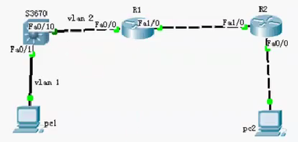
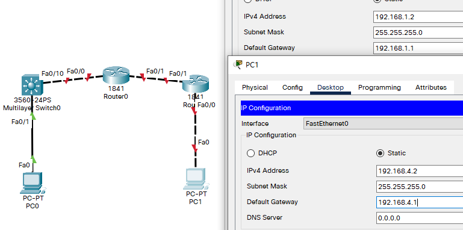

## 例

- 目标

  - 掌握综合路由的配置方法；
  - 掌握查看通过路由重分布学习产生的路由；
  - 熟悉广域网线缆的连接方式；

- 背景

  - 假设某公司通过一台三层交换机连到公司出口路由器R1上，路由器R1再和公司外的另一台路由器R2连接。三层与R1间运行RIPV2路由协议，R1与R2间运行OSPF路由协议。现要做适当配置，实现公司内部主机与公司外部主机之间的相互通信。

- 原理

  - 为了支持本设备能够运行多个路由协议进程，系统软件提供了路由信息从一个路由进程重分布到另外一个路由进程的功能。比如你可以将OSPF路由域的路由重新分布后通告RIP路由域中，也可以将RIP路由域的路由重新分布后通告到OSPF路由域中。路由的相互重分布可以在所有的IP路由协议之间进行。
  - 要把路由从一个路由域分布到另一个路由域，并且进行控制路由重分布，在路由进程配置模式中执行以下命令（路由重分布）：redistribute protocol [metric metric] [metric-type metric-type] [match internal | external type | nssa-external type] [tag tag] [route-map route-map-name] [subnets]

- 步骤

  ​		

  - 新建packet tracer拓扑图（如图）
  - PC与交换机间用直连线连接；PC与路由、路由与路由之间用交叉线连接
  - 在三层上划分2个Vlan，运行RIPV2协议；R2运行OSPF协议。
  - 在路由器R1上左侧配置RIPV2路由协议：右侧配置OSPF协议。
  - 在R1路由进程中引入外部路由，进行路由重分布。
  - 将PC1、PC2主机默认网关分别设置为与直连网络设备接口IP地址。
  - 验证PC1、PC2主机之间可以互相通信；

## 拓扑与设备IP配置



## S0 配置

- 划分VLAN 、 switchport

  - 因 VLAN1 已默认存在，故此处只创建 VLAN2

  ```
  Switch>en
  Switch#conf t
  Enter configuration commands, one per line.  End with CNTL/Z.
  Switch(config)#vlan 2
  Switch(config-vlan)#exit
  Switch(config)#int fa 0/10
  Switch(config-if)#switchport access vlan 2
  Switch(config-if)#exit
  ```

- 配置IP

  ```
  Switch(config)#int vlan 1
  Switch(config-if)#ip add 192.168.1.1 255.255.255.0
  Switch(config-if)#no shut
  
  Switch(config-if)#
  %LINK-5-CHANGED: Interface Vlan1, changed state to up
  
  %LINEPROTO-5-UPDOWN: Line protocol on Interface Vlan1, changed state to up
  
  Switch(config-if)#int vlan 2
  Switch(config-if)#
  %LINK-5-CHANGED: Interface Vlan2, changed state to up
  
  Switch(config-if)#ip add 192.168.2.1 255.255.255.0
  Switch(config-if)#no shut
  Switch(config-if)#end
  ```

- 查看

  ```
  Switch#show int vlan 1
  Vlan1 is up, line protocol is up
    Hardware is CPU Interface, address is 0090.21e1.321e (bia 0090.21e1.321e)
    Internet address is 192.168.1.1/24
    MTU 1500 bytes, BW 100000 Kbit, DLY 1000000 usec,
       reliability 255/255, txload 1/255, rxload 1/255
    Encapsulation ARPA, loopback not set
    ARP type: ARPA, ARP Timeout 04:00:00
    Last input 21:40:21, output never, output hang never
    Last clearing of "show interface" counters never
    Input queue: 0/75/0/0 (size/max/drops/flushes); Total output drops: 0
    Queueing strategy: fifo
    Output queue: 0/40 (size/max)
    5 minute input rate 0 bits/sec, 0 packets/sec
    5 minute output rate 0 bits/sec, 0 packets/sec
       1682 packets input, 530955 bytes, 0 no buffer
       Received 0 broadcasts (0 IP multicast)
       0 runts, 0 giants, 0 throttles
       0 input errors, 0 CRC, 0 frame, 0 overrun, 0 ignored
       563859 packets output, 0 bytes, 0 underruns
       0 output errors, 23 interface resets
       0 output buffer failures, 0 output buffers swapped out
  ```

- RIP发布网段

  ```
  Switch#conf t
  Enter configuration commands, one per line.  End with CNTL/Z.
  Switch(config)#ip routing
  Switch(config-router)#network 192.168.1.0
  Switch(config-router)#network 192.168.2.0
  Switch(config-router)#version 2			!更改版本
  ```

## R0 配置

- IP 配置

  ```
  Router>en
  Router#conf t
  Enter configuration commands, one per line.  End with CNTL/Z.
  Router(config)#hostname R0
  R0(config)#int fa 0/0
  R0(config-if)#ip add 192.168.2.2 255.255.255.0
  R0(config-if)#no shut
  
  R0(config-if)#
  %LINK-5-CHANGED: Interface FastEthernet0/0, changed state to up
  
  %LINEPROTO-5-UPDOWN: Line protocol on Interface FastEthernet0/0, changed state to up
  
  R0(config-if)#int fa 0/1
  R0(config-if)#ip add 192.168.3.1 255.255.255.0
  R0(config-if)#no shut
  
  R0(config-if)#
  %LINK-5-CHANGED: Interface FastEthernet0/1, changed state to up
  
  R0(config-if)#exit
  ```

- RIP 发布网段（与 S0 使用 RIP协议）

  ```
  R0(config)#router rip
  R0(config-router)#network 192.168.2.0
  R0(config-router)#version 2
  ```

- OSPF 发布网段 （与 R1 使用 OSPF协议）

  ```
  R0(config-router)#network 192.168.3.0 0.0.0.255 area 0
  ```

## R1 配置

- IP 配置

  ```
  Router>en
  Router#conf t
  Enter configuration commands, one per line.  End with CNTL/Z.
  Router(config)#hostname R1
  R1(config)#int fa 0/1
  R1(config-if)#ip add 192.168.3.2 255.255.255.0
  R1(config-if)#no shut
  
  R1(config-if)#
  %LINK-5-CHANGED: Interface FastEthernet0/1, changed state to up
  
  %LINEPROTO-5-UPDOWN: Line protocol on Interface FastEthernet0/1, changed state to up
  
  R1(config-if)#int fa 0/0
  R1(config-if)#ip add 192.168.4.1 255.255.255.0
  R1(config-if)#no shut
  
  R1(config-if)#
  %LINK-5-CHANGED: Interface FastEthernet0/0, changed state to up
  
  %LINEPROTO-5-UPDOWN: Line protocol on Interface FastEthernet0/0, changed state to up
  
  R1(config-if)#exit
  ```

- OSPF 发布

  ```
  R1(config)#router ospf 1
  R1(config-router)#network 192.168.3.0 0.0.0.255 area 0
  R1(config-router)#network 192.168.4.0 0.0.0.255 area 0
  R1(config-router)#end
  R1#
  %SYS-5-CONFIG_I: Configured from console by console
  
  00:18:32: %OSPF-5-ADJCHG: Process 1, Nbr 192.168.3.1 on FastEthernet0/1 from LOADING to FULL, Loading Done
  ```

- 查看路由表，有两个直连网段

  ```
  R1#show ip rou
  
  Codes: C - connected, S - static, I - IGRP, R - RIP, M - mobile, B - BGP
         D - EIGRP, EX - EIGRP external, O - OSPF, IA - OSPF inter area
         N1 - OSPF NSSA external type 1, N2 - OSPF NSSA external type 2
         E1 - OSPF external type 1, E2 - OSPF external type 2, E - EGP
         i - IS-IS, L1 - IS-IS level-1, L2 - IS-IS level-2, ia - IS-IS inter area
         * - candidate default, U - per-user static route, o - ODR
         P - periodic downloaded static route
  
  Gateway of last resort is not set
  
  C    192.168.3.0/24 is directly connected, FastEthernet0/1
  C    192.168.4.0/24 is directly connected, FastEthernet0/0
  ```

### 返回 R0 检测

- 查看路由表，可见有两个直连网段，以及与S0 RIP、R1 OSPF连接的网段

  ```
  R0#show ip rou
  Codes: C - connected, S - static, I - IGRP, R - RIP, M - mobile, B - BGP
         D - EIGRP, EX - EIGRP external, O - OSPF, IA - OSPF inter area
         N1 - OSPF NSSA external type 1, N2 - OSPF NSSA external type 2
         E1 - OSPF external type 1, E2 - OSPF external type 2, E - EGP
         i - IS-IS, L1 - IS-IS level-1, L2 - IS-IS level-2, ia - IS-IS inter area
         * - candidate default, U - per-user static route, o - ODR
         P - periodic downloaded static route
  
  Gateway of last resort is not set
  
  R    192.168.1.0/24 [120/1] via 192.168.2.1, 00:00:16, FastEthernet0/0
  C    192.168.2.0/24 is directly connected, FastEthernet0/0
  C    192.168.3.0/24 is directly connected, FastEthernet0/1
  O    192.168.4.0/24 [110/2] via 192.168.3.2, 00:06:27, FastEthernet0/1
  ```

- 查看运行信息

  ```
  R0#show run
  Building configuration...
  
  Current configuration : 710 bytes
  !
  version 12.4
  no service timestamps log datetime msec
  no service timestamps debug datetime msec
  no service password-encryption
  !
  hostname R0
  !
   --More-- 
  !
  interface FastEthernet0/0
   ip address 192.168.2.2 255.255.255.0
   duplex auto
   speed auto
  !
  interface FastEthernet0/1
   ip address 192.168.3.1 255.255.255.0
   duplex auto
   speed auto
  !
  interface Vlan1
   no ip address
   shutdown
  !
  router ospf 1
   log-adjacency-changes
   network 192.168.3.0 0.0.0.255 area 0
  !
  router rip
   version 2
   network 192.168.2.0
  !
   --More-- 
  !
  end
  ```

## 测试

- 在 R0 中 ping 1.0 与 4.0 网段

  ```
  R0#ping 192.168.1.2
  
  Type escape sequence to abort.
  Sending 5, 100-byte ICMP Echos to 192.168.1.2, timeout is 2 seconds:
  .!!!!
  Success rate is 80 percent (4/5), round-trip min/avg/max = 0/0/0 ms
  
  R0#ping 192.168.4.2
  
  Type escape sequence to abort.
  Sending 5, 100-byte ICMP Echos to 192.168.4.2, timeout is 2 seconds:
  .!!!!
  Success rate is 80 percent (4/5), round-trip min/avg/max = 0/0/1 ms
  ```

- PC0 ping PC 1

  ```
  C:\>ipconfig
  
  FastEthernet0 Connection:(default port)
  
     Connection-specific DNS Suffix..: 
     Link-local IPv6 Address.........: FE80::2D0:58FF:FE24:3D1E
     IPv6 Address....................: ::
     IPv4 Address....................: 192.168.1.2
     Subnet Mask.....................: 255.255.255.0
     Default Gateway.................: ::
                                       192.168.1.1
  
  C:\>ping 192.168.4.2
  
  Pinging 192.168.4.2 with 32 bytes of data:
  
  Reply from 192.168.1.1: Destination host unreachable.
  Reply from 192.168.1.1: Destination host unreachable.
  Reply from 192.168.1.1: Destination host unreachable.
  Reply from 192.168.1.1: Destination host unreachable.
  
  Ping statistics for 192.168.4.2:
      Packets: Sent = 4, Received = 0, Lost = 4 (100% loss),		!不可达
  ```

- 检查 S0 路由表

  ```
  Switch#show ip rou
  Codes: C - connected, S - static, I - IGRP, R - RIP, M - mobile, B - BGP
         D - EIGRP, EX - EIGRP external, O - OSPF, IA - OSPF inter area
         N1 - OSPF NSSA external type 1, N2 - OSPF NSSA external type 2
         E1 - OSPF external type 1, E2 - OSPF external type 2, E - EGP
         i - IS-IS, L1 - IS-IS level-1, L2 - IS-IS level-2, ia - IS-IS inter area
         * - candidate default, U - per-user static route, o - ODR
         P - periodic downloaded static route
  
  Gateway of last resort is not set
  
  C    192.168.1.0/24 is directly connected, Vlan1
  C    192.168.2.0/24 is directly connected, Vlan2
  																!只有两条
  ```

- 在 R0 上进行 重分布

  - 将 OSPF 重分布 引入到 RIP 协议中

    ```
    R0(config)#router rip
    R0(config-router)#red
    R0(config-router)#redistribute ?
      connected  Connected
      eigrp      Enhanced Interior Gateway Routing Protocol (EIGRP)
      metric     Metric for redistributed routes
      ospf       Open Shortest Path First (OSPF)
      rip        Routing Information Protocol (RIP)
      static     Static routes
    R0(config-router)#redistribute ospf ?
      <1-65535>  Process ID
    R0(config-router)#redistribute ospf 1
    R0(config-router)#exit
    ```

  - 将 RIP 重分布 引入到 OSPF 协议中

    ```
    R0(config)#router ospf 1
    R0(config-router)#redistribute rip ?
      metric       Metric for redistributed routes
      metric-type  OSPF/IS-IS exterior metric type for redistributed routes
      subnets      Consider subnets for redistribution into OSPF
      tag          Set tag for routes redistributed into OSPF
      <cr>
    R0(config-router)#redistribute rip subnets 
    R0(config-router)#end
    R0#
    %SYS-5-CONFIG_I: Configured from console by console
    ```

  - 查看 S0 路由表，依然只有两条

    ```
    Switch#show ip rou
    Codes: C - connected, S - static, I - IGRP, R - RIP, M - mobile, B - BGP
           D - EIGRP, EX - EIGRP external, O - OSPF, IA - OSPF inter area
           N1 - OSPF NSSA external type 1, N2 - OSPF NSSA external type 2
           E1 - OSPF external type 1, E2 - OSPF external type 2, E - EGP
           i - IS-IS, L1 - IS-IS level-1, L2 - IS-IS level-2, ia - IS-IS inter area
           * - candidate default, U - per-user static route, o - ODR
           P - periodic downloaded static route
    
    Gateway of last resort is not set
    
    C    192.168.1.0/24 is directly connected, Vlan1
    C    192.168.2.0/24 is directly connected, Vlan2
    ```

  - 查询后得知：本例在Packet Tracer 5.2上能正常运行，

    - 在Packet Tracer 5.3或以上版本，Switch0不能学习到192.168.3.0、192.168.4.0的路由信息，
    - 需要给Switch0指定静态路由：ip route 0.0.0.0 0.0.0.0 192.168.2.2

    ```
    Switch(config)#ip route 0.0.0.0 0.0.0.0 192.168.2.2
    Switch(config)#end
    ```

  - 查看 S0 路由表

    ```
    Switch#show ip rou
    Codes: C - connected, S - static, I - IGRP, R - RIP, M - mobile, B - BGP
           D - EIGRP, EX - EIGRP external, O - OSPF, IA - OSPF inter area
           N1 - OSPF NSSA external type 1, N2 - OSPF NSSA external type 2
           E1 - OSPF external type 1, E2 - OSPF external type 2, E - EGP
           i - IS-IS, L1 - IS-IS level-1, L2 - IS-IS level-2, ia - IS-IS inter area
           * - candidate default, U - per-user static route, o - ODR
           P - periodic downloaded static route
    
    Gateway of last resort is 192.168.2.2 to network 0.0.0.0
    
    C    192.168.1.0/24 is directly connected, Vlan1
    C    192.168.2.0/24 is directly connected, Vlan2
    S*   0.0.0.0/0 [1/0] via 192.168.2.2
    ```

- PC0 ping PC 1

  ```
  
  C:\>ipconfig
  
  FastEthernet0 Connection:(default port)
  
     Connection-specific DNS Suffix..: 
     Link-local IPv6 Address.........: FE80::2D0:58FF:FE24:3D1E
     IPv6 Address....................: ::
     IPv4 Address....................: 192.168.1.2
     Subnet Mask.....................: 255.255.255.0
     Default Gateway.................: ::
                                       192.168.1.1
  
  C:\>ping 192.168.4.2
  
  Pinging 192.168.4.2 with 32 bytes of data:
  
  Reply from 192.168.4.2: bytes=32 time<1ms TTL=125
  Reply from 192.168.4.2: bytes=32 time<1ms TTL=125
  Reply from 192.168.4.2: bytes=32 time<1ms TTL=125
  Reply from 192.168.4.2: bytes=32 time<1ms TTL=125
  
  Ping statistics for 192.168.4.2:
      Packets: Sent = 4, Received = 4, Lost = 0 (0% loss),
  Approximate round trip times in milli-seconds:
      Minimum = 0ms, Maximum = 0ms, Average = 0ms
  ```

  
