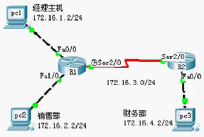
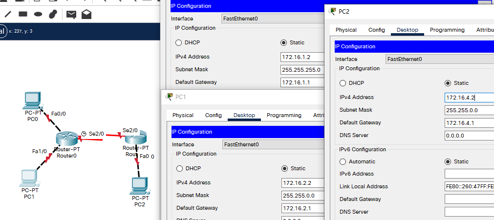

## 例

- 目标

  - 理解标准IP访问控制列表的原理及功能；
  - 掌握编号的标准IP访问控制列表的配置方法；

- 背景

  - 你是公司的网络管理员，公司的经理部、财务部门和销售部分别属于不同的3个网段，三部门之间用路由器进行信息传递，为了安全起见，公司领导要求销售部门不能对财务部进行访问，但经理部可以对财务部进行访问。
  - PC1代表经理部的主机、PC2代表销售部的主机、PC3代表财务部的主机。

- 原理

  - ACLS的全称为接入控制列表（Access Control Lists），也称为访问列表（Access Lists），俗称为防火墙，在有的文档中还称之为包过滤。
  - ACLs通过定义一些规则对网络设备接口上的数据报文进行控制：允许通过或丢弃，从而提高网络可管理性和安全性；IP ACL分为两种：标准IP访问列表和扩展IP访问列表，编号范围分别为1~99、1300~1999，100~199、2000~2699；
  - **标准** IP访问列表可以根据数据包的源IP地址定义规则，进行数据包的过滤；
  - **扩展/高级** IP访问列表可以根据数据包的源IP、目的IP、源端口、目的端口、协议来定义规则，进行数据包的过滤；
  - IP ACL基于接口进行规则的应用，分为：入栈应用和出栈应用；

- 步骤

  ​		

  - 新建packet tracer拓扑图（如图）
  - 路由器之间通过V.35电缆通过串口连接，DCE端连接在R1上，配置其时钟频率64000；主机与路由器通过交叉线连接。
  - 配置路由器接口IP地址。
  - 在路由器上配置静态路由协议，让三台pc能相互ping通，因为只有在互通的前提下才能涉及到访问控制列表。
  - 在R1上配置编号的IP标准访问控制
  - 将标准IP访问列表应用到接口
  - 验证主机之间的互通性

## 拓扑与主机IP配置



- PC0 ~ R0 1.0 网段
- PC1 ~ R0 2.0 网段
- R0 ~ R1 3.0网段
- PC2 ~ R1 4.0网段

## R/S IP(/Clock) 配置

- R0

  ```
  Router>en
  Router#conf t
  Enter configuration commands, one per line.  End with CNTL/Z.
  Router(config)#host R0
  R0(config)#int fa 0/0
  R0(config-if)#ip add 172.16.1.1 255.255.255.0
  R0(config-if)#no shut
  
  R0(config-if)#
  %LINK-5-CHANGED: Interface FastEthernet0/0, changed state to up
  
  %LINEPROTO-5-UPDOWN: Line protocol on Interface FastEthernet0/0, changed state to up
  
  R0(config-if)#int fa 1/0
  R0(config-if)#ip add 172.16.2.1 255.255.255.0
  R0(config-if)#no shut
  
  R0(config-if)#
  %LINK-5-CHANGED: Interface FastEthernet1/0, changed state to up
  
  %LINEPROTO-5-UPDOWN: Line protocol on Interface FastEthernet1/0, changed state to up
  
  R0(config-if)#int s 2/0
  R0(config-if)#ip add 172.16.3.1 255.255.255.0
  R0(config-if)#no shut
  
  %LINK-5-CHANGED: Interface Serial2/0, changed state to down
  R0(config-if)#clock rate 64000
  ```

- R1

  ```
  Router>en
  Router#conf t
  Enter configuration commands, one per line.  End with CNTL/Z.
  Router(config)#host R1
  R1(config)#int s 2/0	
  R1(config-if)#ip add 172.16.3.2 255.255.255.0
  R1(config-if)#no shut
  
  R1(config-if)#
  %LINK-5-CHANGED: Interface Serial2/0, changed state to up
  
  %LINEPROTO-5-UPDOWN: Line protocol on Interface Serial2/0, changed state to up
  
  R1(config-if)#int fa 0/0
  R1(config-if)#ip add 172.16.4.1 255.255.255.0
  R1(config-if)#no shut
  
  R1(config-if)#
  %LINK-5-CHANGED: Interface FastEthernet0/0, changed state to up
  
  %LINEPROTO-5-UPDOWN: Line protocol on Interface FastEthernet0/0, changed state to up
  
  ```

## 配置静态路由

- R0

  ```
  R0(config)#ip route 172.16.4.0 255.255.255.0 172.16.3.2
  ```

- R1 可做缺省路由

  ```
  R1(config)#ip route 0.0.0.0 0.0.0.0 172.16.3.1
  R1(config)#end
  R1#
  %SYS-5-CONFIG_I: Configured from console by console
  
  R1#show ip rou
  Codes: C - connected, S - static, I - IGRP, R - RIP, M - mobile, B - BGP
         D - EIGRP, EX - EIGRP external, O - OSPF, IA - OSPF inter area
         N1 - OSPF NSSA external type 1, N2 - OSPF NSSA external type 2
         E1 - OSPF external type 1, E2 - OSPF external type 2, E - EGP
         i - IS-IS, L1 - IS-IS level-1, L2 - IS-IS level-2, ia - IS-IS inter area
         * - candidate default, U - per-user static route, o - ODR
         P - periodic downloaded static route
  
  Gateway of last resort is 172.16.3.1 to network 0.0.0.0
  
       172.16.0.0/24 is subnetted, 2 subnets
  C       172.16.3.0 is directly connected, Serial2/0
  C       172.16.4.0 is directly connected, FastEthernet0/0
  S*   0.0.0.0/0 [1/0] via 172.16.3.1
  ```

## 测试连通性

- PC0 ~ PC4

  ```
  C:\>ipconfig
  
  FastEthernet0 Connection:(default port)
  
     Connection-specific DNS Suffix..: 
     Link-local IPv6 Address.........: FE80::206:2AFF:FEEB:9BE6
     IPv6 Address....................: ::
     IPv4 Address....................: 172.16.1.2
     Subnet Mask.....................: 255.255.255.0
     Default Gateway.................: ::
                                       172.16.1.1
  
  C:\>ping 172.16.4.2
  
  Pinging 172.16.4.2 with 32 bytes of data:
  
  Request timed out.
  Reply from 172.16.4.2: bytes=32 time=1ms TTL=126
  Reply from 172.16.4.2: bytes=32 time=1ms TTL=126
  Reply from 172.16.4.2: bytes=32 time=9ms TTL=126
  
  Ping statistics for 172.16.4.2:
      Packets: Sent = 4, Received = 3, Lost = 1 (25% loss),
  Approximate round trip times in milli-seconds:
      Minimum = 1ms, Maximum = 9ms, Average = 3ms
  ```

- PC1 ~ PC4

  ```
  C:\>ipconfig
  
  FastEthernet0 Connection:(default port)
  
     Connection-specific DNS Suffix..: 
     Link-local IPv6 Address.........: FE80::201:42FF:FE8E:CACE
     IPv6 Address....................: ::
     IPv4 Address....................: 172.16.2.2
     Subnet Mask.....................: 255.255.0.0
     Default Gateway.................: ::
                                       172.16.2.1
  
  C:\>ping 172.16.4.2
  
  Pinging 172.16.4.2 with 32 bytes of data:
  
  Reply from 172.16.4.2: bytes=32 time=1ms TTL=126
  Reply from 172.16.4.2: bytes=32 time=7ms TTL=126
  Reply from 172.16.4.2: bytes=32 time=6ms TTL=126
  Reply from 172.16.4.2: bytes=32 time=1ms TTL=126
  
  Ping statistics for 172.16.4.2:
      Packets: Sent = 4, Received = 4, Lost = 0 (0% loss),
  Approximate round trip times in milli-seconds:
      Minimum = 1ms, Maximum = 7ms, Average = 3ms
  ```

## 配置基本访问控制列表

- 目标：PC0 可访问 PC2，PC1 不可访问 PC2

- 控制方式：命名或编号，此处使用命名方式

- R0

  - 配置访问控制列表

    ```
    R0(config)#ip acc
    R0(config)#ip access-list ?
      extended  Extended Access List
      standard  Standard Access List
    R0(config)#ip access-list st
    R0(config)#ip access-list standard ?
      <1-99>  Standard IP access-list number
      WORD    Access-list name
    R0(config)#ip access-list standard name1
    R0(config-std-nacl)#permit ?
      A.B.C.D  Address to match
      any      Any source host
      host     A single host address
    R0(config-std-nacl)#permit 172.16.1.0 ?
      A.B.C.D  Wildcard bits
      <cr>
    R0(config-std-nacl)#permit 172.16.1.0 0.0.0.255
    R0(config-std-nacl)#deny 172.16.2.0 0.0.0.255		! 写了上面那条之后，默认其他全部拒绝
    R0(config-std-nacl)#end
    ```

  - 应用访问控制列表

    - 编号模式 1 - 99 为基本访问控制列表，100 -  199 是高级访问控制列表，还可通过命名方式。

    ```
    R0(config)#int s 2/0
    R0(config-if)#ip ?
      access-group        Specify access control for packets
      address             Set the IP address of an interface
      authentication      authentication subcommands
      flow                NetFlow Related commands
      hello-interval      Configures IP-EIGRP hello interval
      helper-address      Specify a destination address for UDP broadcasts
      inspect             Apply inspect name
      ips                 Create IPS rule
      mtu                 Set IP Maximum Transmission Unit
      nat                 NAT interface commands
      ospf                OSPF interface commands
      split-horizon       Perform split horizon
      summary-address     Perform address summarization
      virtual-reassembly  Virtual Reassembly
    R0(config-if)#ip access-group name1 ?					!入站还是出站
      in   inbound packets
      out  outbound packets
    R0(config-if)#ip access-group name1 out
    ```

## 测试

- PC0 ping PC2

  ```
  C:\>ping 172.16.4.2
  
  Pinging 172.16.4.2 with 32 bytes of data:
  
  Reply from 172.16.4.2: bytes=32 time=16ms TTL=126
  Reply from 172.16.4.2: bytes=32 time=1ms TTL=126
  Reply from 172.16.4.2: bytes=32 time=2ms TTL=126
  Reply from 172.16.4.2: bytes=32 time=3ms TTL=126
  
  Ping statistics for 172.16.4.2:
      Packets: Sent = 4, Received = 4, Lost = 0 (0% loss),
  Approximate round trip times in milli-seconds:
      Minimum = 1ms, Maximum = 16ms, Average = 5ms
  ```

- PC1 ping PC2

  ```
  C:\>ping 172.16.4.2
  
  Pinging 172.16.4.2 with 32 bytes of data:
  
  Reply from 172.16.2.1: Destination host unreachable.
  Reply from 172.16.2.1: Destination host unreachable.
  Reply from 172.16.2.1: Destination host unreachable.
  Reply from 172.16.2.1: Destination host unreachable.
  
  Ping statistics for 172.16.4.2:
      Packets: Sent = 4, Received = 0, Lost = 4 (100% loss),
  ```

  

