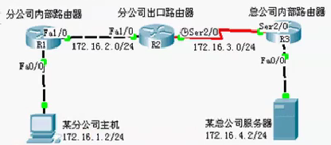
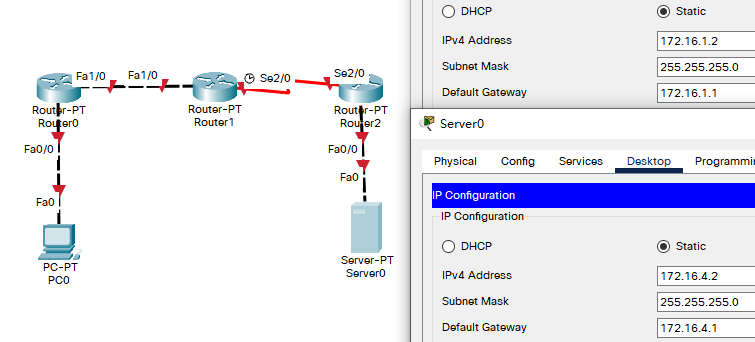
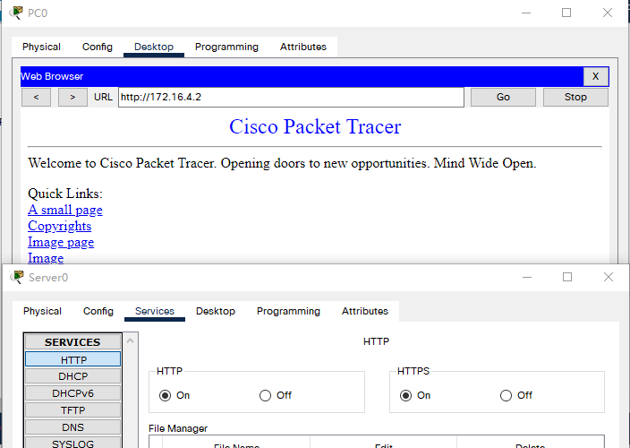
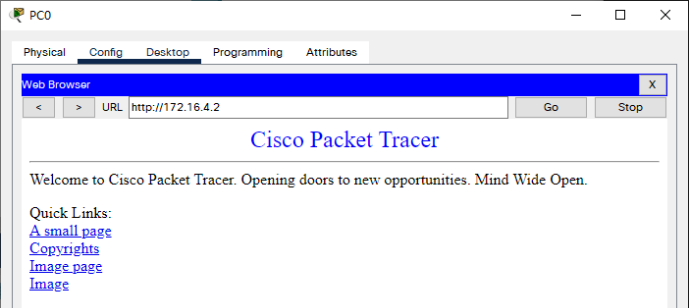

 

## 例

- 原理

  - 访问列表中定义的典型规则主要有以下：源地址、目标地址、上层协议、时间区域；
  - 扩展IP访问列表（编号为100-199，2000-2699）使用以上四种组合来进行转发或阻断分组；可以根据数据包的源IP、目的IP、源端口、目的端口、协议来定义规则，进行数据包的过滤。
  - 扩展IP访问列表的配置包括以下两步：
    - 定义扩展IP访问列表
    - 将扩展IP访问列表应用于特定接口上

- 步骤

  ​		

  - 新建packet tracer拓扑图（如图）
    - 假设分公司可以通过 WWW服务 访问总公司服务器，但不允许通过 ICMP服务 访问总公司服务器
  - 分公司出口路由器与外部路由器之间通过V.35电缆串口连接，DCE端连接在R2上，配置其时钟频率64000；主机与路由器通过交叉线连接。
  - 配置PC机、服务器及路由器接口IP地址。
  - 在各路由器上配置静态路由协议，让pc间能相互ping通，因为只有在互通的前提下才能涉及到访问控制列表。
  - 在R2上配置编号的IP扩展访问控制列表。
  - 将扩展IP访问列表应用到接口
  - 验证主机之间的互通性

## 拓扑与设备IP



- R0

  ```
  Router>en
  Router#conf t
  Enter configuration commands, one per line.  End with CNTL/Z.
  Router(config)#host R0
  R0(config)#int fa 0/0
  R0(config-if)#ip add 172.16.1.1 255.255.255.0
  R0(config-if)#no shut
  
  R0(config-if)#
  %LINK-5-CHANGED: Interface FastEthernet0/0, changed state to up
  
  %LINEPROTO-5-UPDOWN: Line protocol on Interface FastEthernet0/0, changed state to up
  
  R0(config-if)#int fa 1/0
  R0(config-if)#ip add 172.16.2.1 255.255.255.0
  R0(config-if)#no shut
  
  R0(config-if)#
  %LINK-5-CHANGED: Interface FastEthernet1/0, changed state to up
  ```

- R1

  ```
  Router>en
  Router#conf t
  Enter configuration commands, one per line.  End with CNTL/Z.
  Router(config)#host R1
  R1(config)#int fa 1/0
  R1(config-if)#ip add 172.16.2.2 255.255.255.0
  R1(config-if)#no shut
  
  R1(config-if)#
  %LINK-5-CHANGED: Interface FastEthernet1/0, changed state to up
  
  %LINEPROTO-5-UPDOWN: Line protocol on Interface FastEthernet1/0, changed state to up
  
  R1(config-if)#int s 2/0
  R1(config-if)#ip add 172.16.3.1 255.255.255.0
  R1(config-if)#no shut
  
  %LINK-5-CHANGED: Interface Serial2/0, changed state to down
  R1(config-if)#clock rate 64000
  ```

- R2

  ```
  Router>en
  Router#conf t
  Enter configuration commands, one per line.  End with CNTL/Z.
  Router(config)#host R2
  R2(config)#int s 2/0
  R2(config-if)#ip add 172.16.3.2 255.255.255.0
  R2(config-if)#no shut
  
  R2(config-if)#
  %LINK-5-CHANGED: Interface Serial2/0, changed state to up
  
  %LINEPROTO-5-UPDOWN: Line protocol on Interface Serial2/0, changed state to up
  
  R2(config-if)#int fa 0/0
  R2(config-if)#ip add 172.16.4.1 255.255.255.0
  R2(config-if)#no shut
   
  R2(config-if)#
  %LINK-5-CHANGED: Interface FastEthernet0/0, changed state to up
  
  %LINEPROTO-5-UPDOWN: Line protocol on Interface FastEthernet0/0, changed state to up
  ```

##  路由表

- R0 缺省路由

  ```
  R0(config)#ip route 0.0.0.0 0.0.0.0 172.16.2.2
  ```

- R2 缺省路由

  ```
  R2(config)#ip route 0.0.0.0 0.0.0.0 172.16.3.1
  ```

- R1 静态路由

  ```
  R1(config)#ip route 172.16.1.0 255.255.255.0 172.16.2.1
  R1(config)#ip route 172.16.4.0 255.255.255.0 172.16.3.2
  R1(config)#end
  R1#
  %SYS-5-CONFIG_I: Configured from console by console
  
  R1#show ip rou
  Codes: C - connected, S - static, I - IGRP, R - RIP, M - mobile, B - BGP
         D - EIGRP, EX - EIGRP external, O - OSPF, IA - OSPF inter area
         N1 - OSPF NSSA external type 1, N2 - OSPF NSSA external type 2
         E1 - OSPF external type 1, E2 - OSPF external type 2, E - EGP
         i - IS-IS, L1 - IS-IS level-1, L2 - IS-IS level-2, ia - IS-IS inter area
         * - candidate default, U - per-user static route, o - ODR
         P - periodic downloaded static route
  
  Gateway of last resort is not set
  
       172.16.0.0/24 is subnetted, 4 subnets
  S       172.16.1.0 [1/0] via 172.16.2.1
  C       172.16.2.0 is directly connected, FastEthernet1/0
  C       172.16.3.0 is directly connected, Serial2/0
  S       172.16.4.0 [1/0] via 172.16.3.2
  ```

- 测试 PC0 ping Server0

  ```
  C:\>ipconfig
  
  FastEthernet0 Connection:(default port)
  
     Connection-specific DNS Suffix..: 
     Link-local IPv6 Address.........: FE80::201:97FF:FEBD:32CD
     IPv6 Address....................: ::
     IPv4 Address....................: 172.16.1.2
     Subnet Mask.....................: 255.255.255.0
     Default Gateway.................: ::
                                       172.16.1.1
  
  C:\>ping 172.16.4.2
  
  Pinging 172.16.4.2 with 32 bytes of data:
  
  Request timed out.
  Request timed out.
  Reply from 172.16.4.2: bytes=32 time=1ms TTL=125
  Reply from 172.16.4.2: bytes=32 time=1ms TTL=125
  
  Ping statistics for 172.16.4.2:
      Packets: Sent = 4, Received = 2, Lost = 2 (50% loss),
  Approximate round trip times in milli-seconds:
      Minimum = 1ms, Maximum = 1ms, Average = 1ms
  ```

- 测试 PC0 浏览器访问 Server0

  

## 拓展IP访问控制

- 目标
  - PC0 可访问 Server0 的 Web 界面
  - PC0 不可通过 ICMP(ping命令) 访问Server0

- 配置方案

  - 命名

  - 编号（此处使用这种）

    ```
    R1(config)#access-list ?
      <1-99>     IP standard access list
      <100-199>  IP extended access list
    R1(config)#access-list 100 ?
      deny    Specify packets to reject
      permit  Specify packets to forward
      remark  Access list entry comment
    R1(config)#access-list 100 permit ?
      ahp    Authentication Header Protocol
      eigrp  Cisco's EIGRP routing protocol
      esp    Encapsulation Security Payload
      gre    Cisco's GRE tunneling
      icmp   Internet Control Message Protocol
      ip     Any Internet Protocol
      ospf   OSPF routing protocol
      tcp    Transmission Control Protocol
      udp    User Datagram Protocol
    R1(config)#access-list 100 permit tcp ?
      A.B.C.D  Source address
      any      Any source host
      host     A single source host
    R1(config)#access-list 100 permit tcp host ?
      A.B.C.D  Source address
    R1(config)#access-list 100 permit tcp host 172.16.1.2 ?
      A.B.C.D  Destination address
      any      Any destination host
      eq       Match only packets on a given port number
      gt       Match only packets with a greater port number
      host     A single destination host
      lt       Match only packets with a lower port number
      neq      Match only packets not on a given port number
      range    Match only packets in the range of port numbers
    R1(config)#access-list 100 permit tcp host 172.16.1.2 host 172.16.4.2 ?
      dscp         Match packets with given dscp value
      eq           Match only packets on a given port number
      established  established
      gt           Match only packets with a greater port number
      lt           Match only packets with a lower port number
      neq          Match only packets not on a given port number
      precedence   Match packets with given precedence value
      range        Match only packets in the range of port numbers
      <cr>
    R1(config)#access-list 100 permit tcp host 172.16.1.2 host 172.16.4.2 eq ?
      <0-65535>  Port number
      ftp        File Transfer Protocol (21)
      pop3       Post Office Protocol v3 (110)
      smtp       Simple Mail Transport Protocol (25)
      telnet     Telnet (23)
      www        World Wide Web (HTTP, 80)
    R1(config)#access-list 100 permit tcp host 172.16.1.2 host 172.16.4.2 eq www
    ```

    ```
    R1(config)#access-list 100 deny icmp host 172.16.1.2 host 172.16.4.2 ?
      <0-256>               type-num
      echo                  Echo (ping)
      echo-reply            Echo reply
      host-unreachable      Host unreachable
      net-unreachable       Net unreachable
      port-unreachable      Port unreachable
      protocol-unreachable  Protocol unreachable
      ttl-exceeded          TTL exceeded
      unreachable           All unreachables
      <cr>
    R1(config)#access-list 100 deny icmp host 172.16.1.2 host 172.16.4.2 
    ```

    ```
    R1(config)#int s 2/0
    R1(config-if)#ip acc
    R1(config-if)#ip access-group ?
      <1-199>  IP access list (standard or extended)
      WORD     Access-list name
    R1(config-if)#ip access-group 100 out
    R1(config-if)#end
    R1#
    %SYS-5-CONFIG_I: Configured from console by console
    ```

## 测试

- 浏览器访问

  

- ping命令

  ```
  C:\>ipconfig
  
  FastEthernet0 Connection:(default port)
  
     Connection-specific DNS Suffix..: 
     Link-local IPv6 Address.........: FE80::201:97FF:FEBD:32CD
     IPv6 Address....................: ::
     IPv4 Address....................: 172.16.1.2
     Subnet Mask.....................: 255.255.255.0
     Default Gateway.................: ::
                                       172.16.1.1
                                       
  C:\>ping 172.16.4.2
  
  Pinging 172.16.4.2 with 32 bytes of data:
  
  Reply from 172.16.2.2: Destination host unreachable.
  Reply from 172.16.2.2: Destination host unreachable.
  Reply from 172.16.2.2: Destination host unreachable.
  Reply from 172.16.2.2: Destination host unreachable.
  
  Ping statistics for 172.16.4.2:
      Packets: Sent = 4, Received = 0, Lost = 4 (100% loss),
  ```

  


